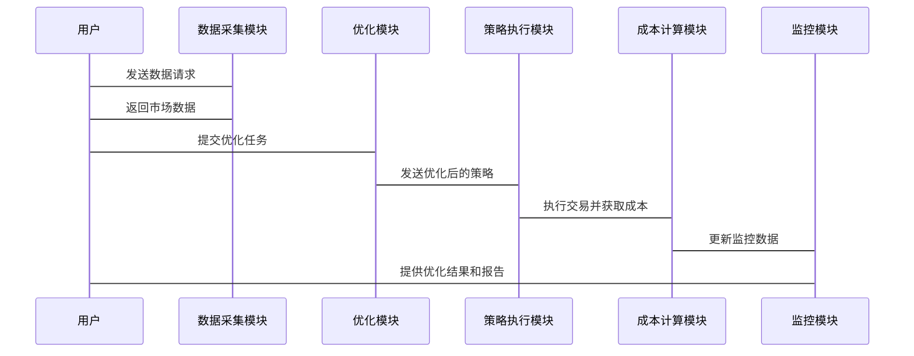
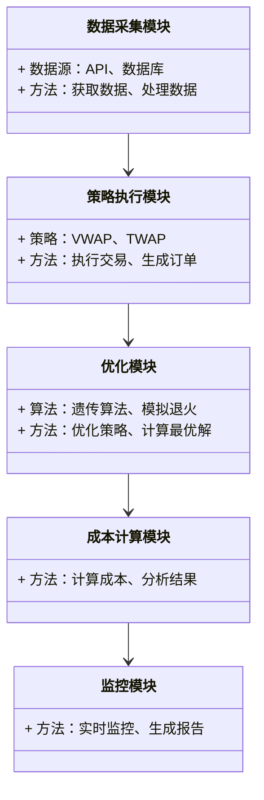
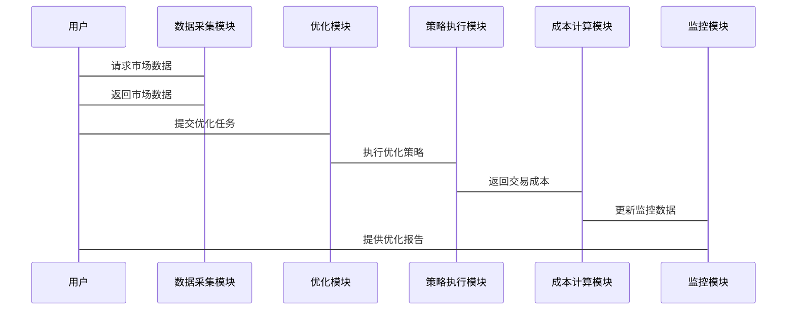
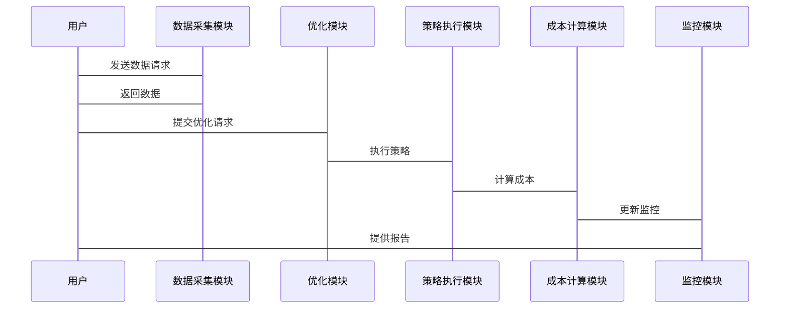

                 

# 第4章: 交易成本优化系统的系统分析与架构设计

## 4.1 系统应用场景

交易成本优化系统主要应用于金融市场中的投资者和机构交易员，帮助他们降低交易成本、提高交易效率。系统适用于以下场景：

1. **高频交易**：需要快速执行大量交易，减少每次交易的成本。
2. **机构投资**：管理大额订单，优化订单执行策略，减少市场冲击。
3. **算法交易**：通过算法优化交易路径和时机，降低交易成本。
4. **量化投资**：基于数据分析，优化交易策略，提升收益。

## 4.2 系统功能设计

### 4.2.1 数据采集模块
负责从多个数据源（如交易所、API）获取实时市场数据，包括价格、成交量、订单簿等。

### 4.2.2 交易策略模块
实现多种交易策略，如平均成本法、VWAP（成交量加权平均价格）、TWAP（时间加权平均价格）等，选择最优策略执行交易。

### 4.2.3 成本计算模块
计算每次交易的实际成本，包括佣金、买卖价差、滑点等，为后续优化提供数据支持。

### 4.2.4 优化模块
应用优化算法（如遗传算法、模拟退火）优化交易策略，找到成本最低的执行方案。

### 4.2.5 监控与报告模块
实时监控交易过程，生成报告，分析优化效果，发现潜在问题。

## 4.3 系统架构设计

### 4.3.1 分层架构
系统采用分层架构，包括数据层、业务逻辑层和用户界面层。

- **数据层**：处理数据存储、获取和管理。
- **业务逻辑层**：实现交易策略、优化算法和成本计算。
- **用户界面层**：提供直观的操作界面，供用户输入指令和查看结果。

### 4.3.2 组件化架构
系统分为多个功能组件，每个组件负责特定任务，如数据采集组件、策略执行组件等，便于模块化开发和维护。

## 4.4 系统接口设计

### 4.4.1 数据接口
- **输入接口**：接收市场数据、订单信息。
- **输出接口**：返回优化后的交易指令、执行报告。

### 4.4.2 用户接口
- **输入接口**：接收用户输入的交易参数、目标。
- **输出接口**：显示优化结果、成本分析报告。

## 4.5 系统交互流程

### 4.5.1 交互流程图

### 4.5.2 详细交互步骤

1. **用户发起请求**：用户输入交易需求，如大额订单优化。
2. **数据采集**：系统从各数据源获取实时市场数据。
3. **优化模块处理**：应用优化算法计算最优执行策略。
4. **策略执行**：根据优化结果执行交易。
5. **成本计算**：计算交易成本，分析优化效果。
6. **监控与报告**：实时监控交易过程，生成报告反馈给用户。

## 4.6 系统架构图

## 4.7 功能模块类图

## 4.8 接口交互流程图

## 4.9 系统交互序列图

---

通过以上系统分析与架构设计，我们可以清晰地看到交易成本优化系统的整体结构和各模块之间的协作关系。接下来，我们将在第5章通过一个具体案例，展示如何将这一系统应用于实际的交易成本优化过程中，帮助投资者和机构实现更高效的交易策略。

