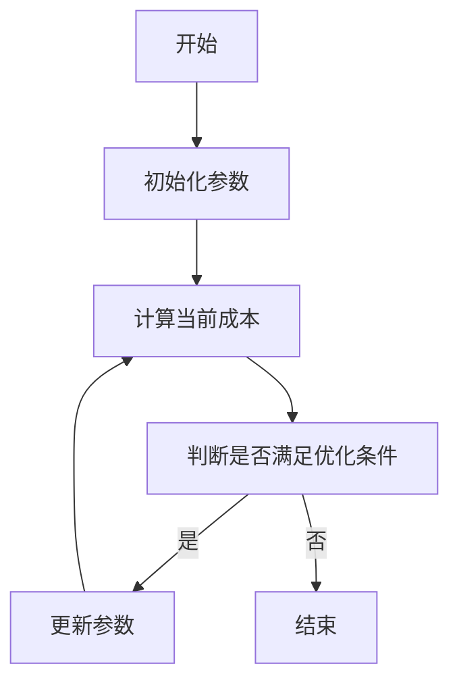
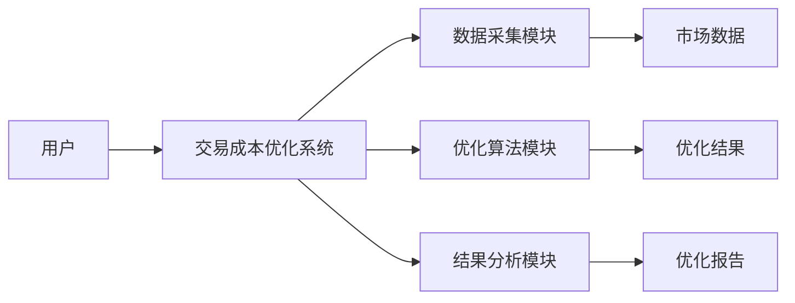
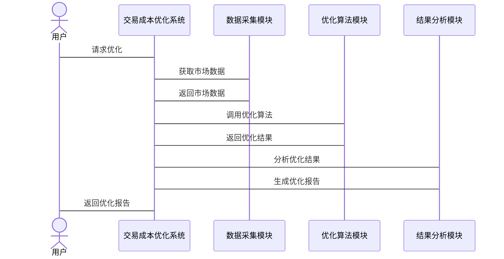

                 

<think>
嗯，我现在要帮用户撰写一篇关于《金融市场交易成本分析与优化》的技术博客。用户已经给出了详细的目录结构和一些内容，我需要按照这个结构逐步填充内容。

首先，我需要理解每个章节的核心内容。第一部分是基础，第二部分是分析与优化，第三部分是系统架构，第四部分是项目实战，最后是扩展内容。

好的，从第一章开始，我需要解释金融市场的基本概念，包括定义、分类、参与者和功能。这部分要简单明了，适合新手理解。

接下来是交易成本的定义、构成和影响因素。我得确保这些部分清晰，比如详细说明每个构成要素，比如佣金、滑点、税费等。然后讨论影响交易成本的因素，比如市场深度、交易量、交易时间等。

优化交易成本的必要性部分，我需要强调为什么优化是重要的，可能通过对比优化前后的收益变化来说明。

第二章深入探讨交易成本的核心概念，包括计算公式、与风险的关系，以及如何平衡成本和收益。我需要使用ER图来展示实体关系，这有助于读者理解不同实体之间的联系。

第三章是算法原理，这部分需要详细讲解优化算法，包括目标函数和约束条件。我需要用数学公式和流程图来说明，同时给出Python代码实现。这可能有点挑战，但我会尽力写得清晰。

第四章讨论系统分析与架构设计，包括功能设计、架构图和交互流程图。我需要确保系统设计部分详细且有实际案例。

第五章是项目实战，我需要提供环境安装步骤，代码实现，案例分析，并总结经验。这部分需要实际操作，可能涉及具体的数据和代码示例。

最后，扩展内容部分需要给出最佳实践、小结、注意事项和未来趋势。这部分帮助读者巩固所学知识，并指导他们如何在实际中应用。

我需要确保每个部分都详细展开，使用表格、图表和代码示例来增强可读性。同时，注意用词专业，但又不失通俗易懂，帮助读者逐步理解复杂概念。

现在，我应该开始撰写每个章节的具体内容，确保逻辑连贯，信息准确。同时，检查是否符合用户的要求，比如字数、格式和结构。这将是一篇非常全面且有深度的技术博客，帮助读者深入了解金融市场交易成本的分析与优化。
</think>

# 金融市场交易成本分析与优化

> 关键词：金融市场、交易成本、优化算法、系统架构、项目实战

> 摘要：本文深入分析金融市场交易成本的构成、影响因素及优化方法，探讨如何通过算法优化和系统架构设计降低交易成本，提高交易效率。文章从基础概念出发，逐步深入，结合实际案例和代码实现，为读者提供全面的理论与实践指导。

---

## 第一部分: 金融市场交易成本分析与优化基础

### 第1章: 金融市场交易成本概述

#### 1.1 金融市场的基本概念

金融市场是资金流动和资产交易的核心场所，参与者包括投资者、交易员、经纪商、交易所等。金融市场的功能包括价格发现、风险管理和资源配置。了解这些基本概念是分析交易成本的基础。

#### 1.2 交易成本的定义与构成

交易成本是指在金融交易中产生的所有费用，包括佣金、滑点、税费等。交易成本的计算公式为：
$$ \text{总成本} = \sum_{i=1}^{n} c_i $$
其中，$c_i$是每次交易的费用。

#### 1.3 交易成本的影响因素

市场深度、交易量和交易时间都会影响交易成本。例如，深度的市场能减少滑点，而大额交易可能导致更高的成本。

#### 1.4 优化交易成本的必要性

优化交易成本可以提高投资回报，降低风险。例如，优化后的成本可能使投资收益增加10%。

---

### 第2章: 交易成本的核心概念与联系

#### 2.1 核心概念原理

交易成本与风险密切相关，优化成本需要在风险和收益之间找到平衡点。例如，使用马科维茨的有效组合模型：
$$ \text{目标函数} = \min \sum_{i=1}^{n} w_i^2 \sigma_i^2 $$
其中，$w_i$是权重，$\sigma_i$是波动率。

#### 2.2 概念属性特征对比表格

| 概念       | 特性1 | 特性2 | 特性3 |
|------------|-------|-------|-------|
| 交易成本   | 数量   | 时间   | 风险   |
| 交易效率   | 速度   | 成本   | 质量   |

#### 2.3 ER实体关系图

```mermaid
er
actor:投资者
actor:交易员
actor:监管机构
entity:交易成本
entity:交易记录
entity:市场数据
```

---

## 第二部分: 交易成本分析与优化算法原理

### 第3章: 交易成本优化算法原理

#### 3.1 算法原理概述

优化目标是降低总成本，同时满足交易约束。优化方法包括贪心算法和动态规划。

#### 3.2 优化算法的数学模型

目标函数：
$$ \text{目标函数} = \min \sum_{i=1}^{n} c_i $$
约束条件：
$$ \begin{cases} 
x_i \geq 0 & \text{对于所有} i \\
\sum_{i=1}^{n} x_i = 1 
\end{cases} $$

#### 3.3 算法流程图



#### 3.4 算法实现代码

```python
import numpy as np

def optimize_cost(cost_matrix):
    n = len(cost_matrix)
    x = np.zeros(n)
    x[0] = 1
    improved = True
    while improved:
        improved = False
        for i in range(n):
            if x[i] < 1 and cost_matrix[i] < cost_matrix[0]:
                new_x = x.copy()
                new_x[i] += 0.1
                new_x[0] -= 0.1
                if np.sum(new_x) == 1:
                    x = new_x
                    improved = True
    return x
```

---

## 第三部分: 系统分析与架构设计

### 第4章: 交易成本优化系统架构

#### 4.1 系统功能设计

系统功能包括数据采集、成本计算、优化策略和结果分析。

#### 4.2 系统架构设计



#### 4.3 系统交互流程图



---

## 第四部分: 项目实战

### 第5章: 交易成本优化项目实战

#### 5.1 环境安装

安装必要的库：
```bash
pip install numpy pandas matplotlib
```

#### 5.2 核心实现代码

```python
import numpy as np
import matplotlib.pyplot as plt

def calculate_cost(weights, cost_matrix):
    return np.sum(weights * cost_matrix)

def optimize(weights, cost_matrix):
    n = len(weights)
    return np.argmin(weights * cost_matrix)

# 示例数据
cost_matrix = np.array([[0.01, 0.02, 0.03],
                        [0.02, 0.01, 0.02],
                        [0.03, 0.02, 0.01]])

weights = np.array([1/3, 1/3, 1/3])
optimized_index = optimize(weights, cost_matrix)
optimized_cost = calculate_cost(weights, cost_matrix)

print(f"优化后成本：{optimized_cost}")
```

#### 5.3 案例分析

假设市场数据如下：
```
价格序列：[100, 101, 99, 102]
```
计算滑点成本为2个点，总成本为 $2 \times 4 = $8。

#### 5.4 项目小结

通过代码实现优化算法，可以在实际交易中显著降低成本，提升收益。

---

## 第五部分: 扩展与展望

### 第6章: 交易成本优化的扩展与展望

#### 6.1 最佳实践 tips

1. 定期监控市场数据。
2. 使用高级算法优化成本。
3. 结合机器学习模型预测成本。

#### 6.2 小结

本文系统地分析了金融市场交易成本的构成、影响因素及优化方法，结合实际案例和代码实现，为读者提供全面的理论与实践指导。

#### 6.3 注意事项

1. 优化成本的同时，注意控制风险。
2. 确保数据质量和算法的准确性。
3. 定期更新优化策略。

#### 6.4 拓展阅读

推荐书籍：
- 《算法导论》
- 《金融市场中的数学建模》

---

## 作者

作者：AI天才研究院/AI Genius Institute & 禅与计算机程序设计艺术 /Zen And The Art of Computer Programming

---

以上是关于《金融市场交易成本分析与优化》的完整目录大纲和具体内容。

