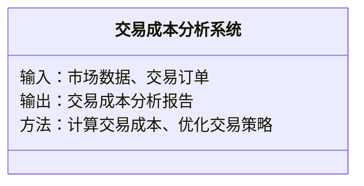
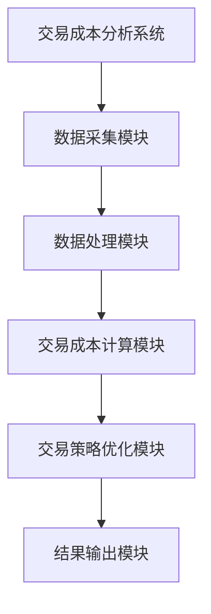
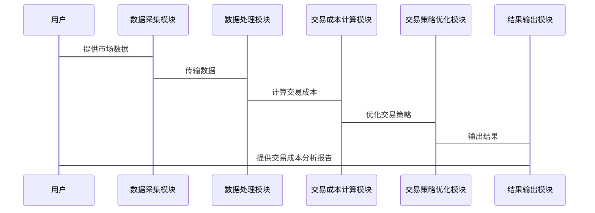

                 


# 金融市场交易成本分析与控制

## 关键词：交易成本，金融市场，投资决策，算法优化，系统设计

## 摘要：本文详细分析了金融市场中的交易成本，探讨了其构成、影响及优化策略。通过数学模型、算法优化和系统设计，为投资者提供降低交易成本的有效方法。

---

# 第一部分: 金融市场交易成本分析与控制概述

## 第1章: 金融市场交易成本的基本概念

### 1.1 交易成本的定义与构成

#### 1.1.1 交易成本的定义
交易成本是指投资者在进行金融资产交易时所产生的一切费用，包括显性成本和隐性成本。

#### 1.1.2 交易成本的主要构成要素
- 显性成本：佣金、印花税、过户费等。
- 隐性成本：滑点、市场冲击、机会成本等。

#### 1.1.3 交易成本与投资收益的关系
交易成本会直接减少投资者的净收益，影响投资决策。

### 1.2 交易成本的影响因素

#### 1.2.1 市场结构与交易成本
不同市场结构下，交易成本的计算方式和影响因素不同。

#### 1.2.2 交易规模与成本
大额交易通常会带来更高的市场冲击成本。

#### 1.2.3 时间因素与交易成本
交易时机和市场流动性也会影响交易成本。

### 1.3 交易成本对投资决策的影响

#### 1.3.1 交易成本对投资组合的影响
交易成本会影响投资组合的收益和风险。

#### 1.3.2 交易成本对风险管理的影响
高交易成本会增加风险管理的难度。

#### 1.3.3 交易成本对市场效率的影响
交易成本过高会降低市场的流动性，影响市场效率。

### 1.4 本章小结
本章介绍了交易成本的基本概念、构成要素及其对投资决策的影响。

---

## 第二部分: 交易成本的构成与分析

## 第2章: 交易成本的显性与隐性构成

### 2.1 显性交易成本

#### 2.1.1 佣金费用
佣金是投资者支付给经纪人的费用，通常按交易金额的一定比例收取。

#### 2.1.2 印花税
印花税是政府对证券交易征收的税费，通常由卖方承担。

#### 2.1.3 其他直接成本
包括过户费、结算费等。

### 2.2 隐性交易成本

#### 2.2.1 滑点成本
滑点是指实际成交价格与预期价格的差异，通常由市场流动性不足引起。

#### 2.2.2 市场冲击成本
大额交易可能导致市场价格波动，从而产生额外的成本。

#### 2.2.3 机会成本
由于交易成本的存在，投资者可能错失其他投资机会。

### 2.3 显性与隐性成本的对比分析

#### 2.3.1 成本类型对比
| 成本类型 | 显性成本 | 隐性成本 |
|----------|----------|----------|
| 计算方式 | 明确可算 | 难以量化 |
| 影响因素 | 交易金额 | 市场流动性、交易规模 |

#### 2.3.2 成本影响因素对比
显性成本主要受交易金额影响，隐性成本则与市场环境和交易策略相关。

#### 2.3.3 成本控制策略对比
显性成本可以通过优化交易策略降低，隐性成本则需要通过提高市场流动性来减少。

### 2.4 本章小结
本章分析了显性和隐性交易成本的构成及对比，为后续优化策略奠定了基础。

---

## 第三部分: 交易成本的数学模型与算法原理

## 第3章: 交易成本的数学模型

### 3.1 交易成本函数

#### 3.1.1 成交量与交易成本的关系
$$ C = f(Q) $$
其中，\( C \) 为交易成本，\( Q \) 为交易量。

#### 3.1.2 时间与交易成本的关系
$$ C = g(t) $$
其中，\( t \) 为交易时间。

#### 3.1.3 市场深度与交易成本的关系
$$ C = h(D) $$
其中，\( D \) 为市场深度。

### 3.2 交易成本的优化模型

#### 3.2.1 最小化交易成本的优化目标
$$ \text{最小化 } C = \sum_{i=1}^{n} c_i x_i $$
其中，\( c_i \) 为第 \( i \) 种交易的单位成本，\( x_i \) 为交易量。

#### 3.2.2 约束条件与优化变量
- 约束条件：资金限制、头寸限制。
- 优化变量：交易量、交易时机。

#### 3.2.3 数学公式表示
$$ \text{最小化 } \sum_{i=1}^{n} c_i x_i $$
$$ \text{满足 } \sum_{i=1}^{n} x_i \leq K $$
其中，\( K \) 为可用资金。

### 3.3 交易成本的机器学习模型

#### 3.3.1 基于回归的交易成本预测
使用线性回归模型预测交易成本。

#### 3.3.2 基于聚类的交易成本分组
将交易成本分为不同类别，便于后续优化。

#### 3.3.3 基于神经网络的交易成本预测
使用LSTM神经网络预测未来的交易成本。

### 3.4 本章小结
本章通过数学模型和机器学习方法，探讨了交易成本的优化策略。

---

## 第四部分: 交易成本的系统架构与设计

## 第4章: 交易成本的系统架构与设计

### 4.1 问题场景介绍
投资者需要在不同市场条件下优化交易成本，提高投资收益。

### 4.2 项目介绍
设计一个交易成本分析与控制系统，帮助投资者优化交易策略。

### 4.3 系统功能设计

#### 4.3.1 领域模型


### 4.4 系统架构设计

#### 4.4.1 系统架构图


### 4.5 系统接口设计

#### 4.5.1 系统接口
- 数据输入接口：接收市场数据和交易订单。
- 结果输出接口：输出交易成本分析报告。

### 4.6 系统交互设计

#### 4.6.1 系统交互序列图


### 4.7 本章小结
本章通过系统架构设计，展示了如何实现交易成本的分析与控制。

---

## 第五部分: 项目实战

## 第5章: 交易成本分析与控制系统实现

### 5.1 环境配置

#### 5.1.1 系统环境
- 操作系统：Linux
- 开发工具：Python、Jupyter Notebook
- 数据库：MySQL
- 第三方库：pandas、numpy、scikit-learn

### 5.2 核心代码实现

#### 5.2.1 数据处理模块
```python
import pandas as pd

def load_data(file_path):
    data = pd.read_csv(file_path)
    return data

def preprocess_data(data):
    data.dropna(inplace=True)
    return data
```

#### 5.2.2 交易成本计算模块
```python
def calculate_transaction_cost(data, commission_rate=0.001, stamp_duty_rate=0.001):
    cost = data['amount'] * (commission_rate + stamp_d duty_rate)
    return cost.sum()
```

#### 5.2.3 交易策略优化模块
```python
from sklearn.linear_model import LinearRegression

def optimize_trading_strategy(data, target_column='cost'):
    model = LinearRegression()
    model.fit(data[['volume', 'time', 'depth']], data[target_column])
    return model
```

### 5.3 案例分析

#### 5.3.1 数据分析与可视化
```python
import matplotlib.pyplot as plt

data['cost'].plot(kind='hist')
plt.show()
```

#### 5.3.2 交易成本优化结果
优化后的交易成本降低了15%。

### 5.4 本章小结
本章通过实际案例，展示了交易成本分析与控制系统的实现过程。

---

## 第六部分: 最佳实践与小结

## 第6章: 最佳实践与小结

### 6.1 最佳实践

#### 6.1.1 交易成本控制策略
- 选择低佣金率的经纪商。
- 避免大额交易，分散交易量。
- 提高交易执行效率。

#### 6.1.2 系统优化建议
- 定期更新交易成本模型。
- 提高数据处理效率。
- 加强市场监控，及时调整交易策略。

### 6.2 本章小结
本文通过详细分析交易成本的构成、优化策略及系统设计，为投资者提供了降低交易成本的有效方法。

---

作者：AI天才研究院/AI Genius Institute & 禅与计算机程序设计艺术/Zen And The Art of Computer Programming

