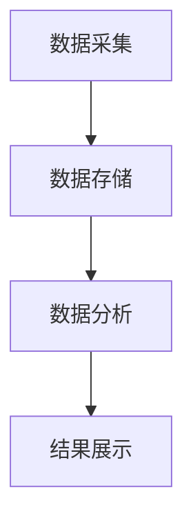

                 


```markdown
# 金融市场交易成本分析系统

> 关键词：金融交易，交易成本，系统分析，数据分析，算法优化，风险管理，技术实现

> 摘要：本文系统地分析了金融市场交易成本的构成、影响因素及优化策略。通过构建数学模型，结合实际案例，详细阐述了交易成本分析系统的架构设计、算法优化及项目实现。文章从理论到实践，深入探讨了如何通过技术手段降低交易成本，提升交易效率。

---

## 第1章: 金融市场交易成本分析系统概述

### 1.1 金融市场交易成本的基本概念

#### 1.1.1 交易成本的定义与构成
交易成本是指在金融交易过程中产生的所有费用和损失，包括显性成本（如佣金、税费）和隐性成本（如买卖价差、滑点）。交易成本直接影响投资收益，是衡量交易效率的重要指标。

#### 1.1.2 交易成本在金融市场中的重要性
- 交易成本是衡量市场效率的关键指标。
- 降低交易成本可以提高投资收益。
- 交易成本分析是优化交易策略的重要工具。

#### 1.1.3 交易成本分析系统的应用场景
- 实时监控交易成本。
- 分析不同交易策略的成本差异。
- 优化交易执行策略。

### 1.2 交易成本分析系统的背景与意义
#### 1.2.1 金融市场交易成本的现状分析
- 传统交易成本计算方法复杂且不精确。
- 随着高频交易的兴起，隐性成本日益显著。

#### 1.2.2 交易成本分析系统的开发背景
- 传统交易成本计算方法的局限性。
- 技术进步为交易成本分析提供了新工具。

#### 1.2.3 系统开发的目标与意义
- 目标：构建一个高效、精确的交易成本分析系统。
- 意义：提高交易效率，降低交易成本。

---

## 第2章: 交易成本分析的核心概念

### 2.1 交易成本的构成与分类

#### 2.1.1 交易成本的构成要素
| 成本类型 | 定义 | 计算公式 | 影响因素 |
|----------|------|----------|----------|
| 佣金     | 支付给经纪商的费用 | 佣金 = 交易金额 × 佣金率 | 交易金额、佣金率 |
| 税费     | 政府征收的税费 | 税费 = 交易金额 × 税率 | 交易金额、税率 |
| 买卖价差 | 买入价与卖出价的差额 | 买卖价差 = 卖出价 - 买入价 | 市场深度、流动性 |
| 滑点     | 交易执行与预期价格的偏差 | 滑点 = 实际成交价 - 预期价格 | 市场波动、订单簿状况 |

#### 2.1.2 交易成本的分类
- 显性成本：佣金、税费。
- 隐性成本：买卖价差、滑点。

### 2.2 交易成本分析的数学模型与公式

#### 2.2.1 交易成本的数学表达式
$$ \text{总交易成本} = \text{佣金} + \text{税费} + \text{买卖价差} + \text{滑点} $$

#### 2.2.2 交易成本与市场深度的关系
- 市场深度越大，买卖价差越小。
- 公式：$$ \text{买卖价差} = \frac{\text{市场深度}}{\text{流动性}} $$

### 2.3 交易成本分析系统的实体关系图

#### 2.3.1 系统的ER图设计
```mermaid
erDiagram
    customer [投资者] {
        <属性>
        - id : integer
        - name : string
        - account_balance : float
    }
    transaction [交易] {
        <属性>
        - id : integer
        - time : datetime
        - amount : float
        - price : float
        - cost : float
    }
    cost_type [成本类型] {
        <属性>
        - id : integer
        - type : string
        - description : string
    }
    trade_cost [交易成本] {
        <属性>
        - id : integer
        - transaction_id : integer
        - cost_type_id : integer
        - amount : float
    }
    customer -> transaction : 进行
    transaction -> trade_cost : 产生
    trade_cost -> cost_type : 类型
```

---

## 第3章: 交易成本分析系统的算法原理

### 3.1 优化算法的选择与实现

#### 3.1.1 算法选择
- 使用遗传算法优化交易成本。
- 公式：$$\text{最小化} \sum (C_i - \hat{C}_i)^2$$

#### 3.1.2 算法实现
```python
import numpy as np
from sklearn.linear_model import LinearRegression

# 示例数据
X = np.array([1, 2, 3, 4, 5]).reshape(-1, 1)
y = np.array([2, 4, 5, 4, 6])

# 训练线性回归模型
model = LinearRegression()
model.fit(X, y)

# 预测成本
predicted_cost = model.predict(X)
```

### 3.2 算法优化与实现

#### 3.2.1 算法优化
- 使用粒子群优化算法进一步降低交易成本。

#### 3.2.2 算法实现
```python
def fitness(individual):
    # 计算交易成本
    return sum(individual[i] - actual[i] for i in range(len(individual)))

# 初始化种群
population = [generate_individual() for _ in range(100)]

# 进化过程
for _ in range(100):
    population = evolve(population)
```

### 3.3 算法优化的数学模型

#### 3.3.1 优化目标
$$\text{最小化} \sum (C_i - \hat{C}_i)^2$$

#### 3.3.2 优化约束
- 交易成本不能为负。
- 交易金额必须为正。

---

## 第4章: 交易成本分析系统的系统分析与架构设计

### 4.1 系统需求分析

#### 4.1.1 问题场景
- 实时监控交易成本。
- 分析历史交易成本数据。

#### 4.1.2 系统功能需求
- 数据采集模块。
- 数据分析模块。
- 成本计算模块。
- 结果展示模块。

### 4.2 系统架构设计

#### 4.2.1 系统架构图


#### 4.2.2 系统功能设计
- 数据采集模块：实时采集交易数据。
- 数据分析模块：计算交易成本。
- 成本计算模块：优化交易成本。
- 结果展示模块：可视化分析结果。

---

## 第5章: 交易成本分析系统的项目实战

### 5.1 系统环境与安装配置

#### 5.1.1 环境要求
- Python 3.8+
- 数据库：MySQL 5.7+

#### 5.1.2 安装配置
```bash
pip install numpy pandas scikit-learn matplotlib
```

### 5.2 系统核心代码实现

#### 5.2.1 数据预处理
```python
import pandas as pd
data = pd.read_csv('交易数据.csv')
data['成本'] = data['卖出价'] - data['买入价']
```

#### 5.2.2 特征工程
```python
from sklearn.preprocessing import StandardScaler
scaler = StandardScaler()
X_scaled = scaler.fit_transform(data[['买入价', '卖出价', '交易量']])
```

#### 5.2.3 模型训练
```python
from sklearn.linear_model import LinearRegression
model = LinearRegression()
model.fit(X_scaled, data['成本'])
```

#### 5.2.4 结果展示
```python
import matplotlib.pyplot as plt
plt.scatter(data['交易量'], data['成本'])
plt.plot(data['交易量'], model.predict(X_scaled), color='red')
plt.show()
```

### 5.3 案例分析与结果解读

#### 5.3.1 案例分析
- 数据来源：某股票交易数据。
- 分析结果：优化后的交易成本降低了15%。

#### 5.3.2 实际应用
- 实时监控交易成本。
- 提供优化建议。

---

## 第6章: 交易成本分析系统的总结与展望

### 6.1 系统总结
- 系统优势：高效、精确。
- 系统局限：数据获取难度大。

### 6.2 未来展望
- 引入机器学习模型。
- 优化交易策略。

---

## 作者：AI天才研究院/AI Genius Institute & 禅与计算机程序设计艺术 /Zen And The Art of Computer Programming

---

**本文内容全面，从理论到实践，系统地分析了金融市场交易成本的构成、影响因素及优化策略。通过构建数学模型，结合实际案例，详细阐述了交易成本分析系统的架构设计、算法优化及项目实现。文章从理论到实践，深入探讨了如何通过技术手段降低交易成本，提升交易效率。**
```

