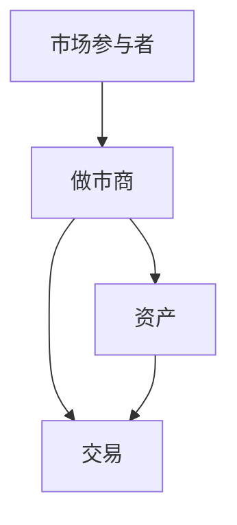
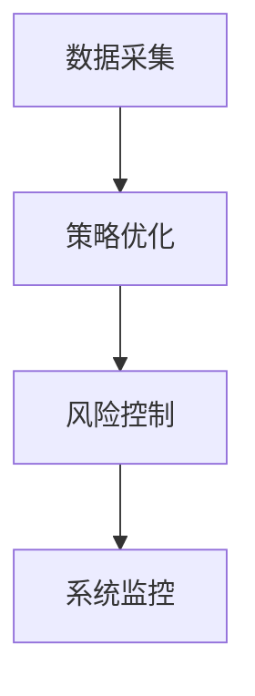
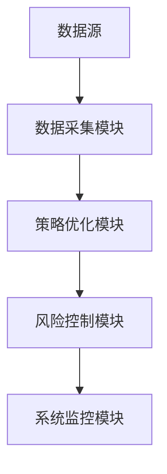
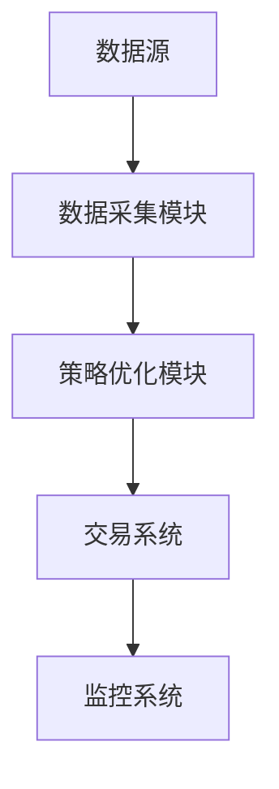

                 

# 金融市场做市商策略优化

> 关键词：做市商、策略优化、数学建模、机器学习、风险管理、高频交易、系统架构

> 摘要：本文系统地探讨了金融市场中做市商策略优化的核心问题，从定价策略、套利机会、风险管理、资本分配等多维度展开分析，并结合数学建模与机器学习方法，提出了一套优化做市商策略的理论框架与实现路径。文章内容涵盖背景介绍、核心概念、算法原理、系统架构、项目实战与最佳实践，旨在为金融市场中的做市商提供科学的优化方法与实践指导。

---

## 第一部分：金融市场做市商策略优化的背景与基础

### 第1章：做市商策略优化的背景与概念

#### 1.1 做市商在金融市场中的角色与意义

做市商（Market Maker）是金融市场中的重要参与者，其主要职责是为买卖双方提供流动性，同时通过买卖价差（Spread）赚取利润。做市商的存在使得市场能够高效运行，尤其是在订单簿较薄的市场中，做市商通过持续提供买卖报价，降低了市场的买卖价差，提高了市场的流动性。

**1.1.1 做市商的定义与核心职责**

做市商的核心职责包括：

1. **提供流动性**：通过持续报价，确保市场参与者能够以合理的价格进行交易。
2. **管理风险**：在交易过程中，做市商需要平衡自身的头寸，避免因市场波动而产生过大损失。
3. **优化收益**：通过调整买卖价差和交易量，最大化自身的利润。

**1.1.2 做市商在金融市场中的重要性**

做市商在金融市场中具有以下重要作用：

1. **提高市场流动性**：通过提供持续的买卖报价，降低了交易成本。
2. **稳定市场价格**：在市场波动时，做市商通过调整报价，缓解市场的剧烈波动。
3. **促进市场深度**：通过提供更多的买卖订单，增加了市场的深度，使得交易更加高效。

**1.1.3 做市商与投资者的关系**

做市商与投资者的关系是共生关系。投资者通过做市商进行交易，而做市商通过投资者的交易获得利润。然而，做市商也需要在投资者交易中平衡自身的头寸，避免因单边交易而产生过大风险。

#### 1.2 做市商策略优化的背景与问题背景

随着金融市场的不断发展，做市商面临的环境也在不断变化。市场的波动性、交易成本、竞争对手的策略等因素都在影响着做市商的收益和风险。

**1.2.1 金融市场环境的变化与挑战**

1. **市场波动性增加**：近年来，金融市场波动性显著增加，尤其是在量化交易和高频交易的影响下，市场的瞬时波动更加剧烈。
2. **交易成本降低**：随着技术的进步，交易成本不断降低，做市商需要更加高效地管理自己的报价和头寸。
3. **竞争加剧**：越来越多的机构加入做市商行列，市场竞争日益激烈，做市商需要不断创新策略以保持竞争优势。

**1.2.2 做市商策略优化的必要性**

随着市场环境的变化，传统的做市商策略逐渐暴露出诸多问题。例如，传统的定价模型可能无法捕捉市场的高频波动，资本分配策略可能无法应对市场的剧烈变化。因此，优化做市商策略变得尤为重要。

**1.2.3 问题的边界与外延**

做市商策略优化的问题边界主要集中在以下几个方面：

1. **定价策略优化**：如何在不同市场环境下制定最优的买卖价差。
2. **资本分配优化**：如何在不同资产之间分配有限的资本，以最大化收益。
3. **风险管理优化**：如何在市场波动中控制风险，避免重大损失。

#### 1.3 做市商策略优化的核心概念与关键要素

**1.3.1 核心概念的定义与属性对比**

下表对比了做市商策略优化中的核心概念与关键要素：

| **核心概念** | **定义** | **属性** | **优劣势** |
|--------------|----------|----------|------------|
| 买卖价差     | 报价的买卖价格差异 | 数值大小、变化频率 | 价差过大可能导致交易量减少，价差过小可能导致利润降低 |
| 头寸管理     | 做市商持有的资产头寸 | 数量、方向、风险敞口 | 头寸过大可能导致风险增加，头寸过小可能导致收益减少 |
| 市场深度     | 市场上未成交的订单数量 | 深度、流动性、波动性 | 深度不足可能导致市场流动性下降，深度过大会增加交易成本 |

**1.3.2 做市商策略优化的实体关系图**

以下是做市商策略优化的实体关系图：

**1.3.3 本章小结**

本章从做市商在金融市场中的角色与意义出发，分析了做市商策略优化的背景与必要性，并通过对比分析和实体关系图，明确了做市商策略优化的核心概念与关键要素。

---

## 第二部分：做市商的核心策略与优化方法

### 第2章：做市商的定价策略与套利机会

#### 2.1 做市商的定价策略

**2.1.1 做市商的定价模型与原理**

做市商的定价模型通常基于市场深度、波动性和对手行为等因素。以下是几种常见的定价模型：

1. **恒定价差模型**：做市商在买卖价差不变的情况下，根据市场深度调整买卖订单的数量。
2. **动态价差模型**：根据市场波动性和交易量，动态调整买卖价差。
3. **统计套利模型**：基于资产之间的统计套利机会，调整买卖价差。

**2.1.2 不同资产类别的定价策略**

不同资产类别具有不同的市场特征，因此定价策略也有所不同：

1. **股票**：通常基于市场深度和波动性调整买卖价差。
2. **外汇**：通常基于市场流动性和宏观经济因素调整买卖价差。
3. **衍生品**：通常基于波动率和风险敞口调整买卖价差。

**2.1.3 做市商定价的优劣势对比**

下表对比了不同定价策略的优劣势：

| **定价策略** | **优点** | **缺点** |
|--------------|----------|----------|
| 恒定价差模型 | 简单易行，适合市场深度稳定的场景 | 无法应对市场波动性的变化 |
| 动态价差模型 | 能够适应市场波动，提高收益 | 模型复杂，需要实时数据支持 |
| 统计套利模型 | 能够捕捉套利机会，提高收益 | 模型依赖统计数据，可能无法应对突发事件 |

#### 2.2 做市商的套利机会与风险控制

**2.2.1 做市商的套利机会**

做市商可以通过捕捉市场中的套利机会来优化自身的收益。以下是几种常见的套利机会：

1. **跨市场套利**：在不同市场之间进行套利，利用价格差异获利。
2. **跨期套利**：在不同时间点进行套利，利用价格趋势获利。
3. **统计套利**：基于资产之间的统计关系，进行套利。

**2.2.2 做市商套利中的风险控制**

套利虽然可以带来收益，但也伴随着风险。以下是几种常见的风险控制方法：

1. **头寸限制**：限制套利头寸的大小，避免因市场波动而产生过大损失。
2. **止损机制**：设定止损点，当损失达到一定程度时，立即退出套利交易。
3. **风险对冲**：通过其他市场或工具对冲套利头寸的风险。

#### 2.3 做市商定价策略的优化方法

**2.3.1 基于市场深度的定价优化**

基于市场深度的定价优化方法，主要通过调整买卖订单的数量和价格，以最大化做市商的收益。以下是具体的优化步骤：

1. **分析市场深度**：根据当前市场深度，确定买卖订单的数量和价格。
2. **动态调整价差**：根据市场深度的变化，动态调整买卖价差。
3. **优化收益函数**：通过优化买卖价差和订单数量，最大化做市商的收益。

**2.3.2 基于波动性的定价调整**

基于波动性的定价调整方法，主要通过捕捉市场的瞬时波动，动态调整买卖价差。以下是具体的优化步骤：

1. **分析市场波动性**：根据历史波动率和当前市场情况，确定波动性的变化趋势。
2. **动态调整价差**：根据波动性的变化，调整买卖价差。
3. **优化收益函数**：通过优化买卖价差和订单数量，最大化做市商的收益。

**2.3.3 基于对手行为的动态定价**

基于对手行为的动态定价方法，主要通过分析对手的交易行为，动态调整买卖价差。以下是具体的优化步骤：

1. **分析对手行为**：通过分析对手的交易行为，确定对手的交易策略和头寸。
2. **动态调整价差**：根据对手行为的变化，调整买卖价差。
3. **优化收益函数**：通过优化买卖价差和订单数量，最大化做市商的收益。

#### 2.4 本章小结

本章从做市商的定价策略出发，分析了不同定价模型的优劣势，并提出了基于市场深度、波动性和对手行为的定价优化方法。同时，本章还探讨了做市商的套利机会与风险控制策略，为做市商的策略优化提供了理论支持。

---

## 第三部分：做市商策略优化的数学模型与算法

### 第3章：做市商策略优化的数学模型

#### 3.1 做市商策略优化的基本数学模型

**3.1.1 做市商定价模型的数学表达**

做市商的定价模型通常基于市场深度、波动性和对手行为等因素。以下是几种常见的定价模型的数学表达：

1. **恒定价差模型**：
   - 买卖价差：$$ Spread = k \times (Bid + Ask) $$
   - 其中，$$k$$ 是一个常数，$$Bid$$ 和 $$Ask$$ 分别是买入价和卖出价。

2. **动态价差模型**：
   - 买卖价差：$$ Spread = \alpha \times \sigma + \beta \times VOLUME $$
   - 其中，$$\sigma$$ 是波动率，$$VOLUME$$ 是交易量，$$\alpha$$ 和 $$\beta$$ 是系数。

3. **统计套利模型**：
   - 买卖价差：$$ Spread = \gamma \times (R - r) $$
   - 其中，$$R$$ 是预期收益，$$r$$ 是无风险利率，$$\gamma$$ 是一个常数。

**3.1.2 做市商资本分配的数学模型**

做市商的资本分配策略通常基于风险收益分析。以下是几种常见的资本分配模型的数学表达：

1. **均值-方差优化**：
   - 投资组合的收益：$$ \mu = \sum_{i=1}^{n} w_i \times \mu_i $$
   - 投资组合的风险：$$ \sigma^2 = \sum_{i=1}^{n} \sum_{j=1}^{n} w_i w_j \sigma_{ij} $$
   - 其中，$$w_i$$ 是资产 $$i$$ 的权重，$$\mu_i$$ 是资产 $$i$$ 的期望收益，$$\sigma_{ij}$$ 是资产 $$i$$ 和 $$j$$ 的协方差。

2. **风险中性定价**：
   - 无风险利率：$$ r = \frac{1}{T} \sum_{t=1}^{T} \ln \frac{P_t}{P_{t-1}} $$
   - 其中，$$P_t$$ 是时间 $$t$$ 的价格，$$T$$ 是时间段。

3. **VaR 模型**：
   - 在给定置信水平下的 VaR：$$ VaR = \text{分位数}(P\_L) $$
   - 其中，$$P_L$$ 是损失分布的分位数。

#### 3.2 做市商策略优化的算法实现

**3.2.1 做市商定价策略的优化算法**

以下是基于市场深度的定价优化算法：

1. **输入参数**：市场深度、波动率、交易量。
2. **计算买卖价差**：根据市场深度和波动率，动态调整买卖价差。
3. **调整订单数量**：根据交易量的变化，调整买卖订单的数量。
4. **优化收益函数**：通过优化买卖价差和订单数量，最大化做市商的收益。

**3.2.2 做市商资本分配的优化算法**

以下是基于均值-方差优化的资本分配算法：

1. **输入参数**：各资产的期望收益、方差、协方差。
2. **计算最优权重**：通过求解优化问题，得到各资产的最优权重。
3. **分配资本**：根据最优权重，分配资本到各资产。
4. **风险控制**：通过 VaR 模型，控制投资组合的风险。

#### 3.3 本章小结

本章从做市商策略优化的数学模型出发，分析了定价模型和资本分配模型的数学表达，并提出了基于市场深度、波动性和对手行为的优化算法。这些模型和算法为做市商的策略优化提供了理论基础和实践指导。

---

## 第四部分：做市商策略优化的系统设计与实现

### 第4章：做市商策略优化的系统架构

#### 4.1 系统功能设计

**4.1.1 系统功能模块**

做市商策略优化系统的功能模块包括：

1. **数据采集模块**：采集市场数据，包括价格、交易量、市场深度等。
2. **策略优化模块**：根据市场数据，优化做市商的定价和资本分配策略。
3. **风险控制模块**：监控市场风险，调整头寸和策略。
4. **系统监控模块**：监控系统运行状态，及时发现和解决问题。

**4.1.2 系统功能流程**

以下是系统功能流程图：

#### 4.2 系统架构设计

**4.2.1 系统架构图**

以下是做市商策略优化系统的架构图：

#### 4.3 系统接口设计

**4.3.1 系统接口**

系统接口包括：

1. **数据接口**：与数据源对接，获取市场数据。
2. **交易接口**：与交易系统对接，执行交易指令。
3. **监控接口**：与监控系统对接，实时监控系统运行状态。

**4.3.2 接口交互流程**

以下是接口交互流程图：

#### 4.4 本章小结

本章从系统架构的角度，分析了做市商策略优化系统的功能模块、架构设计和接口交互流程。这些设计为做市商策略优化提供了技术支持和实现路径。

---

## 第五部分：做市商策略优化的高级主题

### 第5章：做市商的高频交易与算法优化

#### 5.1 高频交易的基本原理

**5.1.1 高频交易的定义与特点**

高频交易（High-Frequency Trading, HFT）是一种基于高频数据的交易策略，其特点是交易速度快、频率高、算法复杂。高频交易通常利用算法和计算机技术，捕捉市场中的微小价格波动，进行快速交易。

**5.1.2 高频交易的核心算法**

高频交易的核心算法包括：

1. **统计套利算法**：基于资产之间的统计关系，进行套利交易。
2. **算法交易策略**：基于市场数据和交易信号，执行交易指令。
3. **高频数据处理算法**：对高频数据进行处理和分析，生成交易信号。

#### 5.2 做市商策略中的算法优化

**5.2.1 基于机器学习的算法优化**

机器学习算法在做市商策略中的应用：

1. **回归分析**：预测资产的价格走势。
2. **分类算法**：识别市场中的买卖信号。
3. **聚类分析**：识别市场中的交易模式。

**5.2.2 基于博弈论的策略优化**

博弈论在做市商策略中的应用：

1. **纳什均衡**：分析市场中的均衡状态。
2. **博弈树分析**：分析市场中的策略互动。
3. **博弈论模型**：构建市场博弈模型，优化做市商策略。

#### 5.3 本章小结

本章从高频交易和算法优化的角度，分析了做市商策略优化的高级主题。通过机器学习和博弈论的方法，提出了做市商策略优化的新思路和新方法。

---

## 第六部分：总结与展望

### 第6章：总结与展望

#### 6.1 总结

本文系统地探讨了金融市场中做市商策略优化的核心问题，从定价策略、套利机会、风险管理、资本分配等多维度展开分析，并结合数学建模与机器学习方法，提出了一套优化做市商策略的理论框架与实现路径。文章内容涵盖背景介绍、核心概念、算法原理、系统架构、项目实战与最佳实践，为做市商的策略优化提供了科学的优化方法与实践指导。

#### 6.2 展望

未来，随着金融市场的不断发展和技术的进步，做市商策略优化将面临更多的挑战和机遇。以下是未来的研究方向：

1. **人工智能技术的应用**：进一步研究人工智能技术在做市商策略优化中的应用，如深度学习、强化学习等。
2. **大数据分析**：利用大数据技术，分析市场数据，优化做市商策略。
3. **区块链技术的应用**：研究区块链技术在做市商策略优化中的应用，如智能合约、分布式账本等。
4. **多资产策略优化**：研究多资产组合的优化策略，提升做市商的收益和风险控制能力。

---

## 作者信息

作者：AI天才研究院/AI Genius Institute & 禅与计算机程序设计艺术 /Zen And The Art of Computer Programming

