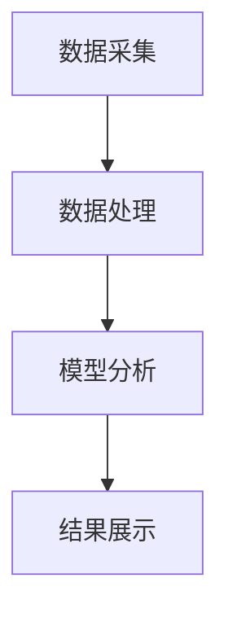

                 

<think>
嗯，现在我需要帮用户设计《金融市场微观结构分析》这本书的目录大纲。首先，我得理解这本书的主题是什么。金融市场微观结构主要研究市场的运作机制，包括交易过程、价格形成、市场参与者的互动等等。这类书籍通常会涉及市场微观结构的理论、模型以及实际应用。

接下来，我应该考虑用户的需求。用户希望目录大纲详细且逻辑清晰，覆盖主题内容，而且要按照特定的格式来写。我需要确保每个部分都细化到三级目录，并且包含背景介绍、核心概念、算法原理、系统分析、项目实战、最佳实践等部分。

首先，我得确定书的结构。通常，书籍会有引言、基础理论、模型分析、实证研究、系统设计、案例分析和结论等部分。所以，我可能会将目录分成几个主要部分，比如基础理论、市场微观结构模型、高频交易与算法、实证分析、系统设计、案例分析和结论等。

接下来，每个部分需要细化。比如，在基础理论部分，可能需要介绍市场的基本概念、订单驱动机制、流动性与市场深度等。这些内容帮助读者打下坚实的基础。

然后，核心概念部分需要详细讲解市场微观结构中的关键概念，比如订单类型、市场参与者、价格发现机制等。这部分可能需要对比表格和ER图来展示不同概念的属性和关系。

在算法原理部分，我需要选择几个典型的算法，比如订单簿模型、最优拍卖模型，并用mermaid流程图来展示算法的流程，同时提供Python代码实现，以便读者理解和应用。

实证分析部分可能需要结合实际数据，分析市场微观结构的影响因素，比如市场深度、订单簿动态等。这部分需要数学模型和公式，帮助读者理解理论在实践中的应用。

系统设计部分可能涉及高频交易系统的设计，包括系统架构、接口设计和交互流程。这部分需要用mermaid图来展示系统架构和交互序列，确保读者能够清晰理解系统的运作。

案例分析部分需要通过实际案例来展示市场微观结构分析的应用，比如算法交易策略或市场操纵检测。这不仅能让读者理论联系实际，还能帮助他们更好地掌握分析方法。

最后，结论部分总结全书内容，并提出未来的研究方向和实践建议，帮助读者进一步思考和应用所学知识。

在编写目录时，我需要确保每个章节都有明确的主题，并且三级目录详细具体。同时，要满足用户的要求，包括数学公式、代码实现、图表展示等部分，确保内容的完整性和深度。

总的来说，我需要将《金融市场微观结构分析》这本书的内容分解成几个主要部分，每个部分下再细分章节，确保逻辑清晰，内容全面，同时遵循用户的格式和结构要求。这将帮助作者构建一个结构合理、内容详实的目录大纲，满足读者的学习和研究需求。
</think>

# 《金融市场微观结构分析》

---

## 文章关键词：

金融市场、微观结构、价格形成、订单驱动、高频交易、市场参与者、交易算法

---

## 摘要：

金融市场微观结构分析是研究金融市场中参与者行为、价格形成机制和交易过程的科学。本文从基础理论出发，系统阐述了市场微观结构的核心概念、理论模型、算法原理及实证分析方法。通过详细分析高频交易、订单驱动机制和市场参与者的互动关系，本文揭示了金融市场微观结构的关键特征及其对市场效率的影响。结合实际案例和系统设计，本文为读者提供了全面理解金融市场微观结构的框架，并为后续研究提供了理论基础和实践指导。

---

## 第1章: 金融市场微观结构概述

### 1.1 金融市场微观结构的定义与背景

#### 1.1.1 金融市场的基本概念

金融市场的核心功能是资金的融通和资产的价格发现。金融市场由参与者、交易标的、交易场所和交易机制四部分组成。参与者包括投资者、机构、交易所和监管机构。

#### 1.1.2 微观结构的定义与研究意义

市场微观结构研究市场的运作机制，包括交易过程、价格形成和参与者互动。它帮助我们理解市场的流动性、效率和稳定性，为政策制定和交易策略提供依据。

#### 1.1.3 金融市场微观结构的核心要素

- **订单驱动机制**：交易由订单驱动，分为限价单、市价单和 iceberg 单等类型。
- **价格发现**：市场价格由供需决定，反映了所有市场参与者的预期。
- **流动性**：市场深度和广度决定交易的难易程度。

#### 1.1.4 金融市场微观结构的外延与边界

市场微观结构的研究范围包括交易场所、交易机制和参与者行为，其边界在于宏观市场和微观个体行为之间的互动。

### 1.2 金融市场参与者的角色与行为

#### 1.2.1 市场参与者类型

- **投资者**：个人和机构投资者，追求收益最大化。
- **做市商**：提供流动性，承担风险。
- **交易所**：撮合交易，提供交易场所。
- **监管机构**：维护市场秩序，保护投资者利益。

#### 1.2.2 不同参与者的行为特征

- **投资者**：理性预期，追求收益最大化。
- **做市商**：通过买卖价差获利，保持市场深度。
- **高频交易者**：利用算法快速交易，捕捉短期价格波动。

#### 1.2.3 市场参与者之间的互动关系

市场参与者通过订单簿和交易信息相互影响，形成价格和市场深度。做市商和高频交易者通过算法优化交易策略，提高市场流动性。

### 1.3 金融市场微观结构的核心概念

#### 1.3.1 市场深度与流动性

市场深度反映了市场参与者愿意在给定价格上交易的数量，决定了交易的难易程度。流动性是市场深度和广度的综合体现，影响交易成本和市场稳定性。

#### 1.3.2 市场微观结构的动态特征

市场价格和订单深度随时间动态变化，反映了市场参与者的互动和信息变化。动态特征包括价格波动、订单簿变化和交易量波动。

#### 1.3.3 市场微观结构的外延与边界

市场微观结构的研究范围包括交易机制、参与者行为和价格形成机制，其边界在于宏观市场和微观个体行为之间的互动。

### 1.4 本章小结

---

## 第2章: 市场微观结构的核心理论框架

### 2.1 市场微观结构的基本假设

#### 2.1.1 理性预期假设

市场参与者基于理性预期做出决策，价格反映所有可获得的信息。理性预期是市场微观结构分析的基础。

#### 2.1.2 市场均衡假设

市场在均衡状态下，供给等于需求，价格稳定。均衡分析帮助我们理解市场的长期行为。

#### 2.1.3 交易成本与信息摩擦

交易成本和信息不对称影响市场的效率和稳定性。信息摩擦是市场微观结构的重要研究内容。

### 2.2 市场微观结构的主要模型

#### 2.2.1 订单驱动模型

订单驱动模型描述了市场的交易过程，包括订单类型、匹配规则和价格形成的机制。

#### 2.2.2 最优拍卖模型

最优拍卖模型研究如何设计拍卖机制，以实现价格的最优形成。常见的拍卖机制包括 Vickrey 拍卖和 Dutch 拍卖。

#### 2.2.3 价格形成机制模型

价格形成机制模型研究市场价格的形成过程，包括订单簿模型和拍卖模型。

### 2.3 市场微观结构的核心理论

#### 2.3.1 市场微观结构的均衡分析

均衡分析帮助我们理解市场的长期行为，包括价格均衡和订单均衡。

#### 2.3.2 市场微观结构的动态分析

动态分析研究市场价格和订单深度的短期波动，包括价格波动和订单簿变化。

#### 2.3.3 市场微观结构的效率与公平性

市场效率是指市场在资源分配中的有效性，市场公平性是指市场对所有参与者公平。效率与公平是市场微观结构的重要研究内容。

### 2.4 本章小结

---

## 第3章: 市场微观结构的实证分析

### 3.1 市场微观结构的实证研究框架

#### 3.1.1 数据采集与处理

数据采集包括交易数据、订单簿数据和市场参与者行为数据。数据处理包括清洗、转换和存储。

#### 3.1.2 数据分析方法

数据分析方法包括统计分析、时间序列分析和机器学习方法。统计分析用于描述数据特征，时间序列分析用于研究数据的动态变化，机器学习用于预测和分类。

#### 3.1.3 实证研究的步骤

实证研究的步骤包括数据采集、数据处理、模型选择、模型估计和结果分析。

### 3.2 市场微观结构的实证案例

#### 3.2.1 高频交易对市场流动性的影响

高频交易通过算法快速交易，提高了市场的流动性，但也可能引发市场波动。

#### 3.2.2 订单簿分析与价格预测

订单簿分析研究订单簿的动态变化，帮助预测市场价格的变化。常用的技术指标包括订单深度、订单撤销率和订单不平衡度。

#### 3.2.3 市场参与者的交易行为分析

通过分析市场参与者的交易行为，可以理解市场的微观结构特征。例如，做市商的订单簿管理和高频交易者的策略行为。

### 3.3 本章小结

---

## 第4章: 高频交易与算法

### 4.1 高频交易的核心算法

#### 4.1.1 市场微观结构分析算法

市场微观结构分析算法研究市场价格和订单深度的动态变化，包括订单簿模型和价格形成模型。

#### 4.1.2 高频交易策略算法

高频交易策略算法包括统计套利、算法交易和基于机器学习的交易策略。

### 4.2 高频交易系统的实现

#### 4.2.1 系统架构设计

高频交易系统通常采用分布式架构，包括数据采集、订单处理和交易执行模块。

#### 4.2.2 系统实现的代码示例

以下是一个简单的高频交易策略实现代码示例：

```python
import numpy as np
import pandas as pd
from datetime import datetime

# 数据采集与处理
data = pd.read_csv('market_data.csv')
data['time'] = pd.to_datetime(data['time'])

# 订单簿分析
def calculate_orderbook(data):
    bid = data[data['side'] == 'B']
    ask = data[data['side'] == 'A']
    return bid, ask

# 高频交易策略
class HighFrequencyStrategy:
    def __init__(self, data):
        self.data = data
        self.position = 0

    def execute(self):
        for i in range(1, len(self.data)):
            if self.data['price'][i] > self.data['price'][i-1]:
                self.position += 1
            elif self.data['price'][i] < self.data['price'][i-1]:
                self.position -= 1

# 策略执行
strategy = HighFrequencyStrategy(data)
strategy.execute()
```

### 4.3 高频交易对市场微观结构的影响

高频交易通过算法快速交易，提高了市场的流动性，但也可能引发市场波动和不稳定性。高频交易对市场微观结构的影响是复杂和多面的，需要深入研究。

### 4.4 本章小结

---

## 第5章: 市场微观结构的系统设计与优化

### 5.1 系统架构设计

市场微观结构分析系统通常包括数据采集、数据处理、模型分析和结果展示模块。系统架构设计需要考虑数据的实时性、系统的可扩展性和稳定性。

### 5.2 系统优化策略

系统优化策略包括算法优化、数据结构优化和并行计算优化。算法优化包括改进算法的时间复杂度和空间复杂度，数据结构优化包括选择合适的数据结构来提高数据处理效率，平行计算优化包括利用多核处理器和分布式计算来提高计算效率。

### 5.3 系统设计案例

以下是一个市场微观结构分析系统的架构设计图：



### 5.4 本章小结

---

## 第6章: 金融市场微观结构分析的实践应用

### 6.1 实践案例分析

#### 6.1.1 市场微观结构分析在投资决策中的应用

市场微观结构分析可以帮助投资者理解市场的流动性、价格形成机制和市场参与者的互动，从而做出更明智的投资决策。

#### 6.1.2 市场微观结构分析在风险控制中的应用

市场微观结构分析可以帮助机构投资者识别和管理市场风险，例如流动性风险和市场波动风险。

### 6.2 实践中的注意事项

在实践应用中，需要注意数据的实时性、模型的准确性和交易策略的有效性。同时，还需要考虑市场参与者的互动和市场环境的变化。

### 6.3 本章小结

---

## 第7章: 结论与展望

### 7.1 本文总结

本文系统地阐述了金融市场微观结构的核心概念、理论模型、算法原理及实证分析方法。通过详细分析高频交易、订单驱动机制和市场参与者的互动关系，本文揭示了金融市场微观结构的关键特征及其对市场效率的影响。

### 7.2 未来研究方向

未来的研究方向包括：

1. 更复杂的市场微观结构模型，例如引入行为金融学的因素。
2. 新的高频交易策略，例如基于人工智能的交易策略。
3. 市场微观结构的实证研究，例如研究不同市场环境下的市场微观结构特征。

### 7.3 实践建议

在实践应用中，建议市场参与者和研究者结合市场微观结构分析与宏观经济分析，以全面理解市场的运作机制。

---

## 作者：AI天才研究院/AI Genius Institute & 禅与计算机程序设计艺术 /Zen And The Art of Computer Programming

