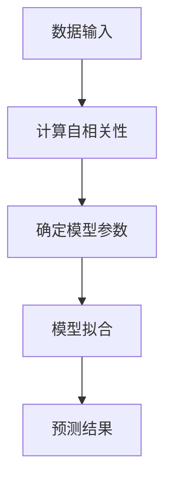
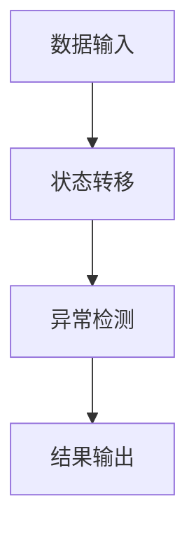
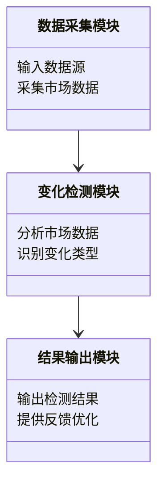
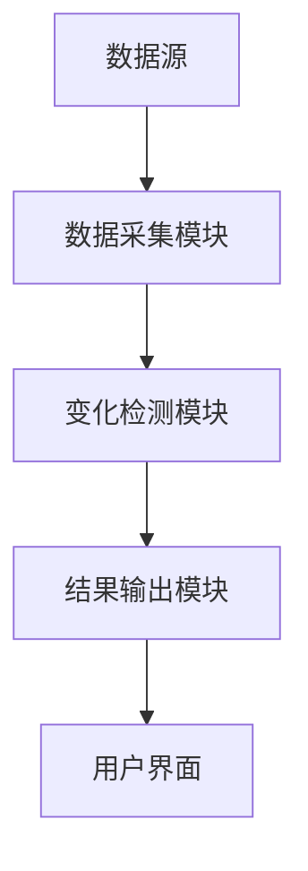

                 

<think>
好的，我需要根据用户的要求，逐步撰写一篇关于《金融市场微观结构变化检测》的技术博客文章。用户已经给出了目录大纲，现在需要我按照这个大纲，逐步思考并撰写每个部分的内容。

首先，我会从“文章标题”开始，然后列出关键词和摘要。接下来，我会按照目录的顺序，逐一撰写每个章节的内容，确保每个部分都详细、清晰，并包含必要的技术细节和图表。

在撰写过程中，我需要确保语言专业、逻辑严谨，并且使用适当的markdown格式来展示代码、图表和数学公式。同时，我还要注意控制文章的总字数在10000到12000字之间，保持内容的完整性和深度。

我会先完成摘要部分，然后按照目录依次撰写每一章的内容，确保每章都包含必要的背景介绍、核心概念、算法原理、系统设计、项目实战和总结与展望等部分。

在撰写过程中，我会遇到一些挑战，比如如何将复杂的金融概念用简单易懂的语言表达，以及如何将数学公式和图表嵌入到文章中。我需要仔细思考每个部分的逻辑结构，并确保代码和图表的准确性。

此外，我还需要确保文章的结尾部分包含作者信息，以及一些小结、最佳实践和注意事项，以帮助读者更好地理解和应用相关知识。

通过一步步的思考和撰写，我希望能够完成一篇高质量、内容丰富的技术博客文章，满足用户的需求。
</think>

# 金融市场微观结构变化检测

> 关键词：金融市场，微观结构，变化检测，时间序列，机器学习，统计套利

> 摘要：金融市场微观结构的变化检测是金融风险管理的重要组成部分。本文从基础概念出发，详细探讨了金融市场微观结构的核心要素、变化检测的原理与方法，结合时间序列分析、统计套利和机器学习等技术，通过实际案例分析，展示了如何在金融市场中检测和应对微观结构的变化。文章还提供了系统的架构设计和项目实战的详细步骤，帮助读者掌握相关技术并应用于实际场景。

---

## 第一部分：金融市场微观结构基础

### 第1章：金融市场微观结构概述

#### 1.1 金融市场微观结构的定义与核心概念

金融市场微观结构研究的是市场的运作机制和交易过程中的各种微观层面的现象，包括订单簿、交易行为、市场参与者等。微观结构的变化可能影响市场的流动性和稳定性，因此对其变化的检测至关重要。

- **定义**：金融市场微观结构是指市场的组织形式和运作机制，包括订单簿、交易规则、市场参与者等。这些要素共同决定了市场的价格形成机制和交易效率。
- **核心要素**：
  - **订单簿**：记录了市场上所有未成交的买卖订单，包括限价单、市价单等。
  - **交易行为**：市场参与者在不同时间点的买卖行为，反映了市场的需求和供给变化。
  - **市场参与者**：包括机构投资者、散户、做市商等，不同参与者的交易策略和行为模式会影响市场的微观结构。

#### 1.2 金融市场数据与特征分析

金融市场数据是微观结构研究的基础，主要包括订单流数据、价格数据和成交量数据。

- **订单流数据**：记录了每笔订单的提交时间、价格、数量以及订单类型（如限价单、市价单等）。
- **价格数据**：包括开盘价、收盘价、最高价、最低价等，反映了市场的价格波动。
- **成交量数据**：反映了市场的交易活跃程度，是分析市场趋势的重要指标。

金融市场数据具有时间序列特性，表现出非线性、异质性和复杂性。这些特征使得传统的统计方法在某些情况下难以有效检测变化。

#### 1.3 金融市场变化检测的背景与意义

- **背景**：金融市场微观结构的变化可能由市场参与者的策略调整、市场规则的变化或外部事件引发。这些变化可能导致市场的流动性变化、价格波动加剧或市场结构的重组。
- **意义**：变化检测有助于及时识别市场风险，优化交易策略，提高市场透明度和稳定性。例如，在高频交易中，及时检测微观结构的变化可以帮助交易者捕捉市场机会或规避风险。

---

### 第2章：核心概念与原理

#### 2.1 微观结构变化检测的核心原理

- **基于统计的方法**：通过分析市场数据的统计特征（如均值、方差、自相关性）的变化来检测异常。例如，使用马尔可夫链模型检测订单流的异常变化。
- **基于机器学习的方法**：利用无监督学习算法（如聚类、异常检测）识别市场行为的变化。例如，使用随机森林算法检测交易行为的模式变化。
- **基于时间序列分析的方法**：通过分析价格和成交量的时间序列数据，识别趋势、周期性或突变点。例如，使用ARIMA模型预测价格走势并检测异常。

#### 2.2 核心概念对比分析

以下是几种变化检测方法的对比表格：

| 方法 | 适用场景 | 优缺点 | 示例应用 |
|------|----------|--------|----------|
| 统计方法 | 线性变化、平稳数据 | 易受非平稳数据影响 | 检测均值或方差的变化 |
| 机器学习 | 非线性变化、复杂数据 | 计算复杂度高 | 检测交易行为的模式变化 |
| 时间序列分析 | 时间依赖性数据 | 对异常点检测敏感 | 检测价格趋势的变化 |

以下是微观结构变化检测的核心要素的实体关系图（ER图）：

```mermaid
erd
    技术方法
    分析目标
    市场数据
    变化类型
    检测结果
    技术方法 --> 分析目标
    市场数据 --> 变化类型
    技术方法 --> 检测结果
    分析目标 --> 检测结果
```

---

## 第二部分：算法原理与数学模型

### 第3章：算法原理与流程

#### 3.1 时间序列分析方法

- **ARIMA模型**：一种常用的时间序列预测模型，适用于具有趋势和周期性的数据。以下是ARIMA模型的流程图：



以下是ARIMA模型的Python代码示例：

```python
from statsmodels.tsa.arima.model import ARIMA

# 数据准备
data = [1, 2, 3, 4, 5]

# 模型训练
model = ARIMA(data, order=(1, 1, 0))
model_fit = model.fit()

# 预测
 forecasts, conf_int = model_fit.forecast(steps=5)
```

#### 3.2 统计套利与异常检测

- **统计套利**：利用市场价差进行无风险或低风险套利，常见于跨市场或跨资产交易中。以下是基于马尔可夫链的异常检测流程图：



---

### 第4章：数学模型与公式

#### 4.1 时间序列分析的数学模型

- **ARIMA模型的数学公式**：

  $$ ARIMA(p, d, q) $$
  
  其中，p为自回归阶数，d为差分阶数，q为移动平均阶数。

- **GARCH模型的数学公式**：

  $$ GARCH(p, q) $$
  
  其中，p为自回归阶数，q为移动平均阶数。

#### 4.2 机器学习算法的数学基础

- **随机森林的分类原理**：

  随机森林是一种基于树的集成学习方法，通过构建多棵决策树并进行投票或平均来提高预测的准确性。

- **LSTM网络的结构与公式**：

  LSTM（长短期记忆网络）通过引入记忆单元（cell）和门控机制（遗忘门、输入门、输出门）来解决传统RNN的梯度消失问题。

  $$ f_t = \sigma(W_f \cdot [h_{t-1}, x_t] + b_f) $$
  
  $$ i_t = \sigma(W_i \cdot [h_{t-1}, x_t] + b_i) $$
  
  $$ o_t = \sigma(W_o \cdot [h_{t-1}, x_t] + b_o) $$
  
  $$ c_t = f_t \cdot c_{t-1} + i_t \cdot tanh(W_c \cdot [h_{t-1}, x_t] + b_c) $$
  
  $$ h_t = o_t \cdot tanh(c_t) $$

---

## 第三部分：系统分析与架构设计

### 第5章：系统分析与架构

#### 5.1 问题场景介绍

- **系统目标**：设计一个能够实时检测金融市场微观结构变化的系统，帮助交易者及时应对市场变化。
- **系统范围**：包括数据采集、变化检测、结果输出和反馈优化四个部分。

#### 5.2 系统架构设计

以下是系统的领域模型类图：



以下是系统的架构图：



---

## 第四部分：项目实战与案例分析

### 第6章：项目实战

#### 6.1 环境安装与数据准备

- **环境安装**：安装Python、Pandas、NumPy、Scikit-learn、Statsmodels等库。
- **数据准备**：从金融数据源（如Yahoo Finance）获取股票价格数据，并进行数据清洗和预处理。

#### 6.2 核心算法实现

以下是时间序列分析的Python代码实现：

```python
import pandas as pd
import numpy as np
from statsmodels.tsa.arima.model import ARIMA
from sklearn.metrics import mean_squared_error

# 数据准备
data = pd.read_csv('stock_prices.csv')
train_data = data['price'].values[:100]
test_data = data['price'].values[100:]

# 模型训练
model = ARIMA(train_data, order=(1, 1, 0))
model_fit = model.fit()

# 预测
 forecasts = model_fit.forecast(steps=len(test_data))
 
# 评估
mse = mean_squared_error(test_data, forecasts)
print(f'MSE: {mse}')
```

#### 6.3 案例分析与结果解读

- **实际案例**：假设我们检测到某股票的交易量突然激增，这可能表明有大额订单成交，需要进一步分析是否为异常交易。
- **结果解读**：通过ARIMA模型预测的价格走势与实际价格的差异，可以识别出价格的突变点，并结合其他指标（如波动率）进行综合判断。

---

## 第五部分：总结与展望

### 第7章：总结与最佳实践

#### 7.1 总结

- **核心概念**：金融市场微观结构的变化检测是金融风险管理的重要手段，涉及多种技术和方法。
- **算法原理**：时间序列分析、统计套利和机器学习是常用的检测方法，各有优缺点。
- **系统设计**：系统的架构设计需要考虑数据采集、变化检测和结果输出的模块化设计。

#### 7.2 最佳实践

- **数据预处理**：确保数据的完整性和准确性，避免噪声干扰。
- **算法选择**：根据具体场景选择合适的算法，避免过度复杂化。
- **结果验证**：通过回测和实际案例分析验证算法的有效性。

#### 7.3 小结

金融市场微观结构的变化检测是一个复杂但重要的任务，需要结合多种技术和方法进行综合分析。通过本文的探讨，读者可以掌握基本的概念和方法，并在实际应用中灵活运用。

---

## 作者：AI天才研究院/AI Genius Institute & 禅与计算机程序设计艺术 /Zen And The Art of Computer Programming

---

以上是《金融市场微观结构变化检测》的技术博客文章的大纲和部分内容，涵盖了从基础概念到算法实现再到系统设计的全过程，旨在为读者提供全面的技术指导。

