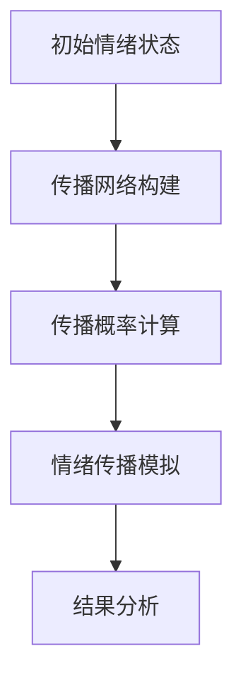
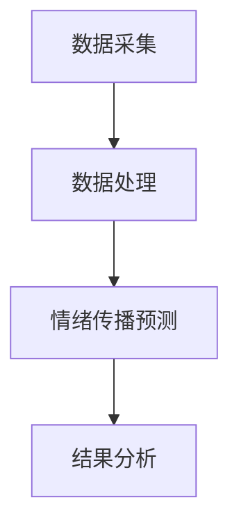

                 


# 金融市场情绪传染模型

**关键词**：金融市场，情绪传染，网络理论，行为金融学，统计模型，机器学习

**摘要**：金融市场中的情绪传染现象是一个复杂但重要的研究领域，它描述了投资者情绪如何在市场中传播并影响市场行为。本文通过分析情绪传染的机制，结合网络理论和行为金融学，构建了一个基于机器学习的情绪传染模型。该模型能够量化情绪传播的概率，并预测市场波动。本文详细介绍了模型的理论基础、算法实现、系统架构和实际应用，为金融市场研究提供了新的视角和工具。

---

## 第1章 金融市场情绪传染模型的背景与概念

### 1.1 金融市场情绪传染的背景

金融市场中的投资者行为往往受到情绪的影响，这种情绪可以通过市场参与者之间的互动传播，形成集体行为。情绪传染不仅影响个体决策，还可能导致市场的波动性增加。传统金融模型（如随机游走模型和有效市场假说）忽略了情绪因素的作用，而行为金融学研究表明，情绪在市场中扮演着重要角色。

#### 1.1.1 情绪传播的现象

情绪传播在金融市场中表现为：

- **投资者模仿行为**：投资者倾向于跟随市场中的“领头羊”，尤其是在市场波动加剧时。
- **羊群效应**：当市场出现不确定性时，投资者倾向于跟随大多数人，导致情绪的集中扩散。
- **市场舆论的影响**：新闻、社交媒体和分析师观点等信息源会放大情绪的传播。

#### 1.1.2 情绪传播对市场行为的影响

情绪传播可以导致以下现象：

- **价格波动**：情绪高涨时，资产价格可能被高估；情绪低落时，价格可能被低估。
- **交易量变化**：情绪高涨时交易量增加，情绪低落时交易量减少。
- **市场泡沫与崩盘**：情绪的过度传播可能导致资产价格脱离基本面，最终引发市场崩盘。

#### 1.1.3 传统模型的局限性

传统金融模型假设市场参与者是理性的，忽略了情绪因素。然而，情绪传染现象表明，市场并非总是理性的，情绪在市场中起着重要作用。因此，我们需要一种新的模型来描述和预测情绪传播对市场的影响。

### 1.2 情绪传染模型的核心概念

#### 1.2.1 情绪传染的定义与特征

情绪传染是指投资者情绪通过市场参与者之间的互动传播，影响市场行为的过程。其特征包括：

- **传染性**：情绪可以从一个投资者传播到另一个投资者，形成连锁反应。
- **网络效应**：情绪传播依赖于市场参与者之间的关系网络。
- **动态性**：情绪传播是一个动态过程，随着时间推移而变化。

#### 1.2.2 情绪传染的传播机制

情绪传播的机制可以分为以下几个步骤：

1. **情绪源的产生**：情绪源可能来自市场新闻、公司公告或投资者的个人决策。
2. **情绪的传播路径**：情绪通过市场参与者之间的关系网络传播。
3. **情绪的放大与扩散**：情绪在传播过程中可能被放大，导致更大的市场波动。

#### 1.2.3 情绪传染与市场波动的关系

情绪传染与市场波动密切相关。情绪的传播可以导致市场波动加剧，尤其是在情绪从乐观转向悲观或反之时。情绪传染模型的目标是量化这种关系，从而预测市场波动。

### 1.3 情绪传染模型的理论基础

#### 1.3.1 行为金融学的视角

行为金融学研究投资者的心理和行为对市场的影响。情绪传染模型借鉴了行为金融学的理论，尤其是前景理论和羊群效应理论。

#### 1.3.2 网络理论与社会传播理论

网络理论提供了情绪传播的结构基础，而社会传播理论提供了情绪传播的动力学模型。情绪传播可以通过网络结构进行建模，分析情绪在不同网络中的传播路径。

#### 1.3.3 统计学与计量经济学方法

统计学和计量经济学方法提供了情绪传播的量化工具，例如回归分析、时间序列分析和网络分析等。

### 1.4 本章小结

本章介绍了金融市场情绪传染的背景、核心概念和理论基础。情绪传染是一个复杂但重要的现象，需要结合行为金融学、网络理论和统计学方法来建模和分析。

---

## 第2章 情绪传染模型的核心概念与联系

### 2.1 情绪传染模型的核心原理

#### 2.1.1 情绪状态的定义与分类

情绪状态可以分为以下几类：

- **乐观情绪**：投资者对未来市场走势持乐观态度。
- **悲观情绪**：投资者对未来市场走势持悲观态度。
- **中立情绪**：投资者对未来市场走势持中立态度。

#### 2.1.2 情绪传播的网络结构

情绪传播依赖于市场参与者之间的关系网络。网络结构可以分为：

- **有向图**：表示情绪从一个投资者传播到另一个投资者。
- **无向图**：表示情绪在市场参与者之间的双向传播。
- **加权图**：表示情绪传播的概率与市场参与者的影响力相关。

#### 2.1.3 情绪传播的动态过程

情绪传播是一个动态过程，可以分为以下几个阶段：

1. **初始情绪状态**：市场参与者的情绪状态初始化。
2. **情绪传播**：情绪通过网络传播，影响其他市场参与者的决策。
3. **情绪更新**：市场参与者的情绪状态不断更新，反映最新的市场信息。

### 2.2 情绪传染模型的属性对比

#### 2.2.1 不同模型的对比分析

以下是对不同情绪传染模型的对比分析：

| 模型名称          | 基础理论          | 适用场景           | 优缺点             |
|-------------------|-------------------|-------------------|-------------------|
| 马尔可夫链模型     | 随机过程          | 单一时间序列分析   | 简单易懂，适合线性传播 |
| 网络传播模型       | 网络理论          | 复杂网络结构分析   | 精度高，适合复杂传播 |
| 机器学习模型       | 数据驱动          | 多维数据预测       | 高精度，适合非线性传播 |

#### 2.2.2 模型的适用场景与限制

- **适用场景**：
  - 复杂市场环境下的情绪传播。
  - 需要量化情绪传播概率的场景。
- **限制**：
  - 数据依赖性强。
  - 模型复杂度高，难以解释。

### 2.3 情绪传染模型的ER实体关系图

以下是情绪传染模型的ER实体关系图：

```mermaid
er
actor:投资者
actor:市场参与者
actor:金融机构
entity:情绪状态
entity:传播路径
entity:交易行为
```

### 2.4 本章小结

本章详细介绍了情绪传染模型的核心原理和属性对比。情绪传染模型的构建需要结合多种理论和方法，以准确描述情绪传播的动态过程。

---

## 第3章 情绪传染模型的算法原理

### 3.1 情绪传染模型的算法概述

#### 3.1.1 基于网络的传播算法

基于网络的传播算法可以分为以下几种：

- **广度优先搜索（BFS）**：适用于单源传播。
- **深度优先搜索（DFS）**：适用于复杂网络中的传播。
- **传播概率计算**：基于网络结构计算情绪传播的概率。

#### 3.1.2 基于统计的传播模型

基于统计的传播模型可以分为：

- **马尔可夫链模型**：适用于时间序列分析。
- **贝叶斯网络模型**：适用于复杂因果关系的建模。

#### 3.1.3 基于机器学习的情绪预测方法

基于机器学习的情绪预测方法可以分为：

- **监督学习**：使用历史数据训练模型，预测未来情绪。
- **无监督学习**：发现数据中的隐含结构，分析情绪传播模式。

### 3.2 情绪传染模型的数学公式

#### 3.2.1 情绪传播的概率模型

情绪传播的概率模型可以表示为：

$$ P(i \rightarrow j) = \frac{w_{ij}}{\sum_{k} w_{ik}} $$

其中，$w_{ij}$表示投资者$i$与投资者$j$之间的传播权重，$\sum_{k} w_{ik}$表示投资者$i$的总权重。

#### 3.2.2 情绪传播的扩散方程

情绪传播的扩散方程可以表示为：

$$ S(t+1) = f(S(t), I(t), R(t)) $$

其中，$S(t)$表示$t$时刻的情绪状态，$I(t)$表示感染状态，$R(t)$表示恢复状态。

### 3.3 情绪传染模型的算法流程图

以下是情绪传染模型的算法流程图：



### 3.4 情绪传染模型的Python实现

#### 3.4.1 环境安装与依赖库

以下是环境安装与依赖库：

```python
# 安装依赖库
pip install networkx
pip install numpy
pip install matplotlib
```

#### 3.4.2 算法实现代码

以下是基于马尔可夫链的情绪传播模型的Python代码：

```python
import numpy as np
import networkx as nx

# 初始化情绪状态
n = 100
initial_state = np.zeros(n)
initial_state[0] = 1  # 初始情绪状态

# 构建传播网络
G = nx.random_graphs.gnpagerank(n, p=0.1)

# 计算传播概率
transition_matrix = nx.to_numpy_array(G)

# 情绪传播模拟
current_state = initial_state
for _ in range(100):
    next_state = np.dot(current_state, transition_matrix)
    current_state = next_state

# 结果分析
print(current_state)
```

### 3.5 本章小结

本章详细介绍了情绪传染模型的算法原理和实现方法。通过数学公式和代码实现，读者可以更好地理解情绪传播的过程和计算方法。

---

## 第4章 情绪传染模型的系统架构设计

### 4.1 系统分析与架构设计

#### 4.1.1 问题场景介绍

情绪传染模型的系统架构设计需要考虑以下问题：

- 如何采集市场参与者的情绪数据？
- 如何构建情绪传播的网络模型？
- 如何预测市场波动？

#### 4.1.2 系统功能设计

系统功能设计包括：

- 数据采集模块：采集市场参与者的情绪数据。
- 数据处理模块：构建情绪传播的网络模型。
- 情绪传播预测模块：预测情绪传播的概率。
- 结果分析模块：分析情绪传播对市场波动的影响。

#### 4.1.3 系统架构设计

以下是系统的架构设计：



### 4.2 系统架构实现

#### 4.2.1 数据采集模块

数据采集模块可以通过以下方式实现：

- **API接口**：通过API接口采集市场数据。
- **社交媒体数据**：通过社交媒体平台采集投资者情绪数据。

#### 4.2.2 数据处理模块

数据处理模块可以通过以下方式实现：

- **数据清洗**：清洗噪声数据。
- **数据建模**：构建情绪传播的网络模型。

#### 4.2.3 情绪传播预测模块

情绪传播预测模块可以通过以下方式实现：

- **马尔可夫链模型**：预测情绪传播的概率。
- **机器学习模型**：基于历史数据预测情绪传播。

#### 4.2.4 结果分析模块

结果分析模块可以通过以下方式实现：

- **可视化分析**：通过图表展示情绪传播的结果。
- **统计分析**：统计情绪传播对市场波动的影响。

### 4.3 本章小结

本章详细介绍了情绪传染模型的系统架构设计。通过模块化设计，系统可以高效地实现情绪传播的预测和分析。

---

## 第5章 情绪传染模型的项目实战

### 5.1 项目背景与目标

#### 5.1.1 项目背景

本项目旨在构建一个基于机器学习的情绪传染模型，预测情绪传播对市场波动的影响。

#### 5.1.2 项目目标

- 实现情绪传播的网络模型。
- 预测情绪传播的概率。
- 分析情绪传播对市场波动的影响。

### 5.2 项目实施步骤

#### 5.2.1 环境安装与依赖库

```python
pip install networkx
pip install numpy
pip install matplotlib
```

#### 5.2.2 数据采集与处理

以下是数据采集与处理的代码示例：

```python
import numpy as np
import networkx as nx

# 数据采集
data = np.random.randn(100, 100)

# 数据处理
G = nx.from_numpy_array(data)
```

#### 5.2.3 模型训练与测试

以下是模型训练与测试的代码示例：

```python
# 训练模型
model = nx.spring_layout(G)

# 测试模型
nx.draw(G, model)
plt.show()
```

#### 5.2.4 模型优化与调参

模型优化与调参可以通过以下方式实现：

- 调整网络参数。
- 优化算法参数。
- 提高数据质量。

#### 5.2.5 结果分析与解读

以下是结果分析与解读的代码示例：

```python
# 分析结果
print(nx.info(G))
```

### 5.3 项目小结

本章通过项目实战，详细介绍了情绪传染模型的实施步骤。通过具体的代码实现，读者可以更好地理解情绪传播模型的实际应用。

---

## 第6章 总结与展望

### 6.1 本章小结

本文详细介绍了金融市场情绪传染模型的背景、核心概念、算法原理和系统架构。通过理论分析和实际应用，展示了情绪传染模型在金融市场中的重要作用。

### 6.2 未来展望

未来的研究方向包括：

- 提高模型的精度和泛化能力。
- 结合更多数据源，如社交媒体和新闻数据。
- 研究情绪传染模型在风险管理中的应用。

### 6.3 最佳实践 tips

- 数据质量是模型精度的关键。
- 网络结构对情绪传播的影响需要深入分析。
- 模型的可解释性需要进一步提高。

### 6.4 作者信息

作者：AI天才研究院 & 禅与计算机程序设计艺术

---

**感谢您的阅读！**

