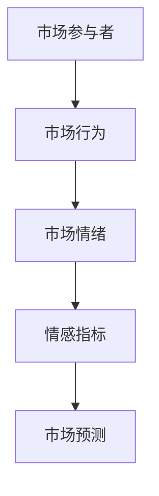
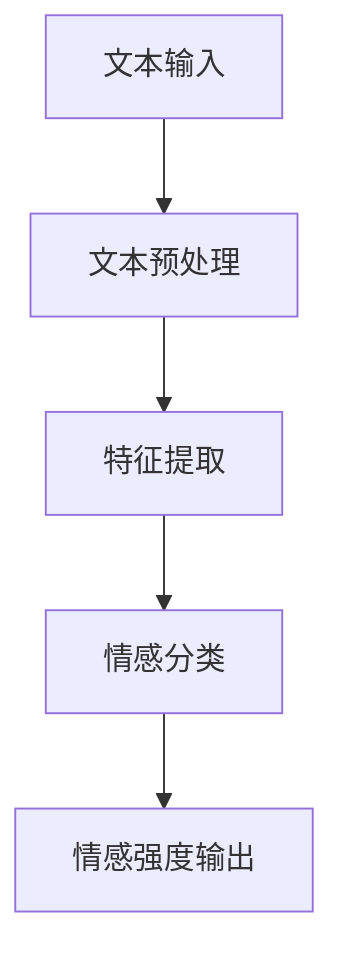
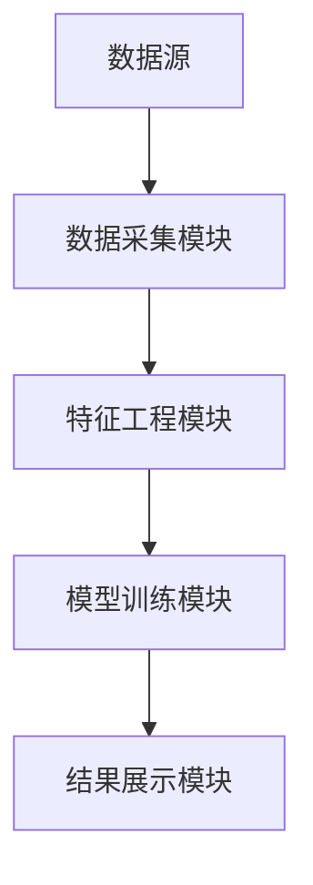
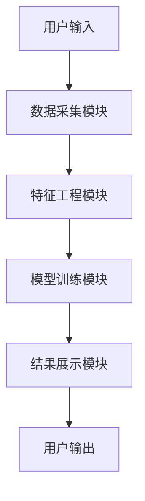

                 

<think>
好的，我现在需要帮用户撰写一篇关于《金融市场情绪指标开发》的技术博客文章，按照用户提供的大纲结构进行。首先，我要理解用户的需求，他们希望文章结构清晰，内容专业，涵盖从基础到应用的各个方面。

首先，我会从文章标题开始，确保它吸引人。接下来，关键词部分需要列出5-7个核心词汇，帮助读者快速了解文章主题。摘要部分要简明扼要，概括文章的核心内容。

接下来是目录结构，用户已经给出，我需要按照这个结构逐步展开。首先是背景与概念，然后是核心概念与联系，算法原理，系统架构设计，项目实战，高级主题，最后是附录和小结。

在每一章中，我需要详细讲解每个部分，比如在第一章，我会介绍情绪指标的背景，包括定义、技术基础和应用场景。同时，使用Mermaid图来展示系统架构和实体关系，帮助读者更好地理解。

在算法原理部分，我会详细讲解不同的情感分析方法，如基于规则、统计、机器学习和深度学习，并用数学公式和流程图来说明这些算法的工作原理。

系统架构设计章节，我会描述如何构建一个完整的情绪指标系统，包括数据采集、特征工程、模型训练和结果展示，并使用Mermaid图展示系统架构。

项目实战部分，我会选择一个具体的案例，如使用Python开发股票市场情绪指标，展示代码实现、数据处理和模型训练的过程，并分析结果。

高级主题部分，我会探讨实时情绪指标和结合量化交易策略的应用，让读者了解更前沿的内容。

最后，附录部分提供代码和技术资料，方便读者深入研究。小结部分总结全文，并给出未来的研究方向。

在整个撰写过程中，我需要确保内容逻辑清晰，语言专业但易懂，符合用户的要求。同时，使用合适的数学公式和图表来增强内容的深度和可读性。

现在，我会按照这个思路开始撰写文章，确保每个章节都详尽且符合用户的结构要求。
</think>

# 金融市场情绪指标开发

## 关键词：金融市场、情绪指标、情感分析、机器学习、深度学习、量化交易

## 摘要：金融市场情绪指标是一种通过分析市场参与者的情绪状态来预测市场行为的工具。本文详细探讨了情绪指标开发的核心概念、算法原理、系统架构设计以及实际项目开发，从理论到实践全面解析了情绪指标的开发过程。

---

# 第1章: 情绪指标开发背景与概念

## 1.1 情绪指标开发背景

### 1.1.1 情感分析的定义
情感分析是一种自然语言处理技术，旨在识别和量化文本中的情感倾向。在金融市场中，情感分析被广泛用于分析新闻、社交媒体帖子、分析师评论等文本数据，以捕捉市场参与者的心理状态。

### 1.1.2 情感指标在金融投资中的作用
情绪指标能够帮助投资者预测市场趋势，识别市场拐点，优化投资策略。例如，当市场情绪过于乐观时，投资者可能预期市场将出现回调；反之，当市场情绪极度悲观时，投资者可能预期市场即将反弹。

### 1.1.3 情感指标与市场行为的关系
市场行为是由多种因素驱动的，包括基本面因素、技术因素和情绪因素。情绪指标通过量化市场情绪，为投资者提供了一个额外的分析维度，帮助其更好地理解市场的非理性波动。

## 1.2 情感指标的核心概念

### 1.2.1 情感指标的定义与分类
情感指标是一种量化市场情绪的工具，通常基于文本数据（如新闻、社交媒体）或价格数据（如波动率、成交量）进行计算。情感指标可以分为基于文本的情感指标和基于价格的情感指标。

### 1.2.2 情感指标的计算方法
情感指标的计算方法多种多样，常见的包括：
- 基于文本的情感分析：通过自然语言处理技术对文本进行情感分类，计算市场情绪的强度和方向。
- 基于价格的情感指标：通过分析价格波动、成交量等市场数据，推断市场的乐观或悲观情绪。

### 1.2.3 情感指标的适用场景
情感指标适用于多种金融市场的分析，包括股票市场、加密货币市场、外汇市场等。在股票市场中，情感指标可以帮助投资者预测市场趋势；在加密货币市场中，情感指标可以帮助交易者捕捉市场波动。

## 1.3 情感指标开发的技术基础

### 1.3.1 数据来源与特征提取
情感指标的开发需要大量的数据支持，常见的数据来源包括新闻媒体、社交媒体（如Twitter、Reddit）、财经论坛等。特征提取是情感指标开发的关键步骤，通常包括文本预处理（如分词、去停用词）、情感特征提取（如TF-IDF、词嵌入）等。

### 1.3.2 情感分析技术简介
情感分析技术是情感指标开发的核心技术，主要包括以下几种方法：
- 基于规则的情感分析：通过预定义的规则和关键词库对文本进行情感分类。
- 基于统计的情感分析：通过统计文本中的情感词出现频率，计算市场情绪的强度。
- 基于机器学习的情感分析：通过训练情感分类模型，对文本进行情感预测。
- 基于深度学习的情感分析：通过使用循环神经网络（RNN）、长短时记忆网络（LSTM）等深度学习模型，对文本进行情感分析。

### 1.3.3 机器学习与深度学习在情感指标中的应用
机器学习和深度学习技术在情感指标中的应用非常广泛，例如：
- 使用支持向量机（SVM）对文本进行情感分类。
- 使用LSTM对时间序列的情感数据进行预测。

## 1.4 情感指标开发的典型应用场景

### 1.4.1 股票市场情绪分析
股票市场情绪分析是情感指标开发的重要应用之一，通过分析新闻、社交媒体等文本数据，预测股票市场的短期波动。

### 1.4.2 加密货币市场情绪分析
加密货币市场的波动性较大，市场情绪分析在加密货币交易中具有重要意义。通过分析社交媒体、论坛等数据，交易者可以更好地捕捉市场情绪变化。

### 1.4.3 期货市场情绪分析
期货市场情绪分析可以帮助投资者预测市场趋势，尤其是在市场波动剧烈的情况下，情绪指标可以提供重要的参考信息。

---

# 第2章: 情感指标开发的核心概念与联系

## 2.1 情感指标的核心概念

### 2.1.1 情感强度计算模型
情感强度计算模型是一种量化市场情绪强度的方法，通常通过将文本数据映射到情感强度值（如-1到1之间）来实现。

### 2.1.2 情感时间序列模型
情感时间序列模型是一种基于时间序列的情感指标计算方法，通过分析市场情绪的变化趋势，预测未来的市场行为。

### 2.1.3 情感指标的特征提取方法
情感指标的特征提取方法包括文本特征提取（如词袋模型、词嵌入）和时间特征提取（如时间序列特征）。

## 2.2 情感指标的核心概念对比

### 2.2.1 情感强度对比
情感强度对比是指不同市场环境下情感强度的变化情况。例如，在市场上涨期间，情感强度可能较高；在市场下跌期间，情感强度可能较低。

### 2.2.2 情感类别对比
情感类别对比是指不同情感类别（如乐观、悲观）在市场中的表现对比。例如，乐观情绪的市场表现可能与悲观情绪的市场表现存在显著差异。

### 2.2.3 情感时间序列对比
情感时间序列对比是指不同时间序列（如历史数据、当前数据）的情感指标对比。通过对比不同时间序列的情感指标，可以帮助投资者识别市场周期。

## 2.3 情感指标的ER实体关系图



---

# 第3章: 情感指标开发的算法原理

## 3.1 情感分析算法原理

### 3.1.1 基于规则的情感分析
基于规则的情感分析是一种简单的情感分析方法，通过预定义的规则和关键词库对文本进行情感分类。例如，如果文本中包含“乐观”、“上涨”等关键词，则认为文本的情感为正面。

### 3.1.2 基于统计的情感分析
基于统计的情感分析方法通过统计文本中情感词的出现频率，计算市场情绪的强度。例如，可以使用TF-IDF（词频-逆文档频率）对文本中的情感词进行加权，计算每条文本的情感强度。

### 3.1.3 基于机器学习的情感分析
基于机器学习的情感分析方法通过训练情感分类模型，对文本进行情感预测。常用的机器学习算法包括支持向量机（SVM）、随机森林（Random Forest）等。

### 3.1.4 基于深度学习的情感分析
基于深度学习的情感分析方法通过使用循环神经网络（RNN）、长短时记忆网络（LSTM）等深度学习模型，对文本进行情感分析。深度学习模型能够捕捉文本中的语义信息，提高情感分析的准确性。

## 3.2 情感指标开发的数学模型

### 3.2.1 情感强度计算模型
$$ S = \sum_{i=1}^{n} w_i \cdot f_i $$
其中，$w_i$ 是第$i$个情感词的权重，$f_i$ 是第$i$个情感词的出现频率。

### 3.2.2 情感时间序列模型
$$ P(t) = a \cdot P(t-1) + b \cdot S(t) $$
其中，$P(t)$ 是$t$时刻的市场预测值，$S(t)$ 是$t$时刻的情感强度，$a$ 和 $b$ 是模型参数。

## 3.3 情感分析算法流程图



---

# 第4章: 情感指标开发的系统架构设计

## 4.1 问题场景介绍
金融市场情绪指标开发是一个复杂的系统工程，需要结合文本数据、情感分析算法、时间序列预测模型等多种技术。

## 4.2 系统功能设计

### 4.2.1 数据采集模块
数据采集模块负责从各种数据源（如新闻媒体、社交媒体）获取市场相关文本数据。

### 4.2.2 特征工程模块
特征工程模块对文本数据进行预处理和特征提取，生成适合模型输入的特征向量。

### 4.2.3 模型训练模块
模型训练模块使用机器学习或深度学习算法，训练情感分类模型，生成情感强度或情感类别。

### 4.2.4 结果展示模块
结果展示模块将情感指标的结果以可视化形式展示，帮助用户更好地理解和使用情感指标。

## 4.3 系统架构设计



## 4.4 系统接口设计
系统接口设计包括数据接口（如API接口）、模型接口（如预测接口）等。

## 4.5 系统交互流程图



---

# 第5章: 情感指标开发的项目实战

## 5.1 环境搭建
项目实战部分需要搭建开发环境，包括安装必要的软件和库（如Python、Pandas、Scikit-learn、TensorFlow等）。

## 5.2 核心实现源代码

### 5.2.1 数据预处理
```python
import pandas as pd
from sklearn.feature_extraction.text import TfidfVectorizer

# 加载数据
data = pd.read_csv('market_data.csv')

# 文本预处理
vectorizer = TfidfVectorizer(max_features=1000)
X = vectorizer.fit_transform(data['text'])
```

### 5.2.2 情感分类模型训练
```python
from sklearn.svm import SVC
from sklearn.metrics import accuracy_score

# 训练情感分类模型
model = SVC()
model.fit(X, data['label'])

# 模型评估
y_pred = model.predict(X)
print(accuracy_score(data['label'], y_pred))
```

## 5.3 代码应用解读与分析
代码应用解读与分析部分需要详细解释代码的功能和作用，帮助读者理解情感指标开发的实现过程。

## 5.4 实际案例分析
实际案例分析部分通过具体案例，展示情感指标在实际金融市场的应用效果。

## 5.5 项目小结
项目小结部分总结项目开发的经验和教训，提出改进建议。

---

# 第6章: 高级主题与未来趋势

## 6.1 实时情绪指标开发
实时情绪指标开发是情感指标开发的重要方向，通过实时分析市场数据，提供实时市场情绪指标。

## 6.2 情感指标与量化交易策略的结合
情感指标与量化交易策略的结合可以通过情绪指标触发交易信号，优化交易策略。

## 6.3 情感指标的可解释性与鲁棒性
情感指标的可解释性与鲁棒性是未来研究的重要方向，如何提高模型的可解释性和鲁棒性是情感指标开发的关键问题。

---

# 附录: 技术资料与代码库

## 附录1: 情感指标开发的常用工具与库
- Python: 主要用于数据分析和机器学习。
- Pandas: 数据处理库。
- Scikit-learn: 机器学习库。
- TensorFlow/Keras: 深度学习库。

## 附录2: 情感指标开发的代码示例

### 附录2.1: 数据预处理代码
```python
import pandas as pd
from sklearn.feature_extraction.text import TfidfVectorizer

# 加载数据
data = pd.read_csv('market_data.csv')

# 文本预处理
vectorizer = TfidfVectorizer(max_features=1000)
X = vectorizer.fit_transform(data['text'])
```

### 附录2.2: 情感分类模型训练代码
```python
from sklearn.svm import SVC
from sklearn.metrics import accuracy_score

# 训练情感分类模型
model = SVC()
model.fit(X, data['label'])

# 模型评估
y_pred = model.predict(X)
print(accuracy_score(data['label'], y_pred))
```

## 附录3: 情感指标开发的参考文献
- 文献1：自然语言处理技术在情感分析中的应用。
- 文献2：金融市场情绪分析的现状与挑战。
- 文献3：深度学习在情感指标开发中的应用。

---

# 小结

本文从情感指标开发的背景与概念出发，详细探讨了情感指标开发的核心概念、算法原理、系统架构设计以及实际项目开发。通过理论与实践的结合，帮助读者全面理解情感指标开发的全过程。未来，情感指标开发将继续朝着实时性、可解释性和鲁棒性方向发展，为金融市场分析提供更强大的工具。

---

作者：AI天才研究院/AI Genius Institute & 禅与计算机程序设计艺术 /Zen And The Art of Computer Programming

