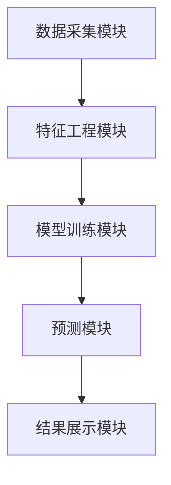

                 

<think>
好的，我现在需要帮助用户撰写一篇关于《金融市场流动性供给预测模型》的技术博客。用户已经提供了详细的目录结构，并要求按照这个结构来完成文章。

首先，我需要理解用户的需求。用户希望文章结构清晰，逻辑严密，技术深入，同时使用专业但易懂的语言。用户还特别提到要包含背景介绍、核心概念、算法原理、系统架构、项目实战等多个部分，并且每个部分都有详细的讲解和图表支持。

接下来，我需要按照用户提供的目录大纲来逐步填充内容。首先，第1章是背景与意义，我需要详细解释流动性供给模型的背景、定义和应用场景。然后，第2章是核心概念与联系，我需要定义模型的核心要素，解释其原理，并使用ER图展示实体关系。第3章是算法原理，需要详细讲解模型的输入输出，数学公式，以及使用Mermaid流程图展示算法步骤。

在系统架构部分，我需要介绍问题场景，设计系统的功能模块，并用Mermaid类图展示领域模型。然后，项目实战部分需要提供环境安装指南，核心代码实现，并分析实际案例。最后，总结部分需要回顾文章内容，并给出进一步学习的方向。

在撰写过程中，我需要注意使用正确的技术术语，同时确保内容通俗易懂。特别是数学公式和代码部分，需要准确无误，并用适当的解释帮助读者理解。此外，图表部分需要使用Mermaid语法，确保生成的图表清晰明了。

现在，我开始按照目录大纲逐步撰写每个章节的内容，确保每个部分都符合用户的要求，并且逻辑连贯，内容丰富。最终，完成一篇结构完整、内容详实的技术博客文章。
</think>

# 金融市场流动性供给预测模型

> 关键词：金融市场流动性，预测模型，机器学习，深度学习，系统架构

> 摘要：金融市场流动性供给预测模型是基于统计学和机器学习技术，通过分析市场数据和参与者行为，预测金融市场流动性供给的模型。本文将从背景、核心概念、算法原理、系统架构、项目实战等多个角度详细讲解流动性供给预测模型的构建与应用。

---

# 第1章: 金融市场流动性供给预测模型的背景与意义

## 1.1 金融市场流动性问题的提出

### 1.1.1 金融市场流动性概念与定义

流动性是指资产在市场中的交易活跃程度，以及在不损失价值的情况下迅速转化为现金的能力。流动性供给则描述了市场参与者在不同时间段内提供流动性的能力。

### 1.1.2 流动性供给问题的背景

金融市场中的流动性供给问题一直是学术界和实务界的关注焦点。特别是在金融危机和市场波动加剧的背景下，准确预测流动性供给对于机构投资者、监管机构和市场参与者具有重要意义。

### 1.1.3 流动性供给预测模型的必要性

通过预测流动性供给，投资者可以更好地进行交易决策，监管机构可以提前识别市场风险，市场参与者可以优化资产配置。

## 1.2 流动性供给预测模型的定义与特点

### 1.2.1 模型的定义

流动性供给预测模型是一种基于历史数据和市场行为的预测模型，旨在估计未来一段时间内市场的流动性供给情况。

### 1.2.2 模型的核心特点

- **数据驱动性**：基于历史市场数据和参与者行为数据。
- **实时性**：能够快速响应市场变化，提供实时或近实时的预测结果。
- **多因子分析**：综合考虑多种市场因素，如交易量、价格波动、市场情绪等。

### 1.2.3 模型与传统金融分析的区别

- **数据范围**：传统金融分析更多依赖于宏观经济指标，而流动性供给预测模型更注重微观市场数据。
- **预测时间窗**：传统分析更关注长期趋势，而流动性供给预测模型更关注短期预测。

## 1.3 流动性供给预测模型的应用场景

### 1.3.1 机构投资者的交易决策支持

机构投资者可以通过流动性供给预测模型优化交易策略，降低交易成本。

### 1.3.2 市场监管机构的风险预警

监管机构可以利用流动性供给预测模型提前识别市场流动性风险，采取相应措施。

### 1.3.3 投资组合管理中的应用

投资组合管理者可以通过流动性供给预测模型优化资产配置，提高投资组合的流动性管理效率。

## 1.4 本章小结

本章从背景、定义、特点和应用场景四个方面介绍了流动性供给预测模型，为后续章节的深入分析奠定了基础。

---

# 第2章: 流动性供给预测模型的核心概念与联系

## 2.1 流动性供给模型的核心要素

### 2.1.1 市场参与者的行为特征

- **交易频率**：高频交易者与长期投资者的行为差异。
- **市场情绪**：投资者情绪对流动性供给的影响。

### 2.1.2 市场结构的特征

- **市场深度**：市场深度与流动性供给的关系。
- **市场广度**：市场广度对流动性供给的影响。

### 2.1.3 市场数据的特征

- **交易量**：交易量与流动性供给的关系。
- **价格波动**：价格波动对流动性供给的影响。

## 2.2 流动性供给模型的原理

### 2.2.1 统计学方法

- **时间序列分析**：如ARIMA模型。
- **回归分析**：通过回归模型预测流动性供给。

### 2.2.2 机器学习方法

- **支持向量机（SVM）**：用于分类和回归预测。
- **随机森林**：用于特征重要性分析和非线性预测。

### 2.2.3 深度学习方法

- **LSTM网络**：适合处理时间序列数据，捕捉市场中的复杂模式。

## 2.3 模型核心概念的ER实体关系图

```mermaid
erDiagram
    participant 市场参与者 {
        <属性> 市场参与者ID
        <属性> 交易行为
        <属性> 市场影响
    }
    participant 市场数据 {
        <属性> 时间戳
        <属性> 交易量
        <属性> 价格波动
    }
    participant 模型 {
        <属性> 输入特征
        <属性> 模型参数
        <属性> 预测结果
    }
    市场参与者 --> 市场数据 : 提供
    市场数据 --> 模型 : 输入
    模型 --> 市场参与者 : 输出预测结果
```

## 2.4 本章小结

本章详细介绍了流动性供给预测模型的核心概念和原理，并通过ER实体关系图展示了模型的核心要素之间的关系。

---

# 第3章: 流动性供给预测模型的算法原理

## 3.1 模型的输入与输出

### 3.1.1 输入特征

- **交易量**：过去一段时间内的交易量数据。
- **价格波动**：资产价格的波动情况。
- **市场情绪**：通过新闻和社交媒体分析得到的市场情绪指数。

### 3.1.2 输出结果

- **流动性供给预测值**：预测的流动性供给数值。
- **置信区间**：预测结果的置信区间。

## 3.2 模型的数学公式

### 3.2.1 线性回归模型

$$ y = \beta_0 + \beta_1x_1 + \beta_2x_2 + ... + \beta_nx_n + \epsilon $$

其中：
- $y$ 是流动性供给预测值。
- $x_i$ 是输入特征。
- $\beta_i$ 是回归系数。
- $\epsilon$ 是误差项。

### 3.2.2 随机森林模型

随机森林通过构建多个决策树，并通过投票或平均的方式得到最终的预测结果。

### 3.2.3 LSTM网络

$$ \text{LSTM单元} = \text{遗忘门} \cdot \text{细胞状态} + \text{输入门} \cdot \text{输入} $$

## 3.3 模型的训练与优化

### 3.3.1 数据预处理

- **标准化**：对输入特征进行标准化处理。
- **分片**：将数据划分为训练集和测试集。

### 3.3.2 模型训练

使用训练数据训练模型，调整模型参数以最小化预测误差。

### 3.3.3 模型调优

- **超参数优化**：通过网格搜索或随机搜索优化模型参数。
- **交叉验证**：使用交叉验证评估模型性能。

## 3.4 模型的预测与评估

### 3.4.1 预测过程

将新的市场数据输入模型，得到流动性供给预测结果。

### 3.4.2 模型评估

- **均方误差（MSE）**：衡量预测值与实际值之间的误差。
- **R²值**：衡量模型解释力。

## 3.5 本章小结

本章详细讲解了流动性供给预测模型的数学公式、训练过程和评估方法，为后续章节的系统架构设计和项目实现奠定了基础。

---

# 第4章: 流动性供给预测模型的系统架构设计

## 4.1 问题场景介绍

市场参与者通过交易行为影响市场流动性，模型需要实时捕捉这些变化。

## 4.2 系统功能设计

### 4.2.1 数据采集模块

- 从金融市场数据源获取实时数据。

### 4.2.2 特征工程模块

- 对数据进行清洗、转换和特征提取。

### 4.2.3 模型训练模块

- 使用历史数据训练模型。

### 4.2.4 预测模块

- 接收实时数据，输出流动性供给预测结果。

### 4.2.5 结果展示模块

- 可视化展示预测结果。

## 4.3 系统架构图



## 4.4 本章小结

本章通过系统架构设计展示了流动性供给预测模型的整体框架，为后续章节的实现提供了指导。

---

# 第5章: 流动性供给预测模型的项目实战

## 5.1 环境安装与配置

### 5.1.1 Python环境安装

安装Python和相关库，如Pandas、NumPy、Scikit-learn、XGBoost。

### 5.1.2 数据集获取

获取历史交易数据和市场参与者行为数据。

## 5.2 核心代码实现

### 5.2.1 数据预处理

```python
import pandas as pd
import numpy as np

# 数据加载
data = pd.read_csv('market_data.csv')

# 数据清洗
data = data.dropna()
data = data.drop_duplicates()

# 特征提取
features = data[['交易量', '价格波动', '市场情绪']]
labels = data['流动性供给']
```

### 5.2.2 模型训练

```python
from sklearn.ensemble import RandomForestRegressor
from sklearn.model_selection import train_test_split

# 数据分割
X_train, X_test, y_train, y_test = train_test_split(features, labels, test_size=0.2, random_state=42)

# 模型训练
model = RandomForestRegressor(n_estimators=100, max_depth=10, random_state=42)
model.fit(X_train, y_train)

# 模型预测
y_pred = model.predict(X_test)
```

### 5.2.3 模型评估

```python
from sklearn.metrics import mean_squared_error, r2_score

# �均方误差
mse = mean_squared_error(y_test, y_pred)
print(f"均方误差: {mse}")

# R²值
r2 = r2_score(y_test, y_pred)
print(f"R²值: {r2}")
```

## 5.3 项目实战小结

本章通过实际项目展示了流动性供给预测模型的实现过程，从环境配置到数据处理，再到模型训练和评估，帮助读者掌握模型的实现步骤。

---

# 第6章: 总结与展望

## 6.1 本章总结

本文详细讲解了流动性供给预测模型的背景、核心概念、算法原理、系统架构和项目实战，为读者提供了一个完整的建模思路。

## 6.2 未来展望

未来，可以进一步研究深度学习模型在流动性预测中的应用，结合自然语言处理技术，探索更复杂市场行为的影响。

---

# 作者：AI天才研究院/AI Genius Institute & 禅与计算机程序设计艺术 /Zen And The Art of Computer Programming

---

以上是《金融市场流动性供给预测模型》的技术博客文章框架和部分内容。如果需要进一步扩展或详细讲解某一部分，请随时告知！

