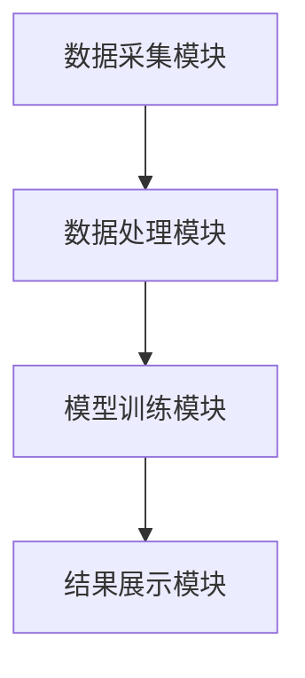

                 


# 金融市场流动性分析工具

> 关键词：金融市场流动性分析工具、流动性风险、VaR模型、系统架构设计、金融数据分析

> 摘要：金融市场流动性分析工具是金融市场风险管理中的核心工具之一。本文系统地介绍了流动性分析工具的背景、核心概念、算法原理、系统架构设计以及项目实战。通过分析流动性风险的形成机制、流动性衡量指标的核心要素，结合VaR模型等算法，详细讲解了流动性分析工具的实现过程，并通过实际案例展示了如何应用这些工具进行金融市场流动性分析。本文旨在为金融市场从业者、软件架构师和技术人员提供一份全面的流动性分析工具开发与应用指南。

---

# 第1章 金融市场流动性分析工具的背景与概念

## 1.1 金融市场流动性分析的背景

### 1.1.1 金融市场流动性问题的提出

金融市场流动性是指资产在短时间内以合理价格买卖的能力。流动性是金融市场健康运行的基础，直接关系到市场的稳定性和参与者的利益。随着金融市场的复杂化和全球化，流动性风险已成为金融机构和监管机构关注的核心问题之一。流动性风险可能引发连锁反应，导致系统性金融危机，因此，流动性分析工具的开发与应用变得尤为重要。

### 1.1.2 流动性分析的重要性

流动性分析的重要性体现在以下几个方面：

1. **风险管理**：通过流动性分析，金融机构可以识别和评估潜在的流动性风险，制定有效的风险管理策略。
2. **投资决策支持**：流动性分析为投资者提供了资产流动性的评估依据，帮助投资者做出更明智的投资决策。
3. **市场监控与监管**：流动性分析是监管机构监控金融市场运行状况、维护市场稳定的重要手段。

### 1.1.3 流动性风险的边界与外延

流动性风险的边界与外延需要从以下几个方面进行分析：

1. **市场深度**：市场深度是指在特定价格下可以买卖的资产数量，直接影响流动性。
2. **市场参与者的流动性需求**：不同市场参与者（如机构投资者、个人投资者）的流动性需求差异会影响市场的整体流动性。
3. **市场波动性**：市场的波动性与流动性密切相关，波动性越高，流动性风险越大。

## 1.2 金融市场流动性分析的核心概念

### 1.2.1 流动性风险的定义

流动性风险是指由于资产无法以合理价格迅速变现而导致的损失风险。流动性风险可以分为以下几种类型：

1. **市场风险**：由于市场价格波动导致的流动性风险。
2. **信用风险**：由于交易对手无法履行合约义务导致的流动性风险。
3. **操作风险**：由于系统故障或操作失误导致的流动性风险。

### 1.2.2 流动性衡量指标的核心要素

流动性衡量指标是流动性分析工具的核心组成部分。常用的流动性衡量指标包括：

1. **流动比率（Current Ratio）**：流动资产与流动负债的比率，用于衡量企业的短期偿债能力。
2. **速动比率（Quick Ratio）**：流动资产减去存货与流动负债的比率，更加保守地衡量企业的流动性。
3. **现金比率（Cash Ratio）**：现金与流动负债的比率，用于衡量企业的即刻流动性。

### 1.2.3 流动性分析工具的分类与特点

流动性分析工具可以根据不同的分类标准进行划分：

1. **基于时间维度的分类**：
   - 即时流动性分析工具：用于实时监控市场流动性。
   - 短期流动性分析工具：用于预测未来一段时间内的流动性风险。
   - 长期流动性分析工具：用于评估长期市场流动性趋势。

2. **基于方法论的分类**：
   - 基于统计模型的流动性分析工具：使用统计方法对市场数据进行建模分析。
   - 基于机器学习的流动性分析工具：利用机器学习算法对市场数据进行预测和分析。

## 1.3 本章小结

本章从金融市场流动性分析的背景出发，详细介绍了流动性风险的定义、衡量指标的核心要素以及流动性分析工具的分类与特点。通过这些内容，读者可以全面理解流动性分析工具的基本概念和重要性，为后续章节的深入分析奠定基础。

---

# 第2章 金融市场流动性分析工具的算法原理

## 2.1 流动性分析算法概述

### 2.1.1 流动性分析算法的分类

流动性分析算法可以根据不同的方法论进行分类：

1. **基于VaR模型的流动性分析算法**：通过VaR（Value at Risk）模型对市场风险进行量化分析。
2. **基于时间序列分析的流动性分析算法**：利用时间序列分析方法对市场流动性进行预测。
3. **基于机器学习的流动性分析算法**：利用机器学习算法对市场数据进行特征提取和预测。

### 2.1.2 流动性分析算法的核心步骤

流动性分析算法的核心步骤包括：

1. **数据收集与预处理**：收集市场数据（如价格、成交量等），并对数据进行清洗和标准化处理。
2. **特征提取**：从市场数据中提取与流动性相关的特征，如波动率、交易量等。
3. **模型训练与优化**：基于提取的特征，训练流动性分析模型，并对模型进行优化。
4. **结果分析与可视化**：对模型的输出结果进行分析，并通过可视化工具进行展示。

### 2.1.3 流动性分析算法的优缺点对比

流动性分析算法的优缺点对比如下：

| 算法类型       | 优点                          | 缺点                          |
|----------------|-------------------------------|-------------------------------|
| VaR模型        | 方法简单，易于实现             | 无法捕捉市场尾部风险           |
| 时间序列分析   | 能够捕捉市场的趋势和周期性       | 对异常数据敏感                 |
| 机器学习算法    | 能够捕捉复杂的市场特征           | 计算复杂，需要大量数据支持       |

## 2.2 基于VaR模型的流动性分析算法

### 2.2.1 VaR模型的基本原理

VaR（Value at Risk）模型是一种常用的风险管理工具，用于量化市场风险。VaR模型的基本原理是通过统计方法估计资产在一定置信水平下的最大损失。

### 2.2.2 VaR模型在流动性分析中的应用

VaR模型可以用于流动性分析，具体步骤如下：

1. **数据收集**：收集资产的市场价格数据。
2. **计算收益率**：计算资产收益率的样本数据。
3. **计算VaR值**：基于收益率样本数据，计算VaR值。

### 2.2.3 VaR模型的实现步骤

以下是基于VaR模型的流动性分析算法的实现步骤：

1. **数据收集**：收集资产的市场价格数据。
2. **计算收益率**：计算资产收益率的样本数据。
3. **计算VaR值**：基于收益率样本数据，计算VaR值。

以下是基于VaR模型的流动性分析算法的Python代码示例：

```python
import numpy as np

def calculate_var(data, confidence_level):
    # 计算收益率
    returns = np.log(data / data.shift(1)).dropna()
    # 计算VaR值
    var = np.percentile(returns, (100 - confidence_level))
    return var

# 示例数据
data = np.random.lognormal(size=1000)
confidence_level = 95

var_value = calculate_var(data, confidence_level)
print(f"VaR值为：{var_value}")
```

## 2.3 流动性分析工具的算法实现

### 2.3.1 算法实现的步骤

流动性分析工具的算法实现步骤如下：

1. **数据预处理**：对市场数据进行清洗和标准化处理。
2. **特征提取**：从市场数据中提取与流动性相关的特征。
3. **模型训练**：基于提取的特征，训练流动性分析模型。
4. **结果分析**：对模型的输出结果进行分析，并生成可视化报告。

### 2.3.2 算法实现的代码示例

以下是流动性分析工具的算法实现的Python代码示例：

```python
import pandas as pd
import numpy as np
import matplotlib.pyplot as plt

# 示例数据
data = pd.DataFrame({'price': np.random.lognormal(size=1000), 'volume': np.random.randint(100, 1000, size=1000)})

# 数据预处理
data['return'] = np.log(data['price'] / data['price'].shift(1)).dropna()

# 特征提取
features = data[['return', 'volume']]

# 模型训练
from sklearn.ensemble import RandomForestRegressor
model = RandomForestRegressor(n_estimators=100, random_state=42)
model.fit(features, features['return'])

# 预测结果
predicted_returns = model.predict(features)

# 可视化
plt.scatter(features['return'], predicted_returns)
plt.xlabel('实际收益率')
plt.ylabel('预测收益率')
plt.title('流动性分析工具的预测结果')
plt.show()
```

### 2.3.3 算法实现的注意事项

在实现流动性分析工具的算法时，需要注意以下几点：

1. **数据质量**：确保数据的准确性和完整性。
2. **特征选择**：选择与流动性相关的特征，避免过多的无关特征。
3. **模型优化**：通过交叉验证等方法优化模型性能。
4. **结果解释**：对模型的输出结果进行合理解释，避免误用。

## 2.4 本章小结

本章详细介绍了流动性分析工具的算法原理，重点讲解了基于VaR模型的流动性分析算法的实现步骤和代码示例。通过这些内容，读者可以理解流动性分析工具的核心算法，并能够基于这些算法进行实际应用。

---

# 第3章 金融市场流动性分析工具的系统架构与设计

## 3.1 系统架构设计概述

### 3.1.1 系统架构设计的目标

系统架构设计的目标是实现一个高效、可靠的金融市场流动性分析工具，能够实时监控市场流动性并提供风险预警。

### 3.1.2 系统架构设计的步骤

系统架构设计的步骤如下：

1. **需求分析**：明确系统的功能需求和性能需求。
2. **模块划分**：将系统划分为功能模块，如数据采集模块、数据处理模块、模型训练模块等。
3. **模块交互设计**：设计模块之间的交互流程。
4. **系统架构图绘制**：通过图表展示系统的整体架构。

### 3.1.3 系统架构设计的注意事项

在系统架构设计中，需要注意以下几点：

1. **模块化设计**：确保系统模块化，便于后续的维护和扩展。
2. **性能优化**：考虑系统的性能需求，进行合理的架构设计。
3. **安全性设计**：确保系统的安全性，防止数据泄露和攻击。

## 3.2 系统功能设计

### 3.2.1 系统功能模块划分

系统功能模块划分为以下几个模块：

1. **数据采集模块**：负责采集市场数据。
2. **数据处理模块**：负责对采集的数据进行预处理。
3. **模型训练模块**：负责训练流动性分析模型。
4. **结果展示模块**：负责展示分析结果。

### 3.2.2 系统功能模块的交互流程

系统功能模块的交互流程如下：

1. 数据采集模块采集市场数据并传递给数据处理模块。
2. 数据处理模块对数据进行预处理并传递给模型训练模块。
3. 模型训练模块训练流动性分析模型并传递结果给结果展示模块。
4. 结果展示模块展示分析结果。

### 3.2.3 系统功能模块的实现方式

以下是系统功能模块的实现方式：

1. **数据采集模块**：使用API接口采集市场数据。
2. **数据处理模块**：使用Python的pandas库进行数据处理。
3. **模型训练模块**：使用机器学习算法进行模型训练。
4. **结果展示模块**：使用可视化工具（如Matplotlib）展示分析结果。

## 3.3 系统架构图

以下是系统的架构图：



## 3.4 本章小结

本章详细介绍了金融市场流动性分析工具的系统架构与设计，包括系统架构设计的目标、步骤、注意事项以及系统功能模块的划分和交互流程。通过这些内容，读者可以理解如何设计一个高效的流动性分析工具系统。

---

# 第4章 金融市场流动性分析工具的项目实战

## 4.1 项目环境的安装与配置

### 4.1.1 开发环境的搭建

开发环境的搭建步骤如下：

1. 安装Python编程语言。
2. 安装必要的Python库（如pandas、numpy、scikit-learn等）。

### 4.1.2 开发工具的安装

开发工具的安装推荐使用以下工具：

1. **Jupyter Notebook**：用于数据处理和模型训练。
2. **PyCharm**：用于编写和运行Python代码。
3. **Git**：用于版本控制。

### 4.1.3 数据源的获取与处理

数据源可以通过以下方式获取：

1. **公开数据集**：如Yahoo Finance提供的市场数据。
2. **API接口**：如Alpha Vantage提供的金融数据API。

## 4.2 系统核心功能的实现

### 4.2.1 流动性分析算法的实现

以下是流动性分析算法的实现步骤：

1. 数据预处理：清洗和标准化数据。
2. 特征提取：从数据中提取与流动性相关的特征。
3. 模型训练：基于提取的特征，训练流动性分析模型。
4. 结果分析：对模型的输出结果进行分析，并生成可视化报告。

### 4.2.2 流动性分析工具的界面设计

流动性分析工具的界面设计可以使用以下工具：

1. **Tkinter**：Python自带的GUI库。
2. **QT Designer**：用于设计GUI界面。

### 4.2.3 流动性分析工具的测试与验证

流动性分析工具的测试与验证步骤如下：

1. **单元测试**：对各个功能模块进行测试。
2. **集成测试**：对系统的整体功能进行测试。
3. **用户测试**：邀请用户进行测试并收集反馈。

## 4.3 项目案例分析与解读

### 4.3.1 案例背景介绍

本案例旨在通过实际数据展示如何使用流动性分析工具进行市场分析。

### 4.3.2 案例分析过程

1. 数据采集：从Yahoo Finance获取某股票的市场数据。
2. 数据处理：清洗和标准化数据。
3. 模型训练：基于数据训练流动性分析模型。
4. 结果分析：展示模型的预测结果并进行解读。

### 4.3.3 案例结果解读与总结

通过案例分析，我们可以看到流动性分析工具在实际应用中的有效性。模型预测结果与实际数据的对比可以帮助我们评估模型的准确性。

## 4.4 本章小结

本章通过实际案例展示了如何使用流动性分析工具进行市场分析。通过案例分析，读者可以理解流动性分析工具的实际应用价值。

---

# 第5章 金融市场流动性分析工具的最佳实践与总结

## 5.1 最佳实践的总结

### 5.1.1 流动性分析工具的使用建议

1. **数据质量管理**：确保数据的准确性和完整性。
2. **特征选择优化**：选择与流动性相关的特征，避免过多的无关特征。
3. **模型优化**：通过交叉验证等方法优化模型性能。
4. **结果解释**：对模型的输出结果进行合理解释，避免误用。

### 5.1.2 流动性分析工具的优化建议

1. **实时监控**：实现市场的实时监控功能。
2. **多模型融合**：结合多种模型进行分析，提高准确性。
3. **用户友好界面**：设计直观的用户界面，方便用户操作。

## 5.2 本章小结

本章总结了金融市场流动性分析工具的最佳实践，包括数据质量管理、特征选择优化、模型优化等方面的建议。通过这些内容，读者可以进一步提高流动性分析工具的性能和准确性。

---

# 作者：AI天才研究院/AI Genius Institute & 禅与计算机程序设计艺术 /Zen And The Art of Computer Programming

---

以上是《金融市场流动性分析工具》的技术博客文章的详细内容，涵盖了从背景介绍到实际应用的全过程，通过理论与实践相结合的方式，为读者提供了全面的流动性分析工具开发与应用指南。

