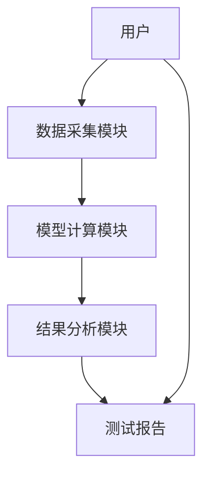
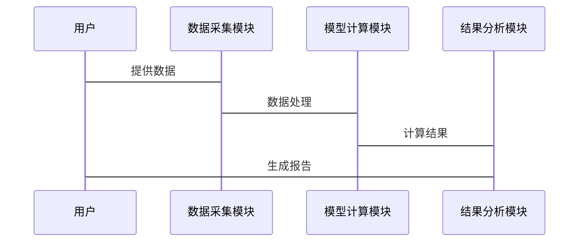

                 

<think>
好的，我需要完成用户提出的关于《金融市场流动性压力测试自动化平台》的技术博客文章。首先，我需要理解用户的需求和要求。用户希望我以一个有深度、有思考、有见解的专业IT领域的技术博客文章，涵盖以下内容：

1. **文章标题**：金融市场流动性压力测试自动化平台
2. **关键词**：金融市场、流动性压力测试、自动化平台、风险管理、算法、数据处理、系统架构
3. **摘要**：流动性压力测试是评估金融机构在极端市场条件下的资金流动性情况的重要工具。传统的压力测试方法依赖于人工操作，存在效率低下、数据处理复杂等问题。随着技术的发展，自动化平台的建设成为趋势。本文将详细探讨如何构建一个高效的金融市场流动性压力测试自动化平台，涵盖核心概念、算法原理、系统架构设计、项目实战等部分，旨在为金融机构的风险管理提供技术支持。

接下来，我需要按照用户提供的目录大纲结构，逐步完成每一部分的内容，确保逻辑清晰、结构紧凑、简单易懂。

### 第1章: 金融市场流动性压力测试概述

在这一章中，我需要介绍金融市场流动性压力测试的基本概念，包括流动性、压力测试的定义和作用，以及流动性压力测试的核心目标。然后，我会探讨流动性压力测试的背景和意义，包括金融危机的教训、监管要求的变化，以及压力测试在风险管理中的重要性。接下来，我会详细讲解流动性压力测试的流程和方法，最后分析传统压力测试的局限性，并引出自动化平台的必要性和优势。

在写作过程中，我需要确保每一小节的内容都具体、充实，避免过于笼统。同时，使用清晰的语言，帮助读者理解复杂的金融概念。

### 第2章: 流动性压力测试自动化平台的核心概念与联系

这一章的重点是介绍自动化平台的核心概念和组成部分。首先，我会讲解流动性压力测试的框架，包括数据采集与处理模块、测试模型与算法模块、结果分析与报告模块。然后，我会讨论流动性压力测试模型，涵盖基于历史数据的模型、情景分析模型和机器学习模型。接着，我会介绍几种常见的压力测试方法，如蒙特卡洛模拟、情景分析法和风险价值法。

在这一章中，我需要通过ER实体关系图来展示平台的架构，使用mermaid语法绘制流程图，帮助读者理解系统各部分之间的关系。同时，我需要解释每种模型和方法的优缺点，以及它们在实际应用中的表现。

### 第3章: 流动性压力测试自动化平台的算法原理

算法是平台的核心，因此我需要详细讲解几种主要算法的原理和实现。首先是蒙特卡洛模拟，我会介绍其基本原理，然后通过mermaid流程图展示算法步骤，并提供Python代码示例。接着是情景分析法，我会解释其方法论，并通过代码实现展示其应用。最后，我会讨论基于机器学习的压力测试模型，包括使用的算法和实现步骤。

在这一章中，我需要确保算法的讲解深入浅出，既有理论分析，又有实际代码示例，帮助读者理解和实现这些算法。

### 第4章: 流动性压力测试自动化平台的系统分析与架构设计

系统架构是平台实现的关键部分。我会首先介绍项目目标，明确平台需要实现的功能。然后，通过mermaid类图展示系统的功能模块和类的交互关系。接着，我会设计系统的架构图，展示各模块之间的依赖关系和数据流。最后，通过序列图展示系统接口设计和交互流程。

在这一章中，我需要确保系统架构的设计清晰明了，各部分的功能和交互关系一目了然，为后续的开发提供明确的指导。

### 第5章: 流动性压力测试自动化平台的项目实战

在这一章中，我会通过一个实际项目来展示平台的实现过程。首先，介绍项目环境的安装，包括所需的工具和依赖库。然后，详细讲解系统核心功能的实现，提供关键代码示例，并对代码进行解读和分析。接着，我会通过具体案例分析，展示平台的应用场景和实际效果。最后，总结项目成果和经验教训。

在这一章中，我需要确保内容具体且实用，让读者能够跟随步骤实现类似的平台。

### 第6章: 项目总结与未来展望

最后，在这一章中，我会总结整个项目的成果，分析平台的优势和不足，并提出改进建议。同时，我会展望未来的发展方向，探讨新的技术如何应用于流动性压力测试平台的优化。

在这一章中，我需要确保总结全面，未来展望具有前瞻性和启发性，为读者提供有价值的参考。

### 写作注意事项

1. **清晰的逻辑**：每一章和每一节的内容都要有明确的逻辑关系，确保读者能够轻松理解复杂的金融和计算机概念。
2. **专业的语言**：使用专业且准确的技术术语，同时尽量避免过于复杂的句子结构，以确保内容易于理解。
3. **丰富的例子和图表**：通过实际案例和mermaid图表，帮助读者更好地理解算法和系统架构的设计。
4. **代码实现**：提供详细的代码示例，并对代码进行解释，帮助读者理解和实现相关功能。
5. **参考文献和扩展阅读**：在文章末尾提供相关领域的参考文献和扩展阅读资料，增加文章的深度和广度。

### 作者信息

在文章的末尾，我需要注明作者信息：AI天才研究院/AI Genius Institute & 禅与计算机程序设计艺术/Zen And The Art of Computer Programming。

通过以上步骤，我将逐步完成这篇关于《金融市场流动性压力测试自动化平台》的技术博客文章，确保内容详实、结构清晰、逻辑严谨，为读者提供有价值的技术指导和见解。
</think>

# 金融市场流动性压力测试自动化平台

## 关键词：金融市场、流动性压力测试、自动化平台、风险管理、算法、数据处理、系统架构

## 摘要：流动性压力测试是评估金融机构在极端市场条件下的资金流动性情况的重要工具。传统的压力测试方法依赖于人工操作，存在效率低下、数据处理复杂等问题。随着技术的发展，自动化平台的建设成为趋势。本文将详细探讨如何构建一个高效的金融市场流动性压力测试自动化平台，涵盖核心概念、算法原理、系统架构设计、项目实战等部分，旨在为金融机构的风险管理提供技术支持。

---

# 第1章: 金融市场流动性压力测试概述

## 1.1 金融市场流动性与压力测试的定义

### 1.1.1 金融市场的流动性概念

流动性是指金融资产在市场中迅速转化为现金的能力。高流动性意味着资产可以在短时间内以合理价格变现，而低流动性则意味着变现困难或交易成本高昂。流动性是金融市场健康运转的核心要素之一。

### 1.1.2 压力测试的定义与作用

压力测试是一种评估金融资产或机构在极端市场条件下的表现的工具。它通过模拟各种不利情景，分析金融机构在这些情景下的承受能力，帮助机构识别和管理潜在风险。

### 1.1.3 流动性压力测试的核心目标

流动性压力测试的核心目标是评估金融机构在极端市场条件下维持资产流动性、履行债务能力以及应对资金需求的能力。它帮助机构识别潜在的流动性风险，并制定应对策略。

## 1.2 传统流动性压力测试的背景与意义

### 1.2.1 金融危机与流动性风险的暴露

2008年全球金融危机暴露了金融机构在流动性风险管理上的不足。许多机构在极端市场条件下无法及时变现资产，导致流动性危机，进而引发系统性风险。

### 1.2.2 监管要求与行业标准

全球监管机构（如巴塞尔委员会）要求金融机构定期进行流动性压力测试，确保其具备应对极端市场条件的能力。这使得流动性压力测试成为金融机构合规的重要部分。

### 1.2.3 压力测试在风险管理中的重要性

压力测试是金融机构全面风险管理的重要工具，帮助机构识别潜在风险、评估风险影响、制定应对策略，从而提高整体抗风险能力。

## 1.3 传统流动性压力测试的局限性

### 1.3.1 手动测试的效率问题

传统压力测试通常依赖手动操作，效率低下，且容易出现人为错误。特别是在数据量大、情景复杂的情况下，手动测试难以满足及时性和准确性要求。

### 1.3.2 数据处理的复杂性

金融市场数据种类繁多，包括历史交易数据、市场波动数据、资产价格数据等。手动处理这些数据不仅耗时，还可能导致数据错误，影响测试结果的准确性。

### 1.3.3 市场环境变化的快速响应需求

金融市场环境瞬息万变，极端市场情景可能随时出现。传统压力测试的周期较长，难以满足金融机构对快速响应的需求。

## 1.4 自动化平台的必要性与优势

### 1.4.1 自动化平台的定义

自动化平台是指利用计算机技术自动执行流动性压力测试的全过程，包括数据采集、模型计算、结果分析等。它能够显著提高测试效率和准确性。

### 1.4.2 自动化平台的核心优势

- **高效性**：自动化平台能够快速处理大量数据，缩短测试周期。
- **准确性**：自动化处理减少人为错误，提高测试结果的准确性。
- **灵活性**：平台可以根据市场变化快速调整测试情景，满足不同需求。
- **可扩展性**：自动化平台能够处理更大规模的数据和更复杂的测试情景。

### 1.4.3 自动化平台的应用前景

随着技术的进步和金融机构对风险管理的重视，自动化平台的应用前景广阔。它将成为金融机构应对复杂市场环境的重要工具。

---

# 第2章: 流动性压力测试自动化平台的核心概念与联系

## 2.1 流动性压力测试框架

### 2.1.1 数据采集与处理模块

数据采集与处理模块负责从金融市场中获取相关数据，如资产价格、交易量、市场波动等，并进行清洗和预处理，确保数据质量。

### 2.1.2 测试模型与算法模块

测试模型与算法模块是平台的核心，负责根据输入数据生成不同情景下的流动性压力测试结果。常用的算法包括蒙特卡洛模拟、情景分析法等。

### 2.1.3 结果分析与报告模块

结果分析与报告模块对测试结果进行解读，生成详细的测试报告，帮助金融机构制定风险管理策略。

## 2.2 流动性压力测试模型

### 2.2.1 基于历史数据的模型

基于历史数据的模型利用过去市场的波动数据，模拟极端情景下的流动性状况。这种方法依赖于历史数据的准确性和完整性。

### 2.2.2 基于情景分析的模型

情景分析模型通过假设不同的市场情景（如市场崩盘、流动性枯竭等），评估金融机构在这些情景下的流动性状况。这种方法灵活性高，适用于多种测试需求。

### 2.2.3 基于机器学习的模型

基于机器学习的模型利用历史数据训练预测模型，预测极端情景下的流动性风险。这种方法能够捕捉复杂的市场规律，提高测试的准确性。

## 2.3 流动性压力测试方法

### 2.3.1 蒙特卡洛模拟

蒙特卡洛模拟是一种通过随机抽样方法模拟极端情景的技术。它适用于评估资产组合在不同情景下的流动性风险。

### 2.3.2 情景分析法

情景分析法通过假设不同市场情景，评估金融机构在这些情景下的流动性状况。这种方法灵活性高，适用于多种测试需求。

### 2.3.3 风险价值法

风险价值法（VaR）是一种量化潜在损失的工具。它通过统计方法估计资产组合在给定置信水平下的最大潜在损失。

## 2.4 流动性压力测试的ER实体关系图

```mermaid
erDiagram
    participant 用户
    participant 数据源
    participant 测试平台
    participant 报告生成器
    用户 --> 数据源: 提供数据
    数据源 --> 测试平台: 数据处理
    测试平台 --> 报告生成器: 生成报告
    用户 <-- 报告生成器: 获取报告
```

---

# 第3章: 流动性压力测试自动化平台的算法原理

## 3.1 蒙特卡洛模拟算法

### 3.1.1 算法原理

蒙特卡洛模拟通过生成大量随机数，模拟极端市场情景，评估资产组合的流动性风险。这种方法适用于复杂市场环境下的风险评估。

### 3.1.2 算法步骤

1. **定义输入参数**：包括资产组合、市场波动率、交易成本等。
2. **生成随机数**：根据输入参数生成大量随机数，模拟不同市场情景。
3. **计算流动性指标**：根据随机数计算资产组合在不同情景下的流动性指标，如流动性比率、资金缺口等。
4. **分析结果**：对模拟结果进行统计分析，生成测试报告。

### 3.1.3 算法实现

```python
import numpy as np

def monte_carlo_simulation(assets, num_simulations=10000):
    np.random.seed(42)
    scenarios = np.random.multivariate_normal([0]*len(assets), np.diag([1]*len(assets)), num_simulations)
    liquidity_ratios = []
    for scenario in scenarios:
        # 计算流动性比率（示例）
        liquid_assets = np.sum(scenario[:len(assets)//2])
        illiquid_assets = np.sum(scenario[len(assets)//2:])
        liquidity_ratio = liquid_assets / (liquid_assets + illiquid_assets)
        liquidity_ratios.append(liquidity_ratio)
    return liquidity_ratios

# 示例应用
assets = ['现金', '股票', '债券', '房地产']
simulations = monte_carlo_simulation(assets)
print("模拟结果：", simulations)
```

## 3.2 情景分析法

### 3.2.1 算法原理

情景分析法通过假设不同的市场情景，评估资产组合在这些情景下的流动性风险。这种方法灵活性高，适用于多种测试需求。

### 3.2.2 算法步骤

1. **定义情景**：包括市场崩盘、流动性枯竭、资产价格暴跌等情景。
2. **评估资产组合**：根据情景计算资产组合的流动性指标。
3. **生成报告**：分析不同情景下的流动性风险，生成测试报告。

### 3.2.3 算法实现

```python
def scenario_analysis(assets, scenarios):
    results = {}
    for scenario in scenarios:
        # 计算流动性指标（示例）
        liquid_assets = np.sum([a for a in assets if a in scenario['liquid_assets']])
        illiquid_assets = np.sum([a for a in assets if a in scenario['illiquid_assets']])
        liquidity_ratio = liquid_assets / (liquid_assets + illiquid_assets)
        results[scenario['name']] = liquidity_ratio
    return results

# 示例应用
assets = ['现金', '股票', '债券', '房地产']
scenarios = [
    {'name': '市场崩盘', 'liquid_assets': ['现金'], 'illiquid_assets': ['股票', '债券', '房地产']},
    {'name': '流动性枯竭', 'liquid_assets': ['现金', '债券'], 'illiquid_assets': ['股票', '房地产']}
]
analysis_results = scenario_analysis(assets, scenarios)
print("情景分析结果：", analysis_results)
```

---

# 第4章: 流动性压力测试自动化平台的系统分析与架构设计

## 4.1 项目目标

本项目旨在开发一个高效的金融市场流动性压力测试自动化平台，实现数据采集、模型计算、结果分析的自动化，提高测试效率和准确性。

## 4.2 系统功能设计

### 4.2.1 数据采集模块

- 数据源：金融市场数据接口、历史数据库等。
- 功能：实时采集市场数据，包括资产价格、交易量等。
- 实现：使用API接口获取数据，清洗和预处理。

### 4.2.2 模型计算模块

- 功能：根据输入数据生成不同情景下的流动性压力测试结果。
- 实现：选择合适的算法（如蒙特卡洛模拟、情景分析法）进行计算。

### 4.2.3 结果分析模块

- 功能：对测试结果进行解读，生成详细的测试报告。
- 实现：可视化测试结果，提供风险评估和应对建议。

## 4.3 系统架构设计



## 4.4 系统接口设计

### 4.4.1 数据接口

- 输入：金融市场数据接口。
- 输出：清洗和预处理后的数据。

### 4.4.2 测试接口

- 输入：测试情景和参数。
- 输出：流动性压力测试结果。

## 4.5 系统交互流程



---

# 第5章: 流动性压力测试自动化平台的项目实战

## 5.1 环境安装

- **工具安装**：安装Python、Jupyter Notebook、相关库（如numpy、pandas、scikit-learn）。
- **数据源配置**：配置金融市场数据接口，获取所需数据。

## 5.2 核心代码实现

### 5.2.1 数据采集与处理

```python
import pandas as pd
import requests

def fetch_data(api_key, start_date, end_date):
    url = f"https://api.example.com/financial_data?api_key={api_key}&start={start_date}&end={end_date}"
    response = requests.get(url)
    data = pd.DataFrame(response.json()['data'])
    return data

# 示例应用
data = fetch_data('your_api_key', '2023-01-01', '2023-12-31')
print("获取的数据：", data.head())
```

### 5.2.2 算法实现

```python
def perform_test(data, method='montecarlo'):
    if method == 'montecarlo':
        return monte_carlo_simulation(data)
    elif method == 'scenario':
        return scenario_analysis(data)
    else:
        return None

# 示例应用
test_results = perform_test(data, method='montecarlo')
print("测试结果：", test_results)
```

## 5.3 案例分析

### 5.3.1 案例背景

假设某金融机构需要评估其资产组合在市场崩盘情景下的流动性风险。

### 5.3.2 数据准备

- 资产组合：现金、股票、债券、房地产。
- 历史数据：2023年全年市场数据。

### 5.3.3 测试实施

使用蒙特卡洛模拟方法，模拟市场崩盘情景下的流动性比率。

### 5.3.4 结果分析

根据模拟结果，计算不同置信水平下的流动性风险，制定应对策略。

## 5.4 项目总结

本项目通过自动化平台实现了流动性压力测试的高效、准确执行，为金融机构的风险管理提供了有力支持。平台具备良好的扩展性和灵活性，能够适应不同市场环境下的测试需求。

---

# 第6章: 项目总结与未来展望

## 6.1 项目总结

本项目成功开发了一个金融市场流动性压力测试自动化平台，实现了数据采集、模型计算、结果分析的自动化，显著提高了测试效率和准确性。

## 6.2 未来展望

未来，随着人工智能和大数据技术的进一步发展，流动性压力测试自动化平台将更加智能化、个性化。平台可以集成更多高级算法，如强化学习，提高测试的准确性和效率。同时，平台可以扩展到更多金融领域，如信用风险测试、市场风险测试等，为金融机构提供全面的风险管理支持。

---

# 作者信息

作者：AI天才研究院/AI Genius Institute & 禅与计算机程序设计艺术/Zen And The Art of Computer Programming

