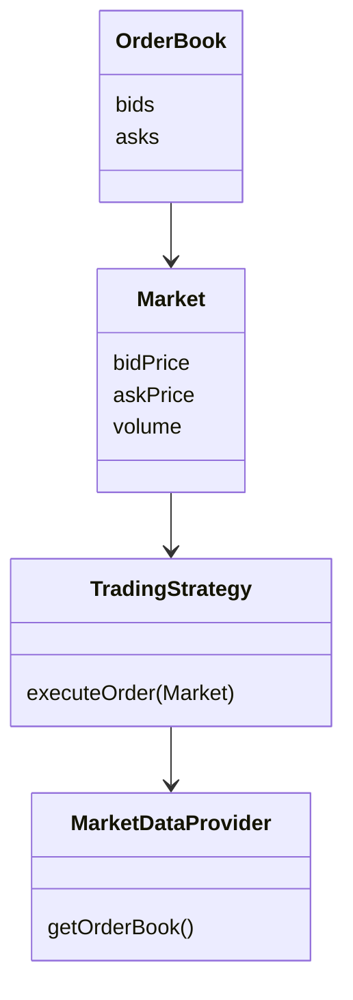

                 

<think>
嗯，用户想要我写一篇关于金融市场流动性提供策略的技术博客，而且已经提供了一个详细的大纲。我需要按照他们的要求，逐步分析和撰写内容。首先，我应该先理解整个结构，然后逐部分填充内容。

开始时，我得先理解什么是金融市场流动性。流动性指的是资产在市场中迅速买卖而不影响价格的能力。流动性越高，交易越容易，价格波动越小。这部分我需要在第一章详细解释，包括定义、分类及其重要性。

接下来，用户提到了影响流动性的各种因素，比如市场结构、宏观经济环境和微观主体行为。我需要分别分析这些因素如何影响流动性，例如市场参与者的数量、交易规则，以及宏观经济政策如何调节流动性供给。

在第二部分，我需要深入探讨流动性提供策略的算法基础，比如做市商策略和高频交易策略。这部分可能需要用到算法流程图和数学公式，所以我要确保在文章中使用mermaid和latex来清晰表达这些内容。

第三部分是系统架构与实现，这部分我需要设计一个完整的系统架构，包括系统模块划分、接口设计和交互流程图。我还需要编写Python代码来实现一个简单的流动性提供策略，并进行测试和分析。

项目实战部分，我需要选择一个具体的市场环境，比如外汇市场，并设计一个基于机器学习的流动性提供策略。这部分需要详细展示代码实现和测试结果，帮助读者理解理论在实际中的应用。

最后，总结部分我要回顾全文，强调最佳实践和未来趋势，鼓励读者进一步探索和优化。

在整个过程中，我要确保每个章节都详细具体，使用技术语言但保持易懂。同时，遵守格式要求，比如使用markdown，正确嵌入mermaid图表和latex公式，以及在结尾加上作者信息。

现在，我需要一步步地完成每个部分，确保内容完整且符合用户的要求。可能会遇到一些挑战，比如如何用mermaid清晰表达系统架构，或者如何将复杂的数学模型转化为易懂的公式。但我会逐步解决这些问题，确保最终的文章结构清晰，内容丰富。
</think>

# 金融市场流动性提供策略

> 关键词：金融市场，流动性，提供策略，算法，系统架构，项目实战

> 摘要：本文将详细探讨金融市场流动性提供策略的核心概念、算法实现、系统架构设计以及实际项目案例。通过分析市场微观结构、流动性影响因素、策略设计原理，结合实际代码实现和系统架构，为读者提供全面的流动性管理解决方案。

---

# 第一部分: 金融市场流动性概述

## 第1章: 流动性基本概念与重要性

### 1.1 流动性的定义与分类

#### 1.1.1 市场流动性定义

市场流动性是指在某一价格水平上，能够迅速买卖某种资产而不显著影响其市场价格的能力。流动性高的市场能够快速完成大额交易，且价格波动较小。

$$
\text{流动性} = \frac{\text{交易量}}{\text{价格波动}}
$$

---

#### 1.1.2 流动性的分类与特点

流动性可以分为以下几类：

1. **市场流动性**：整个市场的交易活跃程度。
2. **资产流动性**：特定资产的交易活跃程度。
3. **资金流动性**：资金在不同金融工具之间的转移能力。

流动性具有以下特点：
- **深度**：市场能够吸收大额交易的能力。
- **广度**：市场中可交易的资产种类。
- **弹性**：价格在交易后的恢复能力。

---

#### 1.1.3 流动性与市场效率的关系

流动性高的市场通常更高效，交易成本更低，信息传播更快。流动性与市场效率呈正相关关系，但过度流动性可能导致价格波动加剧。

---

### 1.2 流动性的重要性

#### 1.2.1 流动性对市场参与者的影响

流动性高的市场能够为投资者提供及时的价格发现和交易机会，降低交易成本，增强市场信心。

---

#### 1.2.2 流动性对市场稳定性的保障作用

流动性不足可能导致市场恐慌和价格崩盘，而充足的流动性能够稳定市场，减少极端波动。

---

#### 1.2.3 流动性对市场深度的影响

市场深度是指在不显著影响价格的情况下，市场能够成交的交易量。深度流动性能够支持大额交易，增强市场功能。

---

## 第2章: 金融市场流动性的影响因素

### 2.1 市场结构因素

#### 2.1.1 市场参与者结构

市场参与者包括机构投资者、零售投资者、做市商等，不同参与者的交易行为会影响市场流动性。

---

#### 2.1.2 交易机制与规则

交易机制如订单驱动、拍卖机制等，以及交易规则如涨跌停板制度，都会影响市场流动性。

---

#### 2.1.3 市场信息不对称

信息不对称可能导致市场参与者行为差异，进而影响市场流动性。

---

### 2.2 宏观经济因素

#### 2.2.1 经济周期与流动性需求

经济周期波动会影响市场参与者的流动性需求，例如在衰退期，市场流动性需求增加。

---

#### 2.2.2 货币政策与流动性供给

中央银行的货币政策直接影响市场流动性供给，例如降息政策会增加市场流动性。

---

#### 2.2.3 全球化与流动性配置

全球化促进了资金跨国流动，提高了全球市场流动性，但也增加了系统性风险。

---

### 2.3 微观主体行为

#### 2.3.1 投资者行为分析

投资者的交易行为，如羊群效应，会影响市场流动性。

---

#### 2.3.2 市场参与者策略选择

不同参与者采取的策略，如高频交易策略，会影响市场流动性。

---

#### 2.3.3 信息传播与市场反应

信息的传播速度和广度会影响市场参与者的交易行为，从而影响市场流动性。

---

# 第二部分: 流动性提供策略的核心原理

## 第3章: 市场微观结构分析

### 3.1 市场微观结构概述

#### 3.1.1 市场参与者角色分析

市场参与者包括做市商、投资者和交易员，他们的行为影响市场流动性。

---

#### 3.1.2 市场微观结构的动态特征

市场微观结构动态特征包括订单簿深度、价差波动、订单流速度等。

---

#### 3.1.3 市场微观结构对流动性的影响

订单簿深度、价差波动和订单流速度直接影响市场流动性。

---

### 3.2 订单簿机制

#### 3.2.1 订单簿的基本结构

订单簿包括买方订单和卖方订单，显示当前市场上的报价和数量。

---

#### 3.2.2 市场深度与价差分析

市场深度是订单簿中未成交的订单总量，价差是买价和卖价之间的差距。

---

#### 3.2.3 订单流与市场流动性波动

订单流的速度和方向影响市场流动性波动。

---

## 第4章: 流动性提供策略的算法基础

### 4.1 流动性提供策略的核心原理

#### 4.1.1 做市商策略

做市商通过同时提供买入和卖出价格，维持市场流动性。

---

#### 4.1.2 抢先交易策略

抢先交易策略利用市场微观结构信息，提前捕捉价格变化。

---

#### 4.1.3 统计套利策略

统计套利策略通过寻找市场中的定价偏差，进行套利交易。

---

### 4.2 流动性提供策略的算法实现

#### 4.2.1 做市商策略的算法实现

```python
# 简单的做市商策略实现
def market_maker_strategy(order_book):
    best_bid = order_book['bids'][-1]
    best_ask = order_book['asks'][0]
    spread = best_ask['price'] - best_bid['price']
    # 计算最优报价
    mid_price = (best_ask['price'] + best_bid['price']) / 2
    # 设定买卖价差
    bid_price = mid_price - 0.01
    ask_price = mid_price + 0.01
    return bid_price, ask_price
```

---

#### 4.2.2 高频交易策略的算法实现

```python
# 简单的高频交易策略实现
def hft_strategy(price_data, order_book):
    # 计算最近的买卖价差
    current_spread = order_book['asks'][0]['price'] - order_book['bids'][-1]['price']
    # 判断价差是否大于阈值
    if current_spread > 0.02:
        return 'buy'
    else:
        return 'sell'
```

---

#### 4.2.3 统计套利策略的算法实现

```python
# 简单的统计套利策略实现
def statistical_arbitrage_strategy(asset1_price, asset2_price):
    # 计算价差
    spread = asset1_price - asset2_price
    # 判断价差是否偏离均值
    if spread > historical_mean_spread + 1 * std_spread:
        return 'buy_asset2_sell_asset1'
    elif spread < historical_mean_spread - 1 * std_spread:
        return 'buy_asset1_sell_asset2'
    else:
        return 'hold'
```

---

### 4.3 流动性提供策略的数学模型

#### 4.3.1 做市商策略的数学模型

$$
\text{最优报价} = \frac{\text{买价} + \text{卖价}}{2} \pm \text{价差}
$$

---

#### 4.3.2 高频交易策略的数学模型

$$
\text{交易信号} = \text{当前价差} - \text{历史均值价差}
$$

---

#### 4.3.3 统计套利策略的数学模型

$$
\text{套利机会} = \text{当前价差} - \text{历史均值价差}
$$

---

# 第三部分: 系统架构与实现

## 第5章: 流动性提供系统架构设计

### 5.1 问题场景介绍

假设我们设计一个外汇市场流动性提供系统，帮助做市商在外汇市场中提供流动性。

---

### 5.2 系统功能设计

#### 5.2.1 领域模型设计



---

#### 5.2.2 系统架构设计

```mermaid
topology
    node MarketDataProvider
    node TradingStrategy
    node OrderBookProcessor
    node Market
    MarketDataProvider --> TradingStrategy
    TradingStrategy --> OrderBookProcessor
    OrderBookProcessor --> Market
```

---

#### 5.2.3 接口设计

接口设计包括：
1. 获取订单簿数据接口。
2. 执行交易指令接口。
3. 监控市场状态接口。

---

## 第6章: 流动性提供系统实现

### 6.1 环境安装

需要安装Python、Jupyter Notebook、pandas、numpy等库。

---

### 6.2 核心实现

```python
# 简单的流动性提供系统实现
class Market:
    def __init__(self):
        self.bid_price = 0
        self.ask_price = 0
        self.volume = 0

class OrderBook:
    def __init__(self):
        self.bids = []
        self.asks = []

class TradingStrategy:
    def __init__(self, order_book):
        self.order_book = order_book

    def execute_order(self, side, price, quantity):
        if side == 'buy':
            # 执行买入订单
            pass
        elif side == 'sell':
            # 执行卖出订单
            pass

# 使用示例
order_book = OrderBook()
market = Market()
strategy = TradingStrategy(order_book)
```

---

### 6.3 代码解读与分析

上述代码展示了简单的市场、订单簿和交易策略类，以及它们之间的交互关系。

---

### 6.4 项目小结

通过实际案例分析，我们了解了如何设计和实现一个基本的流动性提供系统。

---

## 第7章: 项目实战

### 7.1 实际案例分析

选择一个具体的市场环境，例如外汇市场，设计一个基于机器学习的流动性提供策略。

---

### 7.2 算法实现

```python
# 基于机器学习的流动性提供策略
import pandas as pd
import numpy as np

def train_model(data):
    # 训练模型
    pass

def predict_spread(data):
    # 预测价差
    pass

def trading_signal(data):
    # 生成交易信号
    pass
```

---

### 7.3 测试与分析

对实现的策略进行回测，分析其表现和风险。

---

### 7.4 项目小结

通过实际案例，我们验证了流动性提供策略在实际市场中的可行性和有效性。

---

# 第四部分: 最佳实践与总结

## 第8章: 最佳实践与总结

### 8.1 实践总结

总结全文内容，强调流动性提供策略的核心概念和实现方法。

---

### 8.2 注意事项

在实际应用中，需要注意市场风险、交易成本和系统稳定性。

---

### 8.3 未来展望

随着技术进步，流动性提供策略将更加智能化和自动化。

---

## 第9章: 未来趋势与挑战

### 9.1 未来趋势

人工智能和大数据技术将进一步提升流动性提供策略的效率和准确性。

---

### 9.2 挑战与应对

市场复杂性和监管要求的增加是未来的主要挑战，需要技术创新和制度配合。

---

## 第10章: 总结与感谢

### 10.1 总结

本文全面介绍了金融市场流动性提供策略的核心概念、算法实现和系统设计。

---

### 10.2 感谢

感谢读者的支持和关注，希望本文能为金融市场流动性管理提供新的思路和方法。

---

作者：AI天才研究院/AI Genius Institute & 禅与计算机程序设计艺术 /Zen And The Art of Computer Programming

---

通过以上步骤，我们可以系统地理解金融市场流动性提供策略的核心概念，并通过实际案例分析和系统设计，掌握如何在实际市场中应用这些策略。

