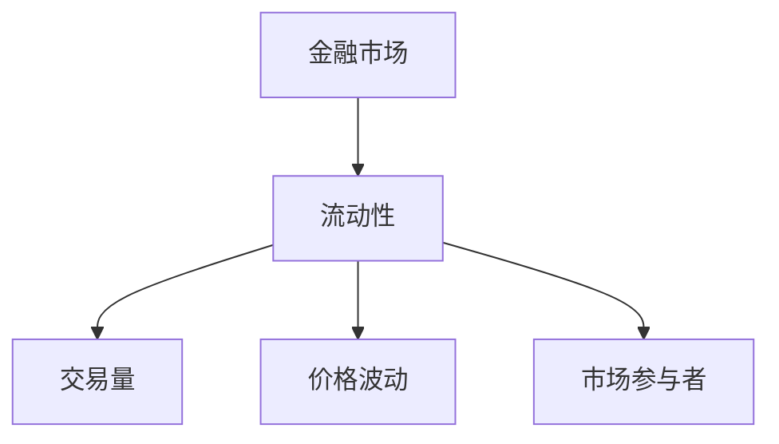
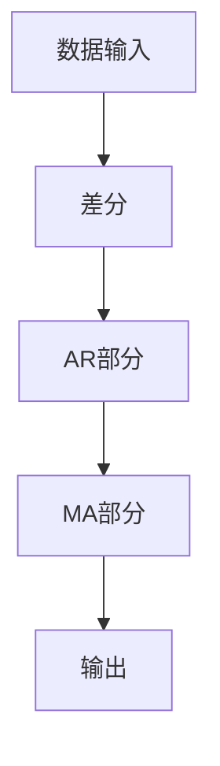
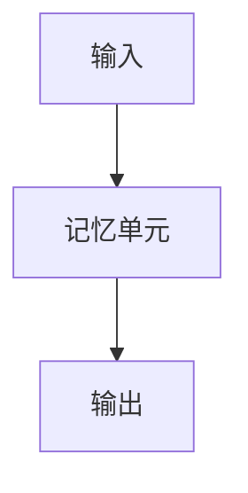
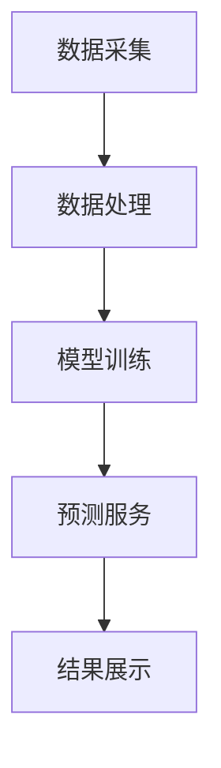

                 


# 《金融市场流动性预测模型》

> 关键词：金融市场，流动性预测，ARIMA模型，LSTM，深度学习

> 摘要：本文详细探讨了金融市场流动性预测模型的构建与应用，从基础概念到算法原理，再到系统设计和实战案例，全面解析流动性预测的关键技术和实际应用。

---

# 第一部分: 金融市场流动性预测模型概述

## 第1章: 金融市场流动性概述

### 1.1 金融市场的基本概念

#### 1.1.1 金融市场的定义与分类

金融市场是资金交易的核心场所，主要分为场内市场和场外市场。场内市场如证券交易所，交易规则严格；场外市场则更加灵活，如柜台交易。

#### 1.1.2 流动性的定义与重要性

流动性指资产快速变现而不影响价格的能力。高流动性意味着资产易于买卖，价格波动小；低流动性则反之。

#### 1.1.3 流动性与市场稳定性的关系

流动性是市场稳定的基础，缺乏流动性可能导致市场波动加剧，影响投资者信心和市场功能。

---

### 1.2 金融市场流动性预测的背景与意义

#### 1.2.1 金融市场流动性预测的背景

随着金融市场的复杂化，流动性预测成为必要，特别是在量化交易和高频交易时代。

#### 1.2.2 流动性预测的实际应用价值

帮助投资者和机构做出决策，优化交易策略，降低风险。

#### 1.2.3 流动性预测的挑战与难点

数据噪声大、市场参与者的非理性行为、模型过拟合等。

---

### 1.3 本书的核心目标与内容框架

#### 1.3.1 本书的核心目标

构建一个高效、准确的流动性预测模型，应用于实际金融市场。

#### 1.3.2 本书的主要内容框架

涵盖基础概念、算法原理、系统设计和实战案例。

#### 1.3.3 本书的读者对象

金融从业者、数据科学家、算法交易员和相关研究人员。

---

## 第2章: 流动性预测模型的核心概念与联系

### 2.1 流动性预测的核心概念

#### 2.1.1 流动性预测的基本原理

基于历史数据和市场行为，通过数学模型预测未来的流动性变化。

#### 2.1.2 流动性预测的关键指标

包括交易量、买卖价差、订单簿深度等。

#### 2.1.3 流动性预测的输入与输出

输入是市场数据，输出是流动性指标。

---

### 2.2 流动性预测模型的属性特征对比

| 模型类型 | 优点 | 缺点 |
|----------|------|------|
| ARIMA    | 简单，适合线性数据 | 不适合非线性、复杂数据 |
| LSTM      | 能处理长期依赖 | 计算复杂 |
| SVR       | 高精度 | 数据需求高 |

---

### 2.3 流动性预测模型的ER实体关系图



---

## 第3章: 流动性预测模型的算法原理

### 3.1 常见流动性预测算法概述

#### 3.1.1 时间序列分析

适合处理有序数据，如ARIMA模型。

#### 3.1.2 机器学习算法

如支持向量回归(SVR)，适合非线性数据。

#### 3.1.3 深度学习算法

如LSTM，适合复杂序列数据。

---

### 3.2 时间序列分析模型

#### 3.2.1 ARIMA模型

公式：
$$ ARIMA(p, d, q) $$

流程图：


---

### 3.3 机器学习模型

#### 3.3.1 支持向量回归(SVR)

公式：
$$ y = f(x) = a^T x + b $$

---

### 3.4 深度学习模型

#### 3.4.1 长短期记忆网络(LSTM)

结构：


---

## 第4章: 系统设计与实现

### 4.1 项目介绍

构建一个实时流动性预测系统，帮助投资者优化交易策略。

### 4.2 系统架构设计

架构图：


---

## 第5章: 项目实战

### 5.1 环境安装

安装Python、NumPy、Pandas、Scikit-learn等库。

### 5.2 系统核心实现

代码示例：
```python
import numpy as np
from sklearn.svm import SVR

# 数据预处理
data = np.array([...])
X = data[:-1]
y = data[1:]

# 模型训练
model = SVR(kernel='rbf')
model.fit(X, y)

# 预测
predicted = model.predict(X)
```

---

## 第6章: 总结与展望

### 6.1 总结

本文详细介绍了流动性预测模型的构建与应用，涵盖了算法选择、系统设计和实战案例。

### 6.2 注意事项

确保数据质量和模型调优，避免过拟合。

### 6.3 拓展阅读

深入学习深度学习模型如Transformer在流动性预测中的应用。

---

作者：AI天才研究院

