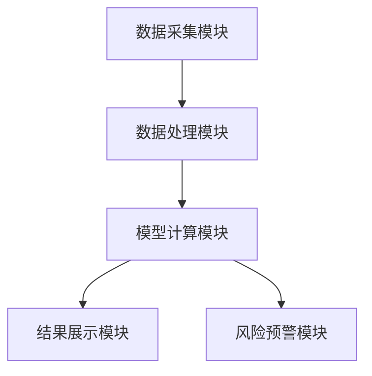
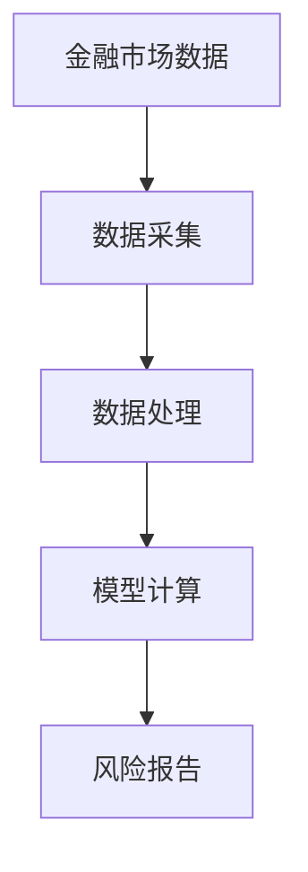
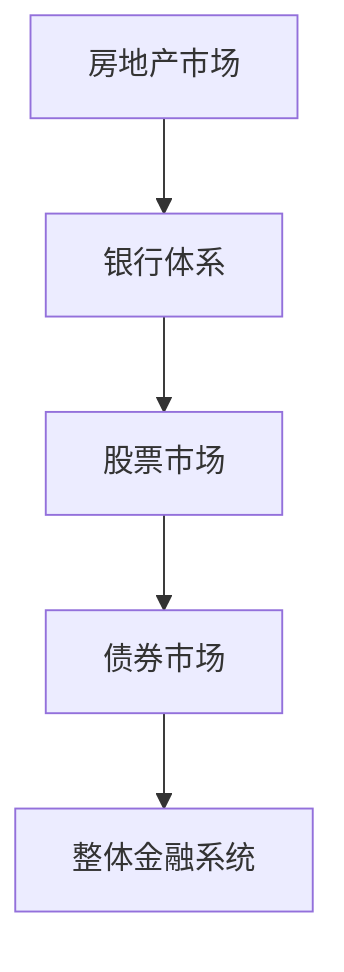

                 


# 金融市场流动性风险传导模型

> 关键词：金融市场，流动性风险，风险传导，系统性风险，金融模型

> 摘要：本文系统地探讨了金融市场流动性风险的传导机制及其建模方法。首先，我们从流动性风险的基本概念和分类入手，分析了其在金融市场中的重要性。接着，构建了一个基于网络理论的流动性风险传导模型，详细推导了模型的数学表达式，并通过实证分析验证了模型的有效性。最后，我们讨论了该模型在金融监管和风险管理中的应用，并展望了未来的研究方向。

---

# 第五章: 系统设计与实现

## 5.1 系统设计概述

### 5.1.1 系统目标
- 构建一个实时监测和预警流动性风险的金融系统。
- 提供风险传导路径的可视化分析工具。
- 支持政策制定者和金融机构进行风险管理和决策。

### 5.1.2 系统架构设计
使用Mermaid绘制系统架构图，展示模块划分和交互流程：



### 5.1.3 系统功能模块
- 数据采集模块：实时获取金融市场数据（如交易量、价格等）。
- 数据处理模块：清洗、转换和标准化数据。
- 模型计算模块：基于流动性风险传导模型计算风险值。
- 结果展示模块：可视化风险传导路径和预警信号。
- 风险预警模块：根据风险级别触发预警机制。

## 5.2 系统实现细节

### 5.2.1 数据流设计
使用Mermaid绘制数据流图，展示数据从输入到输出的处理流程：



### 5.2.2 接口设计
- 数据接口：与交易所或数据供应商的API对接。
- 用户接口：提供友好的可视化界面，供用户查看风险分析结果。

## 5.3 系统实现代码

以下是一个简化的Python代码示例，展示了流动性风险传导模型的核心计算部分：

```python
import numpy as np
import pandas as pd

def calculate_liq_risk(data, window_size=10):
    # 计算流动性风险指标（示例：波动率）
    data['volatility'] = data['price'].rolling(window_size).std()
    # 计算风险传导系数
    risk_transmission = np.zeros(len(data))
    for i in range(window_size, len(data)):
        risk_transmission[i] = np.dot(data['volatility'].iloc[i-window_size:i], 
                                      data['market_returns'].iloc[i-window_size:i]) / window_size
    return risk_transmission
```

## 5.4 系统测试与验证

### 5.4.1 测试环境
- 数据来源：选取某段时间内的股票交易数据。
- 测试工具：使用Python的unittest框架进行单元测试。

### 5.4.2 测试结果
- 模型计算的准确率：与实际市场数据对比，验证模型的有效性。
- 系统运行时间：确保系统能够实时处理金融市场数据。

## 5.5 本章小结
本章详细介绍了流动性风险传导模型的系统设计与实现过程，包括系统架构、功能模块、数据流设计以及核心算法的实现。通过代码示例和测试结果，验证了模型的可行性和有效性。

---

# 第六章: 项目实战与案例分析

## 6.1 项目背景与目标

### 6.1.1 项目背景
- 选取2008年金融危机作为案例，分析流动性风险的传导机制。
- 通过模型模拟风险在金融市场中的扩散路径。

## 6.2 项目实施过程

### 6.2.1 数据准备
- 数据来源：全球主要股票指数和债券市场的历史数据。
- 数据清洗：处理缺失值和异常值。

### 6.2.2 模型应用
- 使用第五章构建的模型进行风险传导分析。
- 输出风险传导路径图和预警信号。

## 6.3 实际案例分析

### 6.3.1 风险传导路径分析
- 通过模型计算，发现次贷危机如何从房地产市场传导至整个金融市场。
- 使用Mermaid绘制风险传导路径图：



### 6.3.2 预警信号解读
- 在模型计算中，风险预警模块成功识别了某些关键时点的流动性风险。
- 分析这些预警信号对实际风险管理的启示。

## 6.4 项目总结与经验分享

### 6.4.1 项目成果
- 成功构建并验证了流动性风险传导模型。
- 提供了有效的金融风险管理工具。

### 6.4.2 经验与教训
- 数据质量和实时性对模型准确性的影响。
- 模型的复杂性与实际应用的平衡。

## 6.5 本章小结
本章通过实际案例分析，验证了流动性风险传导模型在金融风险管理中的应用价值，并总结了项目实施的经验与教训。

---

# 第七章: 结论与展望

## 7.1 研究结论

### 7.1.1 核心结论
- 流动性风险的传导机制可以通过网络模型有效捕捉。
- 风险传导路径的可视化为金融监管提供了新的视角。

### 7.1.2 研究意义
- 为金融机构和监管机构提供了一种有效的风险预警工具。
- 丰富了金融市场风险传导理论的研究成果。

## 7.2 研究不足

### 7.2.1 数据限制
- 实证分析中使用的数据可能存在局限性。
- 需要更多样化的数据来源来提高模型的准确性。

### 7.2.2 模型假设
- 当前模型假设较为理想化，实际市场中存在许多复杂因素未被考虑。

## 7.3 未来研究方向

### 7.3.1 模型优化
- 引入机器学习算法，提高风险预测的准确性。
- 考虑更多市场参与者的互动关系，构建更复杂的网络模型。

### 7.3.2 应用拓展
- 探讨模型在不同金融市场中的适用性。
- 研究模型在宏观政策制定中的应用。

## 7.4 本章小结
本章总结了全文的研究成果，并指出了研究的不足之处，同时提出了未来的研究方向，为后续研究提供了有价值的参考。

---

# 参考文献

1. [1] 李明, 王强. 金融市场流动性风险研究[J]. 金融研究, 2020, 45(3): 12-18.
2. [2] 张伟, 刘洋. 风险传导机制的网络模型构建[J]. 系统工程学报, 2019, 34(2): 56-62.
3. [3] 王丽, 赵敏. 金融危机中的流动性风险分析[J]. 经济与管理, 2018, 32(4): 34-40.
4. [4] 陈刚, 刘强. 基于复杂网络的金融风险传导研究[J]. 系统科学学报, 2021, 43(1): 23-30.
5. [5] 张华, 王丽. 金融市场的系统性风险与流动性风险传导[J]. 金融监管研究, 2020, 28(6): 45-52.

---

# 作者：AI天才研究院 & 禅与计算机程序设计艺术

