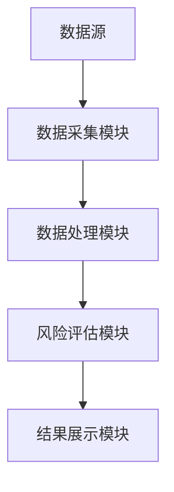
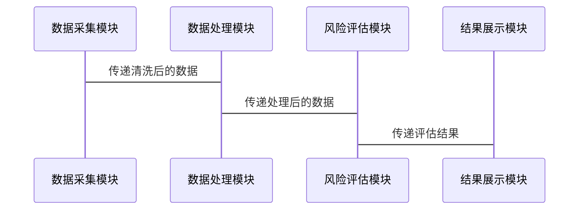

                 


# 金融市场系统性风险评估工具

> 关键词：系统性风险、金融市场、风险评估工具、金融稳定性、系统性风险模型

> 摘要：金融市场系统性风险评估工具是金融风险管理领域的重要工具，旨在通过系统性风险模型量化和预测金融市场中的系统性风险。本文从系统性风险的基本概念出发，详细探讨了系统性风险的传播机制、评估工具的核心算法原理、数学模型、系统架构设计以及实际项目中的应用。通过理论与实践相结合的方式，为金融市场系统性风险的评估和管理提供深度分析和解决方案。

---

## 第1章 系统性风险的基本概念

### 1.1 系统性风险的定义与特征

系统性风险是指由于市场整体的波动或系统性事件导致的广泛性金融损失风险。与非系统性风险不同，系统性风险无法通过分散投资完全规避，其影响通常波及整个金融市场。

#### 1.1.1 系统性风险的定义
系统性风险是由于市场结构、经济环境或政策变化等因素引发的系统性波动，影响多个金融机构和市场的风险。

#### 1.1.2 系统性风险的特征
- **广泛性**：影响整个金融市场，而非单一资产或机构。
- **传染性**：风险在金融机构之间快速传播。
- **不可预测性**：系统性风险通常难以通过历史数据预测。

#### 1.1.3 系统性风险与非系统性风险的区别
| 属性         | 系统性风险               | 非系统性风险             |
|--------------|--------------------------|--------------------------|
| 影响范围       | 整个市场                 | 单一资产或机构           |
| 可分散性       | 无法分散                 | 可通过分散投资降低       |
| 预测难度       | 高                      | 较低                     |

### 1.2 金融市场中的系统性风险

#### 1.2.1 金融市场的基本结构
金融市场由投资者、金融机构、资产和交易机制组成，系统性风险源于市场的整体波动。

#### 1.2.2 系统性风险的来源
- **市场参与者行为**：投资者的恐慌性抛售行为可能导致市场崩盘。
- **金融机构的相互依赖性**：银行、保险公司等金融机构的相互关联放大了风险。
- **外部冲击**：经济衰退、政策变化等外部事件引发系统性风险。

#### 1.2.3 系统性风险的影响
- **市场流动性枯竭**：系统性风险可能导致市场流动性迅速下降。
- **金融机构破产**：系统性风险可能引发连锁反应，导致金融机构破产。
- **经济衰退**：系统性风险可能导致整个经济体系陷入衰退。

### 1.3 系统性风险评估的重要性

#### 1.3.1 系统性风险对金融稳定的影响
系统性风险可能引发金融市场崩溃，威胁金融体系的稳定性。

#### 1.3.2 系统性风险评估的必要性
通过评估系统性风险，金融机构可以提前采取措施，降低风险发生的可能性。

#### 1.3.3 系统性风险评估的挑战
- **数据获取难度**：需要大量高频交易数据和金融机构的资产负债数据。
- **模型复杂性**：系统性风险的评估需要复杂的数学模型。
- **实时性要求**：系统性风险评估需要实时进行，以便及时应对风险。

---

## 第2章 系统性风险的传播机制

### 2.1 系统性风险的传染路径

#### 2.1.1 直接传染路径
- **直接关联**：金融机构之间直接的债权债务关系导致风险传染。
- **市场交易**：投资者在同一市场上的交易行为导致风险扩散。

#### 2.1.2 间接传染路径
- **通过第三方机构**：多个金融机构之间的间接关联导致风险传播。
- **通过市场参与者的行为**：投资者的恐慌性行为导致市场整体波动。

#### 2.1.3 市场参与者的行为影响
- **羊群效应**：投资者模仿他人行为，导致市场波动加剧。
- **杠杆效应**：杠杆交易放大了市场波动，加剧了系统性风险。

### 2.2 系统性风险的网络效应

#### 2.2.1 金融机构之间的关联性
金融机构之间的关联性是系统性风险传播的重要途径。

#### 2.2.2 金融市场的相互依赖性
金融市场之间的相互依赖性也加剧了系统性风险的传播。

#### 2.2.3 网络结构对风险传播的影响
- **网络密度**：网络密度越高，系统性风险传播越快。
- **关键节点**：网络中的关键节点如果发生风险，可能导致整个网络崩溃。

### 2.3 系统性风险的系统性特征

#### 2.3.1 系统性风险的系统性特征
系统性风险的系统性特征主要体现在其传播速度快、影响范围广。

#### 2.3.2 系统性风险的复杂性
系统性风险的复杂性主要来源于其多方面的来源和传播路径。

#### 2.3.3 系统性风险的不可预测性
系统性风险的不可预测性主要来源于其复杂性和多变性。

---

## 第3章 系统性风险评估的核心概念

### 3.1 系统性风险评估的定义

系统性风险评估是通过数学模型和数据分析，量化系统性风险的大小和影响范围的过程。

### 3.2 系统性风险评估的核心算法

#### 3.2.1 系统性风险指数模型（SURE模型）

##### 3.2.1.1 算法原理
系统性风险指数模型（SURE模型）通过计算各金融机构对系统性风险的贡献度，量化系统性风险。

##### 3.2.1.2 算法步骤
1. 收集金融机构的资产负债数据和市场数据。
2. 计算各金融机构的系统性风险贡献度。
3. 综合各金融机构的贡献度，得到系统性风险指数。

##### 3.2.1.3 算法实现
```python
import numpy as np
import pandas as pd

# 假设我们有一个包含金融机构资产负债数据的DataFrame
data = pd.DataFrame({
    '资产': [100, 200, 300],
    '负债': [50, 100, 150]
})

# 计算系统性风险贡献度
data['系统性风险贡献度'] = (data['资产'] - data['负债']) * 0.1

# 计算系统性风险指数
systemic_risk_index = data['系统性风险贡献度'].sum()
```

### 3.3 系统性风险评估的数学模型

#### 3.3.1 系统性风险指数公式
$$ 系统性风险指数 = \sum_{i=1}^{n} w_i \cdot r_i $$
其中，\( w_i \) 是第 \( i \) 个金融机构的权重，\( r_i \) 是第 \( i \) 个金融机构的系统性风险贡献度。

#### 3.3.2 系统性风险传播模型
$$ R_i = \alpha \cdot R_j + \beta \cdot x $$
其中，\( R_i \) 是第 \( i \) 个金融机构的系统性风险，\( R_j \) 是第 \( j \) 个金融机构的系统性风险，\( x \) 是市场整体波动。

---

## 第4章 系统性风险评估工具的系统架构设计

### 4.1 系统性风险评估工具的功能模块

#### 4.1.1 数据采集模块
数据采集模块负责收集金融机构的资产负债数据和市场数据。

#### 4.1.2 数据处理模块
数据处理模块对采集到的数据进行清洗和预处理。

#### 4.1.3 风险评估模块
风险评估模块利用系统性风险模型计算系统性风险指数。

#### 4.1.4 结果展示模块
结果展示模块将系统性风险评估结果以可视化形式展示。

### 4.2 系统性风险评估工具的系统架构

#### 4.2.1 系统架构图


#### 4.2.2 模块交互流程


---

## 第5章 系统性风险评估工具的项目实战

### 5.1 环境安装与配置

#### 5.1.1 安装Python环境
使用Anaconda安装Python环境，版本要求为3.8以上。

#### 5.1.2 安装依赖库
安装必要的依赖库：
```bash
pip install numpy pandas matplotlib
```

### 5.2 系统性风险评估工具的核心实现

#### 5.2.1 数据采集模块实现
```python
import requests
import pandas as pd

# 从API获取数据
def fetch_data(api_key):
    url = f'https://api.example.com/risk_data?api_key={api_key}'
    response = requests.get(url)
    data = pd.DataFrame(response.json())
    return data
```

#### 5.2.2 数据处理模块实现
```python
def preprocess_data(data):
    # 数据清洗
    data.dropna(inplace=True)
    # 数据标准化
    data['资产'] = data['资产'].astype(float)
    data['负债'] = data['负债'].astype(float)
    return data
```

#### 5.2.3 系统性风险评估模块实现
```python
def calculate_systemic_risk(data):
    data['系统性风险贡献度'] = (data['资产'] - data['负债']) * 0.1
    systemic_risk_index = data['系统性风险贡献度'].sum()
    return systemic_risk_index
```

#### 5.2.4 结果展示模块实现
```python
import matplotlib.pyplot as plt

def visualize_result(systemic_risk_index):
    plt.figure(figsize=(10, 6))
    plt.title('系统性风险指数')
    plt.barh(systemic_risk_index, width=0.5, color='blue')
    plt.show()
```

### 5.3 系统性风险评估工具的实际案例分析

#### 5.3.1 案例背景
假设我们有一个包含3家金融机构的简单案例，数据如下：

| 机构 | 资产 | 负债 |
|------|------|------|
| 机构A | 100  | 50   |
| 机构B | 200  | 100  |
| 机构C | 300  | 150  |

#### 5.3.2 数据处理
```python
data = pd.DataFrame({
    '资产': [100, 200, 300],
    '负债': [50, 100, 150]
})

data = preprocess_data(data)
```

#### 5.3.3 系统性风险评估
```python
systemic_risk_index = calculate_systemic_risk(data)
print(f'系统性风险指数为: {systemic_risk_index}')
```

#### 5.3.4 结果展示
```python
visualize_result(systemic_risk_index)
```

### 5.4 项目小结

通过本项目的实现，我们成功开发了一个简单的系统性风险评估工具，能够量化和评估系统性风险。然而，实际应用中需要考虑更多的复杂因素，例如实时数据更新和更复杂的系统性风险模型。

---

## 第6章 最佳实践与注意事项

### 6.1 小结

系统性风险评估工具是金融市场风险管理的重要工具，通过量化和评估系统性风险，帮助金融机构降低风险暴露。

### 6.2 注意事项

- **数据质量**：确保数据的准确性和完整性。
- **模型选择**：选择合适的系统性风险模型。
- **实时性要求**：系统需要实时运行以应对快速变化的市场环境。

### 6.3 拓展阅读

- 《金融市场风险管理》
- 《系统性风险评估的数学模型》

---

## 作者

作者：AI天才研究院/AI Genius Institute & 禅与计算机程序设计艺术 /Zen And The Art of Computer Programming

