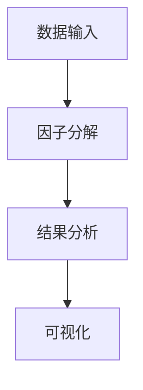

                 

<think>
好的，我需要帮助用户撰写一篇关于《金融市场风险因子分解与分析》的技术博客文章。首先，我需要明确用户的需求：用户希望我以一位世界级人工智能专家的身份，撰写一篇结构清晰、逻辑严谨、内容深刻的技术博客文章，涵盖金融市场风险因子分解的相关主题。

首先，我需要理解金融市场风险因子分解的基本概念。风险因子分解是一种通过分析金融市场中的各种风险因素，将其分解为更基础的成分，从而更好地理解和管理市场风险的方法。这涉及到统计学、线性代数和优化理论等多个领域的知识。

接下来，我需要确定文章的结构。根据用户提供的目录大纲，文章将分为背景、核心概念、算法原理、系统架构、项目实战、案例分析和结论几个部分。每个部分都需要详细展开，确保内容的深度和广度。

在“背景与意义”部分，我需要解释为什么金融市场风险因子分解是必要的，它在金融风险管理中的作用，以及它与其他相关领域的联系。这部分需要语言通俗易懂，适合没有专业背景的读者理解。

核心概念部分，我需要详细讲解风险因子分解的基本原理，包括因子模型、分解方法以及其在不同金融产品中的应用。为了帮助读者更好地理解，我需要引入一些图表，如因子分析的ER图或流程图，使用Mermaid工具来展示。

在算法原理部分，我需要选择几种常用的风险因子分解方法，如主成分分析（PCA）和因子分析方法，并详细解释它们的数学模型和实现步骤。为了使内容更生动，我需要使用LaTeX公式来展示数学模型，并用Mermaid流程图展示算法的执行过程。

系统架构与实现部分，我需要设计一个完整的系统架构，包括功能模块划分、接口设计和交互流程。这部分可以使用类图和架构图来展示，帮助读者理解系统的组成部分和各模块之间的关系。

项目实战部分，我需要选择一个具体的案例，详细讲解如何在实际项目中应用风险因子分解的方法。这包括环境的安装配置、核心代码的实现、结果的分析与可视化。为了增加实用性，我还需要提供一些代码示例和实际案例分析。

案例分析部分，我需要通过一个或多个实际案例，展示风险因子分解在不同情境下的应用效果，以及如何通过分解结果来优化投资组合和管理风险。

最后，在结论部分，我需要总结全文的主要内容，并对未来的研究方向和可能的应用领域进行展望，帮助读者更好地理解该领域的未来发展。

在整个写作过程中，我需要确保内容逻辑清晰，结构紧凑，语言专业但不失易懂。同时，要注意使用适当的图表和代码示例，以增强文章的可读性和实用性。此外，我还需要在文章末尾添加作者信息，以增加文章的权威性和专业性。

总的来说，我需要一步步地构建文章的各个部分，确保每一部分内容详实，符合用户的深度要求，同时保持整体的连贯性和逻辑性。
</think>

# 金融市场风险因子分解与分析

> 关键词：金融市场，风险因子，分解方法，统计分析，因子模型，风险管理

> 摘要：金融市场风险因子分解与分析是理解和管理金融风险的重要方法。本文从风险因子分解的基本概念出发，系统地介绍了其数学基础、主要方法（如主成分分析、因子分析和独立成分分析），并详细讲解了如何在实际项目中实现风险因子分解，通过案例分析展示了其在金融市场中的应用效果。

---

# 第一部分：金融市场风险因子分解概述

## 第1章：金融市场风险因子分解的背景与意义

### 1.1 风险因子分解的背景与意义

金融市场风险因子分解是一种通过分析金融市场中的各种风险因素，将其分解为更基础的成分，从而更好地理解和管理市场风险的方法。随着金融市场的复杂化和全球化，风险因子分解在金融风险管理中扮演着越来越重要的角色。

#### 1.1.1 风险因子分解的定义与背景

金融市场中的风险因子分解是指将金融资产的收益波动分解为几个潜在的、不可观察的因子，这些因子能够解释资产收益的变化。其背景在于，金融市场中的资产价格波动往往受到多种因素的影响，如经济指标、市场情绪、政策变化等。通过分解这些因素，我们可以更清晰地理解资产收益的变化来源。

#### 1.1.2 风险因子分解的必要性与重要性

金融市场中的投资者和机构需要面对各种风险，如市场风险、信用风险、流动性风险等。风险因子分解能够帮助他们识别和量化这些风险，从而更好地进行投资决策和风险管理。通过分解风险因子，投资者可以更好地理解市场波动的来源，从而制定更有效的风险管理策略。

#### 1.1.3 风险因子分解的应用场景与边界

风险因子分解的应用场景主要包括：资产定价、风险管理和投资组合优化等。例如，在资产定价中，风险因子分解可以帮助投资者确定影响资产收益的主要因素；在风险管理中，风险因子分解可以帮助机构识别和量化潜在的风险来源；在投资组合优化中，风险因子分解可以帮助投资者构建更优化的投资组合。

风险因子分解的边界在于，它主要关注资产收益的波动性，而不是资产的具体定价。此外，风险因子分解通常假设市场中的风险因素是线性相关的，这可能限制了其在非线性市场中的应用。

### 1.2 风险因子分解的核心概念

风险因子分解的核心概念包括因子模型、分解方法和应用场景。因子模型是风险因子分解的基础，它描述了资产收益与潜在因子之间的关系。分解方法则是实现风险因子分解的具体技术，如主成分分析（PCA）和因子分析方法。应用场景则是指风险因子分解在金融领域中的具体应用，如资产定价和投资组合优化。

#### 1.2.1 风险因子的定义与分类

风险因子是指影响资产收益的潜在因素，这些因素通常是不可观测的，但可以通过资产收益的变化来推断。常见的风险因子包括市场风险、信用风险、流动性风险等。

风险因子可以分为宏观经济因子和资产特异性因子。宏观经济因子是指影响整个市场的因素，如GDP增长率、利率水平等；资产特异性因子是指影响特定资产的因素，如公司的业绩、管理团队的变化等。

#### 1.2.2 风险因子分解的基本原理

风险因子分解的基本原理是通过统计方法将资产收益的变化分解为几个潜在因子的线性组合。例如，主成分分析（PCA）通过寻找资产收益变化的主成分来分解风险因子。

#### 1.2.3 风险因子分解的关键要素与属性

风险因子分解的关键要素包括：资产收益数据、因子数量、因子载荷和因子方差等。因子数量是指分解出的潜在因子的数量；因子载荷是指资产收益与因子之间的相关性；因子方差是指因子对资产收益波动的贡献程度。

---

## 第2章：风险因子分解的主要方法

### 2.1 主成分分析（PCA）

主成分分析（PCA）是一种常用的风险因子分解方法，它通过寻找资产收益变化的主要成分来分解风险因子。

#### 2.1.1 PCA的基本原理

PCA的基本原理是通过线性变换将原始数据转换为新的坐标系，使得数据在新的坐标系中的方差最大化。具体来说，PCA通过计算资产收益数据的协方差矩阵的特征值和特征向量，找到能够解释最大方差的主成分。

#### 2.1.2 PCA的数学推导与公式

PCA的数学推导如下：

1. 计算资产收益数据的协方差矩阵：  
   $$ \Sigma = \frac{1}{n-1} \sum_{i=1}^{n} (x_i - \bar{x})(x_i - \bar{x})^T $$

2. 计算协方差矩阵的特征值和特征向量：  
   $$ \Sigma v = \lambda v $$

3. 按照特征值的大小顺序排列特征向量，得到主成分：  
   $$ PC_1 = v_1^T x $$  
   $$ PC_2 = v_2^T x $$  
   $$ \vdots $$  
   $$ PC_k = v_k^T x $$

4. 将主成分作为潜在因子，分解资产收益：  
   $$ r_i = \beta_1 PC_1 + \beta_2 PC_2 + \cdots + \beta_k PC_k + \epsilon_i $$

#### 2.1.3 PCA在风险因子分解中的应用

PCA在风险因子分解中的应用非常广泛。例如，可以通过PCA分解股票收益数据，找到影响股票收益的主要因子，如市场整体波动、行业波动等。

### 2.2 因子分析方法

因子分析方法是一种统计方法，旨在通过寻找潜在因子来解释资产收益的变化。

#### 2.2.1 因子分析的基本原理

因子分析的基本原理是通过建立一个因子模型，将资产收益分解为因子的线性组合。因子模型通常分为两类：普通因子模型和特定因子模型。普通因子模型假设所有资产都受相同的一组因子影响；特定因子模型假设资产还受到一些特异性的因子影响。

#### 2.2.2 因子分析的数学模型

因子分析的数学模型如下：  
$$ r_i = \sum_{k=1}^{m} \beta_{ik} F_k + \epsilon_i $$

其中，$r_i$ 是资产i的收益，$\beta_{ik}$ 是资产i对因子k的载荷，$F_k$ 是因子k的值，$\epsilon_i$ 是特异性误差。

#### 2.2.3 因子分析在风险因子分解中的应用

因子分析在风险因子分解中的应用包括：资产定价、投资组合优化等。例如，可以通过因子分析找到影响股票收益的主要因子，如市值、价值、动量等，并构建基于这些因子的投资组合。

### 2.3 独立成分分析（ICA）

独立成分分析（ICA）是一种通过寻找潜在因子的独立分量来分解风险因子的方法。

#### 2.3.1 ICA的基本原理

ICA的基本原理是假设潜在因子是相互独立的，并通过非线性变换将这些因子从观测数据中分离出来。

#### 2.3.2 ICA的数学推导与公式

ICA的数学推导较为复杂，通常涉及最大化非高斯性或最小化互信息等目标函数。

#### 2.3.3 ICA在风险因子分解中的应用

ICA在风险因子分解中的应用较少，但可以用于处理非线性相关性较高的因子。

---

## 第3章：风险因子分解的系统架构与实现

### 3.1 系统架构设计

#### 3.1.1 系统功能模块划分

风险因子分解系统的功能模块包括：数据输入、因子分解、结果分析和可视化。

#### 3.1.2 系统架构的Mermaid图



### 3.2 系统接口设计

#### 3.2.1 输入接口设计

系统输入接口需要接收资产收益数据和参数设置。

#### 3.2.2 输出接口设计

系统输出接口包括因子载荷、因子方差和分解结果等。

### 3.3 系统实现细节

#### 3.3.1 数据预处理

数据预处理包括数据清洗、标准化和去趋势等步骤。

#### 3.3.2 算法实现

算法实现包括PCA、因子分析和ICA等方法的实现。

#### 3.3.3 结果分析与可视化

结果分析包括因子载荷分析和因子方差分析等，可视化部分包括因子载荷图和因子方差图等。

---

## 第4章：风险因子分解的项目实战

### 4.1 项目环境安装与配置

#### 4.1.1 系统环境要求

项目需要安装Python 3.6及以上版本。

#### 4.1.2 开发工具安装

安装Jupyter Notebook、NumPy、Pandas和Scikit-learn等工具。

#### 4.1.3 数据集准备

使用股票收益数据作为输入数据。

### 4.2 核心算法实现

#### 4.2.1 PCA算法实现

以下是PCA算法的Python代码示例：

```python
import numpy as np
from sklearn.decomposition import PCA

# 假设X是输入数据矩阵
X = np.array([...])  # 输入数据

# 创建PCA对象，指定因子数量
pca = PCA(n_components=3)

# 训练模型
pca.fit(X)

# 获取主成分
principal_components = pca.transform(X)

# 获取因子载荷
factor_loadings = pca.components_
```

#### 4.2.2 因子分析实现

以下是因子分析的Python代码示例：

```python
from sklearn import decomposition

# 创建因子分析对象，指定因子数量
fa = decomposition.FactorAnalysis(n_components=2)

# 训练模型
fa.fit(X)

# 获取因子载荷
factor_loadings = fa.components_
```

### 4.3 代码解读与分析

#### 4.3.1 PCA算法代码解读

1. 导入所需的库：NumPy和Scikit-learn的PCA模块。
2. 创建PCA对象，指定因子数量。
3. 训练模型，得到主成分和因子载荷。

#### 4.3.2 因子分析代码解读

1. 导入所需的库：Scikit-learn的FactorAnalysis模块。
2. 创建因子分析对象，指定因子数量。
3. 训练模型，得到因子载荷。

### 4.4 案例分析与结果解读

通过具体案例分析，展示风险因子分解的实际应用效果。例如，可以通过分解股票收益数据，找到影响股票收益的主要因子，并进行可视化展示。

### 4.5 项目小结

总结项目的主要步骤和实现细节，强调风险因子分解在金融风险管理中的重要性。

---

## 第5章：案例分析与应用效果

### 5.1 案例分析

通过具体案例分析，展示风险因子分解在金融市场中的应用效果。例如，可以通过分解股票收益数据，找到影响股票收益的主要因子，并进行可视化展示。

### 5.2 应用效果

分析风险因子分解在资产定价和投资组合优化中的应用效果，展示其在降低投资风险和提高投资收益中的作用。

---

## 第6章：结论与展望

### 6.1 全文总结

总结全文的主要内容，强调风险因子分解在金融风险管理中的重要性。

### 6.2 未来研究方向

提出未来的研究方向，如非线性因子分解方法、多因子模型的优化等。

---

# 作者：AI天才研究院 & 禅与计算机程序设计艺术

