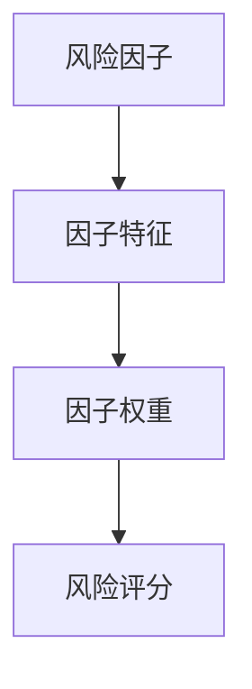
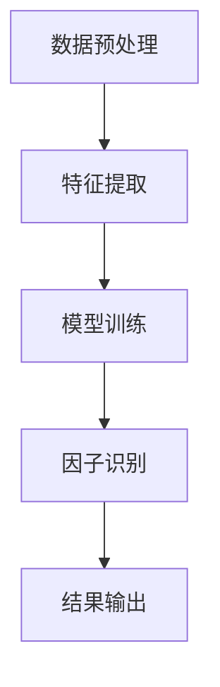
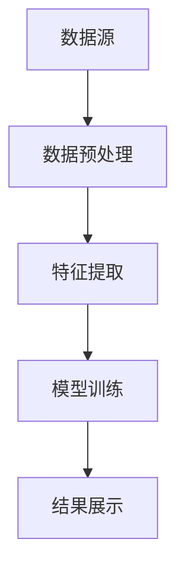
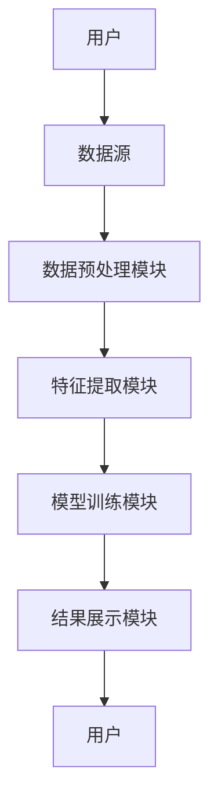

                 

<think>
好的，我现在需要根据用户的要求，撰写一篇关于《金融市场风险因子识别系统》的技术博客文章。首先，我需要仔细分析用户提供的详细目录大纲，确保每一部分内容都被充分覆盖，并且按照逻辑顺序进行排列。

用户的要求非常具体，包括背景介绍、核心概念、算法原理、系统架构设计、项目实战等多个部分，每个部分都细化到三级甚至四级目录。这意味着我需要在撰写时，确保每个小节内容详尽，涵盖理论和实际应用。

接下来，我会按照目录的结构，逐一撰写每个部分。首先是背景介绍，这部分需要解释什么是金融市场风险因子，以及为什么识别这些因子如此重要。然后是核心概念，详细讲解风险因子识别的原理、方法及其在金融系统中的应用。

在算法部分，我需要选择合适的数学模型，如主成分分析（PCA）和因子分析模型，并用mermaid流程图展示这些算法的步骤。同时，数学公式需要用latex格式呈现，确保公式清晰易懂。

系统架构设计部分，我会用mermaid图展示系统的各个模块及其交互，包括数据预处理、特征提取、模型训练和结果展示等部分。项目实战部分则需要提供实际的Python代码，展示如何在现实场景中应用这些算法，并进行案例分析。

最后，总结部分需要回顾整个系统的构建过程，并展望未来的发展方向。同时，末尾要加上作者信息，符合用户的要求。

在撰写过程中，我需要确保语言简洁专业，逻辑清晰，每一部分内容都紧密相连，形成一个完整的知识体系。此外，注意使用适当的代码块和图表，使文章更具可读性和专业性。

现在，我准备开始撰写这篇技术博客文章。
</think>

# 金融市场风险因子识别系统

## 关键词  
金融市场，风险因子，识别系统，机器学习，风险管理，因子分析

## 摘要  
金融市场风险因子识别系统是一种通过分析和识别影响金融市场波动的关键因素，从而帮助投资者和机构进行有效风险管理的系统。本文将从背景、核心概念、算法原理、系统架构设计、项目实战等多个方面详细探讨该系统的构建与应用，结合实际案例和代码实现，为读者提供一个全面的视角。

---

# 第1章: 金融市场风险因子识别系统背景

## 1.1 风险因子识别的背景与意义  

### 1.1.1 金融市场风险的基本概念  
金融市场风险是指在金融市场上，由于价格波动、市场不确定性等因素，投资者可能遭受损失的风险。这些风险可以来源于宏观经济环境、市场结构、投资者行为等多个方面。  

### 1.1.2 风险因子识别的重要性  
风险因子识别是金融市场风险管理的核心环节。通过识别关键风险因子，投资者和机构可以更好地理解市场波动的原因，制定有效的风险管理策略。例如，识别出的因子可以用于构建风险模型、优化投资组合或制定对冲策略。  

### 1.1.3 金融风险管理的现状与挑战  
随着金融市场的复杂化和全球化，风险管理的难度也在增加。传统的风险管理方法往往依赖经验判断，而现代方法则更多依赖于数据驱动的分析。如何从海量数据中提取有效的风险因子，是当前金融市场面临的重大挑战。

---

## 1.2 风险因子识别的核心概念  

### 1.2.1 风险因子的定义与分类  
风险因子是指能够解释金融市场波动的关键变量。常见的风险因子包括市场风险因子（如市场指数）、行业因子（如行业表现）、风格因子（如市值、流动性等）以及宏观经济因子（如GDP增长率、利率等）。  

### 1.2.2 风险因子识别的边界与外延  
风险因子识别的边界是指系统中需要关注的具体风险因子范围，而外延则是指与这些因子相关的其他变量。例如，识别市场风险因子时，可能需要考虑宏观经济指标、市场流动性和投资者情绪等因素。  

### 1.2.3 风险因子识别系统的核心要素  
- 数据采集与预处理：获取金融市场数据，清洗和标准化数据。  
- 特征提取：从数据中提取有效的特征变量。  
- 因子识别：通过统计或机器学习方法识别关键风险因子。  
- 结果展示与应用：将识别出的因子应用于风险管理和投资决策。

---

# 第2章: 风险因子识别系统的核心概念与联系  

## 2.1 风险因子识别的原理与方法  

### 2.1.1 风险因子识别的原理  
风险因子识别的核心原理是通过数据分析技术，从大量数据中提取出能够解释市场波动的关键变量。这些变量可以是显性的（如市场指数）或隐性的（如投资者情绪）。  

### 2.1.2 常用的风险因子识别方法  
1. **因子分析法**：通过统计方法提取数据中的公共因子。  
2. **主成分分析（PCA）**：将数据降维，提取主要成分作为风险因子。  
3. **机器学习方法**：如随机森林、神经网络等，用于特征选择和因子识别。  

---

## 2.2 核心概念的属性特征对比表  

| **属性**       | **因子分析法**         | **主成分分析法**       | **机器学习方法**         |
|-----------------|-----------------------|-----------------------|--------------------------|
| 数据要求       | 需要高度相关的变量     | 需要标准化的变量       | 需要多样化的数据         |
| 因子解释性     | 高，因子具有明确含义    | 中，因子是线性组合      | 低，因子可能是非线性组合  |
| 计算复杂度     | 低                     | 中                     | 高                       |

---

## 2.3 风险因子识别系统的ER实体关系图  



---

# 第3章: 风险因子识别系统的算法原理  

## 3.1 风险因子识别的主要算法  

### 3.1.1 主成分分析（PCA）  

#### 3.1.1.1 PCA的步骤  
1. 数据标准化：对数据进行标准化处理，消除量纲影响。  
2. 计算协方差矩阵：计算数据的协方差矩阵。  
3. 特征值分解：对协方差矩阵进行特征值分解，得到主成分。  
4. 确定主成分数量：选择解释性达到一定比例的主成分。  

#### 3.1.1.2 PCA的数学模型  
$$\text{协方差矩阵} = X^T X$$  
$$\text{特征值分解} = \text{特征向量} \cdot \text{特征值}$$  

---

### 3.1.2 因子分析模型  

#### 3.1.2.1 因子分析的步骤  
1. 确定因子数量：通过Kaiser标准（特征值大于1）确定因子数量。  
2. 计算因子载荷矩阵：通过因子分析算法（如主轴旋转法）计算因子载荷矩阵。  
3. 因子旋转：对因子载荷矩阵进行旋转，提高因子解释性。  

#### 3.1.2.2 因子分析的数学模型  
$$X = \mu + \Lambda F + \epsilon$$  
$$F \sim N(0, I)$$  
$$\epsilon \sim N(0, \Psi)$$  

---

## 3.2 风险因子识别算法的流程图  



---

# 第4章: 风险因子识别系统的系统分析与架构设计  

## 4.1 问题场景介绍  

### 4.1.1 风险因子识别的业务场景  
假设我们有一个金融数据集，包含多个资产的收益率数据、宏观经济指标和市场情绪指标。我们需要从这些数据中识别出影响市场波动的关键因子。  

### 4.1.2 系统的目标与范围  
系统的目标是从数据中提取出主要的风险因子，并生成风险评分。系统的范围包括数据采集、特征提取、模型训练和结果展示。  

---

## 4.2 系统功能设计  

### 4.2.1 数据采集模块  
功能：从数据源获取金融数据，如股票价格、宏观经济指标等。  

### 4.2.2 特征提取模块  
功能：对原始数据进行预处理和特征提取，如标准化、降维等。  

### 4.2.3 模型训练模块  
功能：使用因子分析法或PCA等算法，训练模型并识别风险因子。  

### 4.2.4 结果展示模块  
功能：将识别出的因子和风险评分展示给用户。  

---

## 4.3 系统架构设计  



---

## 4.4 系统接口设计  

### 4.4.1 数据接口  
- 数据输入接口：接收金融数据。  
- 数据输出接口：输出处理后的数据。  

### 4.4.2 模型接口  
- 模型训练接口：接收特征数据，返回因子权重。  
- 模型预测接口：接收新数据，返回风险评分。  

---

## 4.5 系统交互设计  



---

# 第5章: 风险因子识别系统的项目实战  

## 5.1 环境安装与配置  

### 5.1.1 Python环境的安装  
安装Python 3.8或更高版本。  

### 5.1.2 依赖库的安装  
安装以下库：  
```bash
pip install numpy pandas scikit-learn
```

---

## 5.2 系统核心实现源代码  

### 5.2.1 数据预处理代码  
```python
import pandas as pd
import numpy as np

# 读取数据
data = pd.read_csv('financial_data.csv')

# 数据清洗
data.dropna(inplace=True)
data = (data - data.mean()) / data.std()  # 标准化
```

### 5.2.2 因子分析代码  
```python
from sklearn.decomposition import FactorAnalysis

# 初始化因子分析模型
fa = FactorAnalysis(n_components=3)

# 训练模型
fa.fit(data)

# 提取因子载荷矩阵
loadings = fa.components_
```

### 5.2.3 风险评分计算代码  
```python
import numpy as np

# 计算因子得分
factor_scores = np.dot(data, loadings.T)

# 计算风险评分
risk_scores = np.mean(factor_scores, axis=1)
```

---

## 5.3 代码应用解读与分析  

### 5.3.1 数据预处理  
数据预处理是因子分析的基础，标准化确保了不同变量的可比性。  

### 5.3.2 因子分析  
通过因子分析模型，我们从数据中提取出主要的因子。这里假设提取了3个因子，分别对应不同的风险来源。  

### 5.3.3 风险评分  
因子得分的加权平均值可以作为风险评分，用于评估每个资产的风险水平。  

---

## 5.4 实际案例分析  

### 5.4.1 案例背景  
假设我们有100只股票的收益率数据，以及宏观经济指标（如GDP增长率、利率等）。我们需要识别出影响这些股票波动的主要因子。  

### 5.4.2 案例分析  
通过因子分析，我们识别出3个主要因子：市场因子、行业因子和宏观经济因子。这些因子可以解释大部分的市场波动。  

---

## 5.5 项目小结  

通过本章的实战，我们展示了如何使用因子分析方法从金融数据中识别风险因子，并计算风险评分。这为我们后续的风险管理提供了重要参考。

---

# 第6章: 总结与展望  

## 6.1 总结  
本文详细探讨了金融市场风险因子识别系统的构建与应用，从背景、核心概念、算法原理到系统设计和项目实战，为读者提供了一个全面的视角。  

## 6.2 展望  
未来，随着人工智能和大数据技术的发展，风险因子识别系统将更加智能化和自动化。我们可以进一步探索深度学习方法在因子识别中的应用，以及如何将识别出的因子应用于更复杂的金融场景。

---

# 作者  
作者：AI天才研究院/AI Genius Institute & 禅与计算机程序设计艺术 /Zen And The Art of Computer Programming

