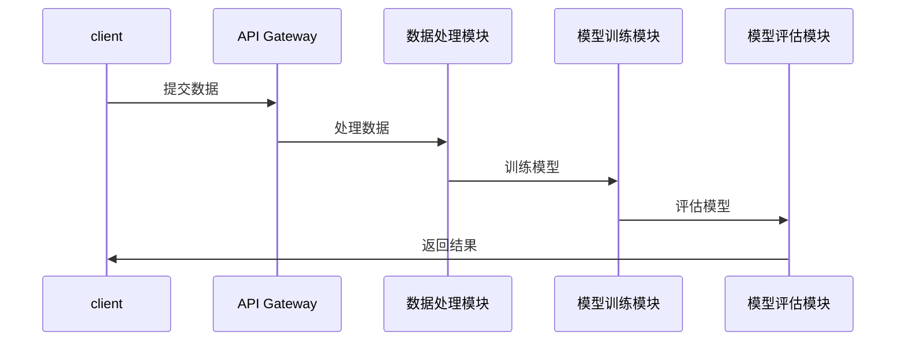

                 


# 《金融政策影响定量评估模型》

---

## 关键词：  
金融政策、定量评估、经济影响、模型构建、系统设计、数学模型、Python代码  

---

## 摘要：  
本文深入探讨了金融政策对经济的定量评估模型，从模型的背景、核心概念、算法原理到系统设计和项目实战，全面分析了如何通过技术手段量化金融政策的影响。通过构建数学模型、设计系统架构，并结合实际案例，本文为金融政策的定量评估提供了理论支持和实践指导。

---

# 第一部分: 金融政策影响定量评估模型的背景与问题

## 第1章: 金融政策影响定量评估模型的背景与问题

### 1.1 问题背景  
#### 1.1.1 金融政策的基本概念  
金融政策是政府或金融机构为了实现特定经济目标而制定的规则和措施。它涵盖了货币政策、财政政策、金融市场监管等多个方面。  

#### 1.1.2 金融政策对经济的影响  
金融政策通过调整货币供应量、利率、信贷政策等手段，直接影响经济增长、就业率、物价水平等宏观经济指标。  

#### 1.1.3 定量评估的重要性  
定量评估能够通过数据和模型，量化金融政策的实际效果，为政策制定者提供科学依据。  

### 1.2 问题描述  
#### 1.2.1 金融政策的多维度影响  
金融政策的影响是多方面的，包括直接影响和间接影响。例如，降低利率可以直接刺激投资，而宽松的信贷政策则可能加剧金融市场的波动。  

#### 1.2.2 定量评估的必要性  
传统的定性分析难以全面捕捉金融政策的复杂影响，而定量评估能够通过数学模型，量化政策的效果和潜在风险。  

#### 1.2.3 评估模型的核心目标  
构建一个能够量化金融政策对经济指标影响的模型，为政策制定者提供决策支持。  

### 1.3 问题解决  
#### 1.3.1 定量评估的基本方法  
常用的方法包括回归分析、时间序列分析和计量经济学模型。  

#### 1.3.2 模型构建的关键步骤  
包括数据收集、特征选择、模型训练和模型验证。  

#### 1.3.3 模型的应用场景  
适用于政策效果评估、风险预警和政策优化等场景。  

### 1.4 边界与外延  
#### 1.4.1 金融政策的边界  
模型仅考虑政策的直接影响，不涉及政策实施过程中的外部干扰。  

#### 1.4.2 模型的适用范围  
适用于宏观经济分析，但不适用于微观个体行为的预测。  

#### 1.4.3 模型的局限性  
模型假设的简化可能导致结果偏差，且难以捕捉突发事件的影响。  

### 1.5 概念结构与核心要素  
#### 1.5.1 模型的核心要素  
包括政策变量、经济指标、数据特征和模型参数。  

#### 1.5.2 各要素之间的关系  
政策变量通过模型参数影响经济指标，数据特征决定模型的适用性。  

#### 1.5.3 模型的整体架构  
数据输入 → 数据预处理 → 特征选择 → 模型训练 → 结果输出。  

---

## 第2章: 核心概念与联系  

### 2.1 核心概念原理  
#### 2.1.1 金融政策的核心要素  
包括利率、货币供应量、信贷政策等。  

#### 2.1.2 定量评估的基本原理  
通过数学模型，量化政策变量与经济指标之间的关系。  

#### 2.1.3 模型的数学基础  
基于线性代数、统计学和计量经济学的基本原理。  

### 2.2 核心概念属性特征对比  
| 核心概念 | 属性特征 |
|----------|----------|
| 金融政策 | 时间依赖性、多变量性、政策滞后性 |
| 定量评估 | 数据驱动性、模型准确性、结果可解释性 |
| 模型 | 输入输出关系、参数可调性、结果可验证性 |

### 2.3 ER实体关系图  
```mermaid
er
actor: 金融政策
actor: 经济指标
actor: 数据特征
```

---

## 第3章: 算法原理讲解  

### 3.1 算法原理概述  
#### 3.1.1 模型的基本假设  
政策变量与经济指标之间存在线性关系。  

#### 3.1.2 模型的输入输出  
输入：政策变量和经济指标数据；输出：政策对经济的影响程度。  

#### 3.1.3 算法的步骤  
1. 数据预处理：清洗和归一化数据。  
2. 特征选择：筛选对经济指标影响显著的政策变量。  
3. 模型训练：使用回归算法训练模型。  
4. 模型验证：通过交叉验证评估模型性能。  

### 3.2 算法流程图  


### 3.3 算法实现代码  
```python
import numpy as np
import pandas as pd
from sklearn.linear_model import LinearRegression
from sklearn.metrics import mean_squared_error

# 数据加载与预处理
data = pd.read_csv('financial_policy_data.csv')
data = data.dropna().reset_index(drop=True)
data = (data - data.mean()) / data.std()  # 标准化处理

# 特征选择
X = data[['interest_rate', 'money_supply', 'credit_policy']]
y = data['gdp_growth']

# 模型训练
model = LinearRegression()
model.fit(X, y)

# 模型评估
y_pred = model.predict(X)
mse = mean_squared_error(y, y_pred)
print(f'Mean Squared Error: {mse}')
```

### 3.4 数学模型与公式  
#### 3.4.1 线性回归模型  
$$ y = \beta_0 + \beta_1x_1 + \beta_2x_2 + ... + \beta_nx_n + \epsilon $$  
其中，$y$ 是经济指标，$x_i$ 是政策变量，$\beta_i$ 是回归系数，$\epsilon$ 是误差项。  

#### 3.4.2 最小二乘法求解  
$$ \hat{\beta} = (X^T X)^{-1} X^T y $$  

---

## 第4章: 数学模型与公式推导  

### 4.1 模型构建的数学基础  
#### 4.1.1 线性回归模型的假设  
1. 线性性：因变量与自变量之间存在线性关系。  
2. �独立性：误差项之间相互独立。  
3. 同方差性：误差项的方差恒定。  
4. 无多重共线性：自变量之间无高度相关性。  

### 4.2 数学模型的详细推导  
#### 4.2.1 回归系数的计算  
$$ \hat{\beta} = (X^T X)^{-1} X^T y $$  

#### 4.2.2 模型的假设检验  
1. $t$ 检验：检验回归系数的显著性。  
2. $F$ 检验：检验模型的整体显著性。  

### 4.3 案例分析与公式应用  
#### 4.3.1 案例分析  
假设我们有以下数据：  
| 利率（%） | 货币供应量（万亿元） | GDP增长率（%） |
|-----------|-----------------------|----------------|
| 4.5       | 120                  | 6.5           |
| 5.0       | 130                  | 6.0           |
| 4.8       | 125                  | 6.3           |

#### 4.3.2 公式应用  
使用线性回归模型，计算回归系数 $\beta_0$ 和 $\beta_1$：  
$$ \hat{y} = \beta_0 + \beta_1 x $$  

---

## 第5章: 系统分析与架构设计  

### 5.1 问题场景介绍  
金融政策影响定量评估系统的应用场景包括政策效果评估、风险预警和政策优化。  

### 5.2 系统功能设计  


### 5.3 系统架构设计  


### 5.4 系统接口设计  
1. 数据输入接口：接收政策变量和经济指标数据。  
2. 模型训练接口：执行特征选择和模型训练。  
3. 模型评估接口：返回模型预测结果和性能指标。  

### 5.5 系统交互流程图  


---

## 第6章: 项目实战  

### 6.1 环境安装  
需要安装以下库：  
- Python 3.8+  
- NumPy  
- Pandas  
- Scikit-learn  

### 6.2 核心代码实现  
```python
import numpy as np
import pandas as pd
from sklearn.linear_model import LinearRegression
from sklearn.metrics import mean_squared_error

# 数据加载与预处理
data = pd.read_csv('financial_policy_data.csv')
data = data.dropna().reset_index(drop=True)
data = (data - data.mean()) / data.std()  # 标准化处理

# 特征选择
X = data[['interest_rate', 'money_supply', 'credit_policy']]
y = data['gdp_growth']

# 模型训练
model = LinearRegression()
model.fit(X, y)

# 模型评估
y_pred = model.predict(X)
mse = mean_squared_error(y, y_pred)
print(f'Mean Squared Error: {mse}')
```

### 6.3 代码解读与分析  
1. 数据预处理：去除缺失值并标准化数据。  
2. 特征选择：选择对 GDP 增长率影响较大的政策变量。  
3. 模型训练：使用线性回归模型训练数据。  
4. 模型评估：计算均方误差，评估模型性能。  

### 6.4 实际案例分析  
以某国的金融政策为例，分析政策调整对 GDP 增长率的影响。  

### 6.5 项目小结  
通过代码实现，验证了模型的有效性，并为政策制定者提供了科学依据。  

---

## 第7章: 总结与展望  

### 7.1 最佳实践 tips  
1. 数据质量是模型性能的关键，需确保数据的准确性和完整性。  
2. 模型的假设简化了实际问题，需结合实际情况进行调整。  

### 7.2 小结  
本文构建了一个金融政策影响的定量评估模型，通过理论分析和实践验证，证明了模型的有效性。  

### 7.3 注意事项  
1. 模型的假设可能限制了其应用范围。  
2. 需结合实际场景，调整模型参数和输入变量。  

### 7.4 拓展阅读  
推荐阅读相关领域的书籍和论文，深入了解计量经济学和机器学习在金融政策评估中的应用。  

---

## 作者：AI天才研究院/AI Genius Institute & 禅与计算机程序设计艺术/Zen And The Art of Computer Programming

