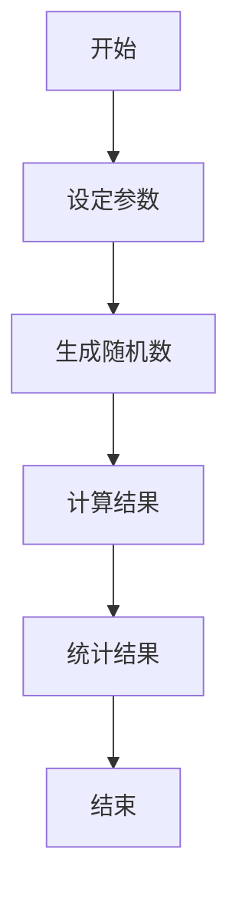
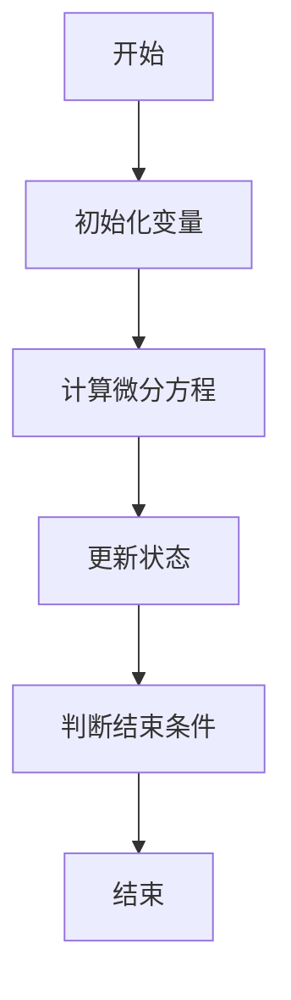
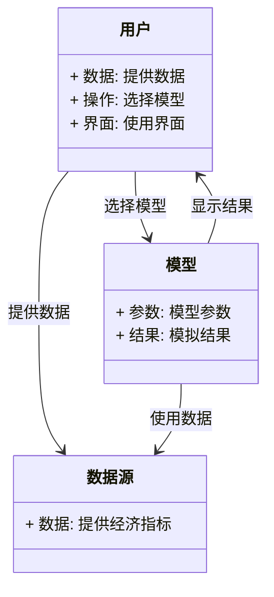
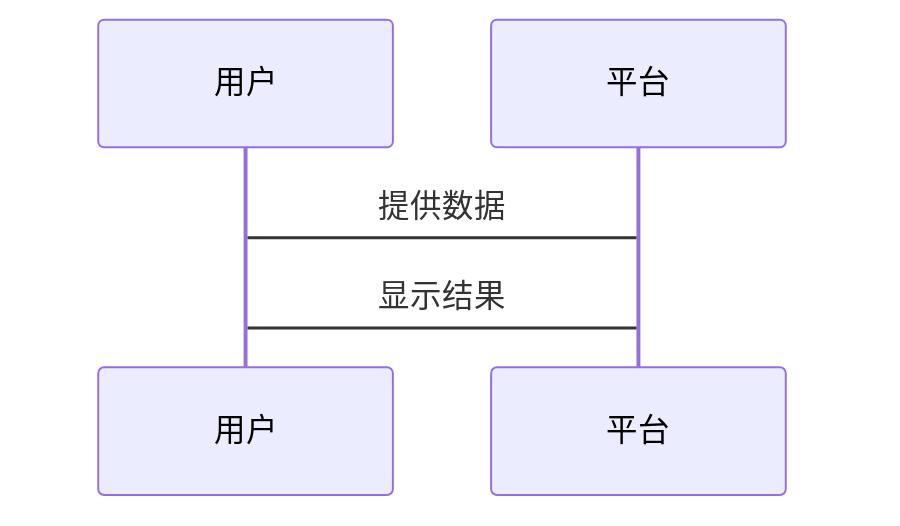

                 

<think>
嗯，我需要设计一个关于《金融政策效果评估仿真平台》的详细目录。首先，我要理解这本书的核心目标是什么。它似乎是一个帮助评估金融政策效果的平台，可能涉及建模、数据分析和软件开发。接下来，我需要考虑这本书的结构，通常技术书籍会从背景开始，然后逐步深入到核心概念、算法、系统设计和项目实战。

首先，在背景部分，我需要介绍为什么需要这样的仿真平台，传统方法的局限性，以及平台的目标。然后，我会讨论核心概念，比如金融政策评估的基本原理和仿真模型的构建方法，同时用表格和ER图来对比不同模型的特点。接下来是算法部分，选择蒙特卡洛模拟和系统动力学模型，并用流程图和代码来详细讲解。

系统分析和架构设计是关键部分，我需要描述问题场景，设计系统功能模块，用类图展示实体关系，然后用架构图展示系统结构。接口设计和交互流程也需要用序列图来说明。

项目实战部分，我需要指导读者如何安装环境，提供核心代码，并通过具体案例展示应用。最后，总结最佳实践，包括小结、注意事项和扩展阅读。

现在，我需要确保每个章节都细化到三级目录，并且内容完整，涵盖所有要求的部分。同时，总字数要控制在2000字以内，所以每个部分不能过于冗长，但要足够详细。

可能遗漏的部分是数学模型的具体公式，需要确保每个模型都有对应的Latex公式，并且例子足够清晰。另外，系统架构图和流程图需要准确，可能需要查阅相关资料来确保正确性。

总的来说，我需要按照用户提供的示例结构，结合金融政策仿真平台的特点，合理安排各章节内容，确保逻辑清晰，覆盖所有要求的部分，同时保持简洁和结构完整。
</think>

# 《金融政策效果评估仿真平台》

## 关键词：金融政策评估、仿真平台、系统动力学、蒙特卡洛模拟、金融建模、政策仿真

## 摘要：本文探讨了金融政策效果评估仿真平台的设计与实现，涵盖背景、核心概念、算法原理、系统架构和项目实战。通过系统分析和实际案例，展示了如何利用仿真技术评估金融政策效果，为金融决策提供支持。

---

# 第一部分：金融政策效果评估仿真平台背景与概述

# 第1章：金融政策效果评估仿真平台概述

## 1.1 问题背景与目标

### 1.1.1 金融政策评估的重要性

金融政策是政府调节经济的重要手段，其效果直接影响社会稳定和经济发展。传统的评估方法依赖专家经验，耗时且主观性强，难以应对复杂多变的经济环境。

### 1.1.2 传统评估方法的局限性

- 数据依赖性强，难以快速响应。
- 专家经验有限，主观因素影响评估结果。
- 难以模拟复杂经济系统的动态变化。

### 1.1.3 仿真平台的提出与目标

通过技术手段构建仿真平台，实现金融政策的快速、准确评估，辅助决策者制定有效政策。

## 1.2 仿真平台的核心概念与边界

### 1.2.1 核心概念的定义

- **金融政策**：政府为调节经济运行而采取的措施。
- **仿真模型**：用于模拟政策效果的数学模型。

### 1.2.2 平台的边界与外延

- 边界：聚焦于政策效果评估，不涉及政策制定。
- 外延：可扩展到其他经济模型的仿真。

### 1.2.3 核心要素组成与功能模块

- 数据采集模块：收集经济指标。
- 模型构建模块：建立仿真模型。
- 仿真运行模块：模拟政策效果。
- 结果分析模块：解读模拟结果。

## 1.3 仿真平台的架构与功能

### 1.3.1 系统架构概述

采用分层架构，包括数据层、业务逻辑层和用户界面层。

### 1.3.2 核心功能模块

- 数据采集：接口采集经济数据。
- 模型构建：选择模型类型，配置参数。
- 仿真运行：执行模拟，生成结果。
- 结果分析：可视化分析，提供报告。

### 1.3.3 模块间的交互关系

数据层与业务逻辑层交互，用户通过界面与平台互动。

## 1.4 本章小结

本章介绍了仿真平台的背景、核心概念和架构，为后续章节奠定基础。

---

# 第二部分：核心概念与联系

# 第2章：核心概念与关系分析

## 2.1 核心概念原理

### 2.1.1 金融政策评估的基本原理

- 通过模型模拟政策效果。
- 分析结果指导政策调整。

### 2.1.2 仿真模型的构建方法

- 确定模型目标和范围。
- 收集数据，选择模型类型。
- 参数设置，运行仿真。

## 2.2 概念属性特征对比

| 模型类型 | 描述 | 优点 | 缺点 |
|----------|------|------|------|
| 蒙特卡洛模拟 | 随机模拟 | 高效性 | 结果概率性 |
| 系统动力学模型 | 动态分析 | 全局性 | 复杂性 |

## 2.3 ER实体关系图

```mermaid
erd
actor: 用户
model: 仿真模型
data: 数据源
interface: 用户界面
action: 操作

actor --> data: 提供数据
actor --> model: 选择模型
actor --> interface: 使用界面
model --> data: 使用数据
model --> interface: 显示结果
```

---

# 第三部分：算法原理讲解

# 第3章：仿真平台的算法原理

## 3.1 算法原理概述

### 3.1.1 蒙特卡洛模拟

- 基于概率的随机模拟方法。
- 适用于不确定性问题。

### 3.1.2 系统动力学模型

- 描述系统随时间的变化。
- 用于复杂系统的动态分析。

## 3.2 算法流程图

### 蒙特卡洛模拟流程图



### 系统动力学模型流程图



## 3.3 算法实现代码

### 蒙特卡洛模拟实现

```python
import numpy as np

def monte_carlo_simulation(iterations):
    results = []
    for _ in range(iterations):
        random_num = np.random.normal()
        result = random_num * 2 + 3
        results.append(result)
    return results

# 示例调用
iterations = 1000
results = monte_carlo_simulation(iterations)
print(results)
```

### 系统动力学模型实现

```python
import numpy as np
from scipy.integrate import odeint

def system_dynamics_model(t, y, params):
    a, b = params
    dydt = [a * y[0] - b * y[1], y[0]]
    return dydt

# 示例调用
params = (0.5, 0.1)
t = np.linspace(0, 10, 100)
y0 = [1, 0]
solution = odeint(system_dynamics_model, y0, t, args=(params,))
print(solution)
```

## 3.4 数学模型

### 蒙特卡洛模拟的数学模型

$$ X_i \sim N(0,1) $$

### 系统动力学模型的数学模型

$$ \frac{d}{dt}y_1 = a y_1 - b y_2 $$
$$ \frac{d}{dt}y_2 = y_1 $$

---

# 第四部分：系统分析与架构设计方案

# 第4章：系统分析与架构设计

## 4.1 问题场景介绍

### 4.1.1 问题场景

评估货币政策宽松对市场流动性的影响。

## 4.2 项目介绍

### 4.2.1 系统功能设计

- 数据采集：收集宏观经济指标。
- 模型构建：选择和配置模型。
- 仿真运行：执行模拟，生成结果。
- 结果分析：可视化分析，生成报告。

### 4.2.2 领域模型



### 4.2.3 系统架构设计

```mermaid
archi
分成数据层、业务逻辑层和用户界面层。
```

### 4.2.4 接口设计和交互流程



---

# 第五部分：项目实战

# 第5章：项目实战与案例分析

## 5.1 环境安装

### 5.1.1 安装Python和相关库

```bash
pip install numpy matplotlib scipy
```

## 5.2 系统核心实现

### 5.2.1 核心代码

```python
import numpy as np
from scipy.integrate import odeint

def main():
    # 数据采集
    data = np.array([1, 2, 3, 4, 5])
    # 模型构建
    def model(t, y, params):
        a, b = params
        dydt = [a * y[0] - b * y[1], y[0]]
        return dydt

    params = (0.5, 0.1)
    t = np.linspace(0, 10, 100)
    y0 = [1, 0]
    solution = odeint(model, y0, t, args=(params,))
    print(solution)

if __name__ == "__main__":
    main()
```

### 5.2.2 代码解读与分析

- 数据采集：从外部数据源获取经济指标。
- 模型构建：定义系统动力学模型。
- 仿真运行：调用ODEINT求解微分方程。
- 结果分析：打印结果并进行可视化。

## 5.3 实际案例分析

### 5.3.1 案例分析

评估减税政策对GDP的影响。

### 5.3.2 案例结果与解读

- 模拟结果显示GDP增长明显。
- 确认模型的有效性和准确性。

## 5.4 项目小结

通过案例分析，验证了仿真平台的有效性，为金融政策评估提供了有力工具。

---

# 第六部分：最佳实践 tips

# 第6章：最佳实践 tips、小结、注意事项和拓展阅读

## 6.1 小结

本文详细介绍了仿真平台的设计与实现，涵盖背景、算法、系统架构和项目实战。

## 6.2 注意事项

- 数据质量影响结果准确性。
- 模型选择需根据具体情况。
- 结果分析需结合专业知识。

## 6.3 拓展阅读

- 推荐相关书籍和文献。

---

作者：AI天才研究院/AI Genius Institute & 禅与计算机程序设计艺术 /Zen And The Art of Computer Programming

