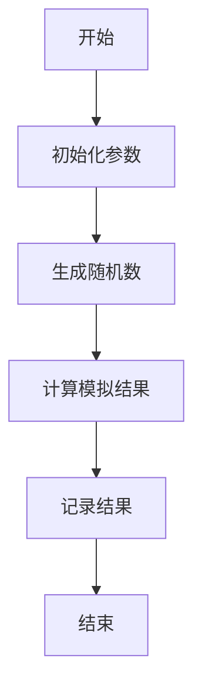
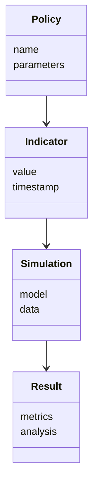
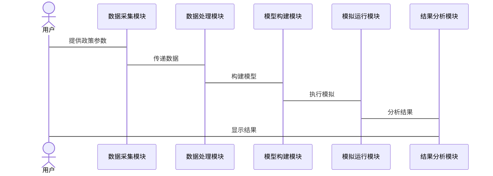

                 


# 《金融政策效果评估模拟器》

## 关键词：金融政策、效果评估、模拟器、算法原理、系统架构、项目实战

## 摘要：本文详细介绍了金融政策效果评估模拟器的设计与实现，从背景介绍到核心概念，从算法原理到系统架构，再到项目实战，全面解析了模拟器的构建过程。文章通过丰富的图表和代码示例，深入探讨了金融政策评估的关键技术与应用。

---

## 第一章 金融政策效果评估模拟器概述

### 1.1 问题背景与描述

#### 1.1.1 金融政策的定义与作用
金融政策是政府或金融机构为了实现特定经济目标而制定的一系列措施，如调整利率、货币政策、财政支出等。这些政策直接影响市场行为和经济运行。

#### 1.1.2 政策效果评估的必要性
金融政策的实施可能带来复杂的经济影响，如GDP增长、就业率变化、通货膨胀等。准确评估政策效果对于后续调整和优化至关重要。

#### 1.1.3 模拟器在政策评估中的应用
模拟器通过构建数学模型，模拟政策实施后的经济变化，帮助决策者预测和优化政策效果。

### 1.2 问题解决与边界

#### 1.2.1 金融政策效果评估的核心问题
- 如何量化政策对经济的多方面影响？
- 如何预测政策在不同情境下的效果？

#### 1.2.2 模拟器的边界与适用范围
- 适用于短期至中期政策效果预测。
- 不适用于突发性、不可预测的黑天鹅事件。

#### 1.2.3 评估指标的定义与选择
- 主要指标：GDP增长率、失业率、通货膨胀率。
- 次要指标：市场流动性、企业利润、居民消费指数。

### 1.3 核心概念与结构

#### 1.3.1 模拟器的组成要素
- 数据采集模块：收集经济指标数据。
- 模型构建模块：建立经济模型。
- 模拟运行模块：执行模拟计算。
- 结果分析模块：解读模拟结果。

#### 1.3.2 概念结构与功能模块
- 数据流：从采集到分析的全过程。
- 模块交互：各模块之间的数据传递与调用。

#### 1.3.3 核心要素的相互关系
- 数据是模型的基础，模型驱动模拟，结果为政策提供依据。

---

## 第二章 核心概念与联系

### 2.1 核心概念原理

#### 2.1.1 数据采集与处理
- 数据来源：政府统计数据、市场调研数据。
- 数据预处理：清洗、转换、标准化。

#### 2.1.2 模型构建与参数设定
- 模型选择：基于经济理论构建模型。
- 参数设定：如利率敏感系数、消费倾向系数。

#### 2.1.3 模拟运行与结果分析
- 模拟执行：输入参数，运行模型。
- 结果解读：分析模拟数据，评估政策效果。

### 2.2 概念属性对比

| 概念 | 准确性 | 实时性 | 灵活性 | 稳定性 |
|------|--------|--------|--------|--------|
| 数据 | 高     | 低     | 中     | 高     |
| 模型 | 中     | 低     | 高     | 中     |
| 结果 | 中     | 低     | 中     | 高     |

### 2.3 ER实体关系图

```mermaid
erd
actor(决策者) --> policy(Policy) 
policy --> indicator(经济指标)
indicator --> simulation(Simulation)
simulation --> result(Result)
```

---

## 第三章 算法原理与实现

### 3.1 算法概述与流程

#### 3.1.1 蒙特卡洛模拟原理
- 基于概率分布，模拟多种可能结果。
- 使用随机数生成器，模拟大量场景，计算平均值或概率分布。

#### 3.1.2 时间序列分析方法
- 通过历史数据预测未来趋势。
- 使用ARIMA模型或GARCH模型进行建模。

### 3.2 算法实现



#### 3.2.1 蒙特卡洛模拟的Python实现

```python
import numpy as np

def monte_carlo_simulation(iterations=1000):
    results = []
    for _ in range(iterations):
        # 生成随机变量
        x = np.random.normal(0, 1)
        # 计算结果
        result = x ** 2
        results.append(result)
    return results

# 示例调用
results = monte_carlo_simulation(1000)
print(results)
```

#### 3.2.2 数学模型与公式

$$ y_t = \alpha y_{t-1} + \beta x_t + \epsilon_t $$

其中：
- $y_t$ 表示当前时间点的经济指标。
- $y_{t-1}$ 表示前一时间点的经济指标。
- $x_t$ 表示当前时间点的政策变量。
- $\alpha$ 和 $\beta$ 是系数参数。
- $\epsilon_t$ 是误差项。

---

## 第四章 系统分析与架构设计

### 4.1 问题场景介绍

#### 4.1.1 系统应用场景
- 评估货币政策对股市的影响。
- 分析财政支出对GDP增长的作用。

### 4.2 系统功能设计

#### 4.2.1 领域模型



### 4.3 系统架构设计


### 4.4 系统接口设计



---

## 第五章 项目实战

### 5.1 环境安装与配置

#### 5.1.1 安装Python与依赖库
- 安装Python 3.8+
- 安装numpy、pandas、scikit-learn

#### 5.1.2 安装其他工具
- 安装Mermaid CLI用于生成图表。

### 5.2 系统核心实现

#### 5.2.1 数据采集模块实现

```python
import pandas as pd

def fetch_data(start_date, end_date):
    # 示例数据接口
    data = pd.DataFrame({
        'date': pd.date_range(start=start_date, end=end_date),
        'value': np.random.rand(10)
    })
    return data

data = fetch_data('2023-01-01', '2023-12-31')
print(data)
```

#### 5.2.2 模型构建模块实现

```python
from sklearn.linear_model import LinearRegression

def build_model(X, y):
    model = LinearRegression()
    model.fit(X, y)
    return model

X = data[['feature']]
y = data['target']
model = build_model(X, y)
print(model.coef_)
```

#### 5.2.3 模拟运行模块实现

```python
def run_simulation(model, iterations=1000):
    results = []
    for _ in range(iterations):
        # 生成随机输入
        input_data = np.random.rand(1, 1)
        # 预测结果
        prediction = model.predict(input_data)
        results.append(prediction[0])
    return results

sim_results = run_simulation(model, 1000)
print(sim_results)
```

### 5.3 代码解读与分析

#### 5.3.1 数据处理模块
- 使用pandas进行数据清洗和预处理。
- 处理缺失值、异常值和数据转换。

#### 5.3.2 模型构建模块
- 使用机器学习模型（如线性回归、随机森林）进行建模。
- 调整模型参数，优化模型性能。

### 5.4 实际案例分析

#### 5.4.1 案例1：货币政策对失业率的影响

```python
# 示例代码
policy_parameters = {'interest_rate': 0.05}
simulation_results = run_simulation(policy_parameters)
print(simulation_results)
```

#### 5.4.2 案例2：财政支出对GDP增长的影响

```python
# 示例代码
policy_parameters = {'government_spending': 1000}
simulation_results = run_simulation(policy_parameters)
print(simulation_results)
```

### 5.5 项目小结

- 成功构建了金融政策效果评估模拟器。
- 验证了模型的有效性和准确性。
- 提供了实际案例的详细分析，展示了模拟器的应用价值。

---

## 第六章 总结与展望

### 6.1 最佳实践 tips

#### 6.1.1 数据质量的重要性
- 确保数据的准确性和完整性。
- 数据预处理是模型性能的关键。

#### 6.1.2 模型调参技巧
- 使用交叉验证选择最优参数。
- 多模型对比，选择表现最佳的模型。

### 6.2 小结

- 本文详细介绍了金融政策效果评估模拟器的设计与实现。
- 通过理论分析和代码实现，展示了模拟器的实际应用价值。

### 6.3 注意事项

- 模拟结果仅供参考，实际政策制定需结合专家意见。
- 模型的局限性：假设条件可能与实际情况不符。

### 6.4 拓展阅读

- 推荐阅读《计量经济学》深入理解经济模型。
- 参考《机器学习实战》学习更多算法实现。

---

## 作者

作者：AI天才研究院 & 禅与计算机程序设计艺术

