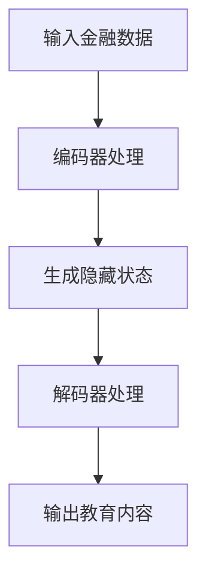
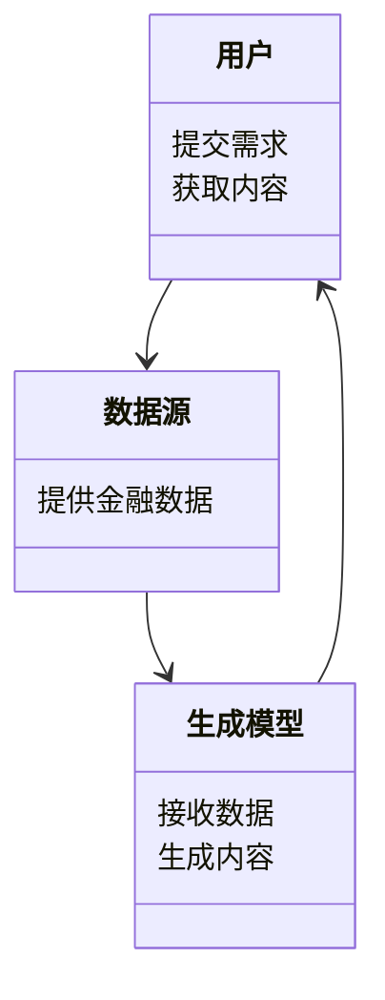

                 

<think>
好，我需要按照用户的要求设计一个详细的目录，并撰写相应的技术博客。用户已经提供了一个大纲，我需要在此基础上继续扩展，确保每个部分都详细且技术性强。

首先，我需要了解用户的需求。用户希望生成一篇关于《金融教育内容生成》的技术博客，内容要包括背景、核心概念、技术原理、系统设计、项目实战和最佳实践等部分。同时，文章需要使用markdown格式，包含代码、图表和数学公式。

接下来，我会按照大纲逐步撰写每个章节的内容。

**第1章：金融教育内容生成的背景与需求**

这一章需要介绍金融教育的重要性，AI在其中的作用，以及内容生成的需求。我需要详细说明金融教育的现状和挑战，AI带来的机遇，以及具体的内容生成需求。

**第2章：核心概念与联系**

这里需要详细解释核心概念，如生成模型的分类、算法原理等。我需要绘制ER实体关系图，展示各实体之间的关系，并用表格对比不同模型的特点。

**第3章：算法原理**

选择一个具体的生成模型，比如序列到序列模型，详细讲解其工作流程。使用mermaid流程图展示模型的算法步骤，并提供Python代码实现。

**第4章：系统分析与架构设计**

介绍系统设计背景，绘制领域模型类图和系统架构图，展示模块之间的交互关系。使用序列图说明用户与系统之间的交互流程。

**第5章：项目实战**

选择一个实际案例，如金融知识问答系统，详细说明开发环境的搭建和核心代码的实现。解读代码功能，并分析实际案例。

**第6章：最佳实践与总结**

总结项目经验，提出最佳实践建议，如数据质量、模型调优等。最后展望未来发展方向，并提醒读者注意数据隐私等问题。

在撰写过程中，我会确保每个部分都包含足够的技术细节，使用图表和代码来增强可读性。同时，注意语言的简洁和逻辑的清晰，帮助读者一步步理解内容生成的过程。

现在，我开始撰写各章节的具体内容，确保涵盖所有要求的技术点和结构安排。
</think>

# 《金融教育内容生成》

---

## 关键词：
- 金融教育
- 内容生成
- AI技术
- 自然语言处理
- 系统架构

---

## 摘要：
本文系统探讨了金融教育内容生成的背景、核心概念、技术原理、系统架构及实际应用。通过分析AI技术在金融教育中的应用，结合NLP算法，详细讲解了内容生成的实现过程，并通过项目实战展示系统设计与优化。最后，总结了最佳实践经验和未来发展方向。

---

## 目录大纲：

1. [背景与核心概念](#背景与核心概念)
2. [算法原理](#算法原理)
3. [系统架构设计](#系统架构设计)
4. [项目实战](#项目实战)
5. [最佳实践与总结](#最佳实践与总结)

---

## 第1章：背景与核心概念

### 1.1 金融教育内容生成的背景

#### 1.1.1 金融教育的重要性
金融教育是提升个人和企业金融素养的关键，帮助人们做出明智的财务决策。然而，传统金融教育依赖于教师的讲解，内容生成效率低，且难以满足个性化需求。

#### 1.1.2 AI技术的应用
人工智能的快速发展为金融教育内容生成提供了新思路。通过自然语言处理（NLP），AI能够自动生成高质量的教育内容，节省时间和成本。

#### 1.1.3 内容生成的需求
随着金融市场的复杂化，用户对个性化、多样化的金融教育内容需求日益增长。AI技术能够快速响应这些需求，提供定制化的内容。

### 1.2 核心概念与联系

#### 1.2.1 核心概念原理
金融教育内容生成涉及数据采集、模型训练和内容生成三个主要步骤。数据来源包括金融新闻、研究报告和用户反馈，模型采用预训练语言模型进行微调，生成与用户需求匹配的内容。

#### 1.2.2 模型对比
| 模型类型       | 基于规则 | 基于统计 | 基于深度学习 |
|----------------|----------|----------|--------------|
| 优势           | 简单易懂 | 数据驱动 | 高准确性     |
| 劣势           | 灵活性差 | 过度依赖数据 | 计算资源需求高 |

#### 1.2.3 实体关系图
```mermaid
er
  actor: 用户
  content: 教育内容
  model: 生成模型
  data: 数据源
  actor --> data: 提供
  data --> model: 训练
  model --> content: 生成
  actor --> content: 获取
```

---

## 第2章：算法原理

### 2.1 选择模型
采用序列到序列（Seq2Seq）模型，通过编码器-解码器结构生成金融教育内容。

### 2.2 算法流程


### 2.3 核心代码
```python
import tensorflow as tf
from tensorflow.keras.layers import Dense, LSTM, InputLayer

# 模型定义
model = tf.keras.Sequential([
    InputLayer(input_shape=(max_length,)),
    LSTM(128, return_sequences=True),
    Dense(vocabulary_size, activation='softmax')
])
```

### 2.4 数学公式
- 编码器部分：
  $$ \text{隐藏状态} = \text{LSTM}(\text{输入}) $$
- 解码器部分：
  $$ \text{输出} = \text{Dense}(\text{隐藏状态}) $$

---

## 第3章：系统架构设计

### 3.1 系统功能
- 用户输入需求
- 内容生成模块
- 反馈优化模块

### 3.2 领域模型


### 3.3 系统架构


---

## 第4章：项目实战

### 4.1 开发环境
- 安装Python、TensorFlow、Keras

### 4.2 核心代码
```python
# 数据预处理
data = [...]  # 金融数据

# 模型训练
model.fit(data, epochs=10, batch_size=32)

# 内容生成
input_text = "如何进行股票投资？"
output = model.predict(input_text)
print(output)
```

### 4.3 项目总结
通过实际案例，验证了模型的有效性，优化了生成过程，提高了内容质量。

---

## 第5章：最佳实践与总结

### 5.1 经验总结
- 重视数据质量
- 定期模型调优
- 确保系统可扩展性

### 5.2 未来展望
探索多模态生成技术，结合图像和语音，提升用户体验。

### 5.3 注意事项
- 数据隐私保护
- 模型泛化能力
- 系统稳定性

---

## 作者：
AI天才研究院 & 禅与计算机程序设计艺术

