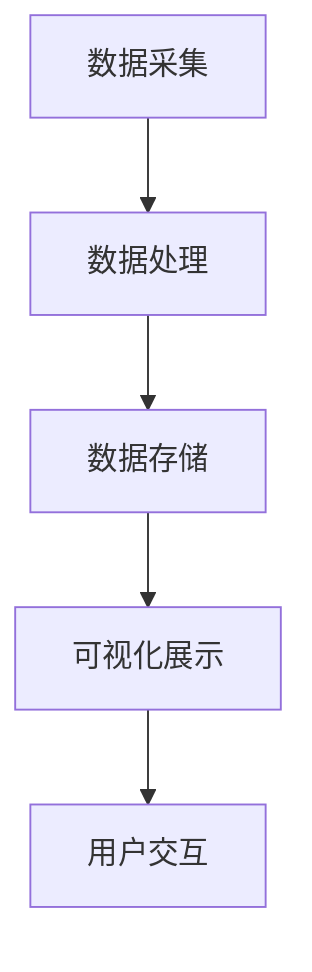

                 


# 金融数据可视化：技术与最佳实践

> 关键词：金融数据可视化，数据处理，图表设计，系统架构，数据交互，最佳实践

> 摘要：本文深入探讨金融数据可视化的核心技术与实践方法，涵盖数据预处理、图表设计、系统架构、项目实战及最佳实践。通过具体案例和工具介绍，帮助读者掌握金融数据可视化的实现技巧。

---

# 第一部分：金融数据可视化基础

## 第1章：金融数据可视化概述

### 1.1 金融数据可视化的背景与意义

#### 1.1.1 金融数据可视化的定义与核心概念
金融数据可视化是通过图形化手段展示金融数据，帮助用户快速理解和分析数据的一种技术。其核心概念包括数据的采集、处理、分析和展示。

#### 1.1.2 金融数据可视化的必要性与优势
在金融领域，数据量庞大且复杂，传统的表格形式难以快速传达信息。可视化能够将复杂数据简化为直观的图表，帮助决策者快速获取关键信息。

#### 1.1.3 金融数据可视化的发展趋势
随着大数据和人工智能技术的发展，金融数据可视化正在向交互式、智能化方向发展，工具和算法也在不断优化。

### 1.2 金融数据可视化的核心概念

#### 1.2.1 数据可视化的基本原理
数据可视化通过视觉元素（如颜色、形状、大小）将数据转换为图形，便于理解和分析。

#### 1.2.2 金融数据的特征与挑战
金融数据具有实时性、波动性和复杂性等特点，这使得可视化需要考虑数据的动态变化和多维度分析。

#### 1.2.3 可视化工具与技术的分类
常用的工具包括Matplotlib、Plotly、Tableau等，技术包括静态可视化、交互式可视化和动态可视化。

### 1.3 金融数据可视化的主要工具

#### 1.3.1 常见数据可视化工具概述
介绍常用的可视化工具，如Matplotlib、Plotly等，并分析其适用场景。

#### 1.3.2 金融领域专用工具介绍
如Interactive Brokers、TradingView等，专门用于金融数据的可视化和分析。

#### 1.3.3 工具选择与配置指南
根据项目需求选择合适的工具，并指导如何安装和配置。

### 1.4 本章小结
本章介绍了金融数据可视化的背景、核心概念和常用工具，为后续内容奠定基础。

---

## 第2章：金融数据可视化的核心技术

### 2.1 数据预处理与清洗

#### 2.1.1 数据清洗的基本步骤
包括数据去重、处理缺失值、异常值剔除等。

#### 2.1.2 数据标准化与归一化
介绍数据标准化（如Z-score标准化）和归一化（如Min-Max归一化）的方法。

#### 2.1.3 数据特征提取与降维
使用主成分分析（PCA）等方法进行特征提取。

### 2.2 数据可视化算法原理

#### 2.2.1 基础可视化算法（如折线图、柱状图）
介绍折线图和柱状图的实现原理和适用场景。

#### 2.2.2 高级可视化算法（如热力图、网络图）
讲解热力图和网络图的算法实现及其在金融分析中的应用。

#### 2.2.3 交互式可视化算法实现
使用D3.js或Plotly实现交互式图表。

### 2.3 数据可视化图表类型与选择

#### 2.3.1 常见金融图表类型
包括K线图、 Candlestick图、OHLC图等。

#### 2.3.2 图表选择的策略与原则
根据数据类型和分析目标选择合适的图表类型。

#### 2.3.3 图表设计的视觉优化
包括颜色选择、布局设计等。

### 2.4 本章小结
本章详细讲解了数据预处理和可视化算法，帮助读者掌握核心技术。

---

## 第3章：金融数据可视化的系统架构

### 3.1 系统架构设计概述

#### 3.1.1 系统架构的基本概念
介绍系统架构的定义和组成部分。

#### 3.1.2 金融数据可视化的系统模块划分
将系统分为数据采集、数据处理、可视化展示等模块。

#### 3.1.3 系统架构的优缺点分析
比较不同架构的优缺点，如单体架构与微服务架构。

### 3.2 系统功能设计

#### 3.2.1 数据采集模块设计
包括数据接口设计和数据源配置。

#### 3.2.2 数据处理模块设计
涉及数据清洗、转换和特征提取。

#### 3.2.3 可视化展示模块设计
包括图表生成、交互设计和结果展示。

### 3.3 系统架构图



### 3.4 本章小结
本章通过系统架构设计，帮助读者理解金融数据可视化的整体结构。

---

## 第4章：金融数据可视化项目实战

### 4.1 项目背景与目标

#### 4.1.1 项目需求分析
分析一个具体的金融数据可视化项目，如股票价格预测。

#### 4.1.2 项目目标设定
明确项目的可视化目标，如展示股票价格波动。

#### 4.1.3 项目可行性分析
评估项目的资源和时间可行性。

### 4.2 项目环境配置

#### 4.2.1 开发环境搭建
安装必要的开发工具和库，如Python、Matplotlib。

#### 4.2.2 数据源获取与配置
介绍如何获取金融数据，如通过API接口获取股票数据。

#### 4.2.3 工具安装与配置
指导读者安装并配置可视化工具。

### 4.3 数据处理与分析

#### 4.3.1 数据清洗与预处理
使用Python代码进行数据清洗，例如：

```python
import pandas as pd
data = pd.read_csv('stock_data.csv')
data = data.dropna()
```

#### 4.3.2 数据分析与可视化
使用Matplotlib绘制K线图，例如：

```python
import matplotlib.pyplot as plt
plt.figure(figsize=(10,6))
plt.plot(data['Date'], data['Price'], 'b-')
plt.title('Stock Price')
plt.xlabel('Date')
plt.ylabel('Price')
plt.show()
```

### 4.4 本章小结
通过具体项目实战，读者可以掌握从数据获取到可视化的完整流程。

---

## 第5章：金融数据可视化的最佳实践

### 5.1 数据可视化的注意事项

#### 5.1.1 数据的可读性
确保图表清晰易读，避免信息过载。

#### 5.1.2 数据的交互性
提供交互功能，如缩放、筛选等，提升用户体验。

#### 5.1.3 数据的动态更新
实现数据的实时更新，保持图表的动态性。

### 5.2 金融数据可视化的小结

#### 5.2.1 核心技术回顾
总结数据预处理、算法实现和系统架构等核心技术。

#### 5.2.2 项目实践总结
分享项目中的经验和教训，提供改进建议。

### 5.3 未来趋势与建议

#### 5.3.1 人工智能与自动化
介绍AI技术在数据可视化中的应用，如自动选择图表类型。

#### 5.3.2 数据安全与隐私保护
强调数据安全的重要性，建议采用加密技术和访问控制。

---

## 作者

作者：AI天才研究院/AI Genius Institute & 禅与计算机程序设计艺术 /Zen And The Art of Computer Programming

---

通过以上章节的详细讲解，本文为读者提供了从基础到实践的全面指导，帮助他们在金融数据可视化领域深入理解和应用相关技术。

