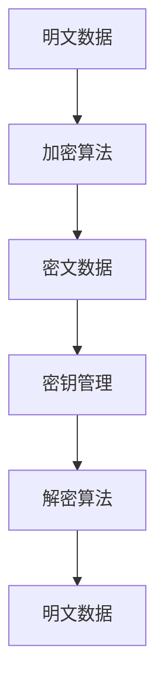
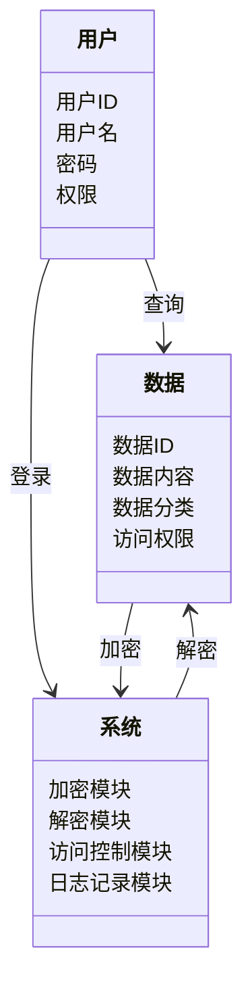
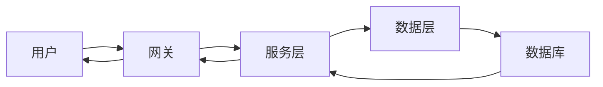
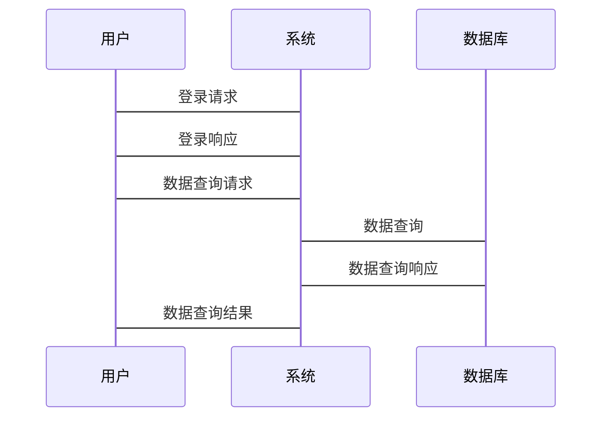

                 


# 《金融数据安全与隐私保护框架设计》

> **关键词**：金融数据安全、隐私保护框架、数据加密、隐私计算、数据脱敏

> **摘要**：本文详细探讨了金融数据安全与隐私保护的框架设计，从背景与挑战、核心概念、技术原理到系统架构设计，结合实际案例分析，提供了一套完整的解决方案。通过深入分析数据安全与隐私保护的关系，结合加密算法、隐私计算技术和数据脱敏方法，构建了一个安全、合规且高效的金融数据隐私保护框架。

---

# 第1章 金融数据安全与隐私保护的背景与挑战

## 1.1 问题背景介绍

随着数字化时代的到来，金融行业面临着前所未有的数据安全挑战。金融数据的敏感性和高价值使其成为黑客攻击的主要目标。近年来，数据泄露事件频发，不仅导致经济损失，还严重损害了金融机构的信誉。因此，如何在保护金融数据安全的同时，确保隐私数据的合规性，成为金融机构亟需解决的问题。

## 1.2 问题描述与分析

金融数据安全与隐私保护的核心目标是确保数据在存储、传输和处理过程中的安全性，防止未经授权的访问和泄露。然而，现有的数据安全解决方案往往侧重于单一的技术手段，难以应对复杂的隐私保护需求。此外，金融行业的数据涉及多个业务系统和部门，数据孤岛现象严重，增加了数据管理的复杂性。

## 1.3 框架设计的目标与原则

### 1.3.1 框架设计的目标
- **数据完整性**：确保数据在存储和传输过程中不被篡改。
- **数据机密性**：保护敏感数据不被未经授权的人员访问。
- **数据可用性**：确保数据在合法授权下能够被及时访问和处理。
- **隐私合规性**：满足相关法律法规（如GDPR、《个人信息保护法》）的隐私保护要求。

### 1.3.2 框架设计的原则
- **最小化原则**：只收集和处理必要的数据，避免过度收集。
- **数据分类原则**：根据数据的敏感程度进行分类管理。
- **访问控制原则**：基于角色和权限进行细粒度的访问控制。
- **可追溯性原则**：记录数据的访问和操作日志，便于审计和追溯。

---

# 第2章 金融数据安全与隐私保护的核心概念

## 2.1 数据安全的核心概念

### 2.1.1 数据安全的定义
数据安全是指通过技术手段和管理措施，确保数据的机密性、完整性和可用性。数据安全不仅包括物理层面的保护，还涉及网络、系统和应用等多个层面的安全防护。

### 2.1.2 数据安全的关键属性
- **机密性（Confidentiality）**：防止未经授权的人员访问数据。
- **完整性（Integrity）**：确保数据在存储和传输过程中不被篡改。
- **可用性（Availability）**：确保数据在合法授权下能够被及时访问和处理。

### 2.1.3 数据安全的层次模型
数据安全可以分为三个层次：物理安全、网络安全和数据管理安全。每个层次都有其独特的安全措施和技术手段。

## 2.2 隐私保护的核心概念

### 2.2.1 隐私保护的定义
隐私保护是指通过技术和管理手段，保护个人隐私数据不被未经授权的人员访问或泄露。隐私保护的核心在于数据的匿名化和最小化处理。

### 2.2.2 隐私保护的关键技术
- **数据加密**：通过加密技术保护数据的机密性。
- **数据匿名化**：通过数据脱敏技术隐藏敏感信息。
- **访问控制**：基于角色和权限进行访问控制，确保只有授权人员可以访问数据。

### 2.2.3 隐私保护的法律与合规要求
- **GDPR（通用数据保护条例）**：欧盟的数据保护法规，要求企业明确数据处理的目的，并获得数据主体的同意。
- **《个人信息保护法》**：中国的个人信息保护法规，要求企业采取必要措施保护个人信息。

## 2.3 数据安全与隐私保护的关系

### 2.3.1 数据安全与隐私保护的联系
数据安全是隐私保护的基础，而隐私保护是数据安全的重要组成部分。只有确保数据的安全性，才能有效保护隐私。

### 2.3.2 数据安全与隐私保护的区别
数据安全关注的是数据的整体安全，而隐私保护关注的是个人隐私数据的保护。数据安全更注重技术手段，而隐私保护更注重法律和合规要求。

### 2.3.3 数据安全与隐私保护的协同机制
通过数据分类、访问控制和加密技术的结合，可以实现数据安全与隐私保护的协同。

---

# 第3章 金融数据安全与隐私保护的技术原理

## 3.1 数据加密技术

### 3.1.1 加密算法的分类
- **对称加密**：加密和解密使用相同的密钥，如AES算法。
- **非对称加密**：加密和解密使用不同的密钥，如RSA算法。

### 3.1.2 常见加密算法
- **AES加密**：高级加密标准，广泛应用于数据加密。
- **RSA加密**：基于公钥密码学的加密算法，常用于数字签名和加密通信。

### 3.1.3 加密过程的mermaid流程图



## 3.2 隐私计算技术

### 3.2.1 隐私计算的定义与特点
隐私计算是一种在保护数据隐私的前提下，进行数据计算的技术。其核心在于在数据不被暴露的情况下，完成数据的计算和分析。

### 3.2.2 常见隐私计算技术
- **同态加密**：允许在加密数据上进行计算，而无需解密。
- **秘密分享**：将数据分割成多个密片，每个密片都无法单独还原原始数据。

### 3.2.3 隐私计算的数学模型与公式

同态加密的数学模型如下：
$$ E(x) = x^k \mod n $$
其中，$k$ 是加密指数，$n$ 是模数。

---

# 第4章 金融数据安全与隐私保护的系统架构设计

## 4.1 系统功能设计

### 4.1.1 领域模型mermaid类图



## 4.2 系统架构设计

### 4.2.1 系统架构mermaid架构图



## 4.3 系统接口设计

### 4.3.1 接口描述
- **登录接口**：用户通过用户名和密码登录系统。
- **数据查询接口**：用户根据权限查询数据。
- **数据加密接口**：系统对敏感数据进行加密存储。

## 4.4 系统交互mermaid序列图



---

# 第5章 项目实战：金融数据隐私保护系统

## 5.1 环境搭建

### 5.1.1 安装Python环境
```bash
python --version
pip install --upgrade pip
```

### 5.1.2 安装依赖包
```bash
pip install aes-cryptography
pip install rsa
```

## 5.2 核心代码实现

### 5.2.1 数据加密模块

```python
from cryptography.hazmat.primitives.ciphers import Cipher, algorithms, modes
from cryptography.hazmat.primitives.asymmetric import padding, utils
import os

def aes_encrypt(plaintext, key):
    key = os.urandom(16)  # 16字节的密钥
    iv = os.urandom(16)    # 16字节的偏移量
    cipher = Cipher(algorithms.AES(key), modes.CBC(iv))
    encryptor = cipher.encryptor()
    ciphertext = encryptor.update(plaintext) + encryptor.finalize()
    return ciphertext, key, iv

def aes_decrypt(ciphertext, key, iv):
    cipher = Cipher(algorithms.AES(key), modes.CBC(iv))
    decryptor = cipher.decryptor()
    plaintext = decryptor.update(ciphertext) + decryptor.finalize()
    return plaintext
```

### 5.2.2 隐私计算模块

```python
def privacy_computation(data_list):
    # 数据匿名化处理
    for data in data_list:
        # 数据脱敏处理
        masked_data = mask_data(data)
        # 数据加密处理
        encrypted_data = aes_encrypt(masked_data)
        yield encrypted_data
```

### 5.2.3 数据脱敏模块

```python
def mask_data(data):
    # 数据脱敏处理，例如替换敏感字段
    masked_data = {
        'id': data['id'],
        'name': '***',
        'age': data['age'],
        'phone': '***'
    }
    return masked_data
```

## 5.3 案例分析

### 5.3.1 系统实现细节
- **数据分类**：根据数据的敏感程度进行分类，如高敏感数据（如身份证号）和低敏感数据（如年龄）。
- **访问控制**：基于角色和权限进行访问控制，确保只有授权人员可以访问敏感数据。

### 5.3.2 案例小结
通过本案例的实现，我们成功构建了一个金融数据隐私保护系统，实现了数据的加密存储、匿名化处理和细粒度的访问控制。该系统不仅满足了数据安全的需求，还符合相关法律法规的隐私保护要求。

---

# 第6章 最佳实践与小结

## 6.1 最佳实践

### 6.1.1 数据分类与分级
- 根据数据的敏感程度进行分类，制定不同的安全策略。

### 6.1.2 访问控制
- 基于角色和权限进行细粒度的访问控制，确保最小权限原则。

### 6.1.3 数据脱敏
- 在数据处理过程中，对敏感数据进行脱敏处理，避免直接存储原始数据。

### 6.1.4 安全审计
- 定期进行安全审计和漏洞扫描，及时发现和修复安全问题。

## 6.2 小结

本文详细探讨了金融数据安全与隐私保护的框架设计，从背景与挑战、核心概念、技术原理到系统架构设计，结合实际案例分析，提供了一套完整的解决方案。通过数据加密、隐私计算和数据脱敏等技术手段，构建了一个安全、合规且高效的金融数据隐私保护框架。

---

# 作者信息

作者：AI天才研究院/AI Genius Institute  
联系邮箱：[email protected]  
GitHub地址：[https://github.com/AI-Genius-Institute](https://github.com/AI-Genius-Institute)  

---

# 拓展阅读

1. [《数据加密与隐私保护》](#)
2. [《金融数据安全最佳实践》](#)
3. [《隐私计算技术详解》](#)

---

希望这篇文章能够为读者提供一个全面的金融数据安全与隐私保护框架设计的视角，帮助读者更好地理解和应用相关技术。

