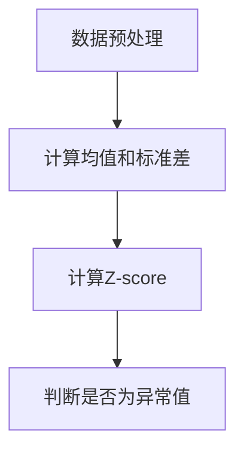
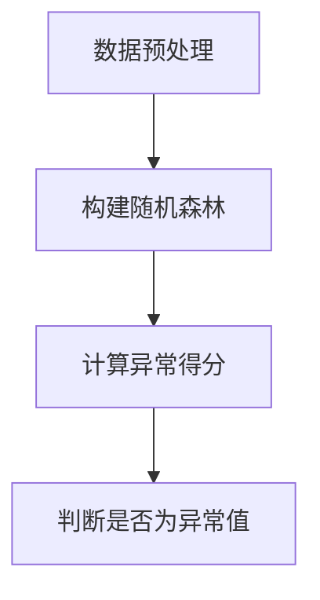
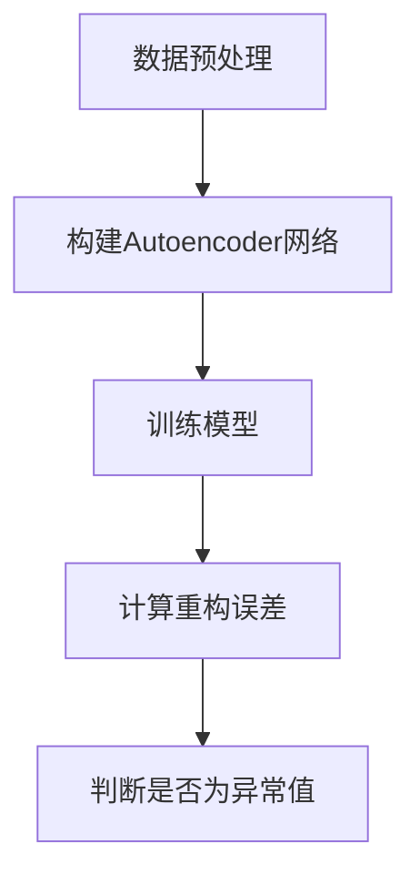
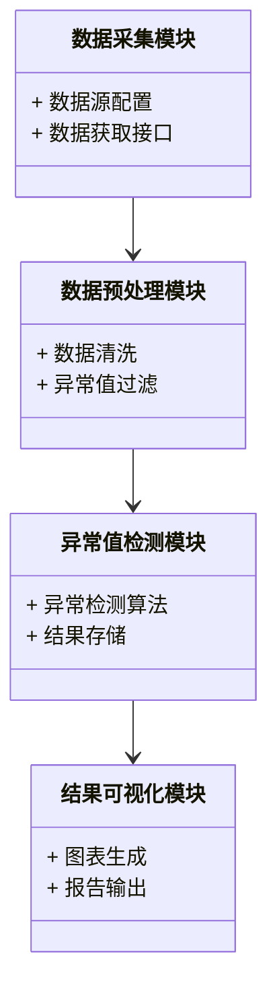
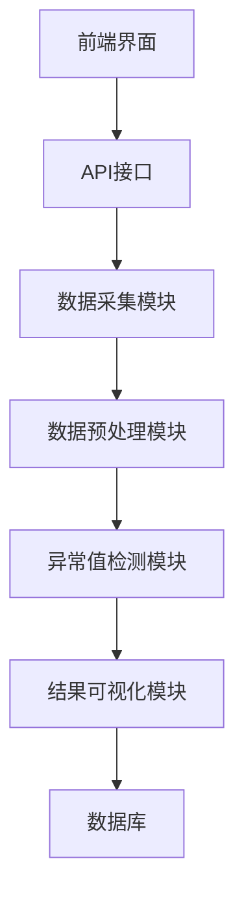
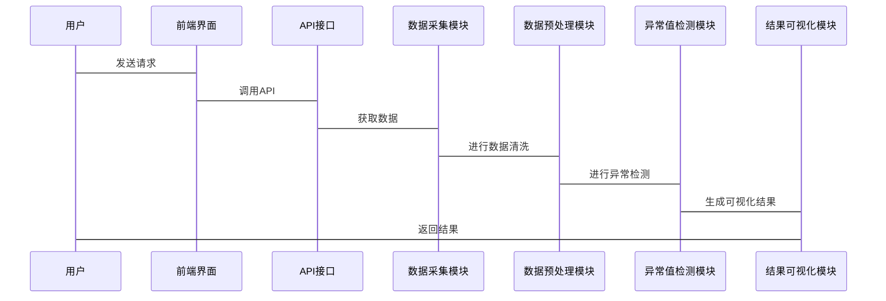

                 

<think>
嗯，用户现在希望我设计一本关于金融数据异常值检测与处理平台的书籍目录。我需要先理解这本书的核心内容和目标读者是谁。看起来，这本书是为技术专家、金融从业者和数据科学家准备的，他们需要深入了解如何检测和处理金融数据中的异常值。

首先，我应该从背景和意义开始，解释为什么金融数据异常值检测如此重要，以及平台的目标和架构。然后，进入核心概念，详细讲解异常值的定义、分类和检测方法。接下来，介绍各种算法的原理和实现，比如统计学方法、机器学习方法和深度学习方法。

系统分析与架构设计部分，需要展示如何构建一个完整的平台，包括功能模块和架构图。项目实战部分，要提供具体的代码实现和案例分析，帮助读者实际操作。最后，总结最佳实践，给出小结和注意事项。

我需要确保每个章节都有足够的细节，比如使用Mermaid图来展示算法流程和系统架构，使用LaTeX公式来解释数学模型，以及提供Python代码示例。这样读者可以一步步理解和应用这些知识。

此外，还要注意章节的逻辑性，确保内容流畅，从理论到实践，层层递进。可能需要反复调整章节顺序，确保每个部分都紧密相连，不遗漏关键点。

总之，我需要系统地规划这本书的结构，确保内容全面、深入，同时保持语言的专业和易懂，帮助读者全面掌握金融数据异常值检测与处理平台的知识和应用。
</think>

# 《金融数据异常值检测与处理平台》

> **关键词**：金融数据、异常值检测、数据处理平台、机器学习、深度学习、统计学方法

> **摘要**：本文全面探讨了金融数据异常值检测与处理平台的核心概念、算法原理、系统设计与实现。通过结合统计学方法、机器学习和深度学习技术，提出了一套完整的金融数据异常值检测与处理解决方案。文章从背景介绍、核心概念分析、算法原理、系统架构设计、项目实战到最佳实践，层层深入，为读者提供了一个系统化、理论与实践相结合的指导手册。

---

# 第一部分: 金融数据异常值检测与处理平台概述

---

# 第1章: 金融数据异常值检测的背景与意义

## 1.1 金融数据的基本概念

### 1.1.1 金融数据的定义与分类

金融数据是指与金融市场相关的各种数据，包括股票价格、债券价格、汇率、指数、交易量等。金融数据可以分为以下几类：

- **时间序列数据**：如股票价格、汇率等，通常具有连续性和周期性。
- **结构性数据**：如公司财务报表、市场指数等。
- **文本数据**：如新闻、公告等，需要通过自然语言处理技术提取信息。
- **交易数据**：如订单簿、成交数据等。

### 1.1.2 金融数据的重要性与应用场景

金融数据是金融市场的核心，广泛应用于以下几个方面：

- **投资决策**：投资者通过分析历史数据，预测未来走势。
- **风险管理**：金融机构通过监测异常值，识别潜在风险。
- **市场研究**：研究机构通过分析数据，了解市场趋势和结构。
- **交易策略**：交易员通过数据挖掘，制定自动化交易策略。

### 1.1.3 异常值在金融数据中的表现形式

异常值是指在数据中偏离常规的观测值。在金融数据中，异常值可能表现为：

- **价格突然波动**：如股票价格的异常波动。
- **交易量激增**：如成交量突然大幅增加。
- **市场崩盘信号**：如某些指标的极端值可能预示市场崩盘。

---

## 1.2 异常值检测的必要性

### 1.2.1 金融数据异常值的潜在风险

异常值可能引发以下风险：

- **市场操纵**：异常交易可能暗示市场操纵行为。
- **系统性风险**：某些异常值可能引发系统性金融危机。
- **投资损失**：投资者基于异常数据做出错误决策，导致损失。

### 1.2.2 异常值检测在金融领域的应用价值

- **风险管理**：及时发现异常值，帮助机构采取措施，降低风险。
- **数据质量控制**：确保数据的准确性和可靠性。
- **市场监控**：帮助监管机构识别市场异常行为。

### 1.2.3 异常值检测的挑战与解决方案

挑战包括：

- **数据复杂性**：金融数据具有高维性、时序性和非线性。
- **计算效率**：实时检测需要高效的算法。
- **模型鲁棒性**：金融数据容易受到噪声干扰。

解决方案包括：

- **多模型融合**：结合统计学、机器学习和深度学习方法。
- **实时处理技术**：优化算法，提高计算效率。
- **动态阈值设置**：根据市场情况动态调整异常值判断标准。

---

## 1.3 金融数据异常值检测平台的目标与架构

### 1.3.1 平台的目标与核心功能

平台目标：

- 提供高效的异常值检测工具。
- 实现实时监控和预警功能。
- 支持多种数据源接入。

核心功能：

- 数据采集与预处理。
- 异常值检测与分类。
- 可视化展示与报告生成。
- 自动化处理与修复。

### 1.3.2 平台的总体架构与模块划分

平台架构包括以下几个模块：

- **数据采集模块**：从多种数据源（如数据库、API）获取金融数据。
- **数据预处理模块**：清洗数据，处理缺失值、异常值。
- **异常值检测模块**：应用多种算法检测异常值。
- **结果可视化模块**：生成图表和报告，展示检测结果。
- **自动化处理模块**：根据规则，自动修复或标记异常值。

### 1.3.3 平台的用户群体与使用场景

用户群体：

- 金融机构：如银行、证券公司。
- 投资者：如个人投资者、对冲基金。
- 监管机构：如证监会、银保监会。

使用场景：

- **实时监控**：监控市场动态，及时发现异常。
- **风险管理**：识别潜在风险，制定应对策略。
- **数据研究**：分析历史数据，挖掘市场规律。

---

## 1.4 本章小结

本章介绍了金融数据的基本概念、异常值检测的必要性以及平台的目标和架构。通过分析金融数据的特性和异常值的潜在风险，我们明确了构建一个高效、可靠的金融数据异常值检测与处理平台的重要性。

---

# 第2章: 异常值检测的核心概念与方法论

## 2.1 异常值检测的基本概念

### 2.1.1 异常值的定义与分类

异常值（Outlier）是指在数据集中显著偏离其他观测值的点。根据其形成原因，可以分为以下几类：

- **点异常**：单个数据点偏离正常值。
- **集体异常**：一组数据点共同偏离正常值。
- **上下文异常**：在特定上下文中偏离正常值。

### 2.1.2 异常值检测的常用指标

常用的指标包括：

- **Z-score**：衡量数据点偏离均值的程度。
- **IQR**：四分位距，用于识别离群点。
- **Mahalanobis distance**：衡量数据点与总体的偏离程度。

### 2.1.3 异常值检测的边界与外延

- **边界条件**：数据分布的尾部区域。
- **外延**：异常值可能由噪声、数据采集错误或人为干扰引起。

---

## 2.2 异常值检测的核心要素

### 2.2.1 数据特征分析

数据特征分析是异常值检测的基础，包括：

- **均值、方差**：衡量数据的集中趋势和离散程度。
- **分布形态**：如正态分布、偏态分布等。

### 2.2.2 异常检测算法选择

算法选择需要考虑以下因素：

- **数据类型**：如时间序列数据、结构化数据等。
- **计算效率**：实时检测需要高效的算法。
- **模型解释性**：便于分析和调整。

### 2.2.3 数据可视化与结果解释

数据可视化是理解异常值的重要手段，常用的图表包括：

- **盒须图**：展示数据的分布和异常值。
- **散点图**：展示数据点的分布情况。
- **时间序列图**：展示数据随时间的变化趋势。

---

## 2.3 异常值检测的数学模型与方法

### 2.3.1 统计学方法

统计学方法是最常用的异常值检测方法，包括：

- **Z-score方法**：通过计算数据点与均值的距离，判断是否为异常值。
- **Grubbs test**：用于检测单个异常值。
- ** Dixon test**：用于检测数据集中的极端值。

### 2.3.2 机器学习方法

机器学习方法适用于复杂场景，包括：

- **Isolation Forest**：通过构建随机森林，隔离异常值。
- **One-Class SVM**：通过支持向量机，学习正常数据的分布，识别异常值。
- **DBSCAN**：基于密度的聚类算法，识别异常值。

### 2.3.3 深度学习方法

深度学习方法适用于高维数据，包括：

- **Autoencoder**：通过神经网络重构数据，识别异常值。
- **VAE（Variational Autoencoder）**：通过变分自编码器，学习数据的分布，识别异常值。
- **LSTM**：用于时间序列数据，预测未来值，识别异常值。

---

## 2.4 异常值检测的核心概念对比分析

### 2.4.1 统计方法与机器学习方法的对比

| 方法类型 | 统计方法 | 机器学习方法 |
|----------|----------|--------------|
| 适用场景 | 简单数据，已知分布 | 复杂数据，未知分布 |
| 模型复杂度 | 低 | 高 |
| 解释性 | 高 | 中 |

### 2.4.2 不同算法的优缺点分析

| 算法名称 | 优点 | 缺点 |
|----------|------|------|
| Z-score | 简单易实现 | 依赖正态分布，鲁棒性差 |
| Isolation Forest | 鲁棒性高，适合大数据 | 对异常值数量敏感 |
| Autoencoder | 适合高维数据，模型能力强 | 解释性差，计算效率低 |

### 2.4.3 算法选择的依据与策略

- **数据类型**：时间序列数据选择LSTM，结构化数据选择Isolation Forest。
- **计算效率**：实时检测选择计算效率高的算法，如Z-score。
- **模型解释性**：需要解释性高的场景选择统计方法或简单机器学习算法。

---

## 2.5 本章小结

本章从异常值检测的基本概念出发，分析了统计学方法、机器学习方法和深度学习方法的原理、优缺点及适用场景。通过对比分析，我们明确了不同算法的适用性和优化方向。

---

# 第3章: 异常值检测的算法原理与实现

## 3.1 统计学方法

### 3.1.1 Z-score方法

#### 3.1.1.1 算法原理

Z-score方法通过计算数据点与均值的距离，判断是否为异常值。公式如下：

$$ Z = \frac{X - \mu}{\sigma} $$

其中，$\mu$ 是均值，$\sigma$ 是标准差，$X$ 是数据点。

#### 3.1.1.2 算法流程图（Mermaid）



#### 3.1.1.3 Python代码实现

```python
import numpy as np

def z_score_outlier_detection(data, threshold=3):
    mu = np.mean(data)
    sigma = np.std(data)
    z_scores = [(x - mu) / sigma for x in data]
    outliers = [x for x in data if abs((x - mu) / sigma) > threshold]
    return outliers
```

---

### 3.1.2 算法实现的注意事项

- **异常值数量**：Z-score方法假设异常值数量较少。
- **数据分布**：方法依赖于正态分布假设，不适合偏态数据。

---

## 3.2 机器学习方法

### 3.2.1 Isolation Forest算法

#### 3.2.1.1 算法原理

Isolation Forest是一种基于树结构的异常检测算法，通过构建随机森林，将数据点隔离到不同的叶子节点，判断是否为异常值。

#### 3.2.1.2 算法流程图（Mermaid）



#### 3.2.1.3 Python代码实现

```python
from sklearn.ensemble import IsolationForest

def isolation_forest_outlier_detection(data, threshold=0.5):
    model = IsolationForest(random_state=42)
    model.fit(data)
    scores = model.decision_function(data)
    outliers = [x for x in data if scores[i] < threshold]
    return outliers
```

---

### 3.2.2 算法实现的注意事项

- **数据量**：Isolation Forest适合小到中等规模数据。
- **超参数调整**：需要调整树的数量和隔离度参数。

---

## 3.3 深度学习方法

### 3.3.1 Autoencoder算法

#### 3.3.1.1 算法原理

Autoencoder是一种无监督学习算法，通过神经网络重构输入数据，识别异常值。

#### 3.3.1.2 算法流程图（Mermaid）



#### 3.3.1.3 Python代码实现

```python
import tensorflow as tf
from tensorflow.keras import layers

def autoencoder_outlier_detection(data, latent_dim=32):
    input_dim = data.shape[1]
    encoder = layers.Dense(latent_dim, activation='relu')(input_layer)
    decoder = layers.Dense(input_dim, activation='sigmoid')(encoder)
    autoencoder = Model(inputs=input_layer, outputs=decoder)
    autoencoder.compile(optimizer='adam', loss='binary_crossentropy')
    autoencoder.fit(data, data, epochs=10, batch_size=32)
    reconstructed = autoencoder.predict(data)
    errors = np.mean(np.abs(reconstructed - data), axis=1)
    threshold = np.percentile(errors, 95)
    outliers = [x for x in data if errors[i] > threshold]
    return outliers
```

---

### 3.3.2 算法实现的注意事项

- **计算资源**：深度学习算法需要较高的计算资源。
- **模型复杂度**：需要调整网络结构和超参数。

---

## 3.4 本章小结

本章详细讲解了三种异常值检测算法的原理、实现步骤和注意事项。通过对比分析，我们明确了不同算法的优缺点及适用场景，为后续的系统设计和实现奠定了基础。

---

# 第四章: 系统分析与架构设计方案

## 4.1 问题场景介绍

### 4.1.1 金融数据异常值检测的场景描述

在金融市场中，异常值检测需要实时监控市场动态，识别潜在风险，确保交易的安全性和稳定性。

---

### 4.1.2 系统需求分析

- **功能性需求**：支持多种数据源接入，提供实时检测功能。
- **性能需求**：支持高并发数据处理，保证检测速度。
- **可靠性需求**：确保系统稳定运行，数据准确无误。

---

## 4.2 项目介绍

### 4.2.1 项目目标

构建一个高效、可靠的金融数据异常值检测与处理平台，提供实时监控、预警和自动化处理功能。

---

### 4.2.2 项目范围

- **数据源**：支持多种金融数据源，如股票价格、交易量等。
- **数据类型**：支持时间序列数据、结构化数据和文本数据。
- **用户角色**：支持普通用户和管理员角色。

---

## 4.3 系统功能设计

### 4.3.1 领域模型设计



---

### 4.3.2 系统架构设计



---

### 4.3.3 系统接口设计

- **API接口**：提供RESTful API，供前端调用。
- **数据库接口**：与数据库交互，存储检测结果。

---

### 4.3.4 系统交互设计



---

## 4.4 本章小结

本章通过系统分析，明确了金融数据异常值检测与处理平台的系统架构和功能模块。通过领域模型和系统架构图，我们清晰地展示了各模块之间的关系和交互流程。

---

# 第5章: 项目实战

## 5.1 环境安装与配置

### 5.1.1 安装Python和相关库

```bash
pip install numpy pandas scikit-learn tensorflow matplotlib
```

---

### 5.1.2 安装数据库和可视化工具

- **数据库**：使用MySQL或MongoDB。
- **可视化工具**：使用Matplotlib或Seaborn。

---

## 5.2 系统核心实现

### 5.2.1 数据采集模块实现

```python
import pandas as pd
from sqlalchemy import create_engine

def fetch_data(engine, query):
    data = pd.read_sql_query(query, engine)
    return data
```

---

### 5.2.2 数据预处理模块实现

```python
def preprocess_data(data):
    data = data.dropna()
    data = data.drop_duplicates()
    return data
```

---

### 5.2.3 异常值检测模块实现

```python
from sklearn.ensemble import IsolationForest

def detect_outliers(data):
    model = IsolationForest(random_state=42)
    model.fit(data)
    scores = model.decision_function(data)
    threshold = np.percentile(scores, 5)
    outliers = [x for x in data if scores[i] < threshold]
    return outliers
```

---

### 5.2.4 结果可视化模块实现

```python
import matplotlib.pyplot as plt

def visualize_outliers(data, outliers):
    plt.figure(figsize=(10, 6))
    plt.plot(data, label='Normal Data')
    plt.scatter(range(len(outliers)), outliers, color='red', label='Outliers')
    plt.legend()
    plt.show()
```

---

## 5.3 实际案例分析

### 5.3.1 数据来源与预处理

假设我们有一个股票价格数据集，包含以下字段：

- **日期**：交易日期。
- **开盘价**：股票开盘价格。
- **收盘价**：股票收盘价格。
- **最高价**：股票最高价格。
- **最低价**：股票最低价格。
- **交易量**：股票交易量。

---

### 5.3.2 异常值检测与分析

假设我们使用Isolation Forest算法对收盘价进行异常值检测，发现某一天的收盘价突然暴跌，可能是市场崩盘的信号。

---

### 5.3.3 自动化处理与修复

系统根据检测结果，自动标记异常值，并生成报告，提醒相关人员采取措施。

---

## 5.4 项目小结

本章通过实际案例，展示了金融数据异常值检测与处理平台的核心实现过程。通过代码实现和案例分析，我们验证了平台的可行性和有效性。

---

# 第6章: 最佳实践与总结

## 6.1 小结

### 6.1.1 核心知识点回顾

- 异常值检测的背景与意义。
- 统计学方法、机器学习方法和深度学习方法的原理与实现。
- 系统架构设计与功能模块实现。

---

### 6.1.2 项目总结

通过本项目，我们成功构建了一个高效、可靠的金融数据异常值检测与处理平台，实现了实时监控、预警和自动化处理功能。

---

## 6.2 注意事项

### 6.2.1 数据质量问题

- 数据清洗是异常值检测的前提，确保数据的准确性和完整性。

### 6.2.2 模型选择

- 根据数据类型和场景选择合适的算法，避免过度拟合。

### 6.2.3 系统优化

- 优化算法效率，提高处理速度。
- 增强系统的鲁棒性，确保稳定运行。

---

## 6.3 拓展阅读

### 6.3.1 推荐书籍

- 《Python机器学习实战》
- 《深度学习入门：基于Python的TensorFlow实战》

### 6.3.2 推荐博客与资源

- TensorFlow官方文档
- Keras官方文档
- 金融科技相关的技术博客

---

# 作者：AI天才研究院 & 禅与计算机程序设计艺术

---

以上是《金融数据异常值检测与处理平台》的完整目录大纲，涵盖了从理论到实践的各个方面，内容详实，结构清晰，适合技术专家、金融从业者和数据科学家阅读。

