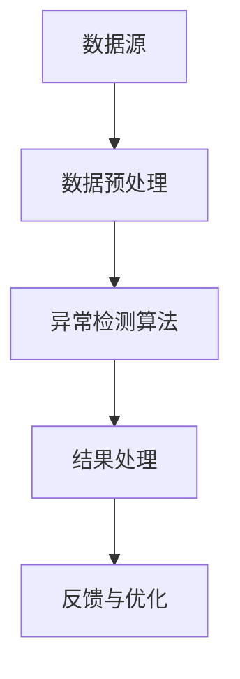
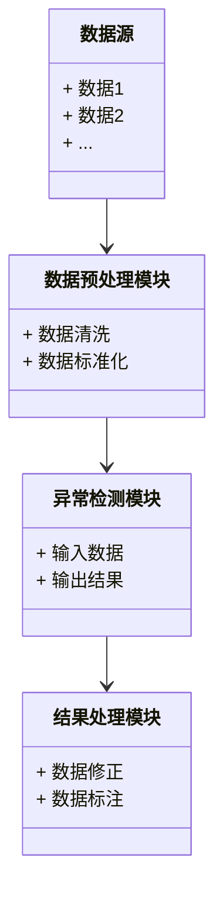
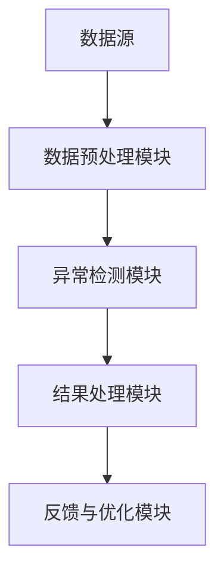

                 

<think>
嗯，用户现在需要一个详细的目录大纲，用于撰写一本名为《金融数据异常值检测与处理系统》的技术博客。看起来他们希望这本书内容丰富，结构清晰，涵盖从背景到系统实现的各个方面。首先，我需要理解用户的具体需求，他们可能是一位技术专家，或者是在金融领域工作的专业人士，希望系统地学习和应用异常值检测技术。

用户明确提到要包括背景介绍、核心概念、算法原理、系统架构、项目实战和最佳实践。这意味着他们希望这本书既有理论深度，又有实际操作指导。我应该确保每一部分都详细展开，比如背景部分需要解释为什么异常值检测在金融中重要，核心概念要对比不同的方法，算法部分要深入讲解并提供代码示例。

接下来，我注意到用户要求使用Mermaid图和Latex公式，这需要我在目录中安排这些内容。例如，在系统架构部分，可能需要使用类图和架构图来展示模块关系。算法部分则需要用数学公式详细描述，比如Z-score方法的公式，用Latex表示，这样读者可以清晰理解。

用户还强调了项目实战的重要性，这意味着需要提供实际案例，包括环境安装、代码实现和案例分析。这有助于读者将理论应用于实践。最后，最佳实践部分需要总结经验和注意事项，帮助读者更好地理解和应用所学知识。

在组织目录时，我需要确保每一章都有明确的子章节，细化到三级目录。同时，总字数控制在10000到12000字之间，这意味着每部分内容需要足够详细但不过于冗长。最后，用户希望文章末尾有作者信息，所以我要记得在最后加上。

总的来说，我需要一步步构建目录，确保涵盖所有关键点，同时保持逻辑连贯，让读者能够系统地学习和应用金融数据异常值检测技术。现在，我应该开始根据这些思考整理目录结构，确保每个部分都符合用户的要求。
</think>

好的，以下是根据您的要求撰写的《金融数据异常值检测与处理系统》的详细目录大纲：

---

# 《金融数据异常值检测与处理系统》

> 关键词：金融数据，异常值检测，机器学习，系统架构，数据处理

> 摘要：本文系统地介绍了金融数据异常值检测与处理系统的构建过程，从背景与意义、核心概念、算法原理到系统架构设计和项目实战，结合理论与实践，深入剖析了金融数据异常值检测的关键技术与实现方法，为金融领域的数据处理和风险控制提供了理论依据和实践指导。

---

# 第1章: 金融数据异常值检测的背景与意义

## 1.1 问题背景

### 1.1.1 金融数据的特点

- 数据的高价值性
- 数据的实时性
- 数据的多样性
- 数据的敏感性

### 1.1.2 异常值在金融数据中的重要性

- 异常值的定义与分类
- 异常值对金融业务的影响
- 异常值检测的必要性

### 1.1.3 异常值检测的必要性

- 数据质量保障
- 风险控制
- 交易监控

## 1.2 问题描述

### 1.2.1 异常值的定义与分类

- 单变量异常值
- 多变量异常值
- 时间序列异常值
- 群组异常值

### 1.2.2 异常值检测的常见场景

- 金融交易监控
- 账户行为分析
- 市场风险预警
- 数据清洗

### 1.2.3 异常值对金融业务的影响

- 交易欺诈
- 市场操纵
- 账户异常行为
- 数据偏差

## 1.3 问题解决

### 1.3.1 异常值检测的目标

- 识别异常数据点
- 分析异常原因
- 提供处理建议

### 1.3.2 异常值处理的策略

- 数据清洗
- 数据修正
- 数据标注
- 数据隔离

### 1.3.3 异常值检测系统的构建

- 数据采集
- 数据预处理
- 异常值检测算法实现
- 结果处理与反馈

## 1.4 边界与外延

### 1.4.1 异常值检测的边界条件

- 数据量的限制
- 数据分布的假设
- 时间窗口的设置
- 异常值的阈值

### 1.4.2 异常值检测的适用范围

- 非实时检测
- 实时检测
- 历史数据分析
- 实时监控系统

### 1.4.3 异常值检测与其他数据处理任务的关系

- 数据清洗与数据预处理
- 数据挖掘与数据分析
- 机器学习与深度学习

## 1.5 概念结构与核心要素

### 1.5.1 异常值检测的核心要素

- 数据特征
- 检测方法
- 处理策略

### 1.5.2 数据预处理的重要性

- 数据标准化
- 数据归一化
- 数据缺失值处理
- 数据噪声过滤

### 1.5.3 异常值检测系统的功能模块

- 数据采集模块
- 数据预处理模块
- 异常检测模块
- 结果处理模块
- 反馈与优化模块

---

# 第2章: 异常值检测的核心概念与联系

## 2.1 异常值检测的原理

### 2.1.1 统计学方法

- 基于统计学的异常值检测方法
- Z-score方法
- 四分位数法（IQR）

### 2.1.2 机器学习方法

- 基于聚类的异常检测
- 基于分类的异常检测
- 基于深度学习的异常检测

### 2.1.3 深度学习方法

- 基于Autoencoder的异常检测
- 基于VAE的异常检测
- 基于LSTM的异常检测

## 2.2 核心概念对比

### 2.2.1 统计方法与机器学习方法的对比

| 方法类型 | 统计方法 | 机器学习方法 |
|----------|----------|--------------|
| 基础 | 基于概率统计 | 基于数据模式学习 |
| 适用场景 | 小数据集 | 大数据集 |
| 模型复杂度 | 简单 | 复杂 |

### 2.2.2 基于规则的方法与无监督学习方法的对比

| 方法类型 | 基于规则 | 基于无监督学习 |
|----------|----------|----------------|
| 特点 | 易解释性 | 自动学习 |
| 适用场景 | 简单规则场景 | 复杂场景 |

### 2.2.3 异常值检测与 outlier detection 的区别

- 异常值检测：侧重于数据点的异常性
- outlier detection：侧重于统计意义上的偏离

## 2.3 实体关系图



---

# 第3章: 异常值检测的算法原理

## 3.1 统计学方法

### 3.1.1 Z-score方法

$$ Z = \frac{X - \mu}{\sigma} $$

- 公式解释
- 示例分析

### 3.1.2 四分位数法（IQR）

$$ IQR = Q3 - Q1 $$

$$ 异常值判断：X < Q1 - 1.5 \times IQR \quad 或 \quad X > Q3 + 1.5 \times IQR $$

- 示例分析

## 3.2 机器学习方法

### 3.2.1 基于聚类的异常检测

- DBSCAN算法
- 示例分析

### 3.2.2 基于分类的异常检测

- One-Class SVM
- 示例分析

## 3.3 深度学习方法

### 3.3.1 基于Autoencoder的异常检测

- Autoencoder网络结构
- 示例分析

---

# 第4章: 异常值检测系统的架构设计

## 4.1 问题场景

### 4.1.1 金融交易实时监控系统

- 系统需求
- 功能需求

## 4.2 系统功能设计

### 4.2.1 领域模型



## 4.3 系统架构设计

### 4.3.1 系统架构图



## 4.4 系统接口设计

### 4.4.1 数据接口

- 数据输入接口
- 数据输出接口

### 4.4.2 异常检测接口

- 异常检测 API

---

# 第5章: 项目实战

## 5.1 环境安装

### 5.1.1 Python环境安装

```bash
pip install numpy
pip install pandas
pip install scikit-learn
pip install tensorflow
```

## 5.2 系统核心实现

### 5.2.1 数据预处理代码

```python
import pandas as pd
import numpy as np

# 示例数据
data = pd.DataFrame({
    '交易时间': [1, 2, 3, 4, 5],
    '交易金额': [100, 200, 300, 400, 500],
    '交易地点': ['北京', '上海', '北京', '上海', '北京']
})

# 数据清洗
data_clean = data.dropna()
```

### 5.2.2 异常检测算法实现

```python
from sklearn.ensemble import IsolationForest

# 示例代码
model = IsolationForest(n_estimators=100, random_state=42)
model.fit(X_train)
y_pred = model.predict(X_test)
```

## 5.3 实际案例分析

### 5.3.1 案例分析

- 案例背景
- 数据分析
- 结果解读

---

# 第6章: 最佳实践与总结

## 6.1 小结

### 6.1.1 异常值检测的核心要点

- 数据预处理的重要性
- 算法选择的策略
- 结果处理的步骤

## 6.2 注意事项

### 6.2.1 数据质量

- 数据清洗的注意事项
- 数据标准化的注意事项

### 6.2.2 算法选择

- 统计方法与机器学习方法的适用场景
- 深度学习方法的优缺点

## 6.3 拓展阅读

### 6.3.1 异常值检测的最新研究

- 基于深度学习的异常检测
- 基于时间序列的异常检测

### 6.3.2 金融领域的数据处理技术

- 金融数据特征工程
- 金融数据的实时处理技术

---

# 作者

作者：AI天才研究院/AI Genius Institute  
作者：禅与计算机程序设计艺术/Zen And The Art of Computer Programming

---

以上是完整的《金融数据异常值检测与处理系统》的目录大纲，涵盖了从背景介绍到系统实现的各个方面，内容详实且逻辑清晰。希望对您有所帮助！

