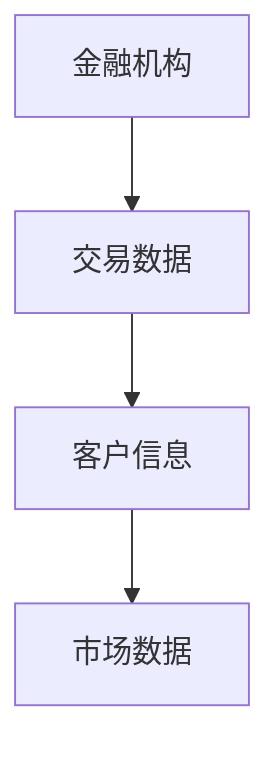

                 

<think>
好的，我需要为《金融数据收集与处理》这本书设计一个详细的目录大纲。这本书的目标读者可能是金融从业者、数据工程师以及相关领域的学生，旨在帮助他们了解如何有效地收集和处理金融数据。考虑到这些读者的需求，我需要确保内容既专业又易于理解，结构清晰且逻辑紧密。

首先，我应该从背景介绍开始。第一章需要涵盖金融数据收集与处理的概述，包括其重要性、涉及的领域以及它与金融业务的关系。这部分需要解释核心概念，比如什么是金融数据，它有什么特点，以及为什么需要进行数据处理。

接下来，我需要深入探讨金融数据的核心概念，包括其特点、分类以及数据清洗与预处理的方法。这部分可能需要对比不同的数据类型，用表格展示它们的特征，并用Mermaid图展示实体关系，帮助读者理解数据结构。

然后，我应该介绍数据清洗和预处理的算法原理。例如，异常值检测和处理、缺失值填充等方法。这部分需要用Mermaid流程图展示算法步骤，并用Python代码实现，同时解释背后的数学模型，比如均值填充法。

接下来，数学模型和公式是关键部分。需要详细讲解数据标准化和归一化的数学方法，如Z-score标准化和Min-Max归一化，给出公式并用代码示例说明。同时，还要讨论特征工程中的维度选择和降维方法，如主成分分析（PCA）。

系统分析与架构设计是接下来的重点。需要介绍系统架构，包括数据采集模块、数据处理模块和数据存储模块。用Mermaid图展示系统架构，并设计接口和交互流程，比如数据采集的HTTP接口和数据处理的队列机制。

项目实战部分需要实际操作。设计一个完整的项目，从环境安装到数据处理的代码实现，详细解读代码，分析实际案例，并给出项目小结，总结经验教训。

最后，最佳实践和小结部分需要讨论数据收集与处理中的注意事项，如数据隐私、性能优化等，并提供进一步的学习资源和未来趋势分析。

在设计目录时，我需要确保每个章节都有足够的细节，涵盖背景、概念、算法、数学、系统设计、实战和总结。同时，使用Mermaid图来辅助理解，比如实体关系图、流程图和架构图。代码示例和数学公式要清晰，帮助读者深入理解原理。

现在，我需要将这些思考整理成一个结构清晰的目录大纲，确保每个部分都细化到三级目录，内容完整且符合要求。
</think>

# 《金融数据收集与处理》

---

## 关键词
- 金融数据
- 数据收集
- 数据处理
- 数据清洗
- 数据预处理
- 金融数据分析

---

## 摘要
本文系统地介绍了金融数据收集与处理的核心概念、算法原理、数学模型、系统架构设计以及项目实战。从金融数据的特点和分类入手，详细讲解了数据清洗与预处理的方法，包括异常值检测、缺失值填充、数据标准化和归一化等。通过数学公式和Python代码示例，深入剖析了数据处理的数学模型。同时，结合系统架构设计，展示了如何构建高效的金融数据处理系统，并通过实际项目案例，进一步验证了理论的应用。最后，本文总结了最佳实践和未来发展趋势，为金融数据从业者提供了全面的指导。

---

## 目录大纲

### 第1章：金融数据收集与处理的背景与意义

#### 1.1 问题背景
- 1.1.1 金融数据的重要性
- 1.1.2 数据收集与处理的挑战
- 1.1.3 金融数据对决策的影响

#### 1.2 核心概念与问题描述
- 1.2.1 金融数据的定义与分类
- 1.2.2 数据收集与处理的目标
- 1.2.3 问题解决的必要性

#### 1.3 边界与外延
- 1.3.1 数据范围的界定
- 1.3.2 相关领域的联系
- 1.3.3 外延与扩展

#### 1.4 核心要素与结构
- 1.4.1 数据来源分析
- 1.4.2 数据处理流程
- 1.4.3 系统架构组成

---

### 第2章：金融数据的核心概念与联系

#### 2.1 核心概念解析
- 2.1.1 数据的实时性
- 2.1.2 数据的多样性
- 2.1.3 数据的敏感性

#### 2.2 数据分类与对比
- 2.2.1 数据类型对比表格
- 2.2.2 数据特征分析
- 2.2.3 数据分类方法

#### 2.3 实体关系图

---

### 第3章：数据清洗与预处理算法

#### 3.1 异常值检测与处理
- 3.1.1 基于统计的方法
- 3.1.2 基于机器学习的方法
- 3.1.3 示例代码实现

#### 3.2 缺失值填充方法
- 3.2.1 均值填充法
- 3.2.2 线性插值法
- 3.2.3 示例代码实现

#### 3.3 数据标准化与归一化
- 3.3.1 标准化公式：$$ Z = \frac{x - \mu}{\sigma} $$
- 3.3.2 归一化公式：$$ Y = \frac{x - \min}{\max - \min} $$
- 3.3.3 示例代码实现

---

### 第4章：数学模型与算法实现

#### 4.1 数据标准化的数学推导
- 4.1.1 均值与标准差计算
- 4.1.2 通过Python代码实现标准化

#### 4.2 数据归一化的数学推导
- 4.2.1 最大值和最小值计算
- 4.2.2 通过Python代码实现归一化

---

### 第5章：系统分析与架构设计

#### 5.1 系统架构设计
- 5.1.1 数据采集模块
- 5.1.2 数据处理模块
- 5.1.3 数据存储模块

#### 5.2 系统接口设计
- 5.2.1 数据采集接口
- 5.2.2 数据处理队列
- 5.2.3 数据存储接口

#### 5.3 系统交互流程
- 5.3.1 数据采集流程
- 5.3.2 数据处理流程
- 5.3.3 数据存储流程

---

### 第6章：项目实战

#### 6.1 环境安装
- 6.1.1 安装Python
- 6.1.2 安装必要的库（如pandas、numpy）

#### 6.2 核心实现
- 6.2.1 数据清洗代码实现
- 6.2.2 数据标准化代码实现

#### 6.3 代码解读与分析
- 6.3.1 数据清洗流程
- 6.3.2 数据标准化流程

#### 6.4 实际案例分析
- 6.4.1 数据来源
- 6.4.2 数据处理过程
- 6.4.3 数据分析结果

#### 6.5 项目小结
- 6.5.1 成果总结
- 6.5.2 经验教训

---

### 第7章：最佳实践与小结

#### 7.1 注意事项
- 7.1.1 数据隐私保护
- 7.1.2 性能优化建议
- 7.1.3 数据安全措施

#### 7.2 未来趋势
- 7.2.1 人工智能在数据处理中的应用
- 7.2.2 区块链技术的潜在影响
- 7.2.3 数据处理工具的创新

#### 7.3 学习资源
- 7.3.1 推荐书籍
- 7.3.2 在线课程
- 7.3.3 开源项目

---

## 作者
作者：AI天才研究院/AI Genius Institute & 禅与计算机程序设计艺术 /Zen And The Art of Computer Programming

---

以上是《金融数据收集与处理》的详细目录大纲，涵盖了从背景到实践的各个方面，结构清晰，内容详实。

