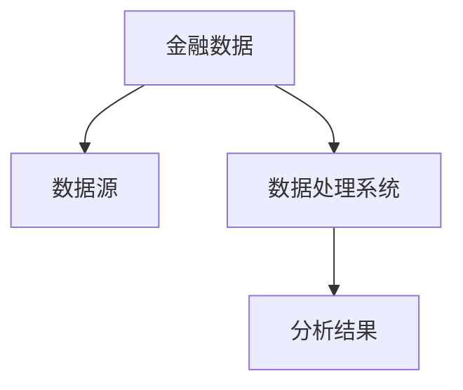
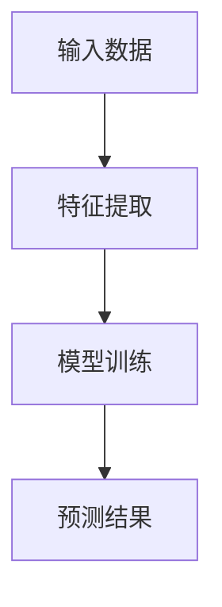
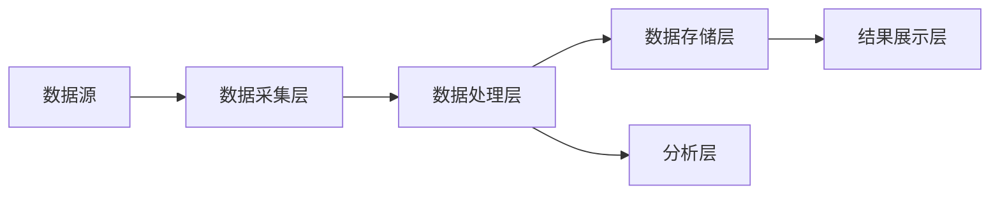
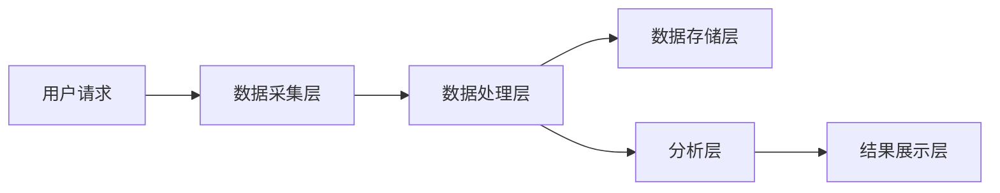

                 

<think>
好，我需要为《金融数据的实时处理与分析》这本书设计一个详细且符合要求的目录。首先，我需要理解这本书的核心内容和目标读者。这本书旨在探讨金融数据的实时处理与分析，涉及数据采集、处理、分析和系统设计等方面。目标读者可能是金融从业者、数据科学家和软件工程师。

接下来，我参考了用户提供的示例，发现目录分为七个部分，包括背景、技术基础、算法原理、系统架构、项目实战、小结等。这种结构有助于读者系统地理解从理论到实践的全过程。因此，我打算沿用类似的结构，确保内容全面且有条理。

在第一部分，我需要介绍金融数据实时处理的背景和概念，包括数据的重要性、实时处理的必要性以及相关技术挑战。这里可以加入数据流的实体关系图，帮助读者理解数据流动。

第二部分是技术基础，涵盖数据采集、预处理和存储。我需要详细讲解常用工具如Kafka和Flink，以及数据存储的最佳实践。这部分可能需要比较不同工具的优缺点，帮助读者选择合适的解决方案。

第三部分聚焦于算法原理，特别是时间序列分析和机器学习的应用。我需要解释这些算法的工作原理，并通过数学公式和流程图来辅助理解。例如，ARIMA模型的公式展示和分类算法的流程图。

第四部分涉及系统架构设计，这部分需要分析如何构建实时处理系统。我会设计一个系统的架构图，展示各个组件的交互，如数据源、处理节点和存储模块。

第五部分是项目实战，通过具体的案例（如股票价格预测）展示如何从数据采集到模型部署。这部分需要详细描述代码实现和系统设计，帮助读者实际操作。

最后，在总结部分，我需要回顾整个内容，强调关键点，并给出进一步学习的建议。此外，添加一些注意事项，提醒读者在实际操作中需要注意的问题。

在撰写过程中，我需要确保每个章节都包含足够的细节，比如使用表格和流程图来直观展示信息。同时，数学公式要用LaTeX格式，并用mermaid绘制流程图和架构图，使内容更加清晰易懂。

最后，检查整个目录的逻辑连贯性，确保每个部分自然过渡，内容完整。这样，读者能够顺畅地从理论学习到实际应用，充分理解和掌握金融数据实时处理与分析的技术要点。
</think>

# 《金融数据的实时处理与分析》

---

## 关键词：
金融数据、实时处理、数据分析、流处理技术、时间序列、机器学习

---

## 摘要：
本文深入探讨了金融数据的实时处理与分析的核心技术与方法。首先，从金融数据的特点与实时处理的重要性入手，分析了实时处理与分析的背景和概念。接着，详细讲解了数据采集、预处理、存储以及实时数据流处理的技术基础，包括常用工具如Kafka、Flink等的原理与应用。随后，重点介绍了时间序列分析、机器学习在实时分析中的应用，以及这些算法的数学模型和实现细节。在系统设计部分，探讨了实时处理系统的架构、接口设计和交互流程，并通过具体案例展示了项目实战。最后，总结了金融数据实时处理与分析的关键点，并提出了进一步优化的建议。

---

# 第一部分: 金融数据的实时处理与分析概述

---

## 第1章: 金融数据实时处理与分析的背景与概念

### 1.1 金融数据的重要性与实时性需求
#### 1.1.1 金融数据的特点与分类
- **特点**：实时性、连续性、波动性、复杂性
- **分类**：
  - 市场数据（如股票价格、指数、成交量）
  - 交易数据（如订单、成交记录）
  - 财务数据（如财务报表、信用评分）

#### 1.1.2 实时处理的必要性
- 金融市场的快速变化要求数据处理必须实时进行
- 实时分析能够帮助金融机构做出快速决策
- 实时数据是高频交易和算法交易的基础

#### 1.1.3 金融数据处理的边界与外延
- **边界**：仅处理实时生成的金融数据，不涉及历史数据分析
- **外延**：结合实时数据与其他数据源（如新闻、社交媒体）进行综合分析

#### 1.1.4 核心概念与联系
- **核心概念原理**：
  - 数据流：实时生成并不断更新的金融数据
  - 数据处理：对数据流进行清洗、转换和分析
  - 数据分析：从数据中提取有用信息，支持决策
- **概念属性特征对比表格**
```markdown
| 概念 | 属性 | 特征 |
|------|------|------|
| 数据流 | 输入 | 实时 |
| 数据处理 | 方法 | 并行处理 |
| 数据分析 | 输出 | 预测结果 |
```

#### 1.1.5 ER实体关系图架构


---

## 第2章: 数据采集与预处理

### 2.1 数据采集技术
#### 2.1.1 数据源的多样性
- 常见数据源：
  - 交易所API
  - 财务系统日志
  - 第三方数据服务提供商

#### 2.1.2 实时数据采集的挑战
- 数据量大、频率高
- 数据格式多样
- 网络延迟和丢包问题

#### 2.1.3 常用数据采集工具
- Kafka：高吞吐量、低延迟的消息队列
- Apache Flume：日志收集工具
- Python的异步IO库（如asyncio）

### 2.2 数据预处理方法
#### 2.2.1 数据清洗与标准化
- 清洗：去除噪声数据、处理缺失值
- 标准化：将数据转换为统一格式（如时间戳标准化）

#### 2.2.2 数据转换与特征提取
- 数据转换：将原始数据转换为适合分析的形式（如将时间序列数据转换为差分序列）
- 特征提取：从数据中提取有用的特征（如波动率、平均值）

#### 2.2.3 时间序列数据的特殊处理
- 数据平滑：使用滑动平均法消除短期波动
- 数据分解：将时间序列分解为趋势、季节性和随机成分

### 2.3 数据存储解决方案
#### 2.3.1 数据库选择
- HBase：适合大规模实时数据存储
- InfluxDB：适合时间序列数据存储
- MySQL：适合结构化数据存储

#### 2.3.2 数据存储结构设计
- 时间戳作为主键
- 分片存储：按时间或数据类型分片
- 索引优化：建立时间戳索引

---

## 第3章: 实时数据流处理技术

### 3.1 数据流处理框架
#### 3.1.1 Apache Flink的核心原理
- Flink的流式处理模型
- 窗口机制：时间窗口、滑动窗口
- Checkpoint机制：确保数据处理的容错性

#### 3.1.2 Apache Kafka在实时处理中的作用
- Kafka作为消息队列，用于数据分发
- Kafka Consumer用于实时消费数据
- Kafka的分区机制提高吞吐量

#### 3.1.3 其他流处理框架对比
- Apache Storm：实时流处理框架
- Apache Samza：分布式流处理框架
- Apache Pulsar：支持实时处理的消息平台

### 3.2 窗口机制与时间处理
#### 3.2.1 时间窗口的定义与实现
- 时间窗口：固定时间段内的数据处理（如1分钟、5分钟）
- 滴水型窗口：按固定时间间隔处理数据
- 会话窗口：基于用户行为的会话定义

#### 3.2.2 时间戳与水印的处理逻辑
- 时间戳：为每条数据打上时间戳
- 水印：用于处理延迟到达的数据

### 3.3 数据流处理的性能优化
#### 3.3.1 并行处理与资源分配
- 并行消费：提高数据处理速度
- 资源分配：合理分配计算资源

#### 3.3.2 网络传输优化
- 使用压缩技术减少数据传输量
- 本地处理：减少网络传输延迟

#### 3.3.3 数据处理逻辑优化
- 减少不必要的数据转换步骤
- 使用高效的数据结构和算法

---

## 第4章: 金融数据实时分析的算法原理

### 4.1 时间序列分析
#### 4.1.1 时间序列分析的基本概念
- 时间序列：按时间顺序排列的数据
- 平稳性：时间序列的统计特性不随时间变化

#### 4.1.2 常用时间序列模型
- ARIMA模型：自回归积分滑动模型
- LSTM网络：长短期记忆网络
- Prophet模型：基于时间序列的预测模型

#### 4.1.3 时间序列预测的数学模型
- ARIMA模型的数学公式：
  $$ ARIMA(p, d, q) $$
  其中，p为自回归阶数，d为差分阶数，q为移动平均阶数

- LSTM网络的结构：
  ```mermaid
  graph LR
  A[输入数据] --> B[输入门] --> C[遗忘门] --> D[输出门]
  B --> E[记忆单元] --> C
  C --> F[隐藏层] --> D
  D --> G[输出]
  ```

### 4.2 机器学习在实时分析中的应用
#### 4.2.1 实时分类与回归
- 分类：预测金融市场的涨跌趋势
- 回归：预测股票价格的变动幅度

#### 4.2.2 机器学习模型的实时更新
- 在线学习：模型在实时数据流上不断更新
- 模型版本控制：管理不同版本的模型

#### 4.2.3 分类算法的流程图


---

## 第5章: 金融数据实时处理系统的架构设计

### 5.1 系统架构设计
#### 5.1.1 系统组成
- 数据采集层：实时采集金融数据
- 数据处理层：清洗、转换和分析数据
- 数据存储层：存储处理后的数据
- 分析层：提供实时分析结果

#### 5.1.2 系统架构图


### 5.2 系统接口设计
#### 5.2.1 数据接口
- REST API：提供数据查询接口
- WebSocket：实时推送分析结果

#### 5.2.2 模型接口
- API接口：提供模型训练和预测接口

### 5.3 系统交互流程图


---

## 第6章: 项目实战——股票价格预测系统

### 6.1 项目背景与目标
- 目标：基于实时股票价格数据，预测未来价格走势

### 6.2 系统设计
#### 6.2.1 数据流设计
- 数据采集：通过API实时获取股票价格数据
- 数据处理：清洗和转换数据
- 数据存储：存储历史数据和预测结果

#### 6.2.2 系统实现
- 使用Flink进行实时数据处理
- 使用LSTM网络进行价格预测

### 6.3 代码实现
#### 6.3.1 数据采集代码
```python
import requests

def get_stock_price(symbol):
    url = f"https://api.example.com/stock/{symbol}"
    response = requests.get(url)
    return response.json()['price']
```

#### 6.3.2 LSTM网络实现
```python
import tensorflow as tf
from tensorflow.keras import layers

model = tf.keras.Sequential([
    layers.LSTM(50, return_sequences=True),
    layers.LSTM(50),
    layers.Dense(1)
])
```

### 6.4 案例分析
- 数据分析：分析股票价格的波动趋势
- 模型评估：计算预测准确率
- 结果展示：可视化预测结果

---

## 第7章: 总结与展望

### 7.1 本章小结
- 金融数据的实时处理与分析是金融机构的核心能力
- 实时数据处理技术是实现高效数据分析的基础
- 时间序列分析和机器学习是实时分析的核心算法

### 7.2 注意事项
- 数据安全：确保金融数据的安全性
- 系统稳定性：保证实时处理系统的稳定运行
- 模型优化：不断提升预测模型的准确性

### 7.3 拓展阅读
- 《大数据分析与机器学习》
- 《实时数据流处理技术》

---

## 作者：
AI天才研究院/AI Genius Institute & 禅与计算机程序设计艺术/Zen And The Art of Computer Programming

