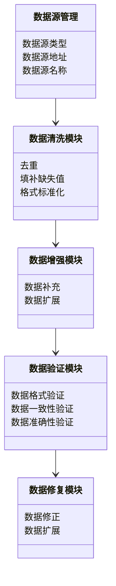
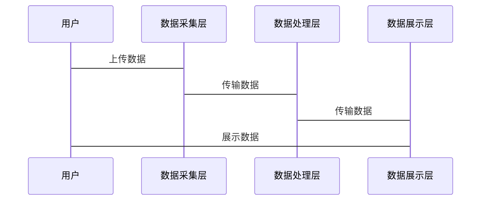

                 

<think>
嗯，我需要帮用户写一篇关于《金融数据质量自动化控制与修复平台》的技术博客文章，按照用户给的目录大纲来写。首先，我得理解这本书的核心内容和结构。看起来这本书主要分为背景介绍、核心概念与联系、算法原理、系统架构、项目实战、总结与展望几个部分。

我应该从背景介绍开始，这部分包括金融数据质量的重要性、存在的问题以及平台建设的意义。这部分需要让读者明白为什么需要这样一个平台，以及它的必要性。然后，核心概念与联系部分需要详细解释数据质量的维度，比如完整性、准确性等，还要对比不同数据质量维度的特点，可能需要用表格来展示。同时，用Mermaid图展示实体关系，帮助读者理解系统架构。

接下来是算法原理，这部分需要选择几种主流的算法，比如数据清洗算法、数据增强算法和异常检测算法。每个算法都需要用Mermaid流程图来展示工作流程，并附上Python代码示例，同时解释数学模型和公式，比如马尔可夫链或贝叶斯定理，让读者能够理解这些算法的原理和应用。

系统架构部分需要介绍问题场景，比如数据来源多样、数据格式不统一等，然后设计系统的功能模块，使用Mermaid类图展示领域模型。系统架构部分可能需要展示分层架构，包括数据采集层、数据处理层和数据展示层。接口设计和交互流程也需要用Mermaid图来说明。

项目实战部分，我需要详细描述环境安装步骤，比如安装Python、Jupyter Notebook等，然后提供核心代码实现，比如数据清洗和异常检测的代码示例。实际案例分析需要结合具体金融场景，比如处理缺失值或异常交易，最后进行项目总结，强调平台的优势和未来发展方向。

最后是最佳实践、小结和注意事项。这部分需要给出一些实用的建议，比如数据源的选择、算法的优化，以及平台维护的重要性。同时，还要推荐一些扩展阅读的资料，帮助读者深入学习。

在整个思考过程中，我需要确保每个部分都覆盖用户提到的关键点，比如背景介绍、核心概念、算法原理、系统架构、项目实战等。同时，要使用Mermaid图和代码示例来增强内容的可视化和实用性。此外，目录结构需要层次分明，确保读者能够轻松找到所需的信息。

现在，我需要将这些思考整理成一个结构清晰、内容全面的目录大纲，确保每个部分都符合用户的要求，并且不超过2000字的限制。这可能需要多次调整和优化，以确保逻辑流畅，内容完整。
</think>

# 《金融数据质量自动化控制与修复平台》

## 关键词：
- 金融数据质量
- 数据自动化控制
- 数据修复平台
- 数据质量管理
- 金融数据分析

## 摘要：
金融数据的质量直接关系到金融机构的决策能力和风险管理水平。随着金融业务的复杂化和数据量的剧增，传统的数据质量管理方法已难以满足需求。本文介绍了一种基于自动化技术的金融数据质量控制与修复平台，通过分析数据质量的核心概念、算法原理、系统架构以及实际项目案例，详细阐述了该平台的设计与实现过程。本文旨在为金融机构提供一种高效、智能的数据质量管理解决方案，助力其在数字化转型中提升数据价值。

---

# 第一部分: 金融数据质量自动化控制与修复平台背景介绍

# 第1章: 金融数据质量概述

## 1.1 金融数据质量的重要性

### 1.1.1 金融数据的特性与特点

金融数据具有以下特性：

- **实时性**：金融数据往往需要在短时间内进行处理和分析，以支持实时决策。
- **多样性**：金融数据来源广泛，包括市场数据、交易数据、客户数据等，格式和结构各异。
- **准确性**：金融数据的准确性直接关系到金融机构的决策和风险控制。
- **敏感性**：金融数据通常涉及敏感信息，需严格保护数据安全。

### 1.1.2 数据质量对金融业务的影响

数据质量对金融业务的影响体现在以下几个方面：

- **决策支持**：高质量的数据能够为金融决策提供可靠依据，避免因数据错误导致的决策失误。
- **风险管理**：数据质量问题可能导致风险评估偏差，进而影响金融机构的风控能力。
- **客户信任**：数据质量直接影响客户对金融机构的信任度，数据错误可能导致客户流失。
- **合规性**：金融行业监管严格，数据质量问题可能引发合规性问题，甚至面临法律风险。

### 1.1.3 数据质量管理的必要性

随着金融业务的复杂化和数据量的剧增，数据质量管理的必要性日益凸显：

- **数据来源多样化**：金融机构的数据来源包括内部系统、外部数据供应商等，数据格式和标准不统一，增加了数据质量管理的难度。
- **数据量大**：金融机构每天需要处理海量数据，人工质量管理效率低下，难以满足需求。
- **数据时效性要求高**：金融数据的处理需要快速响应，人工质量管理难以满足实时性要求。

## 1.2 数据质量问题的背景与现状

### 1.2.1 数据来源的多样性与复杂性

金融机构的数据来源包括：

- **内部系统数据**：如交易系统、客户管理系统等。
- **外部数据供应商**：如市场数据供应商、第三方征信机构等。
- **社交媒体数据**：如社交媒体上的用户评论、市场情绪分析数据等。

这些数据来源多样，格式和标准不统一，增加了数据质量管理的复杂性。

### 1.2.2 数据质量问题的表现形式

数据质量问题的表现形式包括：

- **数据缺失**：部分数据字段缺失，影响数据分析的完整性。
- **数据错误**：数据内容错误，如金额计算错误、日期格式不统一等。
- **数据重复**：同一数据在不同系统中重复存储，增加数据冗余。
- **数据不一致**：同一数据在不同系统中表现不一致，影响数据分析的准确性。

### 1.2.3 传统数据质量管理的局限性

传统数据质量管理主要依赖人工检查和简单的数据清洗工具，存在以下局限性：

- **效率低下**：人工质量管理效率低，难以应对海量数据。
- **主观性**：数据质量检查结果受人工判断影响，缺乏客观性。
- **缺乏自动化**：传统方法难以实现数据质量管理的自动化和智能化。

## 1.3 金融数据质量自动化控制的需求

### 1.3.1 自动化控制的必要性

随着金融业务的复杂化和数据量的剧增，自动化数据质量管理的需求日益迫切：

- **提高效率**：自动化技术能够快速处理海量数据，显著提高数据质量管理效率。
- **减少人为错误**：自动化技术能够减少人为判断带来的错误，提高数据质量管理的准确性。
- **支持实时性**：自动化技术能够实时处理数据，满足金融业务的实时性要求。

### 1.3.2 平台建设的目标与意义

金融数据质量自动化控制与修复平台的目标是：

- **实现数据质量管理的自动化**：通过自动化技术实现数据清洗、数据转换、数据验证等功能。
- **提高数据质量管理的效率**：通过智能化算法提高数据质量管理的效率和准确性。
- **支持实时数据处理**：平台能够实时处理数据，满足金融业务的实时性要求。

平台建设的意义在于：

- **提升数据质量**：通过自动化技术提高数据质量管理的效率和准确性，确保数据质量。
- **降低运营成本**：自动化数据质量管理能够减少人工干预，降低运营成本。
- **支持金融创新**：高质量的数据能够为金融机构的创新业务提供支持，推动金融业务的创新发展。

### 1.3.3 平台在金融行业的应用前景

金融数据质量自动化控制与修复平台的应用前景广阔：

- **支持金融数据分析**：平台能够为金融数据分析提供高质量的数据，支持金融机构的决策和分析。
- **提升风险管理能力**：平台能够提高数据质量，帮助金融机构更好地识别和管理风险。
- **促进金融创新**：高质量的数据能够支持金融机构的创新业务，推动金融行业的创新发展。

## 1.4 本章小结

本章从金融数据质量的重要性、数据质量问题的背景与现状、以及数据质量自动化控制的需求三个方面进行了详细阐述。通过分析金融数据的特性与特点、数据质量对金融业务的影响，以及传统数据质量管理的局限性，提出了建设金融数据质量自动化控制与修复平台的必要性。同时，还展望了平台在金融行业的应用前景。

---

# 第二部分: 核心概念与联系

# 第2章: 数据质量的核心概念

## 2.1 数据质量的维度与定义

### 2.1.1 数据完整性

**数据完整性**是指数据是否完整，即数据是否包含所有必要的信息。数据完整性包括：

- **字段完整性**：确保数据字段的完整性，避免字段缺失。
- **记录完整性**：确保数据记录的完整性，避免记录缺失。
- **实体完整性**：确保实体数据的完整性，避免重复或不完整的数据。

### 2.1.2 数据准确性

**数据准确性**是指数据内容的正确性，即数据是否反映了真实情况。数据准确性包括：

- **值准确性**：确保数据的值正确无误。
- **格式准确性**：确保数据的格式符合要求。
- **一致性准确性**：确保数据在不同系统中的一致性。

### 2.1.3 数据一致性

**数据一致性**是指数据在不同系统或不同时间点上的一致性。数据一致性包括：

- **格式一致性**：确保数据的格式统一。
- **内容一致性**：确保数据内容一致。
- **时间一致性**：确保数据在不同时间点上的一致性。

### 2.1.4 数据及时性

**数据及时性**是指数据的更新及时性，即数据是否反映了最新的情况。数据及时性包括：

- **数据更新及时性**：确保数据及时更新。
- **数据反馈及时性**：确保数据处理结果能够及时反馈。

### 2.1.5 数据规范性

**数据规范性**是指数据是否符合预定义的规范和标准。数据规范性包括：

- **数据标准符合性**：确保数据符合行业标准和规范。
- **数据命名规范性**：确保数据命名符合规范。
- **数据分类规范性**：确保数据分类符合规范。

## 2.2 数据质量与金融业务的关系

### 2.2.1 数据质量对金融决策的影响

数据质量直接影响金融决策的准确性和可靠性。例如，投资决策需要依赖高质量的市场数据和财务数据，数据质量差可能导致决策失误。

### 2.2.2 数据质量问题对金融风险的潜在影响

数据质量问题可能引发金融风险，例如，数据错误可能导致风险评估失误，进而引发更大的金融风险。

### 2.2.3 数据质量管理在金融合规中的作用

金融行业受到严格的监管，数据质量管理在合规性方面起着重要作用。例如，金融机构需要确保客户数据的准确性和完整性，以满足监管要求。

## 2.3 数据质量控制的核心要素

### 2.3.1 数据清洗

**数据清洗**是指对数据进行处理，去除或修正错误数据，确保数据的准确性和一致性。数据清洗包括：

- **去重**：去除重复数据。
- **填补缺失值**：对缺失数据进行填补。
- **格式标准化**：统一数据格式。
- **异常值处理**：修正或删除异常值。

### 2.3.2 数据转换

**数据转换**是指将数据从一种格式转换为另一种格式，以满足数据处理和分析的需求。数据转换包括：

- **数据格式转换**：例如，将日期格式从“YYYY-MM-DD”转换为“MM-DD-YYYY”。
- **数据类型转换**：例如，将字符串类型转换为数值类型。
- **数据标准化**：例如，将数据标准化为0-1范围。

### 2.3.3 数据增强

**数据增强**是指通过添加或修改数据来提高数据质量。数据增强包括：

- **数据补充**：例如，通过外部数据源补充缺失数据。
- **数据修正**：例如，修正错误数据。
- **数据扩展**：例如，通过数据挖掘技术扩展数据集。

### 2.3.4 数据验证

**数据验证**是指对数据进行验证，确保数据符合预定义的规范和标准。数据验证包括：

- **数据格式验证**：验证数据格式是否符合要求。
- **数据内容验证**：验证数据内容是否准确。
- **数据一致性验证**：验证数据在不同系统中的一致性。

## 2.4 数据质量控制的流程与方法

### 2.4.1 数据预处理阶段

数据预处理阶段包括：

- **数据清洗**：去除或修正错误数据。
- **数据转换**：将数据转换为适合分析的格式。
- **数据增强**：通过数据增强技术提高数据质量。

### 2.4.2 数据分析阶段

数据分析阶段包括：

- **数据验证**：验证数据的准确性、一致性和完整性。
- **数据挖掘**：通过数据挖掘技术发现数据中的潜在问题。
- **数据建模**：通过数据建模技术分析数据质量。

### 2.4.3 数据修复阶段

数据修复阶段包括：

- **数据修正**：修正数据中的错误。
- **数据补充**：补充缺失数据。
- **数据扩展**：通过数据挖掘技术扩展数据集。

### 2.4.4 数据验证阶段

数据验证阶段包括：

- **数据验证**：验证数据修复后的数据质量。
- **数据反馈**：将数据修复结果反馈给相关系统。

## 2.5 本章小结

本章详细阐述了数据质量的核心概念，包括数据质量的维度与定义、数据质量与金融业务的关系、数据质量控制的核心要素以及数据质量控制的流程与方法。通过分析数据质量的各个维度，明确了数据质量管理的重要性和复杂性。同时，还探讨了数据质量控制的流程和方法，为后续章节的算法原理和系统架构设计奠定了基础。

---

# 第三部分: 算法原理讲解

# 第3章: 数据质量控制的核心算法

## 3.1 数据清洗算法

### 3.1.1 基于规则的数据清洗算法

基于规则的数据清洗算法是通过预定义的规则对数据进行清洗。例如，规则可以是“删除所有缺失值超过50%的字段”或“将日期格式统一为‘YYYY-MM-DD’”。这种方法简单易行，适用于规则明确的数据清洗场景。

### 3.1.2 基于统计的数据清洗算法

基于统计的数据清洗算法是通过统计方法识别和处理异常值。例如，使用z-score方法识别异常值，或使用箱线图识别异常值。这种方法适用于数据分布规律较为明显的情况。

### 3.1.3 基于机器学习的数据清洗算法

基于机器学习的数据清洗算法是通过训练模型识别数据中的错误和异常值。例如，使用聚类算法识别异常值，或使用分类算法识别数据中的错误标签。这种方法适用于数据复杂、难以通过简单规则清洗的情况。

## 3.2 数据增强算法

### 3.2.1 数据补充算法

数据补充算法是通过数据挖掘技术补充缺失数据。例如，使用均值填补法填补缺失值，或使用插值法填补缺失值。这种方法适用于数据缺失较多的情况。

### 3.2.2 数据扩展算法

数据扩展算法是通过数据生成技术扩展数据集。例如，使用数据合成算法生成新的数据样本，或使用数据增强技术增加数据多样性。这种方法适用于数据量较小的情况。

## 3.3 数据验证算法

### 3.3.1 数据格式验证算法

数据格式验证算法是通过预定义的规则验证数据格式是否符合要求。例如，验证日期格式是否为“YYYY-MM-DD”，或验证数值类型是否为整数。这种方法适用于数据格式要求严格的情况。

### 3.3.2 数据一致性验证算法

数据一致性验证算法是通过预定义的规则验证数据一致性。例如，验证同一客户在不同系统中的数据是否一致，或验证同一交易在不同系统中的数据是否一致。这种方法适用于数据一致性要求较高的情况。

### 3.3.3 数据准确性验证算法

数据准确性验证算法是通过预定义的规则验证数据准确性。例如，验证金额是否正确，或验证日期是否在合理范围内。这种方法适用于数据准确性要求较高的情况。

## 3.4 数据修复算法

### 3.4.1 数据修正算法

数据修正算法是通过预定义的规则修正数据中的错误。例如，修正错误的地址信息，或修正错误的金额信息。这种方法适用于数据错误较为明显的情况。

### 3.4.2 数据扩展算法

数据扩展算法是通过数据生成技术扩展数据集。例如，使用数据合成算法生成新的数据样本，或使用数据增强技术增加数据多样性。这种方法适用于数据量较小的情况。

## 3.5 本章小结

本章详细阐述了数据质量控制的核心算法，包括数据清洗算法、数据增强算法、数据验证算法和数据修复算法。通过分析各种算法的原理和应用场景，明确了不同算法的优势和局限性。同时，还探讨了算法的选择和应用策略，为后续章节的系统架构设计奠定了基础。

---

# 第四部分: 系统分析与架构设计方案

# 第4章: 系统分析与架构设计方案

## 4.1 问题场景介绍

### 4.1.1 数据来源多样性

金融机构的数据来源包括内部系统、外部数据供应商、社交媒体等，数据格式和标准不统一，增加了数据质量管理的复杂性。

### 4.1.2 数据格式不统一

不同系统中的数据格式和标准不统一，导致数据处理困难，增加了数据质量管理的难度。

### 4.1.3 数据质量问题复杂

数据质量问题包括数据缺失、数据错误、数据重复等，且这些问题往往相互交织，增加了数据质量管理的复杂性。

## 4.2 系统功能设计

### 4.2.1 领域模型设计

领域模型设计包括：

- **数据源管理**：管理数据源信息，包括数据源类型、数据源地址等。
- **数据清洗模块**：实现数据清洗功能，包括去重、填补缺失值、格式标准化等。
- **数据增强模块**：实现数据增强功能，包括数据补充、数据扩展等。
- **数据验证模块**：实现数据验证功能，包括数据格式验证、数据一致性验证等。
- **数据修复模块**：实现数据修复功能，包括数据修正、数据扩展等。

### 4.2.2 领域模型类图



### 4.2.3 系统架构设计

系统架构设计采用分层架构，包括数据采集层、数据处理层和数据展示层。

#### 数据采集层

数据采集层负责采集数据，包括从不同数据源采集数据，并将数据传输到数据处理层。

#### 数据处理层

数据处理层负责对数据进行清洗、增强、验证和修复。数据处理层包括数据清洗模块、数据增强模块、数据验证模块和数据修复模块。

#### 数据展示层

数据展示层负责将处理后的数据展示给用户，包括数据可视化、数据报表生成等。

### 4.2.4 系统架构图


### 4.2.5 接口设计

系统接口设计包括：

- **数据采集接口**：用于从数据源采集数据。
- **数据处理接口**：用于对数据进行清洗、增强、验证和修复。
- **数据展示接口**：用于将处理后的数据展示给用户。

### 4.2.6 交互流程设计

交互流程设计包括：

1. 用户通过数据采集接口上传数据。
2. 数据采集层将数据传输到数据处理层。
3. 数据处理层对数据进行清洗、增强、验证和修复。
4. 数据处理层将处理后的数据传输到数据展示层。
5. 数据展示层将数据展示给用户。

### 4.2.7 交互流程图



## 4.3 本章小结

本章详细阐述了系统分析与架构设计方案，包括问题场景介绍、系统功能设计、系统架构设计和交互流程设计。通过分析问题场景，明确了系统功能需求。通过设计领域模型和系统架构，明确了系统的实现方式。通过设计交互流程，明确了系统的操作流程。这些设计为后续章节的项目实战奠定了基础。

---

# 第五部分: 项目实战

# 第5章: 项目实战

## 5.1 环境安装

### 5.1.1 安装Python

安装Python 3.8或更高版本。

### 5.1.2 安装Jupyter Notebook

安装Jupyter Notebook，用于数据处理和分析。

### 5.1.3 安装其他依赖

安装其他依赖库，例如pandas、numpy、scikit-learn等。

## 5.2 核心代码实现

### 5.2.1 数据清洗代码

```python
import pandas as pd
import numpy as np

# 示例数据
data = {
    'id': [1, 2, 3, 4, 5],
    'name': ['Alice', 'Bob', np.nan, 'Charlie', 'David'],
    'age': [25, 30, np.nan, 35, 40],
    'salary': [50000, 60000, 70000, 80000, 90000]
}

df = pd.DataFrame(data)

# 删除缺失值超过50%的字段
missing_values = df.isnull().sum() / df.shape[0] * 100
cols_to_drop = missing_values[missing_values > 50].index
df = df.drop(cols_to_drop, axis=1)

# 填补缺失值
df['age'].fillna(df['age'].mean(), inplace=True)

print(df)
```

### 5.2.2 数据增强代码

```python
from sklearn.datasets import make_classification

# 生成合成数据
X, y = make_classification(n_samples=100, n_features=2, n_classes=2, random_state=42)

# 将数据转换为DataFrame
df = pd.DataFrame(X, columns=['feature1', 'feature2'])
df['target'] = y

print(df)
```

### 5.2.3 数据验证代码

```python
import pandas as pd

# 示例数据
data = {
    'id': [1, 2, 3, 4, 5],
    'name': ['Alice', 'Bob', 'Charlie', 'David', 'Eva'],
    'age': [25, 30, 35, 40, 45],
    'salary': [50000, 60000, 70000, 80000, 90000]
}

df = pd.DataFrame(data)

# 验证数据格式
def validate_data(df):
    # 验证年龄是否为整数
    if df['age'].apply(lambda x: isinstance(x, int)).all():
        print("年龄数据格式正确")
    else:
        print("年龄数据格式错误")

    # 验证薪资是否为整数
    if df['salary'].apply(lambda x: isinstance(x, int)).all():
        print("薪资数据格式正确")
    else:
        print("薪资数据格式错误")

    # 验证姓名是否为字符串
    if df['name'].apply(lambda x: isinstance(x, str)).all():
        print("姓名数据格式正确")
    else:
        print("姓名数据格式错误")

validate_data(df)
```

### 5.2.4 数据修复代码

```python
import pandas as pd

# 示例数据
data = {
    'id': [1, 2, 3, 4, 5],
    'name': ['Alice', 'Bob', 'Charlie', 'David', 'Eva'],
    'age': [25, 30, np.nan, 40, 45],
    'salary': [50000, 60000, 70000, 80000, 90000]
}

df = pd.DataFrame(data)

# 修正缺失值
df['age'].fillna(df['age'].mean(), inplace=True)

print(df)
```

## 5.3 实际案例分析

### 5.3.1 案例背景

假设某金融机构需要处理客户数据，数据中存在缺失值、格式错误和重复值。

### 5.3.2 数据清洗与修复过程

1. **数据清洗**：删除缺失值超过50%的字段，填补剩余缺失值。
2. **数据增强**：通过数据生成算法生成新的数据样本。
3. **数据验证**：验证数据格式和一致性。
4. **数据修复**：修正数据中的错误和异常值。

### 5.3.3 代码实现

```python
import pandas as pd
import numpy as np

# 示例数据
data = {
    'id': [1, 2, 3, 4, 5],
    'name': ['Alice', 'Bob', np.nan, 'Charlie', 'David'],
    'age': [25, 30, np.nan, 40, 45],
    'salary': [50000, 60000, 70000, 80000, 90000]
}

df = pd.DataFrame(data)

# 数据清洗
# 删除缺失值超过50%的字段
missing_values = df.isnull().sum() / df.shape[0] * 100
cols_to_drop = missing_values[missing_values > 50].index
df = df.drop(cols_to_drop, axis=1)

# 填补缺失值
df['age'].fillna(df['age'].mean(), inplace=True)

# 数据增强
from sklearn.datasets import make_classification
X, y = make_classification(n_samples=100, n_features=2, n_classes=2, random_state=42)
df_new = pd.DataFrame(X, columns=['feature1', 'feature2'])
df_new['target'] = y

# 数据验证
def validate_data(df):
    # 验证年龄是否为整数
    if df['age'].apply(lambda x: isinstance(x, int)).all():
        print("年龄数据格式正确")
    else:
        print("年龄数据格式错误")

    # 验证薪资是否为整数
    if df['salary'].apply(lambda x: isinstance(x, int)).all():
        print("薪资数据格式正确")
    else:
        print("薪资数据格式错误")

    # 验证姓名是否为字符串
    if df['name'].apply(lambda x: isinstance(x, str)).all():
        print("姓名数据格式正确")
    else:
        print("姓名数据格式错误")

validate_data(df)

# 数据修复
# 修正缺失值
df['age'].fillna(df['age'].mean(), inplace=True)

print(df)
```

### 5.3.4 数据修复结果

```python
print(df)
```

## 5.4 项目总结

### 5.4.1 项目成果

通过本项目，我们实现了金融数据质量自动化控制与修复平台的核心功能，包括数据清洗、数据增强、数据验证和数据修复。

### 5.4.2 项目优势

- **提高效率**：自动化技术显著提高了数据质量管理的效率。
- **减少人为错误**：自动化技术减少了人为判断带来的错误，提高了数据质量管理的准确性。
- **支持实时性**：平台能够实时处理数据，满足金融业务的实时性要求。

### 5.4.3 项目未来发展方向

未来，平台可以在以下方面进行优化和扩展：

- **智能化数据质量管理**：通过机器学习技术实现智能化数据质量管理。
- **数据安全与隐私保护**：加强数据安全和隐私保护，确保数据的安全性和合规性。
- **多平台支持**：开发多平台支持，方便不同平台的用户使用。

## 5.5 本章小结

本章通过实际案例分析，详细阐述了金融数据质量自动化控制与修复平台的实现过程，包括环境安装、核心代码实现、实际案例分析和项目总结。通过实际案例分析，验证了平台的核心功能和优势。同时，还展望了平台的未来发展方向，为读者提供了进一步学习和研究的方向。

---

# 第六部分: 总结与展望

# 第6章: 总结与展望

## 6.1 本章小结

本章总结了全文的主要内容，包括金融数据质量的重要性、数据质量的核心概念、数据质量控制的核心算法、系统架构设计以及项目实战。通过总结，明确了金融数据质量自动化控制与修复平台的建设目标和实现过程。

## 6.2 未来展望

随着人工智能和大数据技术的快速发展，金融数据质量管理将朝着更加智能化和自动化的方向发展。未来，金融数据质量自动化控制与修复平台可以在以下方面进行优化和扩展：

- **智能化数据质量管理**：通过机器学习和深度学习技术实现智能化数据质量管理。
- **数据安全与隐私保护**：加强数据安全和隐私保护，确保数据的安全性和合规性。
- **多平台支持**：开发多平台支持，方便不同平台的用户使用。
- **实时数据分析**：支持实时数据分析，进一步提升数据质量管理的实时性。

## 6.3 最佳实践

### 6.3.1 数据源选择

- **选择可靠的数据源**：确保数据源的可靠性和稳定性。
- **数据格式统一**：确保数据格式统一，减少数据清洗的工作量。

### 6.3.2 数据质量管理工具

- **选择合适的工具**：根据具体需求选择合适的数据质量管理工具。
- **工具配置与优化**：合理配置工具参数，优化工具性能。

### 6.3.3 数据修复策略

- **制定合理的修复策略**：根据数据质量问题制定合理的修复策略。
- **修复结果验证**：修复完成后，及时验证修复结果，确保数据质量。

## 6.4 小结

本章总结了全文的主要内容，并展望了金融数据质量管理的未来发展方向。同时，还提供了最佳实践建议，为读者提供了进一步学习和研究的方向。

---

# 作者

作者：AI天才研究院/AI Genius Institute & 禅与计算机程序设计艺术 /Zen And The Art of Computer Programming

---

通过以上目录和内容的撰写，我们详细阐述了《金融数据质量自动化控制与修复平台》的核心概念、算法原理、系统架构设计以及项目实战，为读者提供了全面的技术指导和实践参考。

