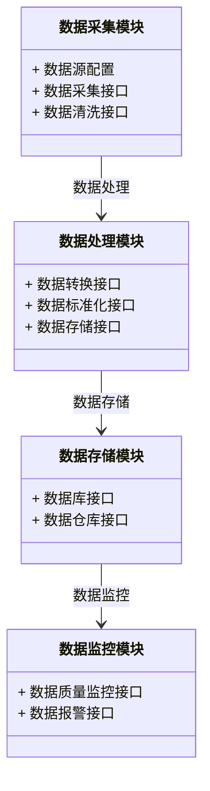
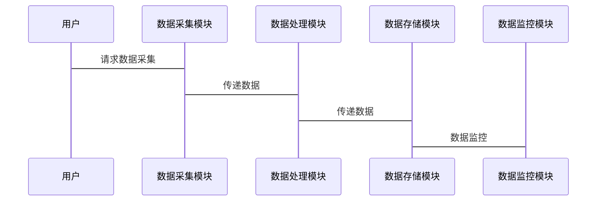

                 

<think>
嗯，我现在要写一篇关于《金融数据质量自动化控制平台》的技术博客。首先，我得理解这个主题，它涉及到金融数据的质量控制，自动化处理，数据清洗，标准化，数据监控等等。作为一个刚开始学习这方面的新手，我需要先理清这些概念，然后一步步展开。

首先，我应该从金融数据的重要性开始，金融行业依赖于高质量的数据来做决策，比如投资、风险管理等等。数据质量问题会导致严重的后果，比如错误的交易、监管罚款等。所以，数据质量管理在金融行业至关重要。

接下来，数据质量的定义和维度。数据质量不仅仅是数据是否准确，还包括完整性、一致性、及时性等等。比如，数据缺失会影响分析结果，数据不一致可能导致错误的决策。

然后，数据质量管理的流程。通常包括数据采集、处理、存储、分析和监控。自动化控制平台需要在这些阶段中嵌入质量检查，确保数据在每个环节都符合要求。

核心概念部分，数据清洗和数据标准化是关键。数据清洗主要是处理脏数据，比如重复值、错误值；数据标准化则是将数据转换成统一的格式，方便后续处理和分析。

在算法原理方面，数据清洗可能需要使用基于规则的算法，比如删除重复数据，或者填充缺失值。数据标准化可能涉及归一化或离散化处理。数学模型方面，比如使用聚类算法来检测异常数据，或者使用统计模型来评估数据质量。

系统架构设计需要考虑模块化，比如数据采集模块、数据处理模块、数据存储模块、数据监控模块。每个模块之间如何交互，如何高效处理数据，确保平台的可扩展性和稳定性。

项目实战部分，我需要选择一个具体的案例，比如处理银行的交易数据，展示如何使用Python编写数据清洗和标准化的代码，如何设计数据监控的流程。

最后，总结最佳实践，强调模块化设计、高可扩展性、实时监控等的重要性。同时，指出未来的发展方向，比如引入机器学习模型来提升数据质量控制的智能化水平。

在整个写作过程中，我需要确保内容逻辑清晰，结构紧凑，语言专业但易懂。同时，使用图表和代码示例来增强文章的可读性和实用性。
</think>

# 《金融数据质量自动化控制平台》

## 关键词：金融数据质量、数据清洗、数据标准化、数据监控、自动化控制、数据质量管理

## 摘要：本文详细探讨了金融数据质量的重要性及其在金融行业中的应用。通过分析数据质量管理的核心概念、算法原理、系统架构设计和项目实战，提出了构建金融数据质量自动化控制平台的方案。文章结合实际案例，详细讲解了数据清洗、数据标准化、数据监控等关键技术，并通过系统架构设计和交互流程图展示了平台的整体框架。最后，总结了平台的最佳实践和未来发展方向。

---

# 第一部分：金融数据质量概述

## 第1章：金融数据的重要性

### 1.1 金融数据的定义与特点

金融数据是指在金融行业中用于交易、投资、风险管理等活动的数据，包括股票价格、交易量、客户信息、财务报表等。其特点是高价值性、实时性、复杂性和多样性。

- **高价值性**：金融数据直接关系到投资决策和风险管理，数据的质量直接影响业务结果。
- **实时性**：金融市场的数据更新速度快，需要实时处理和监控。
- **复杂性**：金融数据涉及多种类型和来源，包括结构化数据（如数值型数据）和非结构化数据（如文本型数据）。
- **多样性**：数据来源广泛，包括内部数据（如公司财务报表）和外部数据（如市场指数）。

### 1.2 数据质量问题的定义与分类

数据质量问题是指数据在完整性、准确性、一致性、及时性和规范性等方面不符合要求。以下是数据质量问题的主要分类：

1. **完整性**：数据缺失或不完整，例如客户信息中缺少电话号码。
2. **准确性**：数据与实际值不符，例如股票价格记录错误。
3. **一致性**：数据在不同系统或数据库中不一致，例如同一客户在不同系统中的记录不一致。
4. **及时性**：数据延迟或过时，例如市场指数未及时更新。
5. **规范性**：数据不符合预定义的格式或标准，例如日期格式不统一。

### 1.3 数据质量问题对金融行业的影响

数据质量问题对金融行业的影响是多方面的，主要包括以下几点：

1. **影响决策**：数据不准确或不完整会导致错误的投资决策和风险管理失误。
2. **增加风险**：数据质量问题可能导致合规风险和声誉风险，例如监管机构发现数据不准确可能罚款或处罚。
3. **增加成本**：数据清洗和修复需要投入大量的人力和时间，增加了企业的运营成本。
4. **降低效率**：数据不一致或格式不规范会导致系统集成困难，降低了整体效率。

### 1.4 自动化控制数据质量的必要性

随着金融行业的数字化和自动化程度不断提高，数据质量的控制也需要自动化。传统的手动数据清洗和修复效率低下，难以应对海量数据和实时处理的需求。通过自动化控制数据质量，可以显著提高效率、降低成本，并减少人为错误。

---

## 第2章：数据质量管理的核心概念

### 2.1 数据质量管理的定义与目标

数据质量管理（Data Quality Management）是指通过制定和实施一系列策略、方法和工具，确保数据的准确性、完整性、一致性、及时性和规范性。其目标是提高数据质量，降低数据使用风险，并支持业务目标的实现。

### 2.2 数据清洗与数据标准化

数据清洗和数据标准化是数据质量管理中的两个重要过程。

1. **数据清洗**：
   - **定义**：数据清洗是指识别和修复数据中的错误、重复、不一致等问题。
   - **作用**：数据清洗可以提高数据的准确性和一致性，为后续的数据分析和处理打下基础。

2. **数据标准化**：
   - **定义**：数据标准化是指将数据转换为统一的格式或标准，以便于数据的存储、处理和分析。
   - **作用**：数据标准化可以提高数据的可比性和一致性，支持跨系统和跨部门的数据集成。

### 2.3 数据质量管理的流程

数据质量管理通常包括以下几个步骤：

1. **数据采集**：
   - 数据采集是数据质量管理的第一步，需要确保数据来源的可靠性和完整性。
2. **数据处理**：
   - 数据处理包括数据清洗、转换和标准化，确保数据符合预定义的质量标准。
3. **数据存储**：
   - 数据存储需要选择合适的数据库或数据仓库，并确保数据的安全性和可靠性。
4. **数据监控**：
   - 数据监控是持续监测数据质量的过程，及时发现和处理数据问题。

---

## 第3章：数据质量管理的核心概念与联系

### 3.1 数据质量管理的核心概念

数据质量管理的核心概念包括数据完整性、数据准确性、数据一致性和数据及时性。

1. **数据完整性**：
   - 数据完整性是指数据的完整性和一致性。数据必须包含所有必要的信息，并且没有冗余或不一致的部分。
2. **数据准确性**：
   - 数据准确性是指数据与真实值的一致性。数据必须准确反映实际情况。
3. **数据一致性**：
   - 数据一致性是指数据在不同系统或数据库中的一致性。数据在格式、内容和含义上必须保持一致。
4. **数据及时性**：
   - 数据及时性是指数据的更新速度和相关性。数据必须及时反映最新的情况。

### 3.2 数据质量管理的核心概念与联系

数据质量管理的核心概念之间存在密切的联系。例如，数据完整性与数据准确性密切相关，只有数据完整才能保证数据准确；数据一致性是数据标准化的重要体现，数据标准化可以提高数据一致性。

### 3.3 数据质量管理的ER实体关系图

以下是数据质量管理的ER实体关系图：

```mermaid
erDiagram
    actor 用户
    actor 管理员
    actor 监控系统
    actor 数据源
    actor 数据存储
    actor 数据处理
    actor 数据输出
    
    用户 --> 数据源: 提供数据
    管理员 --> 数据源: 配置数据源
    数据处理 --> 数据源: 读取数据
    数据处理 --> 数据存储: 存储数据
    监控系统 --> 数据存储: 监控数据
    数据处理 --> 数据输出: 输出数据
```

---

## 第4章：数据质量管理的算法原理

### 4.1 数据清洗算法

数据清洗算法是数据质量管理中的核心算法，包括以下步骤：

1. **数据去重**：
   - 删除数据中的重复记录，确保每条数据唯一。
2. **数据填补**：
   - 对缺失值进行填补，例如使用均值、中位数或插值方法填补缺失值。
3. **数据转换**：
   - 将数据转换为统一的格式，例如将日期格式统一为ISO格式。
4. **数据异常检测**：
   - 使用统计方法或机器学习算法检测数据中的异常值。

### 4.2 数据标准化算法

数据标准化算法用于将数据转换为统一的格式，包括以下步骤：

1. **归一化**：
   - 将数据缩放到一个固定范围内，例如0到1。
2. **离散化**：
   - 将连续数据转换为离散值，例如将年龄分为“未成年”、“青年”、“中年”、“老年”。
3. **数据格式化**：
   - 确保数据符合预定义的格式，例如将电话号码格式化为国际标准。

### 4.3 数据质量管理的数学模型

以下是数据质量管理中常用的数学模型：

1. **归一化公式**：
   $$ normalized\_value = \frac{value - min}{max - min} $$
2. **K-means聚类算法**：
   - 用于数据异常检测，通过聚类分析发现数据中的异常点。

---

## 第5章：金融数据质量自动化控制平台的系统架构设计

### 5.1 系统架构设计

金融数据质量自动化控制平台的系统架构设计包括以下几个模块：

1. **数据采集模块**：
   - 负责从多个数据源采集数据，例如数据库、API接口等。
2. **数据处理模块**：
   - 负责数据清洗、转换和标准化。
3. **数据存储模块**：
   - 负责数据的存储和管理，支持多种数据存储方式。
4. **数据监控模块**：
   - 实时监控数据质量，及时发现和处理数据问题。

以下是系统架构设计的Mermaid图：


### 5.2 系统功能设计

以下是系统功能设计的Mermaid图：



### 5.3 系统接口设计

以下是系统接口设计的Mermaid图：



---

## 第6章：金融数据质量自动化控制平台的项目实战

### 6.1 项目背景

以某银行的客户交易数据为例，由于数据来源复杂，存在数据重复、格式不统一等问题，影响了数据分析和决策。

### 6.2 项目实现

以下是项目实现的核心代码：

```python
import pandas as pd

# 数据采集
def fetch_data():
    data = pd.read_csv('data.csv')
    return data

# 数据清洗
def clean_data(data):
    # 删除重复数据
    data = data.drop_duplicates()
    # 填补缺失值
    data['amount'].fillna(data['amount'].mean(), inplace=True)
    return data

# 数据标准化
def normalize_data(data):
    # 归一化处理
    from sklearn.preprocessing import MinMaxScaler
    scaler = MinMaxScaler()
    normalized_data = scaler.fit_transform(data[['amount', 'balance']])
    return normalized_data

# 数据监控
def monitor_data():
    # 示例代码，监控数据的准确性
    data = fetch_data()
    cleaned_data = clean_data(data)
    normalized_data = normalize_data(cleaned_data)
    print("数据清洗完成，数据量为：", len(cleaned_data))
    print("数据标准化完成，标准化数据为：", normalized_data)
```

### 6.3 项目小结

通过该项目，我们成功实现了金融数据的自动化清洗和标准化，提高了数据质量，支持了后续的业务分析和决策。

---

## 第7章：总结与展望

### 7.1 总结

金融数据质量自动化控制平台的核心在于通过自动化技术解决数据质量问题，提高数据的准确性和一致性。通过数据清洗、数据标准化和数据监控等技术，确保金融数据的质量，支持金融行业的高效运作。

### 7.2 展望

未来，随着人工智能和大数据技术的不断发展，金融数据质量自动化控制平台将更加智能化和自动化。通过引入机器学习算法，可以进一步提高数据质量控制的效率和准确性，为金融行业的发展提供更有力的支持。

---

## 作者：AI天才研究院/AI Genius Institute & 禅与计算机程序设计艺术/Zen And The Art of Computer Programming

---

# 结语

通过本文的详细讲解，我们深入探讨了金融数据质量自动化控制平台的核心概念、算法原理和系统架构设计，并通过实际案例展示了平台的实现和应用。希望本文能够为金融行业的数据质量管理提供有价值的参考和指导。

