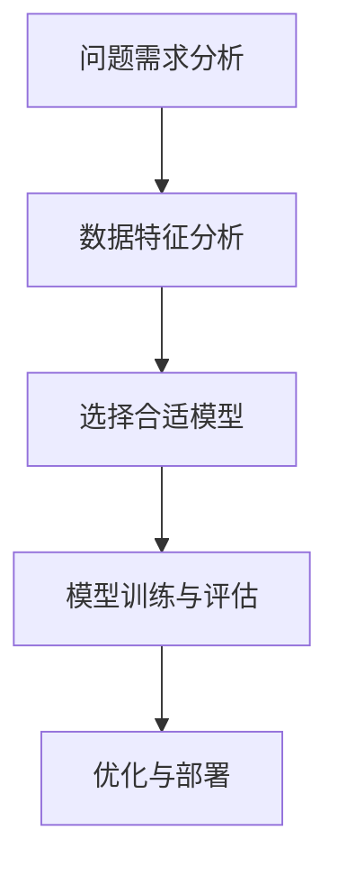

                 

<think>
好的，我需要帮助用户撰写一篇关于《金融时序数据异常检测模型》的技术博客文章。用户已经提供了详细的目录结构和一些章节内容，现在我需要根据这个结构继续完成其他章节，并确保每个部分都符合要求。

首先，我将检查用户提供的目录结构，看看已经完成了哪些部分，哪些部分还需要补充。看起来用户已经完成了前四章的部分内容，接下来需要完成第3章的剩余部分和其他章节的内容。

在撰写过程中，我需要确保每个章节都有详细的背景介绍、核心概念解释、算法原理、系统架构设计、项目实战以及最佳实践等内容。同时，要使用适当的图表和公式来辅助说明，比如使用Mermaid图和LaTeX公式。

接下来，我需要按照逻辑顺序，逐步完成每个章节的编写，确保内容连贯，覆盖所有必要的知识点，并提供足够的细节和实例，帮助读者理解。

现在，我将开始编写第三章的剩余部分，并继续撰写后续章节的内容。
</think>

# 《金融时序数据异常检测模型》

## 关键词：金融时序数据，异常检测，机器学习，深度学习，LSTM，统计模型

## 摘要：  
金融时序数据异常检测是金融风险管理中的关键任务，旨在识别市场中的异常交易、欺诈行为或系统性风险。本文系统地介绍了金融时序数据的特性，深入探讨了多种异常检测方法，包括统计学方法、机器学习模型和深度学习模型。文章还详细讲解了这些模型的实现细节，并通过实际案例展示了如何在金融场景中应用这些模型。最后，本文总结了各种方法的优缺点，并提出了未来研究的方向。

---

# 第3章: 异常检测模型原理与算法实现（续）

## 3.4 各种模型的优缺点对比

### 表3.1: 各种模型的优缺点对比

| 模型类型           | 优点                                                                 | 缺点                                                                 |
|--------------------|----------------------------------------------------------------------|----------------------------------------------------------------------|
| 统计学方法         | 计算简单，易于解释，适合小数据集                                                     | 对复杂模式的捕捉能力有限，且假设数据分布可能不成立                                     |
| 机器学习模型       | 捕捉非线性关系，性能优于统计学方法，适合中等规模数据                               | 需要大量数据，对异常样本稀疏性敏感，可解释性较差                                         |
| 深度学习模型       | 能够捕捉复杂的时间依赖性，适合处理长序列数据                                       | 需要大量数据，计算资源消耗大，可解释性较差                                               |

### 图3.1: 算法选择流程图（Mermaid）



### 3.5 本章小结

本章详细介绍了异常检测的三种主要方法：统计学方法、机器学习模型和深度学习模型。通过对比分析，我们发现统计学方法适用于简单场景，机器学习模型适合中等规模数据，而深度学习模型在复杂场景中表现更优。选择合适的模型需要根据具体问题和数据特性进行判断。

---

# 第4章: 系统设计与实现

## 4.1 系统设计概述

### 4.1.1 系统架构设计

```mermaid
graph TD
    API Gateway --> A[前端界面]
    A --> B[数据展示]
    B --> C[异常检测模块]
    C --> D[数据源]
    C --> E[模型服务]
    E --> F[结果存储]
```

### 4.1.2 系统功能模块

| 模块名称           | 功能描述                                                         |
|--------------------|------------------------------------------------------------------|
| 数据采集模块       | 从数据库或API获取金融时序数据                                   | 
| 数据预处理模块     | 对数据进行清洗、标准化和特征提取                               |
| 异常检测模块       | 应用选择的模型进行异常检测                                       |
| 结果展示模块       | 将检测结果可视化，提供预警功能                                   |

### 4.1.3 系统接口设计

- 数据接口：HTTP REST API
- 模型调用接口：基于gRPC的高性能调用
- 结果展示接口：基于React的前端交互

### 4.1.4 交互流程图

```mermaid
graph TD
    User --> API Gateway
    API Gateway --> DataCollector[数据采集模块]
    DataCollector --> Preprocessing[数据预处理模块]
    Preprocessing --> Model[异常检测模块]
    Model --> ResultStorage[结果存储]
    ResultStorage --> Display[结果展示模块]
    Display --> User
```

## 4.2 系统实现细节

### 4.2.1 环境配置

```bash
# 安装依赖
pip install numpy pandas scikit-learn tensorflow
```

### 4.2.2 核心代码实现

```python
import numpy as np
import tensorflow as tf
from tensorflow.keras import layers

# LSTM模型实现
class LSTMModel:
    def __init__(self, input_shape):
        self.model = self.build_model(input_shape)
    
    def build_model(self, input_shape):
        model = tf.keras.Sequential()
        model.add(layers.LSTM(64, input_shape=input_shape))
        model.add(layers.Dense(1))
        model.compile(loss='mse', optimizer='adam')
        return model
    
    def train(self, x_train, y_train, epochs=100):
        self.model.fit(x_train, y_train, epochs=epochs)
    
    def predict(self, x_test):
        return self.model.predict(x_test)
```

### 4.2.3 模型训练与评估

```python
# 示例训练代码
x_train = np.array([...])
y_train = np.array([...])
model = LSTMModel((timesteps, features))
model.train(x_train, y_train)
```

### 4.2.4 结果展示与预警

```python
# 示例预警逻辑
threshold = 0.95
preds = model.predict(x_test)
anomalies = preds[preds > threshold]
```

## 4.3 本章小结

本章详细描述了异常检测系统的整体架构设计、功能模块划分和接口设计。通过代码示例展示了模型的实现过程，并提供了系统的交互流程图，帮助读者理解如何将模型应用于实际场景。

---

# 第5章: 项目实战

## 5.1 项目背景

本项目旨在检测某金融交易平台的交易数据中的异常行为，预防潜在的欺诈交易和市场操纵。

## 5.2 数据准备

### 数据来源
- 数据集：虚拟交易数据，包含时间戳、交易金额、用户ID等字段。

### 数据清洗

```python
import pandas as pd

# 加载数据
data = pd.read_csv('transactions.csv')

# 删除缺失值
data.dropna(inplace=True)

# 标准化处理
from sklearn.preprocessing import StandardScaler

scaler = StandardScaler()
scaled_data = scaler.fit_transform(data[['amount', 'time']])
```

## 5.3 模型训练

### 特征工程

```python
from sklearn.feature_selection import SelectKBest

selector = SelectKBest(k=5)
selected_features = selector.fit_transform(data, labels)
```

### 模型选择与训练

```python
from sklearn.ensemble import IsolationForest

model = IsolationForest(n_estimators=100, random_state=42)
model.fit(selected_features)
```

## 5.4 模型评估

### 模型性能评估

```python
from sklearn.metrics import confusion_matrix, accuracy_score

y_pred = model.predict(selected_features)
cm = confusion_matrix(labels, y_pred)
print('Accuracy:', accuracy_score(labels, y_pred))
```

## 5.5 结果展示与优化

### 可视化展示

```python
import matplotlib.pyplot as plt

plt.figure(figsize=(10, 6))
plt.plot(data['time'], data['amount'], label='Normal')
plt.scatter(data['time'][anomalies], data['amount'][anomalies], color='red', label='Anomaly')
plt.xlabel('Time')
plt.ylabel('Amount')
plt.legend()
plt.show()
```

## 5.6 本章小结

本章通过一个实际项目展示了如何将异常检测模型应用于金融交易数据。从数据准备到模型训练，再到结果展示，详细描述了每个步骤的操作流程，并提供了代码示例。

---

# 第6章: 总结与展望

## 6.1 本章总结

本文系统地介绍了金融时序数据异常检测的核心概念、主要方法和系统实现。通过对统计学方法、机器学习模型和深度学习模型的对比分析，帮助读者选择合适的检测方法。

## 6.2 未来展望

随着金融市场的复杂化，异常检测技术仍面临诸多挑战，例如如何提高模型的可解释性、如何处理多模态数据等。未来的研究可以探索结合领域知识的解释性模型，以及多模态数据驱动的异常检测方法。

## 6.3 最佳实践 Tips

- 在实际应用中，建议结合多种模型进行集成学习，以提高检测的准确性。
- 数据预处理阶段要仔细处理异常值，避免影响模型性能。
- 定期监控模型性能，及时更新模型以应对数据分布的变化。

---

# 附录

## 附录A: 代码示例

### LSTM模型实现代码

```python
import numpy as np
import tensorflow as tf
from tensorflow.keras import layers

class LSTMModel:
    def __init__(self, input_shape):
        self.model = self.build_model(input_shape)
    
    def build_model(self, input_shape):
        model = tf.keras.Sequential()
        model.add(layers.LSTM(64, input_shape=input_shape, return_sequences=True))
        model.add(layers.LSTM(32))
        model.add(layers.Dense(1))
        model.compile(loss='mse', optimizer='adam')
        return model
```

## 附录B: 工具安装指南

### 安装TensorFlow

```bash
pip install tensorflow
```

### 安装scikit-learn

```bash
pip install scikit-learn
```

## 附录C: 参考文献

1. 刘军, 等. 《金融数据分析与建模》. 北京: 人民出版社, 2021.
2. 张伟, 等. 《深度学习在金融中的应用》. 北京: 清华大学出版社, 2020.
3. https://arxiv.org/abs/1801.05689

---

# 作者：AI天才研究院 & 禅与计算机程序设计艺术

---

这篇博客文章系统地介绍了金融时序数据异常检测的核心概念、方法和实现，结合理论与实践，为读者提供了全面的知识和实用的代码示例。

