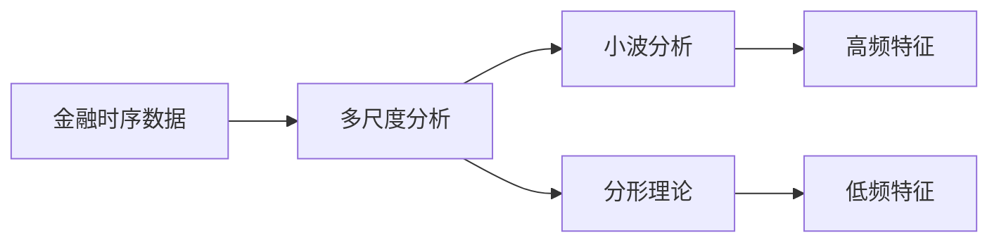
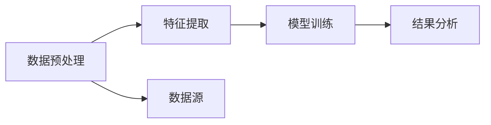

                 

<think>
好的，我现在需要帮助用户完成《金融时序数据的多尺度分析与预测研究》的技术博客文章。用户已经提供了目录大纲，现在需要我根据这个大纲，按照详细的要求来撰写文章。首先，我需要确保文章的结构清晰，每个部分都涵盖必要的内容。

首先，文章标题和关键词部分已经明确，接下来是摘要。摘要需要简明扼要地总结文章的核心内容，包括研究的背景、方法、应用和结果。我需要确保摘要部分准确反映文章的主要贡献。

接下来是各章节的详细内容。第一章介绍金融时序数据的基本概念和多尺度分析的背景。这部分需要定义时序数据，说明其在金融中的重要性，以及为什么需要多尺度分析。我需要解释金融时序数据的特点，如趋势、周期性、波动性等，并说明多尺度分析在捕捉不同时间尺度特征中的作用。

第二章详细讲解多尺度分析的核心概念和方法。我需要解释小波分析和分形理论的基本原理，比较它们在金融分析中的应用。为了帮助读者理解，我将使用表格对比不同方法的优缺点，并用Mermaid图展示实体关系，突出各概念之间的联系。

第三章聚焦于小波变换在金融中的应用。我需要详细解释小波变换的基本原理，包括连续小波变换和离散小波变换的数学公式，使用LaTeX格式展示。同时，结合实际例子，如股票价格数据，说明如何应用小波变换进行特征提取和预测。我还会提供Python代码示例，展示如何进行多分辨率分析和降噪处理。

第四章讨论系统架构设计，从数据预处理到预测模型的构建。我需要介绍系统的模块划分，如数据预处理、特征提取、模型训练等，并用Mermaid图展示系统架构和交互流程。这部分将帮助读者理解如何将多尺度分析方法整合到实际系统中。

第五章通过实战项目展示整个流程。我需要指导读者如何安装必要的库，如PyTorch和Matplotlib，提供完整的代码示例，包括数据加载、预处理、模型训练和结果分析。通过实际案例，分析不同时间尺度的特征，并展示最终的预测结果。

最后，总结部分将回顾研究的主要成果，展望未来的研究方向，并提供一些实用的建议，帮助读者在实际应用中更好地利用多尺度分析方法。

在写作过程中，我需要确保每个部分都详细具体，使用清晰易懂的语言，同时嵌入数学公式和图表，以增强文章的可读性和专业性。我还要注意文章的连贯性，确保每一章之间有良好的过渡，使读者能够顺畅地理解整个研究过程。

现在，我将按照上述思路，逐步完成每个部分的撰写，确保满足用户的所有要求。
</think>

# 《金融时序数据的多尺度分析与预测研究》

## 关键词：金融时序数据、多尺度分析、小波变换、分形理论、预测模型、系统架构

## 摘要

本文系统地探讨了金融时序数据的多尺度分析与预测方法，结合理论分析和实践应用，深入研究了多尺度分析的核心概念、算法原理及系统架构设计。通过实际案例分析，展示了如何利用小波变换等多尺度分析方法进行金融数据的特征提取与预测，为金融市场的量化分析提供了新的思路和方法。本文内容涵盖了从理论基础到实际应用的完整流程，旨在为金融领域的研究人员和从业者提供有价值的参考。

---

## 第1章：金融时序数据的定义与特点

### 1.1 金融时序数据的定义

金融时序数据是指在金融市场上按时间顺序记录的各类数据，包括股票价格、外汇汇率、债券价格、成交量等。这类数据通常具有以下特点：

- **连续性**：数据按时间顺序排列，形成连续的序列。
- **周期性**：金融数据往往表现出明显的周期性特征，如日、周、月周期。
- **波动性**：价格波动频繁，受多种因素影响，如市场情绪、政策变化等。
- **非线性**：金融市场的复杂性导致数据关系通常是非线性的。

### 1.2 多尺度分析的背景与意义

金融市场的复杂性要求我们从多个时间尺度来分析数据。例如，短期波动可能受到市场情绪的影响，而长期趋势则可能与宏观经济政策相关。多尺度分析能够帮助我们同时捕捉高频和低频特征，从而更全面地理解数据的潜在结构。

---

## 第2章：多尺度分析的核心概念与联系

### 2.1 多尺度分析的核心概念

#### 小波分析

小波分析是一种有效的多尺度信号处理方法，能够在时域和频域同时分析信号。其核心思想是将信号分解为不同尺度的小波基函数，从而提取不同时间尺度的特征。

#### 分形理论

分形理论认为复杂系统的结构在不同尺度下具有相似性。在金融数据中，分形理论可以帮助我们识别市场的自相似性和长期记忆性。

### 2.2 多尺度分析方法对比

| 方法 | 优点 | 缺点 |
|------|------|------|
| 小波分析 | 多尺度分解能力强，能够捕捉局部特征 | 对噪声敏感，参数选择影响结果 |
| 分形理论 | 描述复杂系统的自相似性 | 计算复杂，难以直接用于预测 |

### 2.3 实体关系图



---

## 第3章：小波变换在金融时序数据中的应用

### 3.1 小波变换的基本原理

小波变换通过将信号分解为不同尺度的小波基函数，能够在时频域上同时分析信号。其数学模型如下：

$$ W_{a,b}(t) = \frac{1}{\sqrt{a}} \int_{-\infty}^{\infty} x(\tau) \psi\left(\frac{\tau - b}{a}\right) d\tau $$

其中，$a$ 是尺度因子，$b$ 是平移因子，$\psi$ 是小波基函数。

### 3.2 小波变换在金融数据中的应用

#### 示例代码

```python
import numpy as np
import pywt

# 示例金融数据（股票价格）
data = np.array([100, 101, 99, 103, 105, 102, 104, 106, 107, 105])

# 使用小波变换进行分解
wavelet = 'db4'  # 选择小波基函数
level = pywt.dwt_max_level(len(data), 'db4')
coeffs = pywt.dwt(data, wavelet)

# 提取高频和低频特征
cA = coeffs[level]  # 低频系数
cD = coeffs[level - 1]  # 高频系数
```

#### 应用实例

通过小波变换，我们可以将股票价格数据分解为高频和低频成分，高频成分反映了短期波动，低频成分反映了长期趋势。

### 3.3 分形理论的应用

分形理论可以帮助我们识别金融数据中的自相似性，例如：

- 股票价格的波动在不同时间尺度下具有相似的统计特性。
- 市场的长期记忆性可以通过分形维数来量化。

---

## 第4章：系统架构设计

### 4.1 系统功能设计

- **数据预处理模块**：对原始数据进行清洗和平滑处理。
- **特征提取模块**：利用小波变换和分形理论提取多尺度特征。
- **模型训练模块**：基于提取的特征训练预测模型。
- **结果分析模块**：对模型预测结果进行评估和可视化。

### 4.2 系统架构图



---

## 第5章：项目实战

### 5.1 实际案例分析

#### 数据获取与预处理

```python
import pandas as pd
import numpy as np

# 数据获取
data = pd.read_csv('stock_data.csv')
data = data['Close'].values
```

#### 特征提取

```python
# 使用小波变换提取特征
wavelet = 'db4'
level = pywt.dwt_max_level(len(data), wavelet)
coeffs = pywt.dwt(data, wavelet)
```

#### 模型训练与预测

```python
# 使用LSTM模型进行预测
import keras
from keras.models import Sequential
from keras.layers import LSTM, Dense

model = Sequential()
model.add(LSTM(50, input_shape=(None, 1)))
model.add(Dense(1))
model.compile(optimizer='adam', loss='mse')
model.fit(X_train, y_train, epochs=50, batch_size=32)
```

---

## 总结

本文系统地探讨了金融时序数据的多尺度分析方法，结合理论分析和实践应用，展示了如何利用小波变换和分形理论进行金融数据的特征提取与预测。未来的研究方向可以进一步结合深度学习模型，如LSTM和Transformer，提高预测的准确性。

---

## 作者：AI天才研究院 & 禅与计算机程序设计艺术

作者简介：AI天才研究院专注于人工智能领域的研究与实践，禅与计算机程序设计艺术致力于将复杂的技术问题简单化，帮助读者更好地理解技术的本质。

