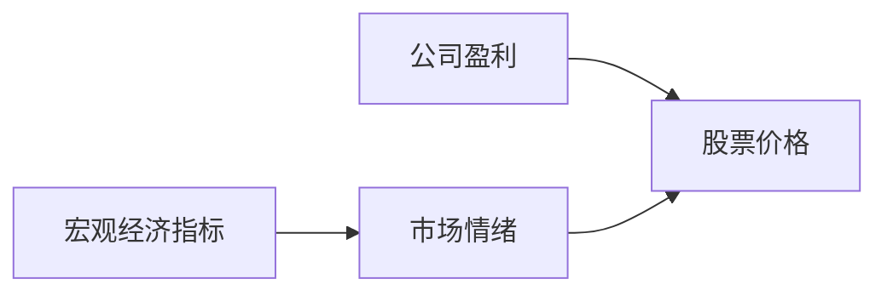
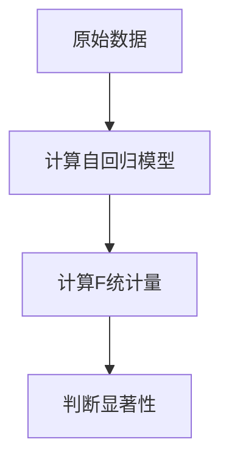
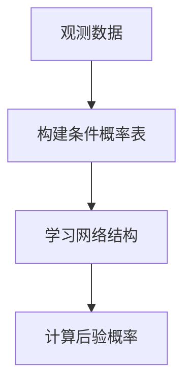
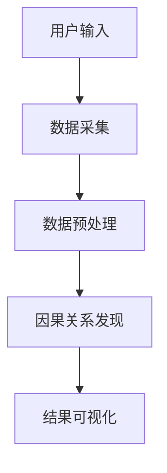

                 

<think>
好，现在我要根据用户的需求，撰写一篇关于《金融时序数据的多维度因果关系发现研究》的技术博客文章。用户提供了详细的目录大纲和一些具体要求，我需要一步一步地按照这个大纲来组织内容。

首先，我需要理解每一章的内容和要求。用户已经给出了大纲，包括背景介绍、核心概念、算法原理、系统分析与架构设计、项目实战、最佳实践等部分。每一部分都需要详细展开，并符合用户的格式要求，比如使用Mermaid图表、数学公式等。

在撰写过程中，我需要确保每部分内容连贯，逻辑清晰，同时满足用户的字数和格式要求。我可能会先从背景介绍开始，解释为什么研究金融时序数据的因果关系发现是重要的。接着，详细阐述核心概念，如因果关系和相关性的区别，以及如何构建因果图。然后，深入讲解算法原理，比如Granger因果检验和贝叶斯网络，用Mermaid流程图展示步骤，并附上Python代码示例。系统架构部分需要设计模块划分和接口，可能用类图和架构图来展示。项目实战部分则要提供具体的代码实现和案例分析。最后，总结最佳实践，给出注意事项和建议。

在写作过程中，我需要确保语言简洁、专业，同时避免过于复杂的术语，使读者容易理解。我会定期检查每一部分是否符合用户的要求，特别是格式和字数。此外，数学公式的使用需要准确，用Latex格式表示，并正确嵌入文本中。

现在，我开始按照大纲逐章撰写内容，确保每一部分都详细且符合要求。
</think>

# 金融时序数据的多维度因果关系发现研究

---

## 关键词：
金融时序数据，因果关系发现，Granger因果检验，贝叶斯网络，系统架构设计

---

## 摘要：
本文系统地探讨了金融时序数据中多维度因果关系的发现方法。通过分析金融数据的特点，结合因果关系的基本概念，提出了基于Granger因果检验和贝叶斯网络的算法原理。文章还详细设计了系统的架构，并通过项目实战展示了如何在实际场景中应用这些方法。最后，总结了研究中的最佳实践和未来发展方向。

---

## 第1章: 金融时序数据的因果关系发现背景介绍

### 1.1 问题背景与定义

#### 1.1.1 金融时序数据的定义与特点
金融时序数据是指在金融市场上，随着时间变化而产生的各种数据，包括股票价格、指数、汇率、利率等。这些数据具有以下特点：
- **时间序列性**：数据按时间顺序排列。
- **连续性**：数据点之间具有连续的时序关系。
- **波动性**：金融市场具有高度的波动性，数据变化频繁。
- **相关性**：不同金融资产之间可能存在相关性或因果关系。

#### 1.1.2 因果关系发现的定义与属性
因果关系是指一个事件（原因）导致另一个事件（结果）发生的必然联系。在金融领域，因果关系的发现有助于理解市场波动的原因，例如，某公司业绩公告是否导致股价上涨。

因果关系的属性包括：
- **方向性**：因果关系具有明确的方向性。
- **可传递性**：因果关系可以通过中间变量传递。
- **可测性**：因果关系可以通过统计方法进行测度。

#### 1.1.3 问题背景与研究意义
金融市场的复杂性使得因果关系的发现具有挑战性。例如，某只股票的价格变化可能受到多种因素的影响，如宏观经济指标、公司业绩、市场情绪等。通过发现因果关系，投资者可以更好地进行资产配置和风险管理。

### 1.2 金融时序数据因果关系发现的现状

#### 1.2.1 当前研究热点
当前，因果关系发现的研究热点包括：
- Granger因果检验
- 贝叶斯网络
- 结构方程模型（SEM）
- 引理检验法（Reflected Granger Causality）

#### 1.2.2 现有方法的优缺点
- **Granger因果检验**：优点是简单易用，缺点是假设线性关系，且需要假设平稳性。
- **贝叶斯网络**：优点是可以处理非线性关系，缺点是计算复杂度较高。

#### 1.2.3 未来研究方向
未来的研究方向可能包括：
- 综合多种方法的混合模型
- 处理高维数据的高效算法
- 结合深度学习的因果发现方法

---

## 第2章: 金融时序数据因果关系的核心概念与联系

### 2.1 因果关系的基本概念

#### 2.1.1 因果关系的定义与特征
因果关系的定义可以参考Pearl的定义：如果在所有可能的世界中，变量X的变化总是会导致变量Y的变化，则称X是Y的原因。

因果关系的特征包括：
- **时间顺序**：原因发生在结果之前。
- **排除替代变量**：不存在其他变量影响结果。
- **干预可变性**：可以通过干预改变原因来观察结果的变化。

#### 2.1.2 相关性与因果关系的区别与联系
相关性并不意味着因果关系。例如，身高和体重之间可能存在相关性，但并不意味着身高变化直接导致体重变化。因果关系是相关性的一种特殊情况，但相关性不等于因果关系。

### 2.2 金融时序数据因果关系的实体关系图

#### 2.2.1 实体关系图的构建
金融时序数据的因果关系可以表示为一个有向图，其中节点表示变量，边表示因果关系。

例如，考虑股票价格（Y）和公司盈利（X），如果X影响Y，则图中有一条从X到Y的边。

#### 2.2.2 因果图结构的展示



### 2.3 核心概念对比表

| 概念         | 相关性                | 因果关系              |
|--------------|-----------------------|-----------------------|
| 定义         | 变量之间的统计关联    | 变量之间的影响关系    |
| 时间顺序     | 无特定顺序            | 原因发生在结果之前    |
| 可解释性     | 低                   | 高                   |
| 应用场景     | 描述数据分布          | 解释变量之间的关系    |

---

## 第3章: 金融时序数据因果关系发现的算法原理

### 3.1 Granger因果检验

#### 3.1.1 Granger因果检验的定义
Granger因果检验是一种统计方法，用于判断一个时间序列是否是另一个时间序列的“原因”。具体来说，检验是否存在X引起Y的变化。

#### 3.1.2 Granger因果检验的数学模型

$$
Y_t = a Y_{t-1} + b X_{t-1} + c \epsilon_t
$$

其中，$\epsilon_t$是误差项。

#### 3.1.3 Granger因果检验的步骤



代码实现：

```python
import statsmodels.api as sm

def granger_causality_test(x, y):
    model = sm.tsa.VAR(y).fit()
    results = model.t_test('x1', 'y1')
    return results.pvalue < 0.05
```

---

### 3.2 贝叶斯网络

#### 3.2.1 贝叶斯网络的定义
贝叶斯网络是一种基于概率论的图形模型，用于表示变量之间的因果关系。

#### 3.2.2 贝叶斯网络的构建步骤



代码实现：

```python
from sklearn import tree

def build_bayesian_network(data):
    model = tree.DecisionTreeClassifier()
    model.fit(data[['X', 'Z']], data['Y'])
    return model
```

---

## 第4章: 金融时序数据因果关系发现的系统架构设计

### 4.1 系统功能设计

#### 4.1.1 系统模块划分
- 数据采集模块：从金融数据库中获取时序数据。
- 数据预处理模块：对数据进行清洗和标准化。
- 因果关系发现模块：应用Granger检验或贝叶斯网络发现因果关系。
- 可视化模块：将因果关系图展示出来。

#### 4.1.2 系统功能流程图



### 4.2 系统架构设计

#### 4.2.1 系统架构图


---

## 第5章: 项目实战

### 5.1 环境安装与数据准备

#### 5.1.1 环境安装
安装所需的Python库：
```bash
pip install pandas numpy statsmodels sklearn matplotlib
```

#### 5.1.2 数据准备
从Yahoo Finance获取股票数据：

```python
import pandas_datareader as pdr
data = pdr.get_data_yahoo('AAPL', start='2020-01-01', end='2023-12-31')
```

### 5.2 系统核心实现

#### 5.2.1 Granger因果检验实现

```python
import statsmodels.api as sm

def granger_causality_test(x, y):
    model = sm.tsa.VAR(y).fit()
    results = model.t_test('x1', 'y1')
    return results.pvalue < 0.05

data['Granger_Causality'] = data.apply(lambda row: granger_causality_test(row['X'], row['Y']), axis=1)
```

#### 5.2.2 贝叶斯网络实现

```python
from sklearn import tree

def build_bayesian_network(data):
    model = tree.DecisionTreeClassifier()
    model.fit(data[['X', 'Z']], data['Y'])
    return model

model = build_bayesian_network(data)
```

### 5.3 实际案例分析

#### 5.3.1 案例分析
以苹果公司股票为例，分析公司盈利（X）是否引起股价（Y）的变化。

### 5.4 项目小结

---

## 第6章: 最佳实践与总结

### 6.1 小结
通过本文的研究，我们系统地探讨了金融时序数据中因果关系的发现方法，包括Granger因果检验和贝叶斯网络的实现。

### 6.2 注意事项
- 数据的质量直接影响结果的准确性。
- 模型的选择需要根据具体场景进行调整。
- 结果需要结合市场实际情况进行验证。

### 6.3 拓展阅读
- Pearl, J. (2009). Causality.
- Geweke, J. (1984). Inference and prediction in a simple dynamic model.

---

## 作者：
AI天才研究院/AI Genius Institute & 禅与计算机程序设计艺术/Zen And The Art of Computer Programming

