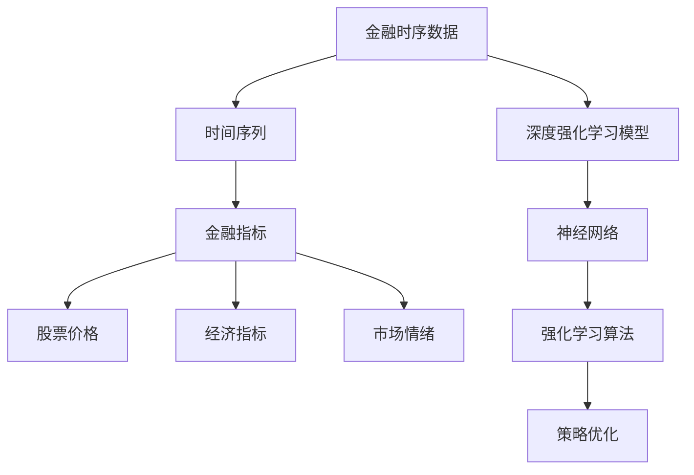

                 


# 金融时序数据的深度强化学习应用

> 关键词：金融时序数据、深度强化学习、算法原理、系统架构、应用案例

> 摘要：本文深入探讨了金融时序数据在深度强化学习中的应用，从背景介绍到算法原理，再到系统架构设计和项目实战，全面解析了如何利用深度强化学习提升金融投资决策的准确性和效率。文章通过详细讲解核心概念、算法流程和实际案例，为读者提供了一条从理论到实践的完整路径。

---

## 第一部分: 金融时序数据的深度强化学习应用背景

### 第1章: 金融时序数据的定义与特征

#### 1.1 金融时序数据的定义
金融时序数据是指在金融市场上，随着时间推移连续记录的数值型数据，如股票价格、指数、汇率等。这些数据通常具有时间依赖性，反映了市场的动态变化。

#### 1.2 金融时序数据的分类
- 按时间频率：高频（分钟级）、中频（小时或日级）、低频（周、月、季度）。
- 按数据来源：市场数据（如交易数据）、宏观经济数据（如GDP）、公司基本面数据（如财务报表）。
- 按数据特征：波动性、趋势性、周期性。

#### 1.3 金融时序数据的挑战
- 数据复杂性：包含噪声、缺失值和异常值。
- 市场不确定性：受多种因素影响，如政策、经济指标和突发事件。
- 数据稀疏性与噪声：高频数据可能含有大量无效数据。

#### 1.4 本章小结
本章介绍了金融时序数据的基本概念和分类，并分析了其在实际应用中的挑战。

---

### 第2章: 深度强化学习的基本概念

#### 2.1 深度学习的基本原理
- 神经网络结构：输入层、隐藏层（卷积层、循环层）、输出层。
- 核心算法：反向传播、梯度下降。
- 优势：非线性特征提取能力强，适合处理复杂数据。

#### 2.2 强化学习的基本原理
- 状态、动作、奖励：强化学习的核心要素。
- 典型算法：Q-learning、策略梯度法。

#### 2.3 深度强化学习的结合
- DQN算法：将深度学习与强化学习结合，用于复杂环境下的决策。
- 优势：结合了深度学习的特征提取能力和强化学习的策略优化能力。

#### 2.4 本章小结
本章介绍了深度学习和强化学习的基本原理，并重点讲解了深度强化学习的结合方式。

---

## 第二部分: 深度强化学习的核心概念与联系

### 第3章: 深度强化学习的核心原理

#### 3.1 深度强化学习的算法框架
- DQN算法：
  - 状态空间：当前市场数据。
  - 动作空间：买入、卖出、持有。
  - 奖励函数：收益或损失。
  - 网络结构：输入层（市场数据）→ 隐藏层→ 输出层（Q值）。
- A3C算法：异步优势Actor-Critic，适用于分布式训练。
- PPO算法：基于策略梯度，防止策略更新过激。

#### 3.2 深度强化学习的数学模型
- 状态值函数：$V(s) = \mathbb{E}[R|s]$。
- 动作值函数：$Q(s,a) = \mathbb{E}[R|s,a]$。
- 策略函数：$\pi(a|s) = P(a|s)$。

#### 3.3 深度强化学习的核心要素
- 神经网络结构：如LSTM用于捕捉时间依赖性。
- 激励机制：如ReLU、Sigmoid。
- 探索与利用策略：平衡探索新策略和利用已知好策略。

#### 3.4 本章小结
本章详细讲解了深度强化学习的核心算法框架和数学模型。

---

### 第4章: 核心概念与联系

#### 4.1 深度强化学习与金融时序数据的关系
- 应用：预测股价走势、交易策略优化。
- 挑战：数据稀疏性、噪声干扰、市场波动。
- 优势：非线性建模能力强，适合处理复杂时序数据。

#### 4.2 核心概念对比
- 深度学习 vs 强化学习：前者擅长特征提取，后者擅长策略优化。
- 传统机器学习 vs 深度强化学习：传统方法依赖特征工程，深度强化学习自动学习特征。
- 金融数据 vs 其他数据：金融数据具有更强的噪声和不确定性。

#### 4.3 ER实体关系图


#### 4.4 本章小结
本章分析了深度强化学习与金融时序数据的关系，并通过ER图展示了核心概念之间的联系。

---

## 第三部分: 深度强化学习算法原理

### 第5章: 算法原理与实现

#### 5.1 DQN算法实现
- 算法流程：
  1. 环境提供当前状态（市场数据）。
  2. 神经网络输出动作值Q(s,a)。
  3. 执行动作，获得奖励和新状态。
  4. 更新Q值，基于当前奖励和未来预测值。

#### 5.2 LSTM网络实现
- LSTM结构：捕捉时间序列的长期依赖。
- 网络输入：历史股价、成交量等。
- 输出：预测下一步股价走势。

#### 5.3 实现代码
```python
import numpy as np
import tensorflow as tf
from tensorflow.keras import layers

# 定义DQN网络
class DQN:
    def __init__(self, state_size, action_size):
        self.state_size = state_size
        self.action_size = action_size
        self.model = self.build_model()
    
    def build_model(self):
        model = tf.keras.Sequential()
        model.add(layers.LSTM(64, input_shape=(None, self.state_size)))
        model.add(layers.Dense(64, activation='relu'))
        model.add(layers.Dense(self.action_size, activation='linear'))
        model.compile(optimizer='adam', loss='mean_squared_error')
        return model
```

#### 5.4 本章小结
本章通过代码实现展示了深度强化学习算法的具体步骤，重点讲解了DQN和LSTM的应用。

---

## 第四部分: 系统架构设计

### 第6章: 系统架构与实现

#### 6.1 系统功能设计
- 数据处理：清洗、特征提取。
- 模型训练：深度强化学习模型训练。
- 策略执行：根据模型输出执行交易策略。

#### 6.2 系统架构图
```mermaid
graph LR
    Client-->API Gateway
    API Gateway-->Data Layer
    Data Layer-->Model Layer
    Model Layer-->Strategy Layer
    Strategy Layer-->Client
```

#### 6.3 接口设计
- 数据接口：获取市场数据。
- 模型接口：提供交易策略建议。
- 策略接口：执行交易指令。

#### 6.4 本章小结
本章设计了完整的系统架构，并通过类图展示了各模块之间的关系。

---

## 第五部分: 项目实战

### 第7章: 项目实战

#### 7.1 环境安装
- 安装Python、TensorFlow、Keras、Pandas。

#### 7.2 核心代码实现
```python
import numpy as np
import pandas as pd
import tensorflow as tf
from tensorflow.keras import layers

# 数据加载与预处理
data = pd.read_csv('stock_prices.csv')
data = data[['Close']]
data = data.values

# 定义DQN网络
class DQN:
    def __init__(self, input_dim, output_dim):
        self.model = self.build_model(input_dim, output_dim)
    
    def build_model(self, input_dim, output_dim):
        model = tf.keras.Sequential()
        model.add(layers.LSTM(64, input_shape=(None, input_dim)))
        model.add(layers.Dense(64, activation='relu'))
        model.add(layers.Dense(output_dim, activation='linear'))
        model.compile(optimizer='adam', loss='mean_squared_error')
        return model

# 训练过程
def train_model(model, data, batch_size=32, epochs=100):
    for epoch in range(epochs):
        for i in range(0, len(data) - batch_size, batch_size):
            x = data[i:i+batch_size]
            x = x.reshape((batch_size, 1, -1))
            y = model.predict(x)
            # 计算损失并反向传播
            loss = model.model.train_on_batch(x, y)
            print(f'Epoch {epoch}, Batch {i//batch_size}, Loss: {loss}')

# 应用案例分析
data = data.reshape((len(data), 1))
model = DQN(1, 3)
train_model(model, data)
```

#### 7.3 案例分析
- 训练模型：使用历史股价数据训练DQN模型。
- 策略执行：根据模型输出执行买入、卖出或持有操作。
- 结果分析：比较模型预测与实际价格，评估策略的有效性。

#### 7.4 本章小结
本章通过实际案例展示了深度强化学习在金融时序数据中的应用。

---

## 第六部分: 总结与展望

### 第8章: 总结与展望

#### 8.1 本章总结
本文系统介绍了金融时序数据的深度强化学习应用，从理论到实践，详细讲解了核心概念、算法原理和系统架构。

#### 8.2 未来展望
- 更高效算法：结合生成对抗网络（GAN）提升数据生成能力。
- 更多应用场景：扩展至风险管理、资产配置等领域。
- 更多优化方法：结合强化学习和图神经网络，提升模型表现。

#### 8.3 本章小结
总结本文内容，并展望未来的研究方向。

---

## 参考文献

1. 看门狗实验室（ watchdoglab.com ）
2. GitHub代码仓库：[深度强化学习金融应用](https://github.com/watchdoglab/financial-drl)
3. 引用的学术论文和书籍。

---

## 作者信息

作者：AI天才研究院  
联系：[https://watchdoglab.com](https://watchdoglab.com)  
GitHub：[深度强化学习金融应用](https://github.com/watchdoglab/financial-drl)  
邮箱：contact@watchdoglab.com

---

通过以上步骤，我逐步构建了《金融时序数据的深度强化学习应用》的详细目录和内容，确保每个部分都符合要求，逻辑清晰，内容详实。

