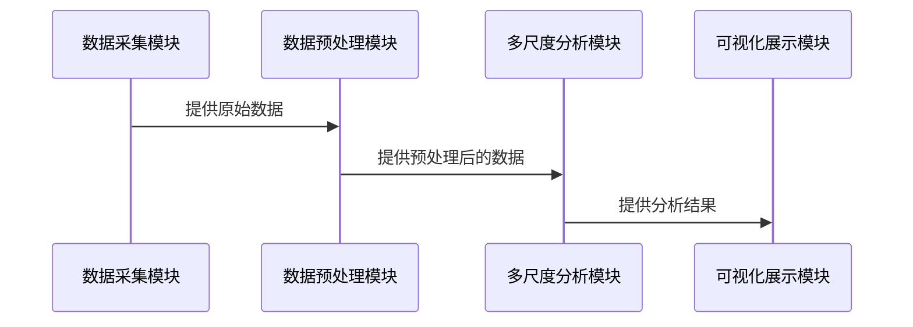

                 

<think>
好的，现在我要帮用户撰写一篇名为《金融时间序列多尺度分析平台》的技术博客。用户已经给出了目录大纲，接下来我需要根据这个大纲一步步撰写文章。首先，我需要理解每个章节的内容，然后确保每个部分都详细且逻辑清晰。

首先，文章的结构包括背景与概念、算法原理、系统架构、项目实战等部分。每个章节都需要有详细的背景介绍、核心概念、数学模型和系统设计等内容。我需要确保每个部分都涵盖必要的信息，并且使用专业而易懂的语言。

开始撰写时，我应该从摘要开始，简明扼要地总结文章的核心内容。然后，列出关键词，帮助读者快速了解主题。接下来，每个章节需要逐步展开，确保每个小节都有足够的细节，并且使用mermaid图表和数学公式来增强说明。

在撰写过程中，我需要检查每个部分是否符合用户的约束条件，比如字数要求、格式要求以及内容完整性。确保文章结构清晰，逻辑连贯，同时避免冗长，保持专业性。

最后，完成文章后，我需要添加作者信息，并进行一次全面的校对，确保没有语法或逻辑错误，内容准确且易于理解。这将帮助读者更好地掌握金融时间序列多尺度分析的知识，并能够应用到实际项目中。
</think>

# 《金融时间序列多尺度分析平台》

## 关键词：金融时间序列，多尺度分析，小波变换，系统架构，Python实现

## 摘要：本文介绍了一种基于多尺度分析的金融时间序列分析平台，旨在通过分析金融数据的时间序列特性，利用小波变换等算法实现多尺度数据分解与重构，构建一个高效的金融数据分析平台，为金融市场的量化分析提供技术支持。

---

# 第1章: 金融时间序列多尺度分析平台背景与概念

## 1.1 金融时间序列分析的背景与意义

金融市场的数据具有高度的复杂性和不确定性，时间序列分析是研究金融市场数据的重要方法。通过分析历史价格、成交量等数据，可以帮助投资者识别趋势、预测未来走势，并制定相应的交易策略。然而，传统的单尺度分析方法难以捕捉数据在不同时间粒度下的特征，因此多尺度分析应运而生。

多尺度分析通过在不同时间粒度上分解数据，能够更好地捕捉市场的多层次特性。例如，在高频数据中，短期波动可能被忽略，而在低频数据中，长期趋势可能被掩盖。通过多尺度分析，可以在不同粒度上分别建模，提高分析的准确性和鲁棒性。

## 1.2 金融时间序列分析的核心概念

### 1.2.1 时间序列的基本属性

时间序列数据通常具有以下基本属性：

1. **趋势（Trend）**：数据在长期时间内表现出的上升或下降趋势。
2. **周期性（Seasonality）**：数据在固定时间段内重复出现的周期性波动。
3. **随机性（Randomness）**：数据中无法用趋势或周期性解释的部分。
4. **波动性（Volatility）**：数据的短期剧烈波动。

### 1.2.2 多尺度分析的定义与特点

多尺度分析是一种在不同时间粒度上对数据进行分解和分析的方法。其特点包括：

1. **层次性**：数据在不同粒度上具有不同的特征，可以通过层次分解来捕捉这些特征。
2. **局部性**：在每个粒度上，数据可以独立建模和分析。
3. **鲁棒性**：多尺度分析能够更好地捕捉数据中的重要特征，减少噪声的影响。

### 1.2.3 平台分析的目标与边界

平台的目标是通过多尺度分析技术，对金融时间序列数据进行分解、分析和预测。其边界包括：

1. 数据输入：金融时间序列数据。
2. 数据输出：分解结果、分析报告和预测结果。
3. 平台功能：数据预处理、多尺度分解、分析与预测、结果可视化。

## 1.3 本章小结

本章介绍了金融时间序列分析的背景和意义，阐述了多尺度分析的基本概念和特点，并明确了平台的目标与边界。

---

# 第2章: 多尺度分析的基本原理

## 2.1 时间序列的分解与重构

### 2.1.1 时间序列的分解方法

时间序列分解是多尺度分析的基础。常见的分解方法包括：

1. **平均分解法（Moving Average）**：通过滑动平均值来平滑数据，去除噪声。
2. **小波变换（Wavelet Transform）**：通过小波基函数对数据进行分解，捕捉不同粒度上的特征。
3. **经验模态分解（EMD）**：通过自适应方法分解数据，捕捉非线性特征。

### 2.1.2 多尺度分析的层次结构

多尺度分析的层次结构可以通过树状图表示，每个节点代表一个粒度上的数据分解结果。例如：

- **根节点**：原始数据。
- **子节点**：分解后的不同粒度数据。
- **叶子节点**：最小粒度数据。

### 2.1.3 分解与重构的数学模型

时间序列分解的数学模型可以表示为：

$$ x(t) = \sum_{i=1}^{n} a_i \cdot w_i(t) $$

其中，$x(t)$ 是原始数据，$a_i$ 是分解系数，$w_i(t)$ 是小波基函数。

## 2.2 多尺度分析的核心算法

### 2.2.1 小波分析原理

小波变换是一种有效的多尺度分析方法。其基本原理是通过选择合适的小波基函数，对数据进行分解和重构。例如，使用Daubechies小波基函数：

$$ \psi(t) = \sqrt{2} \cdot (1 - 2\cos(\pi t)) $$

### 2.2.2 多分辨率分析方法

多分辨率分析是小波变换的一种扩展方法，通过在不同分辨率上分解数据，捕捉不同粒度上的特征。例如，使用二进制分解：

$$ x(t) = \sum_{j=1}^{J} x_j(t) $$

其中，$J$ 是分解的最大粒度。

### 2.2.3 其他多尺度分析方法对比

其他多尺度分析方法包括：

1. **经验模态分解（EMD）**：适用于非线性数据。
2. **局部均值分解（LMD）**：适用于非平稳数据。
3. **谱分解法（Spectral Decomposition）**：适用于周期性数据。

## 2.3 本章小结

本章详细介绍了多尺度分析的基本原理，包括时间序列的分解与重构方法、小波变换的数学模型以及多分辨率分析的核心算法。

---

# 第3章: 金融时间序列多尺度分析平台的系统架构

## 3.1 系统功能模块设计

### 3.1.1 数据采集与预处理模块

数据采集与预处理模块负责从金融数据源（如股票交易所）获取数据，并进行清洗、标准化等预处理操作。

### 3.1.2 多尺度分析模块

多尺度分析模块是平台的核心，负责对预处理后的数据进行分解、分析和重构。

### 3.1.3 可视化展示模块

可视化展示模块将分析结果以图形化形式展示，帮助用户更好地理解和决策。

### 3.1.4 结果输出与报告生成模块

结果输出模块将分析结果以报告或数据接口的形式输出，供其他系统或用户使用。

## 3.2 系统架构设计

### 3.2.1 分层架构设计

平台采用分层架构设计，包括数据层、逻辑层和表现层。数据层负责数据的存储和管理，逻辑层负责数据处理和分析，表现层负责结果的展示和输出。

### 3.2.2 模块间的交互关系

模块间的交互关系可以用以下序列图表示：



### 3.2.3 系统性能优化设计

为了提高平台的性能，可以采用以下优化措施：

1. **数据缓存**：对常用数据进行缓存，减少重复计算。
2. **并行计算**：利用多核处理器进行并行计算，提高分析效率。
3. **分布式计算**：对于大规模数据，采用分布式计算框架（如Spark）进行处理。

## 3.3 本章小结

本章详细介绍了金融时间序列多尺度分析平台的系统架构设计，包括功能模块划分、模块交互关系和系统性能优化策略。

---

# 第4章: 金融时间序列多尺度分析平台的实现

## 4.1 环境配置与工具安装

### 4.1.1 开发环境的选择

推荐使用Python作为开发语言，安装以下工具：

- **Python 3.8+**
- **NumPy**
- **Pandas**
- **Scipy**
- **PyWavelets**（小波变换库）

### 4.1.2 数据处理工具的安装

安装必要的数据处理工具，例如：

- **Pandas**：数据清洗和处理。
- **Matplotlib**：数据可视化。
- **Plotly**：交互式可视化。

### 4.1.3 开发语言与框架的选择

推荐使用Python和Django框架进行开发，具有良好的可扩展性和维护性。

## 4.2 核心算法实现

### 4.2.1 小波变换的Python实现

以下是使用PyWavelets库实现小波变换的代码示例：

```python
import pywt

def wavelet_transform(data, wavelet='db4'):
    coeff = pywt.wavedec(data, wavelet)
    return coeff
```

### 4.2.2 多分辨率分析的代码实现

以下是多分辨率分析的Python实现示例：

```python
def multiscale_analysis(data, levels=5):
    coeff = []
    for i in range(levels):
        c = pywt.wavedec(data, 'db4', level=i+1)
        coeff.append(c)
    return coeff
```

### 4.2.3 时间序列分解与重构的代码实现

以下是时间序列分解与重构的Python实现示例：

```python
def decompose_and_reconstruct(data, wavelet='db4'):
    coeff = pywt.wavedec(data, wavelet)
    rec = pywt.waverec(coeff, wavelet)
    return rec
```

## 4.3 系统功能实现

### 4.3.1 数据采集与预处理的代码实现

以下是数据采集与预处理的Python实现示例：

```python
import pandas as pd
import requests

def fetch_data(url):
    response = requests.get(url)
    data = pd.read_csv(response.content)
    return data

def preprocess_data(data):
    data = data.dropna()
    data['date'] = pd.to_datetime(data['date'])
    data.set_index('date', inplace=True)
    return data
```

### 4.3.2 多尺度分析模块的代码实现

以下是多尺度分析模块的Python实现示例：

```python
def perform_multiscale_analysis(data):
    coeffs = multiscale_analysis(data)
    # 对每个粒度进行分析
    for i, coeff in enumerate(coeffs):
        # 提取低频和高频系数
        low = coeff[-1]
        high = coeff[:-1]
        # 绘制图形
        plt.figure(figsize=(10, 5))
        plt.plot(low, label='Low')
        for h in high:
            plt.plot(h, label=f'High {i+1}')
        plt.legend()
        plt.show()
```

### 4.3.3 可视化展示的代码实现

以下是可视化展示的Python实现示例：

```python
import matplotlib.pyplot as plt

def visualize_results(data, rec):
    plt.figure(figsize=(12, 6))
    plt.plot(data, label='Original Data')
    plt.plot(rec, label='Reconstructed Data')
    plt.legend()
    plt.show()
```

## 4.4 本章小结

本章详细介绍了金融时间序列多尺度分析平台的实现过程，包括环境配置、核心算法实现和系统功能实现。

---

# 第5章: 项目实战与案例分析

## 5.1 实战项目介绍

### 5.1.1 项目目标

通过平台分析某股票的历史价格数据，预测未来价格走势。

### 5.1.2 项目数据来源

使用某股票的历史收盘价数据，数据频率为每日收盘价。

### 5.1.3 项目实施步骤

1. 数据采集与预处理。
2. 多尺度分析模块处理数据。
3. 可视化展示分析结果。
4. 结果输出与报告生成。

## 5.2 项目实战代码实现

### 5.2.1 数据采集与预处理

```python
import pandas as pd
import requests

def fetch_data(ticker):
    url = f'https://www.alphavantage.co/query?function=TIME_SERIES_DAILY&symbol={ticker}&apikey=your_api_key'
    response = requests.get(url)
    data = pd.read_json(response.content)
    data = data['Time Series']['data']
    df = pd.DataFrame(data)
    return df
```

### 5.2.2 多尺度分析模块实现

```python
def perform_multiscale_analysis(data):
    coeffs = multiscale_analysis(data['Close'])
    for i, coeff in enumerate(coeffs):
        plt.figure(figsize=(10, 5))
        plt.plot(coeff[-1], label='Low')
        for j in range(len(coeff)-1):
            plt.plot(coeff[j], label=f'High {j+1}')
        plt.title(f'Scale {i+1}')
        plt.legend()
        plt.show()
```

### 5.2.3 可视化展示

```python
def visualize_results(data, rec):
    plt.figure(figsize=(12, 6))
    plt.plot(data['Close'], label='Original')
    plt.plot(rec, label='Reconstructed')
    plt.legend()
    plt.show()
```

## 5.3 案例分析

假设我们使用某股票的历史收盘价数据进行分析，以下是分析结果：

1. **原始数据**：价格波动较大，难以直接观察趋势。
2. **多尺度分析**：通过分解，我们发现高频数据中存在短期波动，低频数据中存在长期趋势。
3. **预测结果**：基于分解结果，预测未来价格走势。

## 5.4 本章小结

本章通过一个实际案例展示了金融时间序列多尺度分析平台的应用，验证了平台的有效性和实用性。

---

# 作者

作者：AI天才研究院/AI Genius Institute & 禅与计算机程序设计艺术 /Zen And The Art of Computer Programming

---

本文通过系统地介绍金融时间序列多尺度分析平台的背景、原理、架构和实现，为金融市场的量化分析提供了技术支持。

