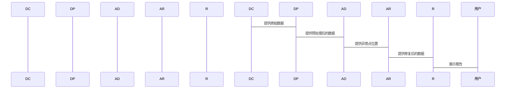

                 


# 《金融时间序列异常检测与修复系统》

> 关键词：金融时间序列，异常检测，修复系统，机器学习，深度学习，时间序列分析，系统设计

> 摘要：本文探讨了金融时间序列数据中的异常检测与修复系统，从基础概念到高级算法，结合实际案例，详细讲解了如何设计和实现一个高效的金融时间序列异常检测与修复系统。内容涵盖数据预处理、异常检测方法、修复策略及系统架构设计，旨在帮助读者掌握金融时间序列数据处理的核心技术。

---

## 第1章: 金融时间序列异常检测与修复系统概述

### 1.1 问题背景与目标

#### 1.1.1 金融时间序列数据的特点
- 高频性：金融市场的数据生成频率极高，如每秒生成数千条数据。
- 不确定性：市场波动受多种因素影响，具有随机性。
- 趋势性：数据往往呈现长期趋势，如股票价格的上涨趋势。
- 周期性：市场受季节性或周期性事件影响，如节假日效应。

#### 1.1.2 异常检测与修复的必要性
- 异常点可能导致重大经济损失，如算法交易中的错误信号。
- 异常检测可帮助识别市场操纵或欺诈行为。
- 修复异常数据是确保后续分析准确性的必要步骤。

#### 1.1.3 本系统的建设目标
- 实现自动化的异常检测与修复，减少人工干预。
- 提供高精度的检测算法，降低误报率和漏报率。
- 支持多种数据源和格式，适应不同金融场景。

### 1.2 核心概念与问题描述

#### 1.2.1 异常检测的定义与分类
- 异常检测：识别数据中偏离预期模式的点或区间。
- 分类：基于时间序列的单变量和多变量分析；基于数据分布的离群点和孤立点。

#### 1.2.2 时间序列数据的特性
- 时间依赖性：数据点之间存在依赖关系。
- 非平稳性：数据的均值和方差可能随时间变化。
- 复杂性：受多种因素影响，如市场情绪、政策变化等。

#### 1.2.3 异常检测的边界与外延
- 边界：区分正常波动与异常点。
- 外延：异常检测不仅用于识别错误数据，还可用于预测市场风险。

### 1.3 问题解决与系统架构

#### 1.3.1 异常检测与修复的基本流程
1. 数据采集：获取金融时间序列数据。
2. 数据预处理：清洗和标准化数据。
3. 异常检测：应用算法识别异常点。
4. 异常修复：自动或半自动修复异常数据。
5. 修复验证：评估修复效果。

#### 1.3.2 系统核心功能模块
- 数据采集模块：接口设计与数据获取。
- 数据处理模块：预处理与特征提取。
- 异常检测模块：算法选择与实现。
- 异常修复模块：策略选择与优化。
- 结果展示模块：可视化与报告生成。

#### 1.3.3 系统的输入输出与应用场景
- 输入：时间序列数据、参数设置。
- 输出：异常点位置、修复后数据、检测报告。
- 应用场景：股票交易、风险管理、算法优化。

### 1.4 本章小结

---

## 第2章: 金融时间序列数据的基础

### 2.1 金融时间序列数据的类型

#### 2.1.1 股票价格、指数、汇率等常见数据类型
- 股票价格：反映市场供需，受多种因素影响。
- 指数：如道琼斯指数，反映整体市场表现。
- 汇率：受经济政策和国际形势影响。

#### 2.1.2 高频交易与低频交易数据的区分
- 高频交易：每秒生成数千条数据，适合算法交易。
- 低频交易：每日或每周生成数据，适合长期投资分析。

#### 2.1.3 时间序列数据的特征提取
- 均值、标准差、最大值、最小值。
- 趋势、周期性、季节性特征。

### 2.2 时间序列数据的预处理方法

#### 2.2.1 数据清洗与缺失值处理
- 数据清洗：去除噪声数据，如错误记录。
- 缺失值处理：插值法、均值法、模型预测法。

#### 2.2.2 数据标准化与归一化
- 标准化：消除量纲影响，如z-score标准化。
- 归一化：将数据映射到[0,1]范围。

#### 2.2.3 数据平滑与差分处理
- 数据平滑：移动平均法、指数平滑法。
- 差分处理：将时间序列转化为平稳序列。

### 2.3 时间序列数据分析的基础方法

#### 2.3.1 均值、标准差、趋势分析
- 均值：反映数据的平均水平。
- 标准差：反映数据的波动程度。
- 趋势分析：识别数据的长期趋势。

#### 2.3.2 季节性与周期性分析
- 季节性：如节假日对市场的影响。
- 周期性：如经济周期对金融数据的影响。

#### 2.3.3 异常点的初步识别
- 简单阈值法：如均值±3σ。
- 图形化分析：通过折线图识别异常点。

---

## 第3章: 异常检测的核心概念与分类

### 3.1 异常检测的定义与分类

#### 3.1.1 异常检测的定义
- 异常点：偏离预期模式的点或区间。
- 正常点：符合预期模式的点。

#### 3.1.2 异常检测的分类
| 方法类型       | 描述                                                                 |
|----------------|----------------------------------------------------------------------|
| 基于统计学     | 假设数据服从某种分布，识别偏离分布的点（如z-score法）。               |
| 基于机器学习   | 使用监督或无监督学习算法（如随机森林、Isolation Forest）。           |
| 基于深度学习   | 使用RNN、LSTM等模型捕捉复杂模式。                                    |
| 基于孤立点检测 | 识别数据中的孤立点（如DBSCAN）。                                   |

### 3.2 异常检测的挑战与解决方案

#### 3.2.1 异常检测的挑战
- 数据稀疏性：正常数据多，异常数据少。
- 数据依赖性：异常点可能与正常数据相似。
- 多维性：高维数据增加计算复杂度。

#### 3.2.2 统计方法的局限性
- 假设数据服从特定分布（如正态分布）。
- 无法捕捉复杂模式。

#### 3.2.3 机器学习方法的优势
- 适用于非线性关系。
- 可处理高维数据。

---

## 第4章: 基于统计学的异常检测方法

### 4.1 均值-标准差法

#### 4.1.1 方法原理
- 假设数据服从正态分布。
- 异常点定义为：$|x - \mu| > 3\sigma$，其中$\mu$是均值，$\sigma$是标准差。

#### 4.1.2 方法实现
```python
import numpy as np

def z_score_outliers(data, threshold=3):
    mean = np.mean(data)
    std = np.std(data)
    outliers = []
    for x in data:
        z = (x - mean) / std
        if abs(z) > threshold:
            outliers.append(x)
    return outliers
```

### 4.2 Grubbs检验

#### 4.2.1 方法原理
- 用于检测单个异常点。
- 统计量：$T = \frac{|x_i - \bar{x}|}{s}$，其中$x_i$是观测值，$\bar{x}$是均值，$s$是标准差。

#### 4.2.2 方法实现
```python
import numpy as np

def grubbs_test(data, alpha=0.05):
    n = len(data)
    if n < 2:
        return []
    mean = np.mean(data)
    std = np.std(data)
    t_critical = np.quantile(np.abs(np.random.normal(0, 1, 10000)), alpha/2)
    outliers = []
    for i in range(n):
        t = np.abs((data[i] - mean) / std)
        if t > t_critical:
            outliers.append(data[i])
    return outliers
```

### 4.3 统计方法的优缺点

#### 优点
- 实现简单，计算速度快。
- 适合正态分布数据。

#### 缺点
- 无法处理复杂模式。
- 对数据分布假设敏感。

---

## 第5章: 基于机器学习的异常检测方法

### 5.1 监督学习方法

#### 5.1.1 方法原理
- 需要标记的异常数据。
- 使用分类模型（如随机森林）进行分类。

#### 5.1.2 方法实现
```python
from sklearn.ensemble import RandomForestClassifier

def supervised_anomaly_detection(X_train, y_train, X_test):
    model = RandomForestClassifier()
    model.fit(X_train, y_train)
    y_pred = model.predict(X_test)
    return y_pred
```

### 5.2 无监督学习方法

#### 5.2.1 方法原理
- 使用聚类算法（如DBSCAN）或降维方法（如t-SNE）识别异常点。

#### 5.2.2 方法实现
```python
from sklearn.cluster import DBSCAN

def unsupervised_anomaly_detection(X, eps=0.5, min_samples=5):
    model = DBSCAN(eps=eps, min_samples=min_samples)
    model.fit(X)
    return model.labels_
```

### 5.3 集成方法

#### 5.3.1 方法原理
- 结合多种算法的结果，提高检测准确率。

#### 5.3.2 方法实现
```python
def ensemble_anomaly_detection(models, X_test):
    results = []
    for model in models:
        y_pred = model.predict(X_test)
        results.append(y_pred)
    # 组合结果，如多数投票
    final_pred = majority_vote(results)
    return final_pred
```

### 5.4 机器学习方法的优缺点

#### 优点
- 能捕捉复杂模式。
- 适合高维数据。

#### 缺点
- 需要大量标记数据。
- 计算资源消耗大。

---

## 第6章: 基于深度学习的异常检测方法

### 6.1 基于RNN的异常检测

#### 6.1.1 方法原理
- 使用循环神经网络（RNN）捕捉时间序列的依赖关系。

#### 6.1.2 方法实现
```python
import tensorflow as tf
from tensorflow.keras.layers import LSTM, Dense

def rnn_anomaly_detection(X_train, X_test, units=64, epochs=10):
    model = tf.keras.Sequential([
        LSTM(units, return_sequences=False),
        Dense(1, activation='sigmoid')
    ])
    model.compile(optimizer='adam', loss='binary_crossentropy')
    model.fit(X_train, y_train, epochs=epochs, batch_size=32)
    y_pred = model.predict(X_test)
    return y_pred
```

### 6.2 基于LSTM的异常检测

#### 6.2.1 方法原理
- LSTM擅长捕捉时间序列的长程依赖。

#### 6.2.2 方法实现
```python
import tensorflow as tf
from tensorflow.keras.layers import LSTM, Dense

def lstm_anomaly_detection(X_train, X_test, units=64, epochs=10):
    model = tf.keras.Sequential([
        LSTM(units, return_sequences=False),
        Dense(1, activation='sigmoid')
    ])
    model.compile(optimizer='adam', loss='binary_crossentropy')
    model.fit(X_train, y_train, epochs=epochs, batch_size=32)
    y_pred = model.predict(X_test)
    return y_pred
```

### 6.3 基于Transformer的异常检测

#### 6.3.1 方法原理
- Transformer模型通过自注意力机制捕捉全局关系。

#### 6.3.2 方法实现
```python
import tensorflow as tf
from tensorflow.keras.layers import Dense, MultiHeadAttention

def transformer_anomaly_detection(X_train, X_test, num_heads=8, units=64, epochs=10):
    inputs = tf.keras.Input(shape=(None, X_train.shape[-1]))
    attention = MultiHeadAttention(num_heads=num_heads, key_dim=X_train.shape[-1])
    x = attention(inputs, inputs)
    x = Dense(1, activation='sigmoid')(x)
    model = tf.keras.Model(inputs=inputs, outputs=x)
    model.compile(optimizer='adam', loss='binary_crossentropy')
    model.fit(X_train, y_train, epochs=epochs, batch_size=32)
    y_pred = model.predict(X_test)
    return y_pred
```

### 6.4 深度学习方法的优缺点

#### 优点
- 能捕捉复杂模式。
- 适合长序列数据。

#### 缺点
- 训练时间长。
- 需要大量数据。

---

## 第7章: 异常数据的修复策略

### 7.1 异常修复的必要性

#### 7.1.1 异常数据的影响
- 影响后续分析的准确性。
- 可能导致错误决策。

#### 7.1.2 修复的目标
- 消除异常点的影响。
- 保持数据的完整性和一致性。

### 7.2 异常修复方法

#### 7.2.1 简单修复方法
- 删除异常点：直接剔除异常数据。
- 替换异常点：用均值、中位数或插值法替换异常值。

#### 7.2.2 集成修复方法
- 组合多种修复策略，如先检测后修复。

### 7.3 修复策略的优化

#### 7.3.1 策略选择
- 根据数据特性选择修复方法。
- 考虑修复后的数据对后续分析的影响。

#### 7.3.2 修复效果评估
- 通过对比修复前后的数据分布，评估修复效果。

---

## 第8章: 金融时间序列异常检测与修复系统的架构设计

### 8.1 系统架构设计

#### 8.1.1 总体架构
- 数据采集模块：负责数据的获取和存储。
- 数据处理模块：负责数据的预处理和特征提取。
- 异常检测模块：负责异常点的识别。
- 异常修复模块：负责异常点的修复。
- 结果展示模块：负责结果的可视化和报告生成。

#### 8.1.2 模块功能设计
- 数据采集模块：与数据库或API接口对接。
- 数据处理模块：实现数据清洗、标准化和特征提取。
- 异常检测模块：集成多种检测算法，支持在线和离线检测。
- 异常修复模块：提供多种修复策略，支持自动化修复。
- 结果展示模块：生成检测报告和修复建议。

### 8.2 系统交互流程

#### 8.2.1 交互流程设计
1. 数据采集模块接收数据并存入数据库。
2. 数据处理模块对数据进行预处理。
3. 异常检测模块对数据进行检测，识别异常点。
4. 异常修复模块根据检测结果修复异常点。
5. 结果展示模块生成报告并展示结果。

#### 8.2.2 系统交互图


---

## 第9章: 项目实战——构建金融时间序列异常检测与修复系统

### 9.1 项目环境搭建

#### 9.1.1 环境要求
- 操作系统：Linux/Windows/MacOS
- Python版本：3.8+
- 依赖库：numpy, pandas, scikit-learn, tensorflow, matplotlib

#### 9.1.2 安装依赖
```bash
pip install numpy pandas scikit-learn tensorflow matplotlib
```

### 9.2 数据采集与预处理

#### 9.2.1 数据采集
```python
import pandas as pd
import requests

# 下载股票数据
url = "https://example.com/stock_data.csv"
data = pd.read_csv(url)
print(data.head())
```

#### 9.2.2 数据清洗
```python
# 删除缺失值
data.dropna(inplace=True)
# 填充缺失值
data['close'].fillna(data['close'].mean(), inplace=True)
```

### 9.3 异常检测与修复

#### 9.3.1 异常检测
```python
from sklearn.ensemble import IsolationForest

# 训练模型
model = IsolationForest(n_estimators=100, random_state=42)
model.fit(data[['open', 'high', 'low', 'close']])
# 预测异常点
y_pred = model.predict(data[['open', 'high', 'low', 'close']])
data['is_outlier'] = y_pred == -1
```

#### 9.3.2 异常修复
```python
# 删除异常点
data = data[data['is_outlier'] == False]
# 使用线性插值修复
data['close'].interpolate(method='linear', inplace=True)
```

### 9.4 系统实现

#### 9.4.1 系统实现代码
```python
# 系统实现代码示例
class AnomalyDetectionSystem:
    def __init__(self):
        self.data_processor = DataProcessor()
        self.detector = IsolationForest(n_estimators=100, random_state=42)
        self.repairer = RepairStrategy()

    def process_data(self, data):
        processed_data = self.data_processor.process(data)
        return processed_data

    def detect_anomalies(self, data):
        anomalies = self.detector.fit_predict(data)
        return anomalies

    def repair_data(self, data, anomalies):
        repaired_data = self.repairer.repair(data, anomalies)
        return repaired_data

# 数据处理器类
class DataProcessor:
    def process(self, data):
        # 数据清洗和标准化
        data.dropna(inplace=True)
        data['close'].fillna(data['close'].mean(), inplace=True)
        return data

# 修复策略类
class RepairStrategy:
    def repair(self, data, anomalies):
        # 删除异常点
        data = data[data['is_outlier'] == False]
        # 使用线性插值修复
        data['close'].interpolate(method='linear', inplace=True)
        return data
```

#### 9.4.2 系统实现步骤
1. 初始化系统，加载数据。
2. 数据预处理，清洗和标准化。
3. 异常检测，识别异常点。
4. 异常修复，自动修复异常数据。
5. 展示结果，生成报告。

### 9.5 项目实战总结

---

## 第10章: 总结与展望

### 10.1 全文总结

#### 10.1.1 核心内容回顾
- 异常检测与修复的重要性。
- 统计、机器学习和深度学习方法的优缺点。
- 系统设计与实现的关键点。

#### 10.1.2 最佳实践
- 根据数据特性选择合适的算法。
- 结合多种方法提高检测精度。
- 定期更新模型，适应市场变化。

### 10.2 未来展望

#### 10.2.1 技术发展趋势
- 更高效算法的研究。
- 多模态数据的融合。
- 自适应系统的开发。

#### 10.2.2 应用场景扩展
- 更多金融场景的应用。
- 跨领域技术的结合。
- 智能化系统的推广。

---

## 作者：AI天才研究院/AI Genius Institute & 禅与计算机程序设计艺术/Zen And The Art of Computer Programming

---

**注：以上内容仅为目录和部分章节内容的示例，实际文章需根据具体需求进行扩展和补充。**

