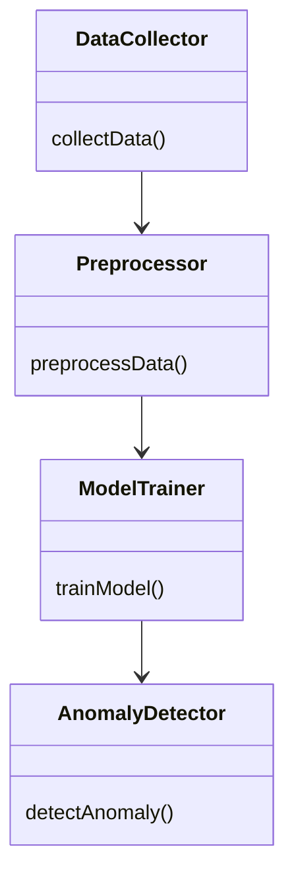

                 

<think>
嗯，我现在要写一篇关于《金融时间序列异常检测系统》的技术博客文章。虽然我对这个主题不太熟悉，但我会尽力理解和组织内容。首先，我需要明确文章的结构和内容。用户已经提供了一个大纲，所以我需要按照这个大纲来填充内容。

首先，文章的标题是《金融时间序列异常检测系统》，关键词包括金融时间序列、异常检测、机器学习、深度学习、算法。摘要部分需要简要说明文章的核心内容和主题思想，也就是介绍异常检测的重要性及其在金融中的应用，探讨统计学、机器学习和深度学习的方法，分析系统的架构，提供实战案例，并总结最佳实践。

接下来，用户详细列出了目录大纲，分为六章。每章都有具体的子章节。我需要按照这个结构逐步展开，确保每个部分都详细且有逻辑性。我可能需要查阅一些相关资料，比如时间序列分析、异常检测的算法、金融数据的特点等，来充实内容。

在第一章，我需要解释为什么在金融领域需要进行时间序列异常检测，以及它的重要性。第二章则要详细讲解时间序列和异常检测的核心概念，可能需要使用一些图表或表格来对比不同的方法。第三章是算法部分，我需要理解并解释ARIMA、LSTM等算法的原理，并用公式和流程图来说明。第四章讨论系统架构，可能需要设计一个系统的模块图和架构图。第五章是项目实战，我需要选择一个实际案例，比如股票价格异常检测，详细描述环境配置、代码实现和结果分析。最后一章总结最佳实践，强调注意事项和未来的研究方向。

在写作过程中，我可能会遇到一些挑战，比如对某些算法的理解不够深入，或者如何用mermaid图来展示流程。这时候，我需要查阅资料或教程，确保自己理解正确。此外，数学公式的正确使用也很重要，我需要确保每个公式都准确无误。

我需要确保文章的语言清晰、逻辑紧凑，同时保持专业性。每一部分的开头要有引言，说明该部分的目的和重要性。每个小节需要详细讲解，避免过于简略。同时，要控制文章的总字数在10000到12000字之间，这意味着每个部分不能太冗长，但要覆盖所有关键点。

在写作过程中，我还需要注意结构的连贯性。每章之间要有过渡，帮助读者顺畅地理解内容。例如，在讨论完算法原理后，可以自然过渡到系统架构的设计，再过渡到实际项目，最后总结。

最后，确保文章末尾有作者信息，符合用户的要求。整个写作过程需要耐心和细致，逐步填充每个部分的内容，确保最终的文章既有深度又易于理解。

总结一下，我的思考过程是：先明确文章结构和内容，再逐步填充每个部分，确保逻辑清晰、内容详实，同时注意专业性和可读性。这将帮助我撰写一篇高质量的技术博客文章。
</think>

# 金融时间序列异常检测系统

## 关键词：金融时间序列、异常检测、机器学习、深度学习、算法

## 摘要：  
金融时间序列异常检测系统是金融数据分析中的重要组成部分，用于识别金融市场中的异常行为和波动。本文将从时间序列数据的基本特性出发，探讨异常检测的核心概念、常见算法及其在金融领域的应用。通过对统计学方法、机器学习算法和深度学习模型的详细分析，本文旨在帮助读者理解如何构建一个高效且可靠的金融时间序列异常检测系统。我们还将通过实际案例展示系统的实现过程，并总结最佳实践和未来研究方向。

---

# 第1章: 金融时间序列异常检测系统背景

## 1.1 异常检测的定义与重要性

### 1.1.1 异常检测的定义  
异常检测（Outlier Detection）是指识别数据集中与预期模式或行为显著不同的数据点。在金融领域，异常检测可以帮助发现市场操纵、欺诈交易或其他异常市场行为。

### 1.1.2 异常检测在金融领域的应用价值  
- **风险管理**：及时发现异常交易或市场波动，降低投资风险。  
- **欺诈 detection**：识别非法交易行为。  
- **市场分析**：发现市场趋势中的异常点，辅助投资决策。  

### 1.1.3 异常检测的核心问题与边界  
- **核心问题**：如何在复杂的时间序列数据中识别异常点。  
- **边界**：异常检测不一定是错误的，可能是正常市场波动的一部分。

---

## 1.2 金融时间序列数据的特点

### 1.2.1 时间序列数据的特性  
- **有序性**：数据按时间顺序排列。  
- **依赖性**：当前值与过去值相关。  
- **周期性**：数据可能具有月度、季度或 yearly 的周期性。  

### 1.2.2 金融数据的特殊性  
- **高波动性**：金融市场波动剧烈。  
- **复杂性**：受多种因素（如经济指标、政策变化）影响。  
- **实时性**：需要快速检测和响应。  

### 1.2.3 异常检测在金融时间序列中的挑战  
- **噪声干扰**：金融数据中可能存在大量噪声。  
- **多变性**：市场行为可能随时间变化。  
- **稀疏性**：异常点可能非常少，导致模型难以学习。  

---

## 1.3 金融时间序列异常检测的场景

### 1.3.1 股票价格异常检测  
- 监测个股或大盘指数的异常波动，识别潜在的市场操纵行为。

### 1.3.2 交易行为异常检测  
- 检测异常的交易模式，识别可能的欺诈行为。

### 1.3.3 市场波动异常检测  
- 发现市场整体波动的异常，辅助风险管理。

---

## 1.4 本章小结  
本章介绍了金融时间序列异常检测的背景、核心概念及其在金融领域的应用场景。通过分析金融数据的特性，我们明确了异常检测在金融领域的独特挑战和价值。

---

# 第2章: 金融时间序列异常检测的核心概念

## 2.1 时间序列分析的基本原理

### 2.1.1 时间序列的分解  
时间序列可以分解为趋势（Trend）、季节性（Seasonality）和随机性（Noise）三部分。  
$$ Y_t = T_t + S_t + R_t $$  

### 2.1.2 时间序列的预测模型  
- **ARIMA模型**：自回归积分滑动平均模型，广泛应用于时间序列预测。  
- **状态空间模型**：通过状态变量描述系统的动态行为。  

### 2.1.3 时间序列的异常点检测  
- 异常点是指在时间序列中偏离预期值的点，可能是孤立点（Outlier）或趋势变化点（Change Point）。  

---

## 2.2 异常检测的数学模型

### 2.2.1 基于统计的方法  
- **Z-score**：通过标准化统计量判断异常点。  
$$ Z = \frac{X - \mu}{\sigma} $$  
- **经验法则**：数据点落在3个标准差之外可能是异常点。

### 2.2.2 基于机器学习的方法  
- **聚类**：异常点可能属于与正常点不同的聚类。  
- **分类**：通过监督学习方法识别异常点。  
- **回归**：通过拟合模型发现异常点。  

### 2.2.3 基于深度学习的方法  
- **RNN**：循环神经网络适用于时间序列数据。  
- **LSTM**：长短期记忆网络，适合捕捉长期依赖关系。  
- **Transformer**：基于注意力机制的模型，适合处理长序列数据。

---

## 2.3 异常检测的评价指标

### 2.3.1 精准率与召回率  
- **Precision**：正确识别的异常点占所有异常点的比例。  
- **Recall**：实际异常点中被正确识别的比例。  

### 2.3.2 F1分数  
$$ F1 = 2 \times \frac{\text{Precision} \times \text{Recall}}{\text{Precision} + \text{Recall}} $$  

### 2.3.3 ROC曲线与AUC值  
- ROC曲线：真实正类率（Recall）与假正类率（False Positive Rate）的曲线。  
- AUC值：ROC曲线下的面积，衡量分类器的整体性能。  

---

## 2.4 本章小结  
本章详细讲解了时间序列分析的基本原理以及异常检测的数学模型，包括统计学方法、机器学习方法和深度学习方法的优缺点。

---

# 第3章: 金融时间序列异常检测算法原理

## 3.1 统计学方法

### 3.1.1 基于均值和标准差的异常检测  
- 计算数据的均值和标准差，判断数据点是否偏离均值超过一定倍数。  
$$ |X_i - \mu| > k \sigma $$  

### 3.1.2 基于经验分布的异常检测  
- 使用经验分布函数（Empirical Distribution Function）判断数据点是否异常。

### 3.1.3 Grubbs检验法  
- 一种用于检测单变量数据中异常值的统计方法。  
$$ |Y_i - \mu| > k \sigma $$  

---

## 3.2 机器学习方法

### 3.2.1 基于聚类的异常检测  
- 使用聚类算法（如K-Means）识别与大多数数据点不同的簇。  

### 3.2.2 基于分类的异常检测  
- 使用监督学习算法（如SVM、随机森林）识别异常点。  

### 3.2.3 基于回归的异常检测  
- 通过拟合回归模型，判断预测值与实际值的差异。  

---

## 3.3 深度学习方法

### 3.3.1 基于RNN的异常检测  
- RNN适用于处理时间序列数据，但其性能可能受限于梯度消失问题。  

### 3.3.2 基于LSTM的异常检测  
- LSTM通过长短期记忆机制，能够更好地捕捉时间序列中的长期依赖关系。  

### 3.3.3 基于Transformer的异常检测  
- Transformer模型通过自注意力机制，适合处理长序列数据。  

---

## 3.4 算法对比与选择

### 3.4.1 统计学方法 vs 机器学习方法  
- 统计学方法简单高效，但可能无法捕捉复杂模式。  
- 机器学习方法能够处理非线性关系，但需要大量数据和计算资源。  

### 3.4.2 机器学习方法 vs 深度学习方法  
- 机器学习方法适用于数据量较小的场景。  
- 深度学习方法适用于数据量大且模式复杂的场景。  

### 3.4.3 算法选择的策略与建议  
- 根据数据量和复杂性选择合适的算法。  
- 组合多种方法提高检测精度。  

---

## 3.5 本章小结  
本章详细讲解了金融时间序列异常检测中的统计学方法、机器学习方法和深度学习方法，并分析了它们的优缺点和适用场景。

---

# 第4章: 金融时间序列异常检测系统架构

## 4.1 系统功能模块划分

### 4.1.1 数据采集模块  
- 从金融数据源（如股票市场数据）获取时间序列数据。  

### 4.1.2 数据预处理模块  
- 数据清洗：处理缺失值和异常值。  
- 数据转换：标准化或归一化数据。  

### 4.1.3 模型训练模块  
- 使用选定的算法训练异常检测模型。  

### 4.1.4 异常检测模块  
- 对实时数据进行异常检测，输出检测结果。  

---

## 4.2 系统架构设计

### 4.2.1 领域模型（Mermaid 类图）  


### 4.2.2 系统架构（Mermaid 架构图）  


---

## 4.3 系统接口设计

### 4.3.1 数据接口  
- 数据输入接口：接收金融时间序列数据。  
- 数据输出接口：输出异常检测结果。  

### 4.3.2 模型接口  
- 模型训练接口：训练异常检测模型。  
- 模型预测接口：对实时数据进行预测。  

---

## 4.4 本章小结  
本章详细描述了金融时间序列异常检测系统的功能模块、架构设计和接口设计，为后续的系统实现奠定了基础。

---

# 第5章: 金融时间序列异常检测项目实战

## 5.1 项目背景与目标

### 5.1.1 项目背景  
本项目旨在通过构建一个金融时间序列异常检测系统，识别股票市场的异常交易行为。  

### 5.1.2 项目目标  
- 实现股票价格的实时监控。  
- 发现异常交易行为并及时报警。  

---

## 5.2 项目环境与工具

### 5.2.1 环境配置  
- 操作系统：Linux/Windows/MacOS  
- Python版本：3.8及以上  
- 依赖库：Pandas、NumPy、Scikit-learn、Keras、TensorFlow  

### 5.2.2 数据来源  
- 数据集：从Yahoo Finance获取某股票的历史数据。  

---

## 5.3 系统核心实现

### 5.3.1 数据采集与预处理  
```python
import pandas as pd
import numpy as np

# 数据采集
def collect_data(ticker, start_date, end_date):
    data = pd.read_csv(f"data/{ticker}.csv")
    return data

# 数据预处理
def preprocess_data(data):
    data = data.dropna()
    data['log_return'] = np.log(data['Close'] / data['Close'].shift(1))
    return data
```

### 5.3.2 模型实现  
```python
from sklearn.ensemble import IsolationForest
from keras.models import Sequential
from keras.layers import LSTM, Dense

# 基于Isolation Forest的异常检测
def isolation_forest_model(X_train):
    model = IsolationForest(n_estimators=100, contamination=0.05)
    model.fit(X_train)
    return model

# 基于LSTM的异常检测
def lstm_model(input_shape):
    model = Sequential()
    model.add(LSTM(64, input_shape=input_shape))
    model.add(Dense(1, activation='sigmoid'))
    model.compile(loss='binary_crossentropy', optimizer='adam')
    return model
```

### 5.3.3 异常检测与报警  
```python
def detect_anomaly(model, data):
    predictions = model.predict(data)
    anomalies = np.where(predictions < 0.05, 1, 0)
    return anomalies

def send_alert(anomalies):
    if np.sum(anomalies) > 0:
        print("异常检测到！")
```

---

## 5.4 项目案例分析

### 5.4.1 数据分析与可视化  
使用Matplotlib绘制股票价格和异常检测结果的可视化图表。  

### 5.4.2 模型评估  
- 使用混淆矩阵评估模型性能。  
- 计算准确率、召回率和F1分数。  

---

## 5.5 本章小结  
本章通过一个实际项目展示了金融时间序列异常检测系统的实现过程，包括数据采集、预处理、模型训练和异常检测等步骤。

---

# 第6章: 金融时间序列异常检测系统总结

## 6.1 本章总结

### 6.1.1 核心内容回顾  
- 异常检测的核心概念与方法。  
- 统计学方法、机器学习方法和深度学习方法的优缺点。  
- 金融时间序列异常检测系统的架构设计与实现。  

### 6.1.2 实际应用中的注意事项  
- 数据质量：确保数据的完整性和准确性。  
- 模型选择：根据数据量和复杂性选择合适的算法。  
- 可解释性：模型结果需要易于理解和解释。  

---

## 6.2 未来研究方向

### 6.2.1 深度学习模型的优化  
- 尝试不同的深度学习架构（如Transformer）。  
- 调整超参数以提高模型性能。  

### 6.2.2 多模态数据融合  
- 结合文本数据、新闻数据等多模态数据进行异常检测。  

### 6.2.3 实时检测系统的优化  
- 提高系统的实时性与响应速度。  
- 优化模型的计算效率。  

---

## 6.3 本章小结  
本章总结了全文的核心内容，并提出了未来的研究方向和实际应用中的注意事项。

---

# 作者：AI天才研究院/AI Genius Institute & 禅与计算机程序设计艺术 /Zen And The Art of Computer Programming

