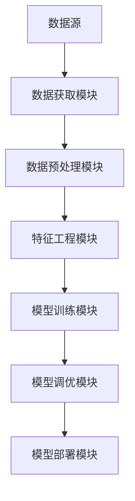

                 


# 金融时间序列数据预测：模型与方法

## 关键词：金融时间序列、预测模型、机器学习、深度学习、ARIMA、LSTM

## 摘要：  
金融时间序列数据预测是金融领域的重要研究方向，旨在通过历史数据预测未来的价格走势。本文系统地介绍了金融时间序列数据预测的核心模型与方法，从数据预处理、经典统计模型（如ARIMA）、机器学习算法（如随机森林、支持向量机）到深度学习模型（如LSTM、Transformer），并结合实际案例进行详细分析。文章还探讨了系统架构设计与实现，帮助读者从理论到实践全面掌握金融时间序列预测的技巧与方法。

---

## 第1章：金融时间序列数据概述

### 1.1 时间序列数据的基本概念  
时间序列数据是指按照时间顺序排列的数据，通常以等间隔的时间点记录观测值。金融时间序列数据具有以下特点：  
1. **连续性**：数据按时间顺序排列，且时间间隔固定。  
2. **波动性**：金融市场的价格波动通常遵循随机游走或均值回归特性。  
3. **非线性**：金融数据的波动往往受到多种复杂因素的影响，表现出非线性特征。  

### 1.2 金融市场的基本概念  
金融市场的核心是资产定价与交易，时间序列数据在金融分析中扮演着重要角色：  
1. **资产定价**：通过历史价格数据预测未来价格走势。  
2. **风险管理**：利用波动性和相关性分析，评估投资组合的风险。  
3. **交易策略**：基于时间序列数据开发量化交易策略。  

### 1.3 时间序列预测的背景与应用  
时间序列预测在金融领域有广泛的应用：  
1. **股票价格预测**：基于历史股价预测未来价格走势。  
2. **外汇汇率预测**：通过分析汇率波动预测未来走势。  
3. **风险管理**：预测市场波动性以优化投资组合。  

---

## 第2章：时间序列数据的预处理  

### 2.1 数据清洗与缺失值处理  
在金融数据中，缺失值的处理至关重要。常见的处理方法包括：  
1. **删除法**：直接删除包含缺失值的样本。  
2. **插值法**：使用前值、后值或均值填充缺失值。  
3. **模型预测法**：利用时间序列模型预测缺失值。  

#### 代码示例：使用线性插值填充缺失值  
```python
import pandas as pd
import numpy as np

# 创建示例数据
data = pd.date_range(start='2020-01-01', periods=10)
data = pd.DataFrame({'date': data, 'price': [100, 90, np.nan, 80, 70, 60, 50, 40, 30, 20]})

# 使用线性插值填充缺失值
data['price'].interpolate(method='linear', inplace=True)
print(data)
```

### 2.2 数据平滑与差分  
数据平滑技术用于去除噪声，增强数据的可预测性：  
1. **移动平均法**：通过计算滑动窗口内的平均值平滑数据。  
2. **差分法**：通过计算相邻观测值的差值，将非平稳序列转化为平稳序列。  

#### 代码示例：使用差分法处理数据  
```python
import pandas as pd
import numpy as np

# 创建示例数据
data = pd.date_range(start='2020-01-01', periods=10)
data = pd.DataFrame({'date': data, 'price': [100, 90, 85, 80, 75, 70, 65, 60, 55, 50]})

# 计算一阶差分
data['diff_price'] = data['price'].diff()
print(data)
```

### 2.3 异常值检测与处理  
异常值会显著影响模型的预测性能，常见的检测方法包括：  
1. **基于统计的方法**：利用Z-score或IQR方法检测异常值。  
2. **基于模型的方法**：通过回归模型或聚类算法识别异常值。  

#### 代码示例：使用Z-score检测异常值  
```python
import pandas as pd
import numpy as np
from scipy import stats

# 创建示例数据
data = pd.date_range(start='2020-01-01', periods=10)
data = pd.DataFrame({'date': data, 'price': [100, 90, 120, 80, 70, 60, 50, 40, 30, 20]})

# 计算Z-score
z_scores = stats.zscore(data['price'])
data['is_outlier'] = z_scores.abs() > 3
print(data)
```

---

## 第3章：时间序列分析的核心模型  

### 3.1 ARIMA模型  
ARIMA（Autoregressive Integrated Moving Average）模型是一种广泛应用于时间序列预测的经典模型，由三个参数（p, d, q）组成：  
- p：自回归阶数，表示模型中使用的过去观测值的数量。  
- d：差分阶数，表示数据经过d次差分后变为平稳序列。  
- q：移动平均阶数，表示模型中使用的过去误差的数量。  

#### ARIMA模型的数学公式  
$$ ARIMA(p, d, q) = y_t = \phi_1 y_{t-1} + \dots + \phi_p y_{t-p} + \theta_1 \epsilon_{t-1} + \dots + \theta_q \epsilon_{t-q} + \epsilon_t $$  

#### 代码示例：使用ARIMA模型进行预测  
```python
from statsmodels.tsa.arima_model import ARIMA

# 创建示例数据
data = pd.date_range(start='2020-01-01', periods=20)
data = pd.DataFrame({'date': data, 'price': [100, 90, 85, 80, 75, 70, 65, 60, 55, 50, 45, 40, 35, 30, 25, 20, 15, 10, 5, 0]})

# 训练ARIMA模型
model = ARIMA(data['price'], order=(5, 1, 2))
model_fit = model.fit()

# 进行预测
forecast = model_fit.forecast(steps=5)
print(forecast)
```

### 3.2 GARCH模型  
GARCH（Generalized Autoregressive Conditional Heteroskedasticity）模型用于估计波动性，特别适用于金融时间序列数据。GARCH模型的数学公式为：  
$$ GARCH(p, q) = \sigma_t^2 = \alpha_0 + \alpha_1 r_{t-1}^2 + \dots + \alpha_q r_{t-q}^2 $$  

#### 代码示例：使用GARCH模型估计波动性  
```python
from arch import arch_model

# 创建示例数据
data = pd.date_range(start='2020-01-01', periods=20)
data = pd.DataFrame({'date': data, 'price': [100, 90, 85, 80, 75, 70, 65, 60, 55, 50, 45, 40, 35, 30, 25, 20, 15, 10, 5, 0]})

# 训练GARCH模型
model = arch_model(data['price'], vol='GARCH', p=1, q=1)
model_fit = model.fit()

# 输出波动性估计
print(model_fit.summary())
```

### 3.3 机器学习方法  
机器学习算法在时间序列预测中表现出色，常用算法包括：  
1. **随机森林**：通过特征重要性分析提取时间序列特征。  
2. **支持向量机（SVM）**：适用于小规模数据的高维特征空间建模。  
3. **XGBoost/LightGBM**：基于梯度提升的树模型，适合处理复杂的非线性关系。  

#### 代码示例：使用随机森林进行时间序列预测  
```python
import pandas as pd
from sklearn.ensemble import RandomForestRegressor
from sklearn.model_selection import train_test_split

# 创建示例数据
data = pd.date_range(start='2020-01-01', periods=20)
data = pd.DataFrame({'date': data, 'price': [100, 90, 85, 80, 75, 70, 65, 60, 55, 50, 45, 40, 35, 30, 25, 20, 15, 10, 5, 0]})

# 特征工程：生成滞后特征
def create_features(data, lag=5):
    for i in range(1, lag+1):
        data[f'lag_{i}'] = data['price'].shift(i)
    return data

data = create_features(data).dropna()

# 划分训练集和测试集
X = data[['lag_1', 'lag_2', 'lag_3', 'lag_4', 'lag_5']]
y = data['price']
X_train, X_test, y_train, y_test = train_test_split(X, y, test_size=0.2, random_state=42)

# 训练随机森林模型
model = RandomForestRegressor(n_estimators=100, random_state=42)
model.fit(X_train, y_train)

# 进行预测
y_pred = model.predict(X_test)
print(y_pred)
```

### 3.4 深度学习方法  
深度学习模型在时间序列预测中表现出强大的能力，常用模型包括：  
1. **LSTM（长短期记忆网络）**：适合处理长序列依赖关系。  
2. **Transformer**：通过自注意力机制捕捉全局依赖关系。  

#### 代码示例：使用LSTM进行时间序列预测  
```python
import numpy as np
from tensorflow.keras.models import Sequential
from tensorflow.keras.layers import LSTM, Dense, Dropout

# 创建示例数据
data = pd.date_range(start='2020-01-01', periods=20)
data = pd.DataFrame({'date': data, 'price': [100, 90, 85, 80, 75, 70, 65, 60, 55, 50, 45, 40, 35, 30, 25, 20, 15, 10, 5, 0]})

# 数据预处理：归一化
from sklearn.preprocessing import MinMaxScaler
scaler = MinMaxScaler()
data_scaled = scaler.fit_transform(data['price'].values.reshape(-1, 1))

# 划分训练集和测试集
train_data = data_scaled[:16]
test_data = data_scaled[16:]

# 构建LSTM输入数据
def create_dataset(data, look_back=5):
    X, y = [], []
    for i in range(len(data) - look_back):
        X.append(data[i:i+look_back])
        y.append(data[i+look_back])
    return np.array(X), np.array(y)

X_train, y_train = create_dataset(train_data, look_back=5)
X_test, y_test = create_dataset(test_data, look_back=5)

# 构建LSTM模型
model = Sequential()
model.add(LSTM(50, input_shape=(5, 1)))
model.add(Dropout(0.2))
model.add(Dense(1))
model.compile(loss='mean_squared_error', optimizer='adam')

# 训练模型
model.fit(X_train, y_train, epochs=50, batch_size=1, verbose=2)

# 进行预测
y_pred = model.predict(X_test)
y_pred = y_pred.reshape(-1, 1)
y_pred = scaler.inverse_transform(y_pred)
y_true = scaler.inverse_transform(y_test.reshape(-1, 1))

print(y_pred)
print(y_true)
```

---

## 第4章：系统架构与实现  

### 4.1 系统架构设计  
金融时间序列预测系统的架构设计包括以下几个部分：  
1. **数据获取**：从金融数据源获取实时或历史数据。  
2. **特征工程**：对数据进行清洗、平滑和特征提取。  
3. **模型训练**：基于特征数据训练预测模型。  
4. **模型调优**：通过超参数优化和模型融合提升预测性能。  
5. **模型部署**：将模型部署到生产环境，实现实时预测。  

#### 系统架构图  


### 4.2 系统实现  

#### 4.2.1 数据获取与处理  
使用API获取实时金融数据，并进行初步处理：  
```python
import pandas_datareader as pdr

# 获取股票数据
data = pdr.get_data_yahoo('AAPL', start='2020-01-01', end='2023-12-31')
print(data.head())
```

#### 4.2.2 特征工程  
生成技术指标（如移动平均线、相对强弱指数等）作为模型输入：  
```python
import pandas as pd
import numpy as np

# 生成移动平均线
data['MA_5'] = data['Close'].rolling(5).mean()
data['MA_10'] = data['Close'].rolling(10).mean()

# 生成相对强弱指数
data['RSI'] = (100 * (data['Close'] - data['Close'].shift(1)) / data['Close'].shift(1).abs()).rolling(14).mean()

print(data.head())
```

#### 4.2.3 模型训练与部署  
使用训练好的模型进行实时预测，并将结果输出：  
```python
# 训练模型（以随机森林为例）
model = RandomForestRegressor(n_estimators=100, random_state=42)
model.fit(X_train, y_train)

# 部署模型
def predict_price(model, scaler, look_back=5):
    current_price = data['Close'][-look_back:]
    normalized_price = scaler.transform(current_price.reshape(-1, 1))
    prediction = model.predict(normalized_price.reshape(1, -1))
    return scaler.inverse_transform(prediction)

print(predict_price(model, scaler))
```

---

## 第5章：项目实战  

### 5.1 项目背景  
本项目旨在利用时间序列数据预测股票价格走势，使用苹果公司（AAPL）的股票数据进行分析。  

### 5.2 数据获取与预处理  
使用Yahoo Finance API获取苹果股票数据，并进行初步处理：  
```python
import pandas_datareader as pdr

# 获取数据
data = pdr.get_data_yahoo('AAPL', start='2020-01-01', end='2023-12-31')

# 数据预处理
data['Date'] = data.index
print(data.head())
```

### 5.3 特征工程  
生成技术指标，如移动平均线、相对强弱指数等：  
```python
import pandas as pd
import numpy as np

# 生成移动平均线
data['MA_5'] = data['Close'].rolling(5).mean()
data['MA_10'] = data['Close'].rolling(10).mean()

# 生成相对强弱指数
data['RSI'] = (100 * (data['Close'] - data['Close'].shift(1)) / data['Close'].shift(1).abs()).rolling(14).mean()

print(data.head())
```

### 5.4 模型实现  
使用LSTM模型进行股票价格预测：  
```python
from tensorflow.keras.models import Sequential
from tensorflow.keras.layers import LSTM, Dense, Dropout
import numpy as np

# 数据归一化
scaler = MinMaxScaler()
data_scaled = scaler.fit_transform(data['Close'].values.reshape(-1, 1))

# 划分训练集和测试集
train_data = data_scaled[:16]
test_data = data_scaled[16:]

# 创建LSTM输入数据
def create_dataset(data, look_back=5):
    X, y = [], []
    for i in range(len(data) - look_back):
        X.append(data[i:i+look_back])
        y.append(data[i+look_back])
    return np.array(X), np.array(y)

X_train, y_train = create_dataset(train_data, look_back=5)
X_test, y_test = create_dataset(test_data, look_back=5)

# 构建LSTM模型
model = Sequential()
model.add(LSTM(50, input_shape=(5, 1)))
model.add(Dropout(0.2))
model.add(Dense(1))
model.compile(loss='mean_squared_error', optimizer='adam')

# 训练模型
model.fit(X_train, y_train, epochs=50, batch_size=1, verbose=2)

# 进行预测
y_pred = model.predict(X_test)
y_pred = y_pred.reshape(-1, 1)
y_pred = scaler.inverse_transform(y_pred)
y_true = scaler.inverse_transform(y_test.reshape(-1, 1))

print(y_pred)
print(y_true)
```

### 5.5 结果分析  
将预测结果与实际价格进行对比，计算预测误差：  
```python
from sklearn.metrics import mean_squared_error, mean_absolute_error

mse = mean_squared_error(y_true, y_pred)
mae = mean_absolute_error(y_true, y_pred)
print(f'MSE: {mse}')
print(f'MAE: {mae}')
```

---

## 第6章：总结与展望  

### 6.1 本章小结  
本文系统地介绍了金融时间序列数据预测的核心模型与方法，从数据预处理、经典统计模型到机器学习和深度学习算法，结合实际案例进行了详细分析。  

### 6.2 注意事项  
1. **数据质量**：确保数据的完整性和准确性。  
2. **模型选择**：根据数据特点选择合适的模型。  
3. **超参数调优**：通过网格搜索优化模型性能。  

### 6.3 拓展阅读  
1. 《时间序列分析：方法与应用》  
2. 《深度学习中的时间序列建模》  

---

## 作者：AI天才研究院/AI Genius Institute & 禅与计算机程序设计艺术 /Zen And The Art of Computer Programming

