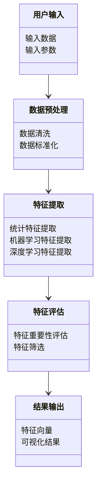
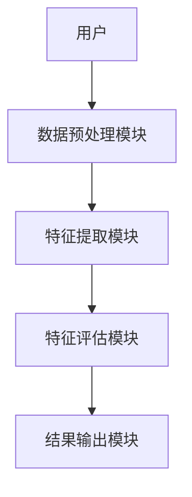
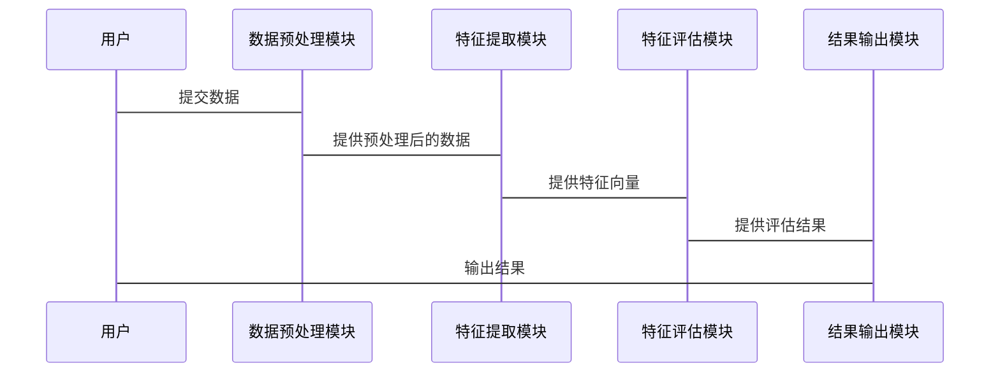

                 


# 《金融时间序列特征提取工具集》

> 关键词：金融时间序列、特征提取、工具集、机器学习、深度学习

> 摘要：本文旨在探讨如何构建一个高效、全面的金融时间序列特征提取工具集。通过分析金融时间序列数据的特性，结合统计学、机器学习和深度学习等多种方法，提出一套系统化的特征提取解决方案。文章从基础概念入手，详细阐述了特征提取的核心算法与数学模型，并通过实际案例展示了工具集的应用与效果。最后，本文总结了构建金融时间序列特征提取工具集的关键要点，并提出了未来研究的方向。

---

# 第1章: 金融时间序列特征提取背景与概念

## 1.1 金融时间序列数据的基本概念

### 1.1.1 时间序列数据的定义与特点
时间序列数据是指按照时间顺序排列的观测值序列，通常具有以下特点：
- **有序性**：数据按时间顺序排列。
- **趋势性**：数据可能呈现长期上升或下降的趋势。
- **周期性**：数据可能受到季节性或周期性因素的影响。
- **随机性**：数据中可能存在不可预测的随机波动。

### 1.1.2 金融时间序列数据的特殊性
金融时间序列数据具有以下几个特殊性：
- **波动性**：金融市场的数据通常波动较大。
- **非线性**：金融数据往往呈现出复杂的非线性关系。
- **噪声干扰**：金融数据中常受到噪声干扰，例如市场操纵、突发事件等。
- **稀疏性**：某些金融数据可能较为稀疏，例如某些股票的交易数据。

### 1.1.3 金融时间序列分析的典型应用场景
- **股票价格预测**：通过分析历史股价数据，预测未来股价走势。
- **市场风险评估**：通过分析波动性，评估市场的潜在风险。
- **异常交易检测**：通过分析交易数据，发现异常交易行为。
- **资产配置优化**：通过分析不同资产的历史表现，优化资产配置。

## 1.2 特征提取在金融时间序列分析中的重要性

### 1.2.1 特征提取的基本概念
特征提取是指从原始数据中提取能够反映数据本质特征的低维表示。在金融时间序列分析中，特征提取的目标是将复杂的时序数据转化为一组简洁的特征向量，以便后续分析（如分类、预测等）。

### 1.2.2 金融时间序列特征提取的目标与意义
- **目标**：提取能够反映金融时间序列本质特征的指标。
- **意义**：通过特征提取，可以降低数据维度，提高模型的计算效率；同时，特征提取可以帮助我们更好地理解数据的内在规律。

### 1.2.3 常见的金融时间序列特征类型
- **统计特征**：均值、方差、标准差、偏度、峰度等。
- **时间特征**：周期性、趋势性、波动性等。
- **频域特征**：傅里叶变换后的频域特征。
- **复杂特征**：基于机器学习或深度学习模型提取的高阶特征。

## 1.3 金融时间序列特征提取工具集的构建目标

### 1.3.1 工具集的功能定位
金融时间序列特征提取工具集旨在为用户提供一个高效、易用的特征提取平台，支持多种特征提取方法，并能够与其他分析工具（如预测模型）无缝对接。

### 1.3.2 工具集的用户群体与使用场景
- **用户群体**：金融分析师、数据科学家、学术研究人员等。
- **使用场景**：股票价格预测、市场风险评估、资产配置优化、异常交易检测等。

### 1.3.3 工具集的技术路线与实现框架
- **技术路线**：结合统计学、机器学习和深度学习方法，构建一个多层次的特征提取框架。
- **实现框架**：模块化设计，支持多种特征提取方法的灵活组合。

## 1.4 本章小结

---

# 第2章: 金融时间序列特征提取的核心概念与联系

## 2.1 时间序列分析的基本原理

### 2.1.1 时间序列的分解模型
时间序列的分解模型将序列分解为趋势、周期和噪声三部分：
$$ T_t + S_t + R_t $$

### 2.1.2 时间序列的平稳性与单位根检验
- **平稳性**：时间序列的统计性质在时间上保持不变。
- **单位根检验**：用于判断时间序列是否平稳，常用的检验方法包括ADF检验、KPSS检验等。

### 2.1.3 时间序列的自相关与偏自相关函数
- **自相关函数（ACF）**：衡量序列中不同滞后阶数之间的相关性。
- **偏自相关函数（PACF）**：衡量在控制其他滞后变量影响下的自相关性。

## 2.2 金融时间序列特征提取的关键方法

### 2.2.1 基于统计学的特征提取方法
- **均值、方差、标准差**：这些统计指标可以反映序列的中心位置和离散程度。
- **分位数**：通过计算不同分位数，可以捕捉序列的分布特征。

### 2.2.2 基于机器学习的特征提取方法
- **主成分分析（PCA）**：通过降维技术提取特征。
- **线性判别分析（LDA）**：通过分类器的视角提取特征。

### 2.2.3 基于深度学习的特征提取方法
- **长短时记忆网络（LSTM）**：可以捕捉序列中的长程依赖关系。
- **Transformer架构**：通过自注意力机制提取序列的全局特征。

## 2.3 金融时间序列特征提取的工具集架构

### 2.3.1 工具集的功能模块划分
- **数据预处理模块**：负责数据清洗、标准化等。
- **特征提取模块**：包含多种特征提取算法。
- **特征评估模块**：评估特征的重要性。
- **结果可视化模块**：将提取的特征以图形化方式展示。

### 2.3.2 工具集的输入输出接口设计
- **输入接口**：支持多种数据格式的输入，例如CSV、Excel等。
- **输出接口**：输出提取的特征向量，支持多种格式的导出。

### 2.3.3 工具集的可扩展性与灵活性
工具集应支持用户自定义特征提取算法，方便根据具体需求进行扩展。

## 2.4 本章小结

---

# 第3章: 常见金融时间序列特征提取算法原理

## 3.1 基于统计学的特征提取算法

### 3.1.1 均值、方差、标准差的计算
- **均值**：$$ \mu = \frac{1}{n}\sum_{i=1}^{n}x_i $$
- **方差**：$$ \sigma^2 = \frac{1}{n-1}\sum_{i=1}^{n}(x_i - \mu)^2 $$
- **标准差**：$$ \sigma = \sqrt{\sigma^2} $$

### 3.1.2 自相关函数与偏自相关函数的计算
- **自相关函数（ACF）**：$$ ACF(k) = \frac{\sum_{i=1}^{n-k}(x_i - \mu)(x_{i+k} - \mu)}{\sum_{i=1}^{n}(x_i - \mu)^2} $$
- **偏自相关函数（PACF）**：通过回归分析计算。

### 3.1.3 金融时间序列的周期性检测
- **傅里叶变换**：用于检测序列中的周期性成分。
- **周期图**：通过傅里叶变换的结果绘制周期图，判断显著周期。

## 3.2 基于机器学习的特征提取算法

### 3.2.1 主成分分析（PCA）在时间序列特征提取中的应用
- **PCA原理**：通过线性变换将高维数据降维到低维空间。
- **PCA步骤**：
  1. 标准化数据。
  2. 计算协方差矩阵。
  3. 计算协方差矩阵的特征值和特征向量。
  4. 选择前k个特征向量作为主成分。

### 3.2.2 线性判别分析（LDA）在时间序列特征提取中的应用
- **LDA原理**：通过最大化类间距离和最小化类内距离，提取具有区分能力的特征。

### 3.2.3 支持向量机（SVM）在时间序列特征提取中的应用
- **SVM原理**：通过构建超平面，将数据分为不同类别。
- **核函数**：使用核函数将低维数据映射到高维空间，提取非线性特征。

## 3.3 基于深度学习的特征提取算法

### 3.3.1 长短期记忆网络（LSTM）在时间序列特征提取中的应用
- **LSTM结构**：包括输入门、遗忘门和输出门。
- **LSTM特点**：能够捕捉序列中的长程依赖关系。

### 3.3.2 递归神经网络（RNN）在时间序列特征提取中的应用
- **RNN结构**：通过递归方式处理序列数据。
- **RNN特点**：适合处理变长的序列数据。

### 3.3.3 Transformer架构在时间序列特征提取中的应用
- **Transformer结构**：包括编码器和解码器两部分。
- **自注意力机制**：通过计算序列中每个位置的重要性，提取全局特征。

## 3.4 本章小结

---

# 第4章: 金融时间序列特征提取的数学模型与公式

## 4.1 基于统计学的特征提取模型

### 4.1.1 均值、方差、标准差的数学表达式
$$ \mu = \frac{1}{n}\sum_{i=1}^{n}x_i $$
$$ \sigma^2 = \frac{1}{n-1}\sum_{i=1}^{n}(x_i - \mu)^2 $$
$$ \sigma = \sqrt{\sigma^2} $$

### 4.1.2 自相关函数（ACF）的数学表达式
$$ ACF(k) = \frac{\sum_{i=1}^{n-k}(x_i - \mu)(x_{i+k} - \mu)}{\sum_{i=1}^{n}(x_i - \mu)^2} $$

## 4.2 基于机器学习的特征提取模型

### 4.2.1 主成分分析（PCA）的数学表达式
$$ X = X\lambda X^T $$

### 4.2.2 支持向量机（SVM）的数学表达式
$$ \text{目标函数} = \sum_{i=1}^{n} \xi_i + C\sum_{i=1}^{n}\xi_i $$
$$ \text{约束条件}： y_i(\omega \cdot x_i + b) \geq 1 - \xi_i $$
$$ \xi_i \geq 0 $$

---

# 第5章: 金融时间序列特征提取工具集的系统架构与实现

## 5.1 系统功能设计

### 5.1.1 领域模型


### 5.1.2 系统架构


### 5.1.3 系统接口设计
- **输入接口**：支持多种数据格式的输入，例如CSV、Excel等。
- **输出接口**：支持多种格式的输出，例如JSON、CSV等。

### 5.1.4 系统交互


## 5.2 项目实战

### 5.2.1 环境安装
```bash
pip install numpy pandas scikit-learn tensorflow
```

### 5.2.2 系统核心实现源代码
```python
import numpy as np
import pandas as pd
from sklearn.decomposition import PCA
from tensorflow.keras.layers import LSTM, Dense, Input
from tensorflow.keras.models import Model

# 数据预处理
def preprocess_data(data):
    # 数据清洗
    data = data.dropna()
    # 标准化
    data = (data - data.mean()) / data.std()
    return data

# 特征提取
def extract_features(data):
    # 统计特征
    stats = data.describe().values
    # 机器学习特征
    pca = PCA(n_components=2)
    ml_features = pca.fit_transform(stats)
    # 深度学习特征
    model = create_lstm_model((ml_features.shape[1], 1))
    lstm_features = model.predict(ml_features)
    return np.concatenate([stats, ml_features, lstm_features], axis=1)

def create_lstm_model(input_shape):
    inputs = Input(shape=input_shape)
    lstm_layer = LSTM(64, return_sequences=False)(inputs)
    dense_layer = Dense(32, activation='relu')(lstm_layer)
    model = Model(inputs=inputs, outputs=dense_layer)
    model.compile(optimizer='adam', loss='mse')
    return model
```

### 5.2.3 代码应用解读与分析
- **数据预处理**：对数据进行清洗和标准化处理，确保数据适合后续特征提取。
- **特征提取**：结合统计特征、机器学习特征和深度学习特征，提取多维度的特征向量。
- **模型训练**：使用LSTM网络对提取的特征向量进行训练，进一步优化特征表示。

### 5.2.4 实际案例分析
以股票价格预测为例，展示工具集在实际应用中的效果。

### 5.2.5 项目小结
总结项目实现的关键步骤和成果，分析工具集的优势与不足。

## 5.3 本章小结

---

# 第6章: 金融时间序列特征提取工具集的最佳实践与总结

## 6.1 最佳实践 Tips

### 6.1.1 数据预处理
- 确保数据的完整性和准确性。
- 对异常值进行处理。

### 6.1.2 特征提取
- 根据具体需求选择合适的特征提取方法。
- 结合多种特征提取方法，提高特征的表征能力。

### 6.1.3 模型训练
- 对提取的特征进行充分验证。
- 调参优化模型性能。

## 6.2 项目总结

### 6.2.1 核心成果
- 构建了一个功能完善的金融时间序列特征提取工具集。
- 提供了多种特征提取方法，能够满足不同场景的需求。

### 6.2.2 经验与教训
- 数据预处理是特征提取的关键步骤，需要高度重视。
- 特征提取方法的选择需要结合具体应用场景。

## 6.3 未来研究方向

### 6.3.1 更高效的特征提取算法
- 研究更高效的特征提取算法，例如基于图神经网络的方法。

### 6.3.2 多模态特征提取
- 结合文本、图像等多种模态数据，提取更丰富的特征。

### 6.3.3 自适应特征提取
- 研究自适应的特征提取方法，能够根据数据动态调整提取策略。

## 6.4 本章小结

---

# 作者：AI天才研究院/AI Genius Institute & 禅与计算机程序设计艺术 /Zen And The Art of Computer Programming

