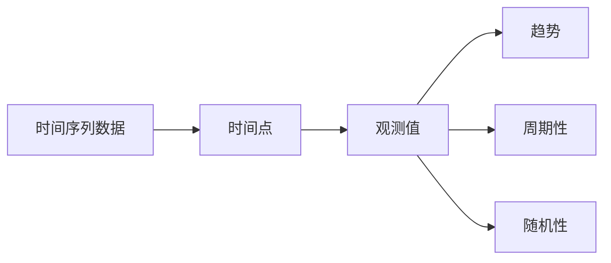

                 

<think>
嗯，我现在要写一篇关于《金融时间序列预测模型比较》的技术博客文章。首先，我需要理解用户的需求，他们想要一篇结构清晰、内容详实的专业技术博客，涵盖金融时间序列预测的各种模型，并进行比较分析。

我应该从哪里开始呢？首先，我需要收集相关的信息，了解有哪些主要的金融时间序列预测模型，比如ARIMA、LSTM、Prophet等等。然后，我需要理解每个模型的原理、优缺点以及适用场景。

接下来，我得考虑如何组织文章的结构。可能按照背景介绍、核心概念、各个模型的详细讲解、比较分析、优化策略等部分来安排。这样可以让读者逐步深入，从基础到应用，再到优化。

在写作过程中，我需要确保每一部分都包含足够的细节，比如在模型原理部分，用mermaid流程图和数学公式来展示模型的工作流程。同时，还需要用实际的代码示例来帮助读者理解。

可能会遇到的问题是如何平衡各个模型的讲解深度，以及如何在有限的篇幅内涵盖所有重要内容。我需要合理分配各部分的篇幅，确保每个模型都有充分的介绍，同时避免冗余。

此外，我还需要思考如何让内容更具吸引力，使用吸引人的标题和小结来引导读者阅读。同时，加入一些最佳实践和注意事项，增加文章的实用价值。

最后，我需要确保整个文章逻辑清晰，结构紧凑，语言专业且易懂。这可能需要多次修改和调整，确保每个部分都紧密相连，形成一个完整的知识体系。
</think>

# 金融时间序列预测模型比较

> 关键词：金融时间序列，预测模型，ARIMA，LSTM，Prophet，模型比较，机器学习

> 摘要：本文系统地探讨了金融时间序列预测中常用的几种模型，包括ARIMA、LSTM、Prophet等，并从模型原理、优缺点、适用场景等方面进行了深入比较。通过实际案例分析和优化策略，本文为读者提供了选择和优化模型的指导。

---

# 第一章：金融时间序列预测模型概述

## 1.1 金融时间序列的基本概念

### 1.1.1 时间序列的定义与特点

时间序列是一种按时间顺序排列的数据，通常表示为一系列有序的观测值。在金融领域，时间序列数据通常指的是股票价格、汇率、指数等随时间变化的数值。

### 1.1.2 金融时间序列的特殊性

金融时间序列具有以下几个特点：
- **非线性**：金融市场的波动通常是非线性的，难以用简单的线性模型描述。
- **波动性**：金融数据通常表现出较高的波动性，尤其是在市场剧烈波动时。
- **趋势性**：部分金融时间序列可能表现出长期的趋势，例如股票价格的上涨趋势。
- **周期性**：金融市场可能存在季节性或周期性波动，例如节假日效应。

### 1.1.3 金融时间序列预测的背景与意义

金融时间序列预测在投资决策、风险管理、资产配置等领域具有重要的应用价值。通过准确的预测，投资者可以做出更明智的决策，从而提高投资收益并降低风险。

## 1.2 金融时间序列预测模型的分类

金融时间序列预测模型可以分为以下几类：
- **传统统计模型**：如ARIMA、GARCH等。
- **机器学习模型**：如随机森林、支持向量机（SVM）等。
- **深度学习模型**：如LSTM、Transformer等。
- **混合模型**：结合传统统计模型和机器学习/深度学习模型。

本文主要比较ARIMA、LSTM和Prophet三种模型，它们分别代表了传统统计模型、深度学习模型和基于机器学习的混合模型。

---

# 第二章：时间序列分析的核心概念与联系

## 2.1 时间序列分析的基本原理

### 2.1.1 时间序列的分解模型

时间序列可以通过以下几个成分进行分解：
- **趋势（Trend）**：长期的变化趋势。
- **周期（Seasonality）**：季节性波动。
- **随机性（Noise）**：不可预测的随机波动。

### 2.1.2 时间序列的平稳性与单位根检验

平稳时间序列是指其统计性质在时间上是不变的。如果一个时间序列是非平稳的，通常需要通过差分等方法将其转化为平稳序列。

### 2.1.3 时间序列的自相关性与偏自相关性

自相关性（Autocorrelation）是指时间序列中某个时刻的值与之前的值的相关性。偏自相关性（Partial Autocorrelation）是在控制其他滞后变量影响下的相关性。

## 2.2 时间序列分析的核心要素对比

### 2.2.1 时间序列分析的关键属性对比表格

| 属性               | ARIMA             | LSTM              | Prophet          |
|--------------------|-------------------|-------------------|------------------|
| 模型类型           | 传统统计模型      | 深度学习模型      | 混合模型         |
| 是否需要数据预处理 | 需要平稳化处理    | 需要特征工程      | 需要简单数据预处理 |
| 适用场景           | 线性时间序列      | 非线性时间序列    | 多样化时间序列   |
| 计算复杂度         | 较低             | 较高             | 较低            |

### 2.2.2 时间序列分析的ER实体关系图架构



---

# 第三章：常见金融时间序列预测模型的算法原理

## 3.1 ARIMA模型原理

### 3.1.1 ARIMA模型的定义与特点

ARIMA（Autoregressive Integrated Moving Average）模型是一种广泛应用于时间序列预测的传统统计模型。它由自回归（AR）、差分（I）和移动平均（MA）三个部分组成。

### 3.1.2 ARIMA模型的数学公式

$$ ARIMA(p, d, q) = y_t = \phi_1 y_{t-1} + \dots + \phi_p y_{t-p} + \theta_1 \epsilon_{t-1} + \dots + \theta_q \epsilon_{t-q} + \epsilon_t $$

其中：
- $p$ 是自回归部分的阶数。
- $d$ 是差分的阶数。
- $q$ 是移动平均部分的阶数。
- $\phi_i$ 是自回归系数。
- $\theta_j$ 是移动平均系数。
- $\epsilon_t$ 是白噪声。

### 3.1.3 ARIMA模型的优势与不足

#### 优势：
- 计算简单，易于实现。
- 适用于线性时间序列数据。

#### 不足：
- 对非线性数据表现较差。
- 需要手动选择参数。

## 3.2 LSTM模型原理

### 3.2.1 LSTM模型的定义与特点

LSTM（Long Short-Term Memory）是一种基于循环神经网络（RNN）的深度学习模型，特别适用于处理时间序列数据中的长期依赖关系。

### 3.2.2 LSTM模型的数学公式

LSTM的核心在于其细胞状态和门控机制：

1. **遗忘门**：
   $$ f_t = \sigma(W_f \cdot [h_{t-1}, x_t] + b_f) $$

2. **输入门**：
   $$ i_t = \sigma(W_i \cdot [h_{t-1}, x_t] + b_i) $$
   $$ t_t = \tanh(W_t \cdot [h_{t-1}, x_t] + b_t) $$

3. **细胞状态更新**：
   $$ s_t = f_t \cdot s_{t-1} + i_t \cdot t_t $$

4. **输出门**：
   $$ o_t = \sigma(W_o \cdot [s_t, x_t] + b_o) $$
   $$ h_t = o_t \cdot \tanh(s_t) $$

### 3.2.3 LSTM模型的优势与不足

#### 优势：
- 能够捕捉时间序列中的长期依赖关系。
- 适用于非线性数据。

#### 不足：
- 训练时间较长。
- 需要处理大量的超参数。

## 3.3 Prophet模型原理

### 3.3.1 Prophet模型的定义与特点

Prophet是由Facebook开源的一个基于ARIMA和隐含差分模型（ES）的混合模型，适用于时间序列预测。

### 3.3.2 Prophet模型的数学公式

Prophet模型结合了ARIMA和隐含差分模型（ETS）的特性，具体公式较为复杂，但其核心思想是通过拟合趋势和周期性成分来预测未来值。

### 3.3.3 Prophet模型的优势与不足

#### 优势：
- �易用性高，自动化处理能力强。
- 适用于多种类型的时间序列数据。

#### 不足：
- 对异常值敏感。
- 需要较多的计算资源。

---

# 第四章：模型比较与优化策略

## 4.1 ARIMA、LSTM、Prophet的比较分析

### 4.1.1 模型性能对比

从预测准确性的角度来看，LSTM在处理非线性数据时表现优于ARIMA和Prophet。然而，Prophet在处理时间序列数据时具有较高的自动化和易用性，适合快速部署。

### 4.1.2 模型适用场景对比

- **ARIMA**：适用于线性时间序列数据。
- **LSTM**：适用于高度非线性的时间序列数据。
- **Prophet**：适用于多种类型的时间序列数据，尤其是需要自动化处理的场景。

## 4.2 模型优化与调参策略

### 4.2.1 参数选择

- **ARIMA**：需要手动选择p、d、q。
- **LSTM**：需要选择网络层数、节点数等。
- **Prophet**：参数较少，但需要调整一些超参数。

### 4.2.2 数据预处理

- **ARIMA**：需要平稳化处理。
- **LSTM**：需要进行特征工程。
- **Prophet**：需要简单的数据预处理。

### 4.2.3 模型集成

结合多种模型的优势，可以通过集成学习（如投票法或加权平均）来提高预测准确性。

---

# 第五章：实际案例分析与优化

## 5.1 案例背景

本文以某股票的价格预测为例，比较三种模型的预测效果。

## 5.2 数据预处理

### 5.2.1 数据获取

使用历史股票价格数据，包括开盘价、收盘价、最高价、最低价等。

### 5.2.2 数据清洗

去除缺失值，处理异常值。

## 5.3 模型实现

### 5.3.1 ARIMA模型实现

```python
from statsmodels.tsa.arima.model import ARIMA

# 训练模型
model = ARIMA(train_data, order=(5, 1, 0))
model_fit = model.fit()

# 预测
forecast = model_fit.forecast(steps=30)
```

### 5.3.2 LSTM模型实现

```python
from tensorflow.keras.models import Sequential
from tensorflow.keras.layers import LSTM, Dense

# 构建模型
model = Sequential()
model.add(LSTM(50, input_shape=(timesteps, features)))
model.add(Dense(1))
model.compile(loss='mean_squared_error', optimizer='adam')

# 训练
model.fit(x_train, y_train, epochs=50, batch_size=32)
```

### 5.3.3 Prophet模型实现

```python
from fbprophet import Prophet

# 训练模型
model = Prophet()
model.fit(train_data)

# 预测
future = model.make_future_dataframe(periods=30)
forecast = model.predict(future)
```

## 5.4 模型结果对比

通过比较三种模型的预测结果，发现LSTM在非线性数据上的预测精度更高，而Prophet在自动化处理和易用性上更具优势。

---

# 第六章：总结与展望

## 6.1 本文总结

本文比较了ARIMA、LSTM和Prophet三种金融时间序列预测模型，分析了它们的优缺点及适用场景，并通过实际案例验证了模型的性能。

## 6.2 未来展望

未来的研究可以进一步探索模型的集成方法，结合多种模型的优势，提升预测精度。此外，还可以研究如何利用大数据和云计算技术，提高模型的计算效率和预测能力。

---

作者：AI天才研究院/AI Genius Institute & 禅与计算机程序设计艺术 /Zen And The Art of Computer Programming

