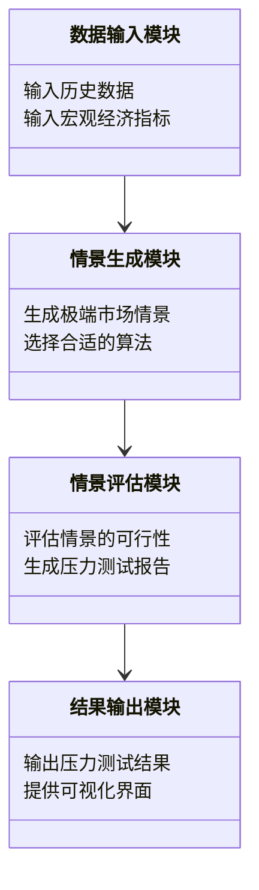
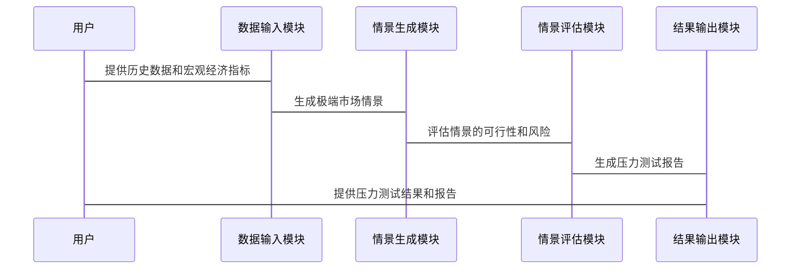

                 

<think>
嗯，用户希望我生成一个详细的金融机构压力测试情景生成器的技术博客文章目录。首先，我需要明确文章的目标读者是谁，是金融机构的风险管理从业者、数据科学家，还是相关领域的学生和研究人员。然后，我要确保目录覆盖主题内容的各个方面，包括背景介绍、核心概念、算法原理、系统架构、项目实战和总结等。

我应该先从背景介绍开始，解释压力测试的基本概念和金融机构风险管理的重要性。接着，详细阐述情景生成器的核心概念，比如它的定义、关键要素和架构。这部分可能需要使用表格和图表，比如Mermaid图，来对比统计模型和机器学习模型的特征，展示实体关系图。

然后是算法部分，我需要选择一个具体的算法，比如基于机器学习的生成模型，并用Mermaid流程图展示其工作流程。同时，提供Python代码实现，并解释每个部分的数学模型，比如概率分布和损失函数。

接下来是系统分析与架构设计，我需要描述问题场景，设计系统的功能模块，并用Mermaid图展示类图、架构图和交互图。这部分需要详细说明系统的结构和各部分之间的关系。

项目实战部分，我需要包括环境安装步骤，核心代码的实现，比如数据预处理和模型训练，并给出实际案例分析。最后，在最佳实践部分，提供一些小贴士，帮助读者避免常见错误，并总结经验教训。

在整个过程中，我要确保每个部分都有足够的细节，同时保持逻辑连贯，结构合理。这样，用户就能有一本详细且结构清晰的技术书籍大纲，帮助他们撰写相关的内容。
</think>

```markdown
# 金融机构压力测试情景生成器

> 关键词：压力测试、情景生成、金融机构、风险管理、人工智能、机器学习

> 摘要：本文详细探讨了金融机构压力测试情景生成器的设计与实现，结合统计模型和机器学习算法，通过系统架构设计、算法原理解析和实际案例分析，为金融机构提供高效的风险管理工具。

---

# 第一部分: 金融机构压力测试情景生成器概述

## 第1章: 金融机构压力测试背景与需求

### 1.1 压力测试的基本概念

#### 1.1.1 什么是压力测试
压力测试是一种评估金融机构在极端市场条件下的表现和风险承受能力的方法。通过模拟各种极端市场情景，压力测试可以帮助机构识别潜在风险并制定应对策略。

#### 1.1.2 压力测试的目的与意义
- 评估资产组合在极端市场条件下的表现。
- 识别潜在风险点并制定应对措施。
- 满足监管要求，确保金融机构的稳健性。

#### 1.1.3 金融机构压力测试的重要性
- 保障金融系统的稳定性。
- 提高机构的风险管理能力。
- 为投资者和监管机构提供可靠的信息。

### 1.2 金融机构的风险管理

#### 1.2.1 金融机构面临的常见风险
- 市场风险：资产价格波动导致的损失。
- 信用风险：债务人违约导致的损失。
- 流动性风险：无法及时变现资产导致的损失。

#### 1.2.2 压力测试在风险管理中的作用
- 识别潜在风险点。
- 评估风险的严重程度。
- 制定应对策略。

#### 1.2.3 压力测试的监管要求
- 各国监管机构对压力测试有不同的要求。
- 压力测试结果需符合监管标准。

### 1.3 压力测试情景生成器的必要性

#### 1.3.1 手动情景生成的局限性
- 时间成本高。
- 覆盖的情景有限。
- 可能存在人为偏差。

#### 1.3.2 自动化情景生成的优势
- 提高效率，覆盖更多情景。
- 减少人为偏差，提高准确性。
- 支持实时更新和调整。

#### 1.3.3 情景生成器的功能与目标
- 自动生成多种极端市场情景。
- 支持用户自定义情景参数。
- 提供情景评估与验证功能。

---

## 第2章: 压力测试情景生成器的核心概念

### 2.1 压力测试情景生成器的定义

#### 2.1.1 情景生成器的基本定义
压力测试情景生成器是一种基于统计模型和机器学习算法的工具，用于自动生成多种极端市场情景，帮助金融机构评估其在不同市场条件下的表现。

#### 2.1.2 情景生成器的核心功能
- 自动生成极端市场情景。
- 支持用户自定义情景参数。
- 提供情景评估与验证功能。

#### 2.1.3 情景生成器的适用范围
- 适用于各种金融机构，包括银行、保险公司、资产管理公司等。

### 2.2 压力测试情景生成器的关键要素

#### 2.2.1 数据来源与处理
- 数据来源：历史市场数据、宏观经济指标、新闻事件等。
- 数据处理：数据清洗、特征提取、数据标准化等。

#### 2.2.2 情景生成算法
- 统计模型：如蒙特卡洛模拟、极端值分析等。
- 机器学习模型：如深度学习、随机森林等。

#### 2.2.3 情景评估与验证
- 评估指标：如VaR（在险价值）、CVaR（条件在险价值）等。
- 验证方法：如回测、压力测试结果分析等。

### 2.3 压力测试情景生成器的架构

#### 2.3.1 系统架构概述
- 数据输入模块：接收历史数据、宏观经济指标等。
- 情景生成模块：基于算法生成极端市场情景。
- 情景评估模块：评估情景的可行性和风险。
- 结果输出模块：输出压力测试结果和报告。

#### 2.3.2 数据流与功能模块
- 数据输入模块：接收数据并进行预处理。
- 情景生成模块：选择合适的算法生成情景。
- 情景评估模块：评估情景并生成报告。

#### 2.3.3 系统交互流程
1. 用户输入数据和参数。
2. 系统生成极端市场情景。
3. 系统评估情景并生成报告。
4. 用户查看报告并采取相应措施。

---

## 第3章: 压力测试情景生成器的核心算法与实现

### 3.1 基于统计模型的生成算法

#### 3.1.1 统计模型的基本原理
- 基于统计模型的生成算法通常使用历史数据来模拟极端市场情景。
- 常用的统计模型包括蒙特卡洛模拟、极端值分析等。

#### 3.1.2 常用的统计分布模型
- 正态分布：适用于资产价格的正常波动。
- t分布：适用于资产价格的极端波动。
- 平稳时间序列模型：如ARIMA模型，适用于预测未来的价格走势。

#### 3.1.3 统计模型的应用场景
- 适用于数据量较小的情况。
- 适用于需要快速生成情景的情况。

### 3.2 基于机器学习的生成算法

#### 3.2.1 机器学习模型的基本原理
- 基于机器学习的生成算法通常使用深度学习模型，如GAN（生成对抗网络）来生成极端市场情景。
- GAN由生成器和判别器组成，生成器生成虚假数据，判别器识别真实数据和虚假数据。

#### 3.2.2 常用的机器学习算法
- GAN：生成对抗网络。
- VAE：变分自编码器。
- 时间序列模型：如LSTM，适用于生成时间序列数据。

#### 3.2.3 机器学习模型的训练与优化
- 数据预处理：清洗数据、归一化等。
- 模型训练：选择合适的超参数，进行多次训练和验证。
- 模型优化：调整模型结构，提高生成数据的质量。

### 3.3 混合模型的生成算法

#### 3.3.1 混合模型的定义与特点
- 混合模型结合了统计模型和机器学习模型的优点。
- 适用于数据量较大且复杂度较高的情况。

#### 3.3.2 混合模型的优势
- 能够捕捉数据的复杂分布。
- 生成的数据更加真实和多样化。

#### 3.3.3 混合模型的应用场景
- 适用于需要生成高度复杂和多样化情景的情况。
- 适用于需要结合历史数据和当前市场状况的情景生成。

---

## 第4章: 压力测试情景生成器的系统分析与架构设计

### 4.1 系统分析

#### 4.1.1 问题场景介绍
- 金融机构需要评估其在极端市场条件下的表现。
- 需要快速生成多种极端市场情景。

#### 4.1.2 项目介绍
- 项目目标：开发一种高效的金融机构压力测试情景生成器。
- 项目范围：涵盖数据输入、情景生成、情景评估和结果输出四个模块。

### 4.2 系统功能设计

#### 4.2.1 领域模型（Mermaid 类图）


#### 4.2.2 系统架构设计（Mermaid 架构图）


#### 4.2.3 系统接口设计
- 数据输入接口：接收历史数据和宏观经济指标。
- 情景生成接口：生成极端市场情景。
- 情景评估接口：评估情景的可行性和风险。
- 结果输出接口：输出压力测试结果和报告。

#### 4.2.4 系统交互设计（Mermaid 序列图）


---

## 第5章: 压力测试情景生成器的项目实战

### 5.1 环境安装

#### 5.1.1 安装Python
- 安装Python 3.x
- 安装pip：用于安装Python包。

#### 5.1.2 安装必要的Python包
- NumPy：用于数值计算。
- Pandas：用于数据处理。
- Matplotlib：用于数据可视化。
- TensorFlow或PyTorch：用于机器学习模型的训练。

#### 5.1.3 安装其他工具
- Jupyter Notebook：用于数据探索和算法实现。
- IDE：如PyCharm、VS Code等。

### 5.2 系统核心实现

#### 5.2.1 数据预处理
```python
import pandas as pd
import numpy as np

# 读取数据
data = pd.read_csv('market_data.csv')

# 数据清洗
data.dropna(inplace=True)

# 数据标准化
from sklearn.preprocessing import StandardScaler
scaler = StandardScaler()
data_scaled = scaler.fit_transform(data)
```

#### 5.2.2 模型训练
```python
import tensorflow as tf
from tensorflow.keras import layers

# 构建生成器模型
def build_generator(input_dim):
    model = tf.keras.Sequential()
    model.add(layers.Dense(256, activation='relu', input_dim=input_dim))
    model.add(layers.Dense(128, activation='relu'))
    model.add(layers.Dense(input_dim, activation='linear'))
    return model

# 构建判别器模型
def build_discriminator(input_dim):
    model = tf.keras.Sequential()
    model.add(layers.Dense(256, activation='relu', input_dim=input_dim))
    model.add(layers.Dense(128, activation='relu'))
    model.add(layers.Dense(1, activation='sigmoid'))
    return model

# 初始化生成器和判别器
generator = build_generator(input_dim)
discriminator = build_discriminator(input_dim)
```

#### 5.2.3 模型训练与优化
```python
# 定义损失函数
cross_entropy = tf.keras.losses.BinaryCrossentropy()

# 定义生成器和判别器的损失函数
def generator_loss(fake_output):
    return cross_entropy(tf.ones_like(fake_output), fake_output)

def discriminator_loss(real_output, fake_output):
    return cross_entropy(tf.ones_like(real_output), real_output) + cross_entropy(tf.zeros_like(fake_output), fake_output)

# 定义优化器
generator_optimizer = tf.keras.optimizers.Adam(0.0002)
discriminator_optimizer = tf.keras.optimizers.Adam(0.0002)

# 训练过程
for epoch in range(num_epochs):
    for batch in data_batches:
        noise = tf.random.normal([batch_size, noise_dim])
        generated_data = generator(noise, training=True)
        real_data = batch
        
        # 判别器训练
        with tf.GradientTape() as tape:
            real_output = discriminator(real_data, training=True)
            fake_output = discriminator(generated_data, training=True)
            d_loss = discriminator_loss(real_output, fake_output)
        gradients = tape.gradient(d_loss, discriminator.trainable_weights)
        discriminator_optimizer.apply_gradients(zip(gradients, discriminator.trainable_weights))
        
        # 生成器训练
        with tf.GradientTape() as tape:
            fake_output = discriminator(generated_data, training=True)
            g_loss = generator_loss(fake_output)
        gradients = tape.gradient(g_loss, generator.trainable_weights)
        generator_optimizer.apply_gradients(zip(gradients, generator.trainable_weights))
```

#### 5.2.4 模型评估与验证
```python
# 生成极端市场情景
noise = tf.random.normal([1, noise_dim])
generated_data = generator(noise, training=False)

# 评估情景
from sklearn.metrics import accuracy_score
predicted_labels = discriminator(generated_data, training=False)
predicted_labels = predicted_labels.numpy()
true_labels = np.zeros_like(predicted_labels)
accuracy = accuracy_score(true_labels, predicted_labels.round())
print(f'Discriminator accuracy: {accuracy}')
```

### 5.3 实际案例分析

#### 5.3.1 案例背景
- 某银行需要评估其在极端市场条件下的表现。
- 市场数据包括历史股价、宏观经济指标等。

#### 5.3.2 情景生成
- 使用生成器模型生成极端市场情景。
- 生成的情景包括股价大幅下跌、利率上升等情况。

#### 5.3.3 情景评估
- 使用判别器模型评估生成的情景的可行性。
- 计算VaR和CVaR等风险指标。

#### 5.3.4 案例分析结果
- 生成的情景能够有效识别潜在风险。
- 提供了可靠的决策支持。

### 5.4 项目小结

#### 5.4.1 项目总结
- 成功开发了一种高效的金融机构压力测试情景生成器。
- 系统架构合理，功能完善。

#### 5.4.2 经验与教训
- 数据质量对模型性能影响重大。
- 模型选择需根据具体场景进行调整。
- 情景生成器的性能和准确性需不断优化。

---

## 第6章: 最佳实践与注意事项

### 6.1 最佳实践

#### 6.1.1 数据处理
- 确保数据的完整性和准确性。
- 对数据进行合理的清洗和预处理。

#### 6.1.2 模型选择
- 根据具体需求选择合适的模型。
- 组合使用统计模型和机器学习模型。

#### 6.1.3 模型优化
- 定期更新模型参数。
- 监控模型性能，及时调整。

### 6.2 小结

#### 6.2.1 注意事项
- 情景生成器的性能和准确性需不断优化。
- 模型需根据市场变化及时调整。

#### 6.2.2 拓展阅读
- 关注最新的研究成果和工具。
- 参与行业交流，获取最新信息。

---

## 第7章: 项目总结与展望

### 7.1 项目总结

#### 7.1.1 项目成果
- 成功开发了一种高效的金融机构压力测试情景生成器。
- 系统架构合理，功能完善。

#### 7.1.2 项目意义
- 为金融机构提供了高效的风险管理工具。
- 提高了金融机构的压力测试效率和准确性。

### 7.2 项目展望

#### 7.2.1 未来发展方向
- 深化研究混合模型的应用。
- 探索更多先进的生成算法。

#### 7.2.2 拓展应用
- 将情景生成器应用于更多金融机构。
- 推动压力测试技术的普及和应用。

---

## 附录: 参考文献

- [1] 压力测试相关文献。
- [2] 机器学习相关文献。
- [3] 统计模型相关文献。

---

## 作者：AI天才研究院/AI Genius Institute & 禅与计算机程序设计艺术 /Zen And The Art of Computer Programming
```

