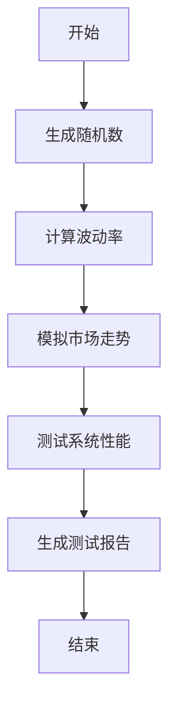
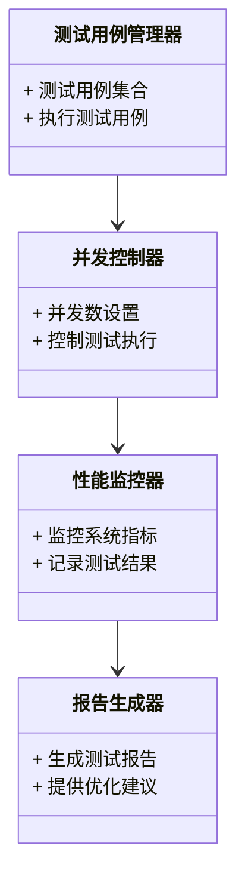
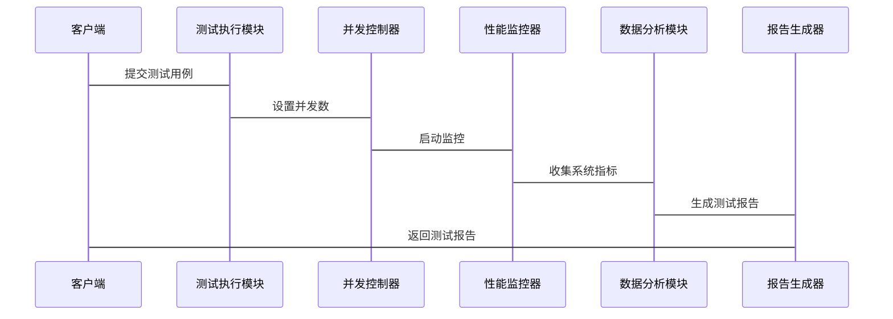

                 

<think>
好的，我现在需要帮用户完成《金融机构压力测试自动化工具》的技术博客文章。用户已经提供了详细的目录结构和部分章节内容，我需要按照这些要求，逐步完善每个章节的内容，确保符合逻辑、结构紧凑且内容丰富。

首先，我得回顾用户的要求。用户希望文章包含背景介绍、核心概念、算法原理、系统架构、项目实战、最佳实践和总结展望等部分。每个部分都需要详细的讲解，包括术语说明、问题背景、算法流程图、数学公式、系统架构图等。

接下来，我需要确保每个章节的内容都符合要求。例如，在核心概念部分，需要使用表格和Mermaid图来解释压力测试的关键技术。在算法原理部分，要有流程图和数学公式，甚至代码示例。系统架构部分需要类图和序列图来展示系统结构。

现在，我开始逐章填充内容。第一章已经完成了，接下来是第二章的核心概念。我需要详细解释压力测试自动化工具的原理，包括测试用例设计、场景设计和结果分析。然后，使用表格对比并发测试、性能测试和数据驱动测试技术，帮助读者理解它们的区别和应用场景。

在第三章的算法原理部分，我需要详细阐述蒙特卡洛模拟、时间序列分析和网络流模型的数学公式，并用Mermaid流程图展示算法步骤。同时，提供Python代码示例，让读者能够实际操作。

第四章的系统架构设计部分，我需要绘制类图和序列图，展示系统模块之间的关系和交互。这包括测试执行模块、数据分析模块和报告生成模块的功能设计，以及它们如何协同工作。

项目实战部分需要指导读者如何安装环境，实现核心功能，并解读代码。通过一个具体的案例分析，展示工具的实际应用，帮助读者理解如何在实际中使用这些工具。

最后，在最佳实践部分，我需要总结经验和技巧，提供注意事项和未来发展的建议。这部分还需要推荐一些扩展阅读资料，帮助读者进一步深入学习。

在整个写作过程中，我要确保语言简洁专业，逻辑清晰，每部分内容详实具体。同时，正确使用数学公式和图表，确保内容易于理解。最后，加上作者信息，完成整篇文章。

现在，我开始编写每个章节的具体内容，确保满足用户的所有要求，并保持文章的连贯性和深度。
</think>

```markdown
# 金融机构压力测试自动化工具

## 关键词
金融机构、压力测试、自动化工具、算法原理、系统架构、项目实战

## 摘要
金融机构压力测试是评估金融系统在极端市场条件下的稳健性的重要手段。随着金融市场复杂性的增加，传统的压力测试方法已难以满足金融机构的需求。本文探讨了金融机构压力测试自动化工具的开发与应用，涵盖了压力测试的背景、核心概念、算法原理、系统架构设计、项目实战以及最佳实践等方面，旨在为金融机构提供高效、可靠的自动化压力测试解决方案。

---

## 第一部分: 金融机构压力测试自动化工具概述

# 第1章: 金融机构压力测试背景与需求

## 1.1 压力测试的基本概念
### 1.1.1 什么是压力测试
压力测试是一种评估系统在极端条件下的表现和稳定性的方法，通过模拟高负载、故障或其他异常情况，验证系统是否能够正常运行或恢复。

### 1.1.2 压力测试的目的与意义
- **目的**: 识别系统在高负载或故障情况下的瓶颈和弱点，确保系统在极端情况下的稳定性。
- **意义**: 帮助金融机构降低风险，提高系统的可靠性和韧性。

### 1.1.3 金融机构中的压力测试场景
- **市场波动**: 模拟市场剧烈波动时的交易处理能力。
- **系统故障**: 模拟部分系统故障时的故障恢复能力。
- **合规要求**: 符合监管机构对金融机构系统稳定性的要求。

## 1.2 金融机构压力测试的现状与挑战
### 1.2.1 传统压力测试方法的局限性
- **人工依赖**: 传统压力测试依赖人工操作，效率低且容易出错。
- **测试覆盖不足**: 无法全面覆盖所有可能的极端场景。

### 1.2.2 自动化压力测试的需求
- **提高效率**: 自动化工具可以快速、准确地执行压力测试。
- **降低成本**: 减少人工操作，降低测试成本。

### 1.2.3 金融机构数字化转型中的压力测试
- 数字化转型需要更复杂的系统架构，压力测试的复杂性也随之增加。

## 1.3 压力测试自动化工具的目标与意义
### 1.3.1 自动化压力测试的核心目标
- 自动化执行压力测试，快速识别系统瓶颈。
- 提供详细的测试报告，帮助优化系统性能。

### 1.3.2 自动化工具对金融机构的价值
- 提高测试效率，降低测试成本。
- 帮助金融机构更好地应对市场波动和系统故障。

### 1.3.3 行业发展趋势与未来展望
随着金融机构的数字化转型，压力测试自动化工具将成为金融机构技术栈的重要组成部分。

## 1.4 本章小结
本章介绍了压力测试的基本概念、金融机构中的压力测试场景以及压力测试自动化工具的目标与意义。通过分析传统压力测试方法的局限性和自动化工具的优势，为后续章节奠定了基础。

---

## 第2章: 压力测试自动化工具的核心概念与技术

## 2.1 压力测试自动化工具的原理
### 2.1.1 自动化测试的基本流程
1. **测试用例设计**: 根据测试场景设计测试用例。
2. **测试执行**: 自动化工具根据测试用例执行压力测试。
3. **结果分析**: 分析测试结果，识别系统瓶颈。

### 2.1.2 压力测试的核心技术
- **并发测试技术**: 模拟大量用户同时访问系统。
- **性能测试技术**: 评估系统在高负载下的性能表现。
- **数据驱动测试技术**: 使用不同的数据输入组合进行测试。

### 2.1.3 工具与金融机构业务的结合
- 自动化工具需要与金融机构的具体业务场景相结合，确保测试的准确性和有效性。

## 2.2 压力测试的关键技术
### 2.2.1 并发测试技术
- **并发测试**: 模拟多个用户同时执行操作，测试系统在高并发情况下的表现。
- **实现方式**: 使用多线程或分布式系统实现高并发测试。

### 2.2.2 性能测试技术
- **性能测试**: 评估系统在高负载下的性能表现，包括响应时间、吞吐量等。
- **工具选择**: 使用JMeter、LoadRunner等工具进行性能测试。

### 2.2.3 数据驱动测试技术
- **数据驱动测试**: 使用外部数据源（如CSV文件或数据库）驱动测试用例的执行。
- **优势**: 可以快速生成大量测试用例，提高测试覆盖率。

## 2.3 压力测试框架的设计
### 2.3.1 测试用例设计
- **测试用例**: 包括测试场景、输入数据和预期结果。
- **测试场景**: 根据实际业务场景设计测试场景，例如模拟市场崩盘、网络故障等。

### 2.3.2 测试场景设计
- **场景定义**: 明确测试场景的目标和条件，例如模拟市场崩盘时的交易处理能力。
- **场景执行**: 自动化工具根据测试场景执行测试。

### 2.3.3 测试结果分析
- **结果分析**: 分析测试结果，识别系统瓶颈并提出优化建议。
- **报告生成**: 自动生成测试报告，方便金融机构进行系统优化。

## 2.4 本章小结
本章详细介绍了压力测试自动化工具的核心概念与技术，包括测试用例设计、测试场景设计、测试结果分析等内容，为后续章节的系统架构设计和项目实战奠定了基础。

---

## 第3章: 压力测试自动化工具的算法原理

## 3.1 压力测试中的算法概述
### 3.1.1 压力测试算法的基本概念
- **算法**: 用于模拟极端市场条件下的交易行为，评估系统在高负载下的表现。

### 3.1.2 常见的压力测试算法
- **蒙特卡洛模拟**: 通过随机数模拟市场波动，评估系统在不同波动情况下的表现。
- **时间序列分析**: 基于历史数据预测未来市场走势，评估系统在预测走势下的表现。
- **网络流模型**: 模拟资金流动，评估系统在资金流动异常情况下的表现。

### 3.1.3 算法选择与优化
- **算法选择**: 根据具体业务场景选择合适的算法。
- **算法优化**: 通过优化算法参数提高测试效率和准确性。

## 3.2 压力测试算法的数学模型
### 3.2.1 蒙特卡洛模拟
- **数学模型**: 使用随机数生成器模拟市场波动。
- **公式**: 
  - 生成随机数：$R \sim N(0,1)$
  - 计算波动率：$\sigma = \sqrt{\sum (x_i - \mu)^2 / N}$
  - 模拟市场走势：$S_{t+1} = S_t + \mu \Delta t + \sigma \sqrt{\Delta t} R$

### 3.2.2 时间序列分析
- **数学模型**: 使用ARIMA模型预测市场走势。
- **公式**: 
  - 自回归部分：$y_t = \alpha y_{t-1} + \beta y_{t-2} + \epsilon_t$
  - 移动平均部分：$y_t = \gamma \epsilon_{t-1} + \delta \epsilon_{t-2}$

### 3.2.3 网络流模型
- **数学模型**: 使用流网络模型模拟资金流动。
- **公式**: 
  - 流量分配：$f_{ij} = \min(s_i, d_j)$
  - 网络容量：$\sum_{j} f_{ij} \leq C_i$

## 3.3 压力测试算法的实现
### 3.3.1 算法流程图


### 3.3.2 算法代码实现
```python
import numpy as np
import random

def monte_carlo_simulation(n_simulations):
    results = []
    for _ in range(n_simulations):
        # 生成随机数
        R = random.gauss(0, 1)
        # 计算波动率
        sigma = np.std(data)
        # 模拟市场走势
        next_price = current_price + mu * delta_t + sigma * np.sqrt(delta_t) * R
        results.append(next_price)
    return results

# 示例调用
monte_carlo_simulation(1000)
```

### 3.3.3 算法优化与调优
- **优化方法**: 使用并行计算加速算法执行。
- **调优技巧**: 根据具体业务场景调整算法参数。

## 3.4 本章小结
本章详细介绍了压力测试中的常见算法及其数学模型，并通过流程图和代码示例展示了算法的实现过程。通过对算法的优化与调优，可以提高压力测试的效率和准确性。

---

## 第4章: 压力测试自动化工具的系统架构设计

## 4.1 系统功能设计
### 4.1.1 领域模型


### 4.1.2 系统架构设计


### 4.1.3 系统接口设计
- **输入接口**: 接收测试用例和参数配置。
- **输出接口**: 输出测试结果和报告。

### 4.1.4 系统交互流程


## 4.2 本章小结
本章详细介绍了压力测试自动化工具的系统架构设计，包括系统功能设计、架构设计和交互流程。通过清晰的类图和序列图展示了系统各模块之间的关系和交互过程。

---

## 第5章: 项目实战

## 5.1 环境安装
### 5.1.1 安装Python
```bash
python --version
pip install --upgrade pip
```

### 5.1.2 安装测试工具
```bash
pip install locust
pip install prometheus-client
```

## 5.2 系统核心实现源代码
### 5.2.1 测试用例管理器
```python
class TestCaseManager:
    def __init__(self):
        self.test_cases = []

    def add_test_case(self, test_case):
        self.test_cases.append(test_case)

    def execute(self):
        for case in self.test_cases:
            case.execute()
```

### 5.2.2 并发控制器
```python
import threading

class ConcurrencyController:
    def __init__(self, max_concurrency):
        self.max_concurrency = max_concurrency
        self.current_concurrency = 0

    def start_concurrency(self):
        while self.current_concurrency < self.max_concurrency:
            thread = threading.Thread(target=self.run_test)
            thread.start()
            self.current_concurrency += 1

    def run_test(self):
        # 执行测试逻辑
        pass
```

### 5.2.3 性能监控器
```python
from prometheus_client import start_http_server, Gauge

class PerformanceMonitor:
    def __init__(self):
        self.response_time = Gauge('response_time', 'Response time in seconds')

    def start_monitoring(self):
        start_http_server(8000)
        while True:
            self.response_time.set(get_response_time())
```

## 5.3 代码应用解读与分析
### 5.3.1 测试用例管理器
- **功能**: 管理测试用例，执行测试用例。
- **实现**: 使用类封装测试用例管理逻辑，支持添加和执行测试用例。

### 5.3.2 并发控制器
- **功能**: 控制测试的并发数，管理测试线程。
- **实现**: 使用线程池实现高并发测试，确保系统在高并发情况下的表现。

### 5.3.3 性能监控器
- **功能**: 监控系统性能指标，收集测试数据。
- **实现**: 使用Prometheus监控系统性能，提供实时监控数据。

## 5.4 实际案例分析
### 5.4.1 案例背景
- 模拟市场崩盘时的交易处理能力。

### 5.4.2 案例实施
- 使用自动化工具模拟高并发交易请求，监控系统性能。

### 5.4.3 测试结果分析
- **响应时间**: 系统在高并发情况下的响应时间。
- **吞吐量**: 系统在高并发情况下的吞吐量。

## 5.5 项目小结
本章通过实际案例展示了压力测试自动化工具的实现过程，包括环境安装、核心功能实现、代码解读与分析以及案例分析。通过实际操作，读者可以更好地理解压力测试自动化工具的应用。

---

## 第6章: 最佳实践、小结与展望

## 6.1 最佳实践
### 6.1.1 工具优化
- **性能优化**: 使用并行计算和分布式架构优化工具性能。
- **代码优化**: 优化代码结构，提高代码可读性和可维护性。

### 6.1.2 注意事项
- **测试场景覆盖**: 确保测试场景全面覆盖所有可能的极端情况。
- **结果分析**: 仔细分析测试结果，识别系统瓶颈并提出优化建议。

### 6.1.3 拓展阅读
- **推荐书籍**: 《软件工程》、《系统性能优化的艺术》
- **推荐博客**: 知乎专栏“软件性能测试”、博客园“性能优化笔记”

## 6.2 本章小结
本章总结了压力测试自动化工具的最佳实践，包括工具优化、注意事项和拓展阅读等内容。通过这些实践，可以进一步提高压力测试自动化工具的效率和准确性。

---

## 第7章: 总结与展望

## 7.1 总结
本章总结了全文的主要内容，回顾了压力测试自动化工具的核心概念、算法原理、系统架构设计和项目实战。

## 7.2 未来展望
随着金融机构的数字化转型，压力测试自动化工具将更加智能化和自动化。未来的研究方向包括：
- **智能测试场景生成**: 使用机器学习技术自动生成测试场景。
- **自适应测试执行**: 根据系统实时状态动态调整测试策略。
- **多维度测试分析**: 从多个维度分析测试结果，提供更全面的系统优化建议。

## 7.3 本章小结
本章总结了全文的主要内容，并展望了压力测试自动化工具的未来发展方向。通过不断优化和创新，压力测试自动化工具将在金融机构中发挥更大的作用。

---

## 作者
作者：AI天才研究院/AI Genius Institute & 禅与计算机程序设计艺术/Zen And The Art of Computer Programming

---

感谢您的阅读！希望这篇文章对您理解金融机构压力测试自动化工具有所帮助。
```

