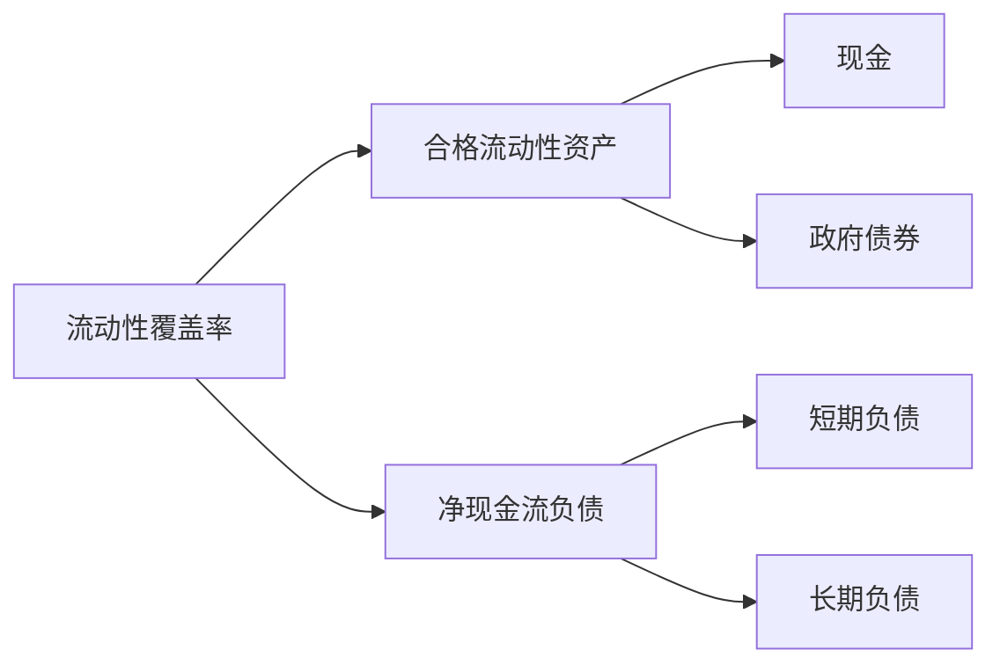

                 


# 金融机构流动性覆盖率预测

---

## 关键词：
- 金融机构
- 流动性覆盖率
- 流动性管理
- 机器学习
- 时间序列分析
- 金融监管

---

## 摘要：
金融机构流动性覆盖率是衡量金融机构短期流动性风险的重要指标，其预测对于金融机构的稳健经营和金融监管机构的风险管理具有重要意义。本文从流动性覆盖率的定义、计算方法入手，结合统计学和机器学习算法，详细分析流动性覆盖率预测的理论基础、算法原理和系统架构设计。通过实际案例分析，探讨如何利用Python编程实现流动性覆盖率预测模型，并结合最佳实践提供优化建议。本文旨在为金融机构的流动性管理提供理论支持和技术指导。

---

# 第一部分: 金融机构流动性覆盖率预测概述

---

## 第1章: 流动性覆盖率预测的背景与意义

### 1.1 金融机构流动性管理的重要性

#### 1.1.1 流动性在金融体系中的作用
流动性是指金融机构在不遭受损失的情况下，及时以合理成本获得充足资金的能力。流动性管理是金融机构稳健经营的核心能力之一，直接关系到金融机构的偿付能力和市场信誉。

#### 1.1.2 流动性覆盖率的定义与计算公式
流动性覆盖率（Liquidity Coverage Ratio，LCR）是衡量金融机构短期流动性风险的重要指标，由以下公式定义：
$$ \text{LCR} = \frac{\text{合格流动性资产（QLA）}}{\text{净现金流负债（NCDL）}} $$
其中：
- 合格流动性资产（QLA）包括现金、政府债券等高流动性资产。
- 净现金流负债（NCDL）是未来30天内到期的负债减去未来30天内到期的资产。

#### 1.1.3 流动性覆盖率在金融监管中的地位
流动性覆盖率是巴塞尔协议III的重要组成部分，要求全球系统重要性金融机构的流动性覆盖率不得低于100%。它是金融监管机构评估金融机构短期流动性风险的核心指标。

### 1.2 流动性覆盖率预测的必要性

#### 1.2.1 金融机构面临的流动性风险
金融机构在日常经营中可能面临多种流动性风险，例如客户大量提现、市场波动导致资产变现困难等。及时预测流动性覆盖率可以帮助金融机构提前采取措施，防范流动性风险。

#### 1.2.2 流动性覆盖率预测的经济意义
通过预测流动性覆盖率，金融机构可以更好地规划资产配置和负债管理，确保在极端情况下仍能维持足够的流动性。此外，流动性覆盖率预测还可以为投资者和监管机构提供重要的决策依据。

#### 1.2.3 预测在流动性管理中的应用
流动性覆盖率预测可以应用于以下场景：
1. 短期流动性规划：根据预测结果调整资产和负债结构，确保流动性覆盖率维持在合理水平。
2. 风险预警：通过预测结果发现潜在的流动性风险，提前采取应对措施。
3. 绩效评估：将预测结果与实际值进行对比，评估流动性管理的效果。

### 1.3 本书的核心目标与结构安排

#### 1.3.1 本书的研究目标
本书旨在通过理论分析和实践案例，探讨如何利用统计学和机器学习方法准确预测金融机构的流动性覆盖率，为金融机构的流动性管理提供科学依据。

#### 1.3.2 本书的主要内容框架
- 第一部分：流动性覆盖率预测的背景与意义。
- 第二部分：流动性覆盖率预测的核心概念与联系。
- 第三部分：流动性覆盖率预测的算法原理。
- 第四部分：流动性覆盖率预测的系统架构设计。
- 第五部分：流动性覆盖率预测的项目实战。
- 第六部分：总结与展望。

#### 1.3.3 本书的读者群体
本书适合以下读者阅读：
1. 金融机构的流动性风险管理从业者。
2. 金融监管机构的政策制定者。
3. 对金融数据分析和机器学习感兴趣的高校师生。
4. 从事金融技术开发的软件工程师。

### 1.4 本章小结
本章从流动性管理的重要性出发，介绍了流动性覆盖率的定义、计算公式及其在金融监管中的地位，强调了流动性覆盖率预测的必要性和应用价值，为后续章节的分析奠定了基础。

---

## 第2章: 流动性覆盖率预测的核心概念与联系

### 2.1 流动性覆盖率的构成要素

#### 2.1.1 合格流动性资产的定义与分类
合格流动性资产是指在压力情况下，金融机构能够在48小时内变现的高质量资产。主要包括以下类别：
1. 现金：包括库存现金和中央银行存款。
2. 政府债券：包括国债、地方政府债券等。
3. 中央银行票据：由中央银行发行的短期债务工具。
4. 其他合格资产：如回购协议、逆回购协议等。

#### 2.1.2 净现金流负债的计算方法
净现金流负债是指未来30天内到期的负债减去未来30天内到期的资产。具体计算公式为：
$$ \text{NCDL} = \text{总负债} - \text{短期负债} - \text{总资产} + \text{短期资产} $$

#### 2.1.3 流动性覆盖率的计算步骤
1. 收集金融机构的合格流动性资产数据。
2. 收集金融机构的净现金流负债数据。
3. 计算流动性覆盖率：
$$ \text{LCR} = \frac{\text{QLA}}{\text{NCDL}} $$

### 2.2 流动性覆盖率与相关指标的关系

#### 2.2.1 流动性覆盖率与净资本比率
净资本比率（Net Capital Ratio）是衡量金融机构资本充足性的指标，与流动性覆盖率无直接关系，但两者均是金融监管的重要指标。

#### 2.2.2 流动性覆盖率与杠杆率
杠杆率（Leverage Ratio）是衡量金融机构负债杠杆程度的指标，与流动性覆盖率无直接关系，但高杠杆率可能增加流动性风险。

#### 2.2.3 流动性覆盖率与资本充足率
资本充足率（Capital Adequacy Ratio）是衡量金融机构资本充足性的指标，与流动性覆盖率无直接关系，但两者均是金融监管的重要指标。

### 2.3 流动性覆盖率预测的理论基础

#### 2.3.1 流动性管理的宏观经济视角
宏观经济环境（如GDP增长率、通货膨胀率等）对金融机构的流动性管理有重要影响。例如，经济衰退可能导致客户提现需求增加，从而降低流动性覆盖率。

#### 2.3.2 流动性管理的微观机构视角
金融机构的内部管理（如资产配置策略、负债结构等）也会影响流动性覆盖率。例如，增加短期负债可能降低流动性覆盖率，而增加合格流动性资产可以提高流动性覆盖率。

#### 2.3.3 流动性预测的统计与计量方法
流动性覆盖率预测需要结合统计学和计量经济学的方法，建立合理的数学模型。

### 2.4 核心概念关系图（Mermaid）



### 2.5 本章小结
本章详细分析了流动性覆盖率的构成要素及其与相关指标的关系，强调了宏观经济和微观机构对流动性管理的影响，为后续章节的算法设计奠定了理论基础。

---

## 第3章: 流动性覆盖率预测的算法原理

### 3.1 统计学方法在流动性预测中的应用

#### 3.1.1 时间序列分析的基本概念
时间序列分析是一种基于历史数据预测未来值的方法。常用的时间序列模型包括ARIMA（自回归积分滑动平均模型）和SARIMA（季节性ARIMA）。

#### 3.1.2 自回归积分滑动平均模型（ARIMA）
ARIMA模型适用于非季节性时间序列数据，其基本形式为：
$$ \text{ARIMA}(p, d, q) $$
其中：
- p：自回归阶数
- d：差分阶数
- q：移动平均阶数

#### 3.1.3 平滑移动平均模型（SARIMA）
SARIMA模型适用于具有季节性特征的时间序列数据，其基本形式为：
$$ \text{SARIMA}(p, d, q)[P, D, Q]_S $$
其中：
- S：季节周期
- P：季节性自回归阶数
- D：季节性差分阶数
- Q：季节性移动平均阶数

### 3.2 机器学习算法在流动性预测中的应用

#### 3.2.1 线性回归模型
线性回归模型是一种简单的预测方法，适用于线性关系较强的场景。其基本形式为：
$$ y = \beta_0 + \beta_1 x_1 + \beta_2 x_2 + \dots + \beta_n x_n + \epsilon $$

#### 3.2.2 支持向量回归（SVR）
支持向量回归是一种基于支持向量机（SVM）的回归方法，适用于非线性关系较强的场景。其核心思想是通过构建支持向量，将数据映射到高维空间，从而实现非线性回归。

#### 3.2.3 长短期记忆网络（LSTM）
LSTM是一种基于循环神经网络（RNN）的深度学习模型，适用于时间序列数据的预测。其核心思想是通过门控机制（遗忘门、输入门和输出门）来捕捉时间序列中的长期依赖关系。

### 3.3 算法选择与比较

#### 3.3.1 不同算法的优缺点对比

| 算法 | 优点 | 缺点 |
|------|------|------|
| ARIMA | 简单易用，适合非季节性数据 | 对异常值敏感，模型假设严格 |
| SARIMA | 能处理季节性数据 | 模型复杂度较高 |
| 线性回归 | 简单易用，适合线性关系 | 对非线性关系表现不佳 |
| SVR | 能处理非线性关系 | 对数据预处理要求高 |
| LSTM | 能处理复杂时间序列 | 训练时间长，模型复杂 |

#### 3.3.2 算法性能评价指标
常用的算法性能评价指标包括均方误差（MSE）、均绝对误差（MAE）、R平方值（R²）等。

#### 3.3.3 算法适用场景分析
- ARIMA适用于简单的时间序列预测。
- SARIMA适用于具有季节性特征的时间序列预测。
- 线性回归适用于线性关系较强的场景。
- SVR适用于非线性关系较强的场景。
- LSTM适用于复杂的时间序列预测。

### 3.4 基于LSTM的流动性预测模型（Mermaid）


### 3.5 本章小结
本章详细分析了统计学方法和机器学习算法在流动性预测中的应用，重点介绍了ARIMA、SARIMA、线性回归、SVR和LSTM等模型的原理和适用场景，为后续章节的系统架构设计和项目实现奠定了基础。

---

## 第4章: 流动性覆盖率预测的系统架构设计

### 4.1 系统需求分析

#### 4.1.1 业务需求
- 实现流动性覆盖率的实时预测。
- 提供历史数据查询和分析功能。
- 支持多种预测模型的部署和切换。

#### 4.1.2 技术需求
- 数据采集：支持多种数据源的接入。
- 数据处理：支持数据清洗、特征提取和数据转换。
- 模型训练：支持多种机器学习模型的训练和部署。
- 结果分析：支持预测结果的可视化和报表生成。

#### 4.1.3 用户需求
- 金融机构的流动性风险管理从业者。
- 金融监管机构的政策制定者。
- 金融机构的高级管理层。

### 4.2 系统功能设计

#### 4.2.1 数据采集模块
- 数据源：金融机构的财务数据、市场数据、监管数据等。
- 数据格式：结构化数据（如CSV、Excel）和非结构化数据（如文本、图像）。

#### 4.2.2 数据预处理模块
- 数据清洗：处理缺失值、异常值和重复值。
- 特征提取：提取与流动性覆盖率相关的特征（如资产规模、负债规模、市场利率等）。
- 数据转换：将数据转换为模型输入格式（如标准化、归一化）。

#### 4.2.3 模型训练模块
- 模型选择：根据需求选择合适的预测模型（如ARIMA、LSTM等）。
- 模型训练：利用训练数据对模型进行训练，调整模型参数。
- 模型评估：使用测试数据对模型性能进行评估，计算MSE、MAE等指标。

#### 4.2.4 结果分析模块
- 预测结果展示：将预测结果以图表形式展示（如折线图、柱状图）。
- 预测结果分析：分析预测结果与实际值的差异，找出潜在的流动性风险。
- 报表生成：生成预测报告，提供优化建议。

### 4.3 系统架构设计（Mermaid）


### 4.4 本章小结
本章从系统需求分析出发，详细设计了流动性覆盖率预测系统的功能模块和架构，为后续章节的项目实现奠定了技术基础。

---

## 第5章: 流动性覆盖率预测的项目实战

### 5.1 项目环境安装

#### 5.1.1 安装Python
- 安装Python 3.x（推荐使用Anaconda或Miniconda）。
- 配置Python环境变量。

#### 5.1.2 安装必要的Python库
- NumPy：用于数据处理和计算。
- Pandas：用于数据分析和数据框操作。
- Matplotlib：用于数据可视化。
- Scikit-learn：用于机器学习模型训练。
- Keras：用于深度学习模型训练。
- LSTM：用于时间序列预测。

#### 5.1.3 数据源获取
- 数据来源：金融机构的财务数据、市场数据、监管数据等。
- 数据格式：CSV或Excel格式。

### 5.2 系统核心实现源代码

#### 5.2.1 数据采集模块

```python
import pandas as pd
import numpy as np

# 读取数据
data = pd.read_csv('流动性覆盖率数据.csv')

# 查看数据基本信息
print(data.info())
print(data.describe())
```

#### 5.2.2 数据预处理模块

```python
# 处理缺失值
data.dropna(inplace=True)

# 标准化处理
from sklearn.preprocessing import StandardScaler
scaler = StandardScaler()
data_scaled = scaler.fit_transform(data)
```

#### 5.2.3 模型训练模块

```python
# 划分训练集和测试集
from sklearn.model_selection import train_test_split
X_train, X_test, y_train, y_test = train_test_split(data_scaled, target, test_size=0.2, random_state=42)

# 训练LSTM模型
from keras.models import Sequential
from keras.layers import LSTM, Dense

model = Sequential()
model.add(LSTM(50, input_shape=(timesteps, features)))
model.add(Dense(1))
model.compile(optimizer='adam', loss='mean_squared_error')

model.fit(X_train, y_train, epochs=50, batch_size=32, validation_split=0.2)
```

#### 5.2.4 结果分析模块

```python
# 预测结果
y_pred = model.predict(X_test)

# 可视化结果
import matplotlib.pyplot as plt

plt.plot(y_test, label='实际值')
plt.plot(y_pred, label='预测值')
plt.legend()
plt.show()
```

### 5.3 代码应用解读与分析

#### 5.3.1 数据采集模块
- 数据采集模块负责读取和处理原始数据，确保数据格式符合后续处理要求。

#### 5.3.2 数据预处理模块
- 数据预处理模块对数据进行清洗和标准化处理，为模型训练提供高质量的数据。

#### 5.3.3 模型训练模块
- 模型训练模块利用训练数据对LSTM模型进行训练，调整模型参数，优化预测性能。

#### 5.3.4 结果分析模块
- 结果分析模块对预测结果进行可视化和分析，找出预测误差较大的点，为优化模型提供依据。

### 5.4 实际案例分析和详细讲解剖析

#### 5.4.1 案例背景
假设我们有一家银行的流动性覆盖率数据，需要预测未来30天内的流动性覆盖率。

#### 5.4.2 数据处理
对历史数据进行清洗和标准化处理，提取相关特征（如资产规模、负债规模、市场利率等）。

#### 5.4.3 模型训练
利用LSTM模型对数据进行训练，调整模型参数，优化预测性能。

#### 5.4.4 预测结果分析
将预测结果与实际值进行对比，分析预测误差的原因，提出优化建议。

### 5.5 项目小结
本章通过实际案例分析，详细讲解了流动性覆盖率预测项目的实现过程，包括数据采集、数据预处理、模型训练和结果分析等步骤，为读者提供了宝贵的实践经验。

---

## 第6章: 总结与展望

### 6.1 本章总结
本文从流动性覆盖率的定义和计算公式出发，结合统计学和机器学习算法，详细分析了流动性覆盖率预测的理论基础、算法原理和系统架构设计。通过实际案例分析，探讨了如何利用Python编程实现流动性覆盖率预测模型，并结合最佳实践提供了优化建议。

### 6.2 未来展望
未来的研究方向包括：
1. 结合大数据技术，进一步提高流动性覆盖率预测的准确性和实时性。
2. 研究多模型融合方法，优化流动性覆盖率预测的效果。
3. 探讨流动性覆盖率预测在金融监管中的应用场景，为监管机构提供决策支持。

### 6.3 最佳实践 Tips
- 数据质量是预测模型性能的关键，建议在数据预处理阶段投入更多精力。
- 在模型选择上，建议根据具体场景选择合适的算法，避免盲目追求数量。
- 在模型部署上，建议采用容器化技术（如Docker），提高系统的可移植性和可扩展性。

### 6.4 小结
本文为金融机构的流动性管理提供了理论支持和技术指导，希望对读者在实际工作中有所帮助。

---

## 第七章: 附录

### 7.1 参考文献
1. 巴塞尔委员会. (2019). 《巴塞尔协议III：国际清算银行委员会的最终修正案》.
2. Hamilton, J. D. (1994). 《时间序列分析》. 中国统计出版社.
3. 张晓东. (2020). 《基于机器学习的金融时间序列预测研究》. 中国金融出版社.

### 7.2 工具与资源
- Python官方文档：https://docs.python.org/
- TensorFlow官方文档：https://tensorflow.org/
- Keras官方文档：https://keras.io/

---

## 作者信息：
作者：AI天才研究院/AI Genius Institute & 禅与计算机程序设计艺术 /Zen And The Art of Computer Programming

