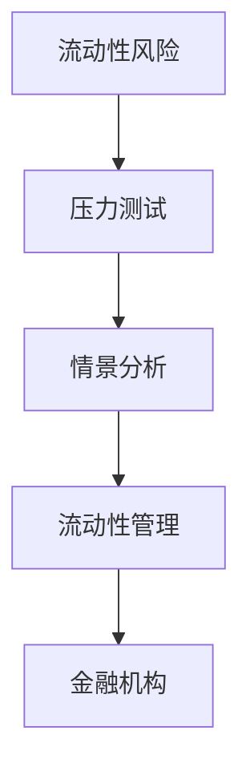
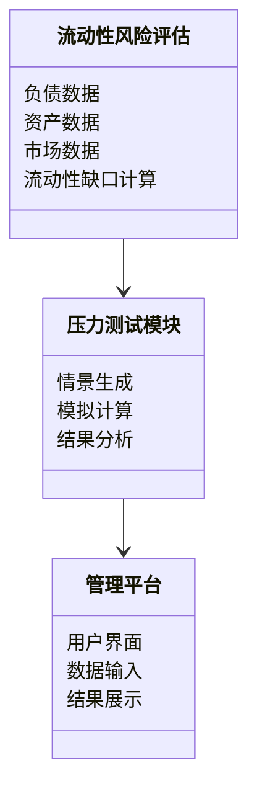
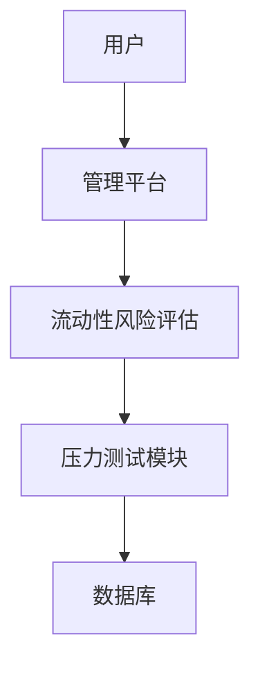
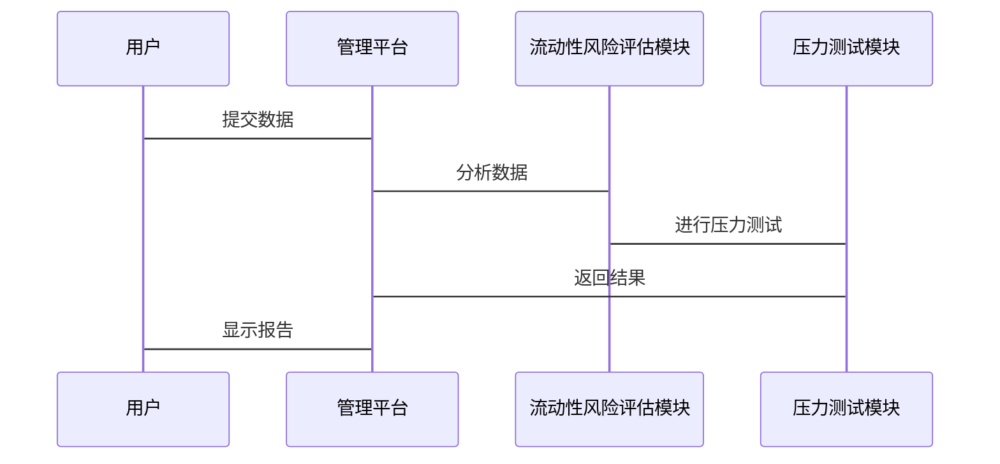

                 


# 金融机构流动性风险压力测试与管理平台

## 关键词：流动性风险、压力测试、金融机构、系统架构、算法模型

## 摘要：本文详细探讨了金融机构流动性风险压力测试与管理平台的设计与实现，从核心概念、算法原理到系统架构，结合实际案例分析，为金融机构提供有效的风险管理解决方案。

---

## 第1章: 流动性风险与压力测试概述

### 1.1 流动性风险的定义与特征

#### 1.1.1 流动性风险的定义
流动性风险是指金融机构无法在不承担额外成本或损失的情况下，及时以合理成本获得足够的资金来满足其资产增长或负债减少的需求的风险。简单来说，就是当资金需求超过供给时，金融机构可能面临无法及时偿还债务的风险。

#### 1.1.2 流动性风险的核心特征
- **时间性**：流动性风险通常在特定时间段内显现，例如市场波动时期。
- **传染性**：流动性问题可能迅速从一家金融机构蔓延到整个金融体系。
- **复杂性**：涉及多种因素，如市场波动、投资者信心等。

#### 1.1.3 流动性风险的分类与影响
流动性风险可以分为外部风险和内部风险：
- **外部风险**：由市场环境或宏观经济因素引发。
- **内部风险**：由金融机构自身的资产和负债结构不当引起。

流动性风险的影响包括资金链断裂、信誉损失和监管处罚等。

### 1.2 压力测试的定义与方法

#### 1.2.1 压力测试的定义
压力测试是一种评估金融机构在极端市场条件下的稳健性方法，通过模拟不同压力情景，分析其承受压力的能力。

#### 1.2.2 压力测试的主要方法
- **情景分析法**：基于假设的极端市场情景，评估金融机构的承受能力。
- **敏感性分析法**：分析关键假设或变量变化对流动性的影响。

#### 1.2.3 压力测试的应用场景
- **风险评估**：识别潜在风险点。
- **制定应对策略**：基于测试结果制定应急措施。

### 1.3 金融机构流动性风险管理的重要性

#### 1.3.1 流动性风险管理的必要性
金融机构若忽视流动性风险管理，可能在市场波动时面临资金短缺，导致声誉损失或破产。

#### 1.3.2 流动性风险对金融机构的影响
- **直接损失**：资金不足导致的违约或罚款。
- **间接影响**：影响市场参与度和客户信任。

#### 1.3.3 监管要求与行业标准
监管机构要求金融机构定期进行流动性压力测试，确保其具备应对极端情况的能力。

### 1.4 本章小结
本章介绍了流动性风险的基本概念、分类及其对金融机构的影响，强调了压力测试在风险管理中的重要性。

---

## 第2章: 流动性风险压力测试的核心概念与联系

### 2.1 流动性风险压力测试的原理

#### 2.1.1 流动性压力测试的基本原理
通过模拟极端市场情景，评估金融机构在不同压力下的流动性状况，识别潜在问题并制定应对措施。

#### 2.1.2 流动性压力测试的关键要素
- **情景设定**：包括市场崩盘、大规模赎回等。
- **数据输入**：金融机构的资产负债数据、市场数据等。
- **模型计算**：基于假设情景计算流动性缺口。

#### 2.1.3 流动性压力测试的数学模型
$$ \text{流动性缺口} = \text{负债到期金额} - \text{资产到期金额} $$

### 2.2 核心概念对比分析

#### 2.2.1 流动性风险与信用风险的对比
| 对比维度       | 流动性风险                | 信用风险                |
|----------------|---------------------------|--------------------------|
| 定义           | 资金获取困难的风险        | 债务违约的风险           |
| 主要影响因素   | 资产负债结构、市场信心    | 债务偿还能力、违约概率  |
| 应对措施       | 提高流动性管理能力        | 优化信用评估和风险控制  |

#### 2.2.2 压力测试与情景分析的对比
压力测试是情景分析的一种应用，情景分析更广泛，包括不同假设情景下的分析。

#### 2.2.3 流动性压力测试与资本充足率测试的对比
流动性压力测试关注资金流动性，资本充足率测试关注资本质量，两者均是监管要求的重要指标。

### 2.3 ER实体关系图架构



### 2.4 本章小结
本章通过对比分析，明确了流动性风险压力测试的核心概念及其与相关风险的区别，为后续分析奠定了基础。

---

## 第3章: 流动性风险压力测试的算法原理

### 3.1 流动性压力测试的主要算法

#### 3.1.1 简单情景分析法
基于假设情景，计算流动性缺口。

#### 3.1.2 复杂情景分析法
结合市场数据和历史案例，构建更复杂的假设情景进行分析。

#### 3.1.3 蒙特卡洛模拟法
通过随机模拟市场情景，评估流动性风险的概率分布。

### 3.2 算法原理的数学模型

#### 3.2.1 简单情景分析法的数学模型
$$
\text{流动性缺口} = \text{负债到期金额} - \text{资产到期金额}
$$

#### 3.2.2 蒙特卡洛模拟法的数学模型
$$
P(L \leq q) = \frac{\sum_{i=1}^{n} I(L_i \leq q)}{n}
$$

### 3.3 算法实现的Python源代码

```python
import numpy as np

def liquidity_gap_analysis(liabilities, assets):
    gap = liabilities - assets
    return gap

def monte_carlo_simulation(n_iterations, scenario_generator):
    results = []
    for _ in range(n_iterations):
        scenario = scenario_generator()
        results.append(scenario)
    return results
```

### 3.4 本章小结
本章详细介绍了流动性压力测试的主要算法及其数学模型，并通过Python代码展示了算法的实现。

---

## 第4章: 金融机构流动性风险压力测试平台的系统架构设计

### 4.1 问题场景介绍
金融机构在面对市场波动时，需及时评估流动性风险，制定应对策略。

### 4.2 项目介绍
本项目旨在开发一个能够实时监控并评估流动性风险的管理平台。

### 4.3 系统功能设计

#### 4.3.1 领域模型类图


### 4.4 系统架构设计

#### 4.4.1 系统架构图


### 4.5 系统接口设计

#### 4.5.1 数据接口
- 输入接口：接收金融机构的资产负债数据和市场数据。
- 输出接口：提供流动性风险评估结果和压力测试报告。

#### 4.5.2 用户接口
- 界面友好，便于用户输入数据和查看结果。

### 4.6 系统交互流程

#### 4.6.1 交互流程图


### 4.7 本章小结
本章详细设计了金融机构流动性风险压力测试平台的系统架构，包括功能模块划分、系统架构图和交互流程。

---

## 第5章: 项目实战与案例分析

### 5.1 环境安装与配置

#### 5.1.1 安装Python环境
安装Python 3.8及以上版本，并配置Jupyter Notebook。

#### 5.1.2 安装依赖库
安装numpy、pandas、scikit-learn等库。

### 5.2 核心代码实现

#### 5.2.1 数据加载与处理
```python
import pandas as pd

# 加载数据
data = pd.read_csv('financial_data.csv')

# 数据预处理
data_cleaned = data.dropna()
```

#### 5.2.2 流动性风险评估模型
```python
def calculate_liquidity_gap(liabilities, assets):
    return liabilities - assets

# 应用模型
gap = calculate_liquidity_gap(data_cleaned['liabilities'], data_cleaned['assets'])
print(gap)
```

#### 5.2.3 压力测试模块实现
```python
from sklearn.metrics import mean_squared_error

def pressure_test_simulation(model, scenarios):
    predictions = model.predict(scenarios)
    return predictions

# 示例用法
model = load_model('流动性压力测试模型.pkl')
scenarios = generate_scenarios(1000)
results = pressure_test_simulation(model, scenarios)
print(mean_squared_error(results, actual_values))
```

### 5.3 案例分析与解读

#### 5.3.1 案例背景
某中型银行在市场波动期间，面临客户大量赎回，需评估其流动性风险。

#### 5.3.2 数据分析与处理
加载该银行的资产负债数据和市场数据，进行数据清洗。

#### 5.3.3 模型应用与结果解读
应用流动性风险评估模型和压力测试模块，模拟极端市场情景，评估流动性缺口。

### 5.4 本章小结
本章通过实际案例展示了平台的应用过程，从数据加载、模型训练到结果解读，详细讲解了平台的实际操作流程。

---

## 第6章: 总结与展望

### 6.1 本章小结
本文详细探讨了金融机构流动性风险压力测试与管理平台的设计与实现，从核心概念到系统架构，结合实际案例，为金融机构提供了一套有效的风险管理解决方案。

### 6.2 未来研究方向
- **算法优化**：探索更高效的流动性风险评估算法。
- **系统扩展**：增加更多市场数据源和多样化的情景模拟。
- **实时监控**：实现对金融机构实时流动性风险的监控和预警。

### 6.3 注意事项
在实际应用中，需注意数据的准确性和模型的适用性，确保系统的稳定性和安全性。

### 6.4 拓展阅读
推荐相关书籍和资源，供读者深入学习流动性风险管理和压力测试技术。

---

## 作者：AI天才研究院/AI Genius Institute & 禅与计算机程序设计艺术 /Zen And The Art of Computer Programming

---

以上是《金融机构流动性风险压力测试与管理平台》的技术博客文章的详细内容，涵盖背景介绍、核心概念、算法原理、系统架构设计、项目实战和总结等部分，确保每章内容丰富且逻辑清晰。

