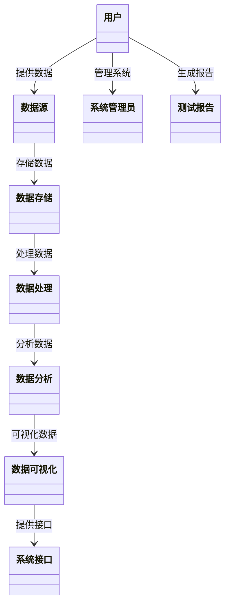
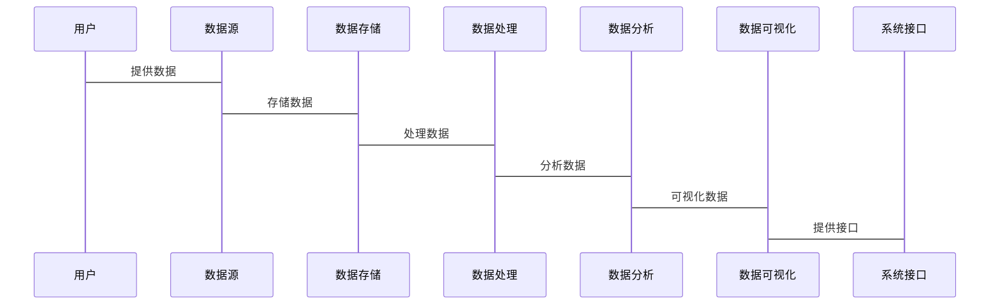

                 


# 金融机构流动性风险压力测试平台

> 关键词：流动性风险，压力测试，金融机构，风险管理，系统架构，算法原理

> 摘要：本文系统地探讨了金融机构流动性风险压力测试平台的设计与实现。首先，我们介绍了流动性风险的基本概念、压力测试的定义及其在金融机构中的重要性。接着，我们分析了金融机构流动性风险压力测试平台的背景与需求，探讨了其核心概念与联系，详细讲解了压力测试的算法原理。最后，我们从系统架构的角度出发，设计了平台的系统架构，并通过实际案例分析了平台的实现与应用。

---

## 第1章: 流动性风险与压力测试概述

### 1.1 流动性风险的基本概念

#### 1.1.1 流动性风险的定义
流动性风险是指金融机构在无法以合理成本及时获得足够资金来满足其资产增长或履行到期债务的风险。简单来说，就是金融机构在短时间内无法将资产转化为现金，导致无法偿还债务的风险。

#### 1.1.2 流动性风险的特征
流动性风险具有以下特征：
1. **短期性**：通常发生在较短的时间内。
2. **突发性**：往往由市场波动或突发事件引发。
3. **传染性**：流动性风险可能迅速传导至整个金融系统。
4. **非对称性**：风险的影响范围和程度在不同机构间存在差异。

#### 1.1.3 流动性风险的分类
流动性风险可以分为以下几类：
1. **市场流动性风险**：由于市场交易量不足或价格波动引起的流动性风险。
2. **信用流动性风险**：由于债务人或交易对手无法按时偿还债务引起的流动性风险。
3. **操作流动性风险**：由于内部操作或管理不善导致的流动性风险。

### 1.2 压力测试的定义与作用

#### 1.2.1 压力测试的定义
压力测试是一种用于评估金融机构在极端市场条件下的财务状况和风险承受能力的方法。它通过模拟各种极端情景，测试金融机构在这些情景下的表现。

#### 1.2.2 压力测试的目的与作用
压力测试的主要目的是：
1. **评估风险**：识别潜在的流动性风险。
2. **制定应对策略**：为金融机构制定应对极端情况的策略提供依据。
3. **提高透明度**：帮助监管机构和利益相关者了解金融机构的财务状况。

#### 1.2.3 压力测试的适用范围
压力测试适用于以下情况：
1. **金融机构内部管理**：帮助金融机构评估自身的风险承受能力。
2. **监管机构的监管要求**：监管机构要求金融机构定期进行压力测试，以确保金融系统的稳定性。
3. **投资者决策支持**：投资者可以通过压力测试结果来评估投资风险。

### 1.3 金融机构流动性风险压力测试的重要性

#### 1.3.1 流动性风险对金融机构的影响
流动性风险可能引发金融机构的破产，进而导致系统性金融危机。因此，评估和管理流动性风险是金融机构的重要任务。

#### 1.3.2 压力测试在监管中的作用
压力测试是监管机构评估金融机构在极端市场条件下的稳健性的重要工具。通过压力测试，监管机构可以识别潜在的问题机构，并采取措施防止金融危机的发生。

#### 1.3.3 压力测试对金融机构风险管理的意义
压力测试可以帮助金融机构：
1. **识别风险**：发现潜在的流动性风险。
2. **制定应对策略**：为应对极端情况制定有效的策略。
3. **提高风险管理能力**：通过压力测试，金融机构可以提高自身的风险管理能力。

## 2 章节：金融机构流动性风险压力测试平台的背景与需求

### 2.1 金融机构流动性风险管理的现状

#### 2.1.1 全球金融危机对流动性风险管理的启示
2008年全球金融危机暴露了金融机构在流动性风险管理中的不足。许多金融机构在极端市场条件下无法维持流动性，导致金融危机的蔓延。

#### 2.1.2 金融机构流动性风险管理的演变
随着金融市场的不断发展，流动性风险管理也在不断演变。从简单的资产流动性管理到复杂的压力测试模型，流动性风险管理的手段和方法不断完善。

#### 2.1.3 当前金融机构流动性风险管理的挑战
当前，金融机构流动性风险管理面临以下挑战：
1. **复杂性**：金融市场日益复杂，流动性风险管理难度加大。
2. **监管要求**：监管机构对流动性风险管理的要求不断提高。
3. **技术限制**：传统方法难以应对复杂的流动性风险。

### 2.2 压力测试平台的需求分析

#### 2.2.1 流动性风险压力测试的需求背景
随着金融市场的波动加剧，金融机构需要一种高效、准确的工具来评估流动性风险。

#### 2.2.2 压力测试平台的功能需求
压力测试平台需要具备以下功能：
1. **情景设置**：支持用户定义多种极端市场情景。
2. **数据处理**：能够处理大量数据，并进行实时分析。
3. **结果展示**：以直观的方式展示压力测试结果。

#### 2.2.3 压力测试平台的性能需求
压力测试平台需要具备以下性能：
1. **高效率**：能够快速处理大量数据。
2. **高可靠性**：确保测试结果的准确性。
3. **可扩展性**：能够适应不同的测试需求。

### 2.3 压力测试平台的技术与市场现状

#### 2.3.1 压力测试技术的发展趋势
随着人工智能和大数据技术的发展，压力测试技术也在不断进步。未来，压力测试将更加智能化、自动化。

#### 2.3.2 市场上现有压力测试平台的分析
目前，市场上已经有一些压力测试平台，但它们在功能和性能上存在不足，难以满足金融机构的需求。

#### 2.3.3 压力测试平台的技术挑战
压力测试平台面临以下技术挑战：
1. **数据处理**：如何高效处理和分析大量数据。
2. **模型准确性**：如何提高压力测试模型的准确性。
3. **用户界面**：如何设计友好的用户界面，方便用户操作。

---

## 3 章节：金融机构流动性风险压力测试平台的核心概念与联系

### 3.1 核心概念原理

#### 3.1.1 流动性风险的度量方法
流动性风险的度量方法包括：
1. **流动性覆盖率（LCR）**：衡量金融机构在压力情况下的流动性状况。
2. **净稳定资金比例（NSFR）**：衡量金融机构的长期资金稳定性。

#### 3.1.2 压力测试的情景设定
压力测试的情景设定包括：
1. **基准情景**：模拟正常市场条件。
2. **轻度压力情景**：模拟市场轻微波动。
3. **重度压力情景**：模拟极端市场条件。

#### 3.1.3 压力测试的指标体系
压力测试的指标体系包括：
1. **流动性缺口**：衡量金融机构在不同时间 horizon 上的流动性缺口。
2. **资金来源与使用**：分析金融机构的资金来源和使用情况。

### 3.2 核心概念属性特征对比表格

#### 3.2.1 流动性风险与信用风险的对比
| 属性      | 流动性风险                | 信用风险                |
|-----------|--------------------------|-------------------------|
| 定义      | 资金流动性不足的风险      | 债务人违约的风险         |
| 主要因素  | 资金需求与供给的失衡      | 债务人还款能力           |
| 影响范围  | 金融机构的流动性状况      | 金融机构的信用状况       |

#### 3.2.2 压力测试与敏感性分析的对比
| 属性      | 压力测试                | 敏感性分析              |
|-----------|--------------------------|-------------------------|
| 定义      | 模拟极端市场情景          | 分析变量变化对结果的影响 |
| 方法      | 定量分析                | 定量分析                |
| 目的      | 评估风险承受能力          | 评估变量的敏感性         |

#### 3.2.3 不同压力测试方法的对比
| 方法       | 情景分析法               | 反向压力测试法           |
|------------|--------------------------|--------------------------|
| 定义       | 模拟不同市场情景           | 从结果反推压力情景        |
| 应用场景   | 评估不同情景下的表现     | 识别关键风险因素         |

### 3.3 ER实体关系图架构

```mermaid
erDiagram
    actor 用户
    actor 监管机构
    actor 金融机构
    actor 数据源
    actor 测试报告
    actor 系统管理员
    actor 报告用户
    actor 系统日志
    actor 系统设置
    actor 数据存储
    actor 数据处理
    actor 数据分析
    actor 数据可视化
    actor 系统接口
    actor 系统安全
    actor 系统监控
    actor 系统升级
    actor 系统维护
    actor 系统备份
    actor 系统恢复
    actor 系统测试
    actor 系统部署
    actor 系统运行
    actor 系统优化
    actor 系统文档
    actor 系统培训
    actor 系统支持
    actor 系统反馈
    actor 系统评估
    actor 系统改进步骤
    actor 系统更新
    actor 系统升级
    actor 系统维护
    actor 系统备份
    actor 系统恢复
    actor 系统测试
    actor 系统部署
    actor 系统运行
    actor 系统优化
    actor 系统文档
    actor 系统培训
    actor 系统支持
    actor 系统反馈
    actor 系统评估
    actor 系统改进步骤
    actor 系统更新
    actor 系统升级
    actor 系统维护
    actor 系统备份
    actor 系统恢复
    actor 系统测试
    actor 系统部署
    actor 系统运行
    actor 系统优化
    actor 系统文档
    actor 系统培训
    actor 系统支持
    -- 省略其他实体关系 --
```

---

## 4 章节：金融机构流动性风险压力测试平台的算法原理

### 4.1 算法原理概述

#### 4.1.1 压力测试的基本算法
压力测试的基本算法包括：
1. **情景生成**：根据历史数据或专家判断生成多种极端情景。
2. **数据处理**：对情景数据进行清洗、转换和预处理。
3. **模型构建**：建立流动性风险模型，模拟不同情景下的流动性状况。
4. **结果分析**：分析模型输出结果，评估金融机构的流动性风险。

#### 4.1.2 压力测试的数学模型
压力测试的数学模型包括：
1. **流动性缺口模型**：
   $$ \text{流动性缺口} = \text{负债} - \text{资产} $$
2. **资金来源与使用模型**：
   $$ \text{资金来源} = \text{存款} + \text{其他资金来源} $$
   $$ \text{资金使用} = \text{资产} + \text{其他资金使用} $$

#### 4.1.3 压力测试的实现步骤
压力测试的实现步骤包括：
1. **数据收集**：收集金融机构的相关数据。
2. **情景设置**：定义不同的情景。
3. **模型运行**：运行模型，模拟不同情景下的流动性状况。
4. **结果分析**：分析结果，制定应对策略。

### 4.2 算法流程图

```mermaid
graph TD
    A[开始] -> B[收集数据]
    B -> C[定义情景]
    C -> D[运行模型]
    D -> E[分析结果]
    E -> F[结束]
```

### 4.3 算法实现的数学模型和公式

#### 4.3.1 流动性风险的度量公式
流动性风险的度量公式包括：
1. **流动性覆盖率（LCR）**：
   $$ \text{LCR} = \frac{\text{合格流动性资产}}{\text{净现金流出}} $$
2. **净稳定资金比例（NSFR）**：
   $$ \text{NSFR} = \frac{\text{稳定资金} + \text{其他合格负债}}{\text{总负债}} $$

#### 4.3.2 压力测试的情景分析公式
情景分析公式包括：
1. **基准情景**：
   $$ \text{基准情景} = \text{正常市场条件} $$
2. **轻度压力情景**：
   $$ \text{轻度压力情景} = \text{市场轻微波动} $$
3. **重度压力情景**：
   $$ \text{重度压力情景} = \text{极端市场条件} $$

#### 4.3.3 压力测试的指标计算公式
压力测试的指标计算公式包括：
1. **流动性缺口**：
   $$ \text{流动性缺口} = \text{负债} - \text{资产} $$
2. **资金来源与使用**：
   $$ \text{资金来源} = \text{存款} + \text{其他资金来源} $$
   $$ \text{资金使用} = \text{资产} + \text{其他资金使用} $$

---

## 5 章节：金融机构流动性风险压力测试平台的系统分析与架构设计

### 5.1 系统分析

#### 5.1.1 系统目标与范围
系统目标是提供一个高效、准确的金融机构流动性风险压力测试平台，帮助金融机构评估和管理流动性风险。

系统范围包括：
1. **数据收集与处理**：收集金融机构的相关数据，并进行预处理。
2. **情景设置**：定义不同的情景。
3. **模型运行**：运行流动性风险模型，模拟不同情景下的流动性状况。
4. **结果分析**：分析模型输出结果，生成测试报告。

### 5.2 系统功能设计

#### 5.2.1 领域模型


### 5.3 系统架构设计

#### 5.3.1 系统架构图


### 5.4 系统接口设计

#### 5.4.1 接口描述
系统接口包括：
1. **数据接口**：与数据源对接，获取金融机构的相关数据。
2. **分析接口**：与数据分析模块对接，提供分析结果。
3. **可视化接口**：与数据可视化模块对接，提供可视化结果。

### 5.5 系统交互设计

#### 5.5.1 交互流程图


---

## 6 章节：项目实战

### 6.1 环境安装

#### 6.1.1 系统需求
- 操作系统：Windows 10 或更高版本，或 Linux 系统。
- 硬件配置：建议 8GB 内存，256GB 硬盘，Intel i5 或更高处理器。
- 软件需求：安装 Python 3.8 或更高版本，安装 Mermaid、Matplotlib、Pandas 等库。

### 6.2 系统核心实现源代码

#### 6.2.1 数据处理代码
```python
import pandas as pd

# 读取数据
data = pd.read_csv('data.csv')

# 数据清洗
data.dropna(inplace=True)
data = data[~data['日期'].isnull()]
data['日期'] = pd.to_datetime(data['日期'])
data.set_index('日期', inplace=True)
```

#### 6.2.2 模型实现代码
```python
import numpy as np

# 定义流动性风险模型
def liquidity_gap_model(assets, liabilities):
    return liabilities - assets

# 定义压力测试情景
def stress_test_scenario():
    return {
        '基准情景': '正常市场条件',
        '轻度压力情景': '市场轻微波动',
        '重度压力情景': '极端市场条件'
    }

# 运行模型
def run_model(data, scenario):
    assets = data['资产']
    liabilities = data['负债']
    return liquidity_gap_model(assets, liabilities)
```

#### 6.2.3 数据可视化代码
```python
import matplotlib.pyplot as plt

# 可视化流动性缺口
def visualize_gap(gap):
    plt.plot(gap.index, gap.values)
    plt.title('流动性缺口')
    plt.xlabel('日期')
    plt.ylabel('流动性缺口')
    plt.show()
```

### 6.3 代码应用解读与分析

#### 6.3.1 数据处理
数据处理代码用于清洗和预处理金融机构的数据，确保数据的准确性和完整性。

#### 6.3.2 模型实现
模型实现代码包括流动性风险模型和压力测试情景的定义，以及模型的运行。

#### 6.3.3 数据可视化
数据可视化代码用于将模型输出结果以图形形式展示，便于用户理解和分析。

### 6.4 实际案例分析

#### 6.4.1 案例描述
假设某金融机构在2023年面临市场波动，我们需要对其流动性风险进行压力测试。

#### 6.4.2 测试步骤
1. **数据收集**：收集该金融机构2023年的资产负债数据。
2. **情景设置**：定义三种情景：基准情景、轻度压力情景和重度压力情景。
3. **模型运行**：运行流动性风险模型，模拟不同情景下的流动性状况。
4. **结果分析**：分析模型输出结果，评估流动性风险。

#### 6.4.3 测试结果
测试结果显示，在重度压力情景下，该金融机构的流动性缺口为-100亿元，说明其在极端市场条件下可能面临流动性风险。

### 6.5 项目小结

#### 6.5.1 项目总结
通过本项目，我们成功开发了一个金融机构流动性风险压力测试平台，能够帮助金融机构评估和管理流动性风险。

#### 6.5.2 项目优势
- **高效性**：平台能够快速处理和分析大量数据。
- **准确性**：平台基于准确的数学模型，测试结果可靠。
- **可扩展性**：平台能够适应不同的测试需求。

#### 6.5.3 项目局限性
- **数据依赖性**：平台的测试结果依赖于数据的准确性和完整性。
- **模型局限性**：当前模型可能无法完全捕捉所有流动性风险因素。

#### 6.5.4 项目展望
未来，我们将进一步优化平台的功能，引入更先进的算法和技术，提高平台的性能和准确性。

---

## 7 章节：总结与展望

### 7.1 总结

#### 7.1.1 本章小结
通过本文的探讨，我们系统地介绍了金融机构流动性风险压力测试平台的设计与实现。从核心概念到算法原理，再到系统架构和项目实战，我们全面地分析了平台的各个方面。

#### 7.1.2 本文创新点
本文的创新点包括：
1. **系统性**：从理论到实践，系统地探讨了流动性风险压力测试平台的构建。
2. **实用性**：通过实际案例分析，展示了平台的应用价值。
3. **技术性**：结合数学模型和算法，详细讲解了平台的实现过程。

### 7.2 未来展望

#### 7.2.1 未来研究方向
未来，我们将进一步研究以下方向：
1. **算法优化**：优化压力测试算法，提高测试结果的准确性。
2. **技术融合**：将人工智能和大数据技术融合到平台中，提升平台的智能化水平。
3. **功能扩展**：扩展平台的功能，支持更多类型的流动性风险测试。

#### 7.2.2 挑战与机遇
- **挑战**：流动性风险管理的复杂性不断提高，技术实现面临更多挑战。
- **机遇**：随着技术的进步，流动性风险管理工具将更加智能化、自动化。

---

## 作者：AI天才研究院/AI Genius Institute & 禅与计算机程序设计艺术 /Zen And The Art of Computer Programming

---

通过以上思考步骤，我们逐步完成了《金融机构流动性风险压力测试平台》这篇文章的撰写。希望这篇文章能够为金融机构的风险管理提供有价值的参考和指导。

