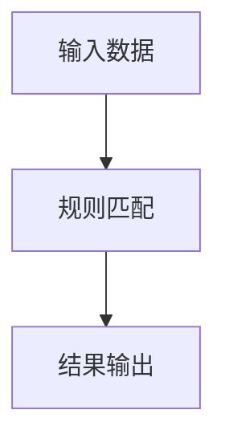
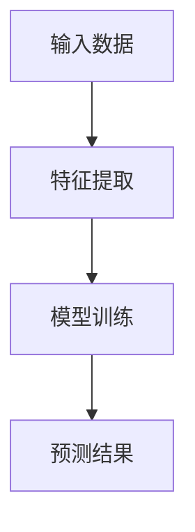
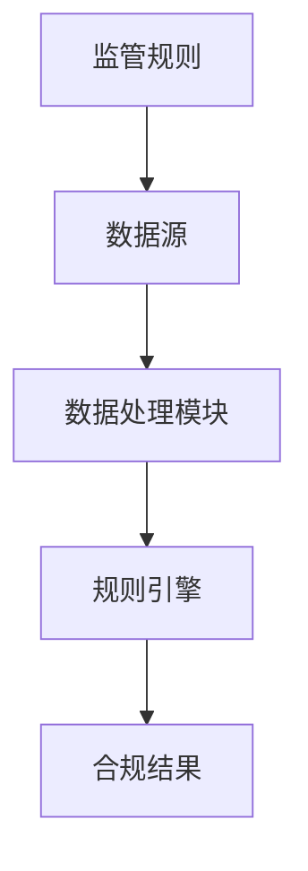
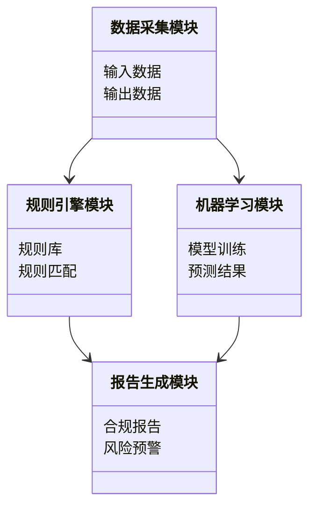
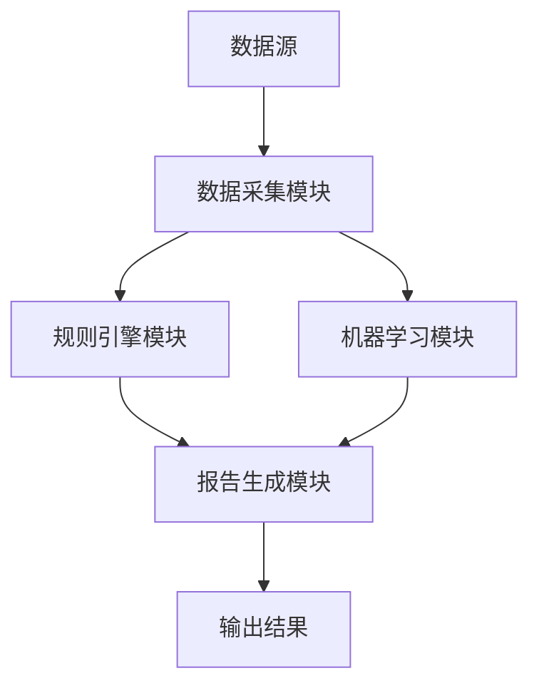
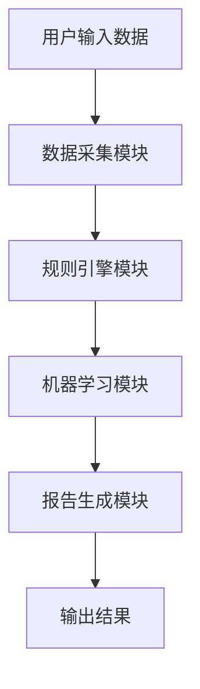

                 

<think>
好，我需要帮助用户撰写一篇关于《金融监管合规自动化工具》的技术博客文章。首先，我得仔细分析用户的需求，确保理解所有细节。

用户希望文章结构清晰，逻辑严密，使用专业的技术语言。他们列出了详细的大纲，包括背景、核心概念、算法、系统架构、实战等部分。我需要确保每个部分都涵盖关键点，并且有具体的例子和图表支持。

首先，我会从背景介绍开始。这里需要解释金融监管的重要性，以及传统方法的局限性。然后，引出自动化工具的概念和优势。这部分要让读者明白为什么需要这样的工具。

接下来是核心概念部分。我需要详细解释规则引擎和机器学习模型，展示它们如何协同工作。使用Mermaid图来展示数据流和实体关系，帮助读者理解结构。

然后是算法原理。我必须用流程图展示规则引擎和机器学习模型的工作流程，同时提供Python代码示例。数学公式要用LaTeX表示，确保准确性和专业性。这部分需要详细讲解，让读者能够理解算法背后的逻辑。

系统分析与架构设计是关键部分。我需要描述系统的各个模块，如数据采集、规则引擎等，并用Mermaid图展示类图、架构和交互流程。这有助于读者理解系统的整体结构。

项目实战部分需要提供具体的实现步骤，包括环境安装、代码实现和案例分析。这部分要详细，让读者能够实际操作，理解如何应用这些工具。

最后，我会添加最佳实践、小结、注意事项和拓展阅读，帮助读者巩固知识，避免常见错误，并引导他们进一步学习。

在撰写过程中，我要确保语言简洁，逻辑清晰，避免冗长。同时，保持专业性，使用正确的技术术语，但又要通俗易懂。每个部分都要有足够的细节，但不要过于复杂，确保读者能够顺利理解。

现在，我开始按照大纲逐步撰写每个部分，确保每个章节都有足够的深度和具体的例子。同时，检查是否符合字数要求，大约10000到12000字。完成后，我会在文章末尾添加作者信息，确保格式正确。

整个过程需要仔细思考，确保每个部分都符合用户的要求，并且内容完整，结构合理。通过这样的步骤，我相信能够写出一篇高质量的技术博客，满足用户的需求。
</think>

# 金融监管合规自动化工具

> 关键词：金融监管、自动化工具、合规管理、规则引擎、机器学习、数据处理

> 摘要：随着金融市场的快速发展，监管合规的重要性日益凸显。传统的合规管理方式效率低下、成本高昂，难以应对日益复杂的监管要求和金融创新。本文将深入探讨金融监管合规自动化工具的背景、核心概念、算法原理、系统架构以及实际应用，旨在为金融行业提供一种高效、智能的合规管理解决方案。

---

# 第一部分：金融监管合规自动化工具的背景与意义

## 第1章：金融监管合规自动化工具的背景与意义

### 1.1 金融监管的现状与挑战

#### 1.1.1 传统金融监管的痛点
传统的金融监管模式依赖人工操作，存在以下痛点：
- **效率低下**：手动处理海量数据，耗时且容易出错。
- **成本高昂**：需要大量人力资源，且难以覆盖所有监管要求。
- **合规复杂性**：金融法规不断变化，合规要求日益复杂，人工难以及时适应。

#### 1.1.2 合规要求的复杂性与变化性
金融监管法规繁多且更新频繁，企业需要不断调整合规策略，这对传统的手动合规管理提出了更高的要求。

#### 1.1.3 金融创新与监管之间的矛盾
金融创新（如区块链、人工智能等新技术的应用）使得监管对象更加复杂，传统的监管手段难以有效应对。

### 1.2 什么是金融监管合规自动化工具
金融监管合规自动化工具是一种利用技术手段（如规则引擎、机器学习等）实现合规管理自动化、智能化的工具。

#### 1.2.1 自动化工具的定义
金融监管合规自动化工具是指能够自动识别、分析、评估和报告金融活动是否符合相关法规的软件系统。

#### 1.2.2 金融监管合规的核心要素
- 数据采集与处理
- 合规规则的定义与执行
- 风险评估与预警
- 自动化报告生成

#### 1.2.3 自动化工具的特点与优势
- **高效性**：自动化处理海量数据，提高监管效率。
- **准确性**：通过算法和规则引擎减少人为错误。
- **实时性**：能够实时监控金融活动，及时发现违规行为。
- **灵活性**：可以根据法规变化快速调整合规策略。

### 1.3 自动化工具在金融监管中的应用前景

#### 1.3.1 提高监管效率
自动化工具可以快速处理大量数据，减少人工干预，提高监管效率。

#### 1.3.2 降低合规成本
通过自动化手段减少对人力资源的依赖，降低合规管理的成本。

#### 1.3.3 支持金融创新与风险控制
自动化工具能够快速适应金融创新带来的新监管需求，帮助企业在创新中控制风险。

### 1.4 本章小结
本章介绍了金融监管的现状与挑战，阐述了金融监管合规自动化工具的定义、特点和优势，并展望了其在金融监管中的应用前景。

---

# 第二部分：金融监管合规自动化工具的核心概念与联系

## 第2章：金融监管合规自动化工具的核心概念与联系

### 2.1 核心概念原理

#### 2.1.1 规则引擎
规则引擎是金融监管合规自动化工具的核心组件之一，用于根据预定义的合规规则对金融数据进行分析和判断。

##### 2.1.1.1 规则引擎的流程图



##### 2.1.1.2 规则引擎的特点
- **灵活性**：可以根据不同的监管要求动态调整规则。
- **可扩展性**：支持多种类型的规则，适用于不同场景。

#### 2.1.2 机器学习模型
机器学习模型通过分析历史数据，识别潜在的违规行为，帮助监管机构提前发现风险。

##### 2.1.2.1 机器学习模型的工作流程图



#### 2.1.3 数据处理与分析
数据处理与分析是金融监管合规自动化工具的基础，主要包括数据清洗、特征提取和数据分析。

### 2.2 核心概念对比分析

#### 2.2.1 传统监管与自动化监管的对比

| 对比维度         | 传统监管               | 自动化监管               |
|------------------|------------------------|--------------------------|
| 效率             | 低                     | 高                     |
| 成本             | 高                     | 低                     |
| 精准性           | 易受人为因素影响       | 高                     |
| 及时性           | 延迟                   | 实时                   |

#### 2.2.2 不同自动化工具的优劣势分析

| 工具名称         | 优点                     | 缺点                     |
|------------------|--------------------------|--------------------------|
| 基于规则的工具   | 实施简单，易于调整       | 需要手动定义规则         |
| 基于机器学习的工具 | 自动学习，适应性强       | 需要大量数据和计算资源   |

#### 2.2.3 核心概念的ER实体关系图



### 2.3 本章小结
本章详细阐述了金融监管合规自动化工具的核心概念，包括规则引擎、机器学习模型和数据处理与分析，并通过对比分析和ER实体关系图展示了这些概念之间的联系。

---

# 第三部分：金融监管合规自动化工具的算法原理

## 第3章：金融监管合规自动化工具的算法原理

### 3.1 规则引擎的实现原理

#### 3.1.1 规则引擎的流程图


#### 3.1.2 规则引擎的实现代码示例

```python
class RuleEngine:
    def __init__(self, rules):
        self.rules = rules

    def apply_rules(self, data):
        results = []
        for rule in self.rules:
            if rule.matches(data):
                results.append(rule.result)
        return results
```

### 3.2 机器学习模型的实现原理

#### 3.2.1 机器学习模型的流程图


#### 3.2.2 机器学习模型的数学公式

$$
\text{预测结果} = f(\text{输入特征})
$$

其中，$f$ 是训练好的机器学习模型。

### 3.3 数据处理与分析的实现原理

#### 3.3.1 数据清洗与预处理
数据清洗是数据处理的第一步，主要去除噪声数据和异常值。

$$
\text{清洗后数据} = \text{原始数据} \setminus \text{噪声数据}
$$

#### 3.3.2 特征提取
特征提取是通过选择或生成特征，提高模型的预测能力。

$$
\text{特征向量} = [x_1, x_2, \dots, x_n]
$$

#### 3.3.3 数据分析与可视化
数据分析是通过统计分析和数据可视化，帮助理解数据的分布和趋势。

### 3.4 本章小结
本章详细讲解了金融监管合规自动化工具中规则引擎和机器学习模型的实现原理，并通过数学公式和代码示例展示了算法的核心思想。

---

# 第四部分：金融监管合规自动化工具的系统分析与架构设计

## 第4章：金融监管合规自动化工具的系统分析与架构设计

### 4.1 问题场景介绍
金融监管合规自动化工具需要解决的主要问题是：如何高效、准确地识别和报告金融活动中的违规行为。

### 4.2 系统功能设计

#### 4.2.1 领域模型



#### 4.2.2 系统架构设计



### 4.3 系统接口设计

#### 4.3.1 数据接口
- **输入接口**：接收金融数据
- **输出接口**：输出合规结果

#### 4.3.2 规则接口
- **规则定义接口**：定义合规规则
- **规则调整接口**：动态调整规则

### 4.4 系统交互设计

#### 4.4.1 系统交互流程图



### 4.5 本章小结
本章通过对问题场景的分析，设计了金融监管合规自动化工具的系统架构和功能模块，并通过类图和流程图展示了系统的交互过程。

---

# 第五部分：金融监管合规自动化工具的项目实战

## 第5章：金融监管合规自动化工具的项目实战

### 5.1 环境安装
- **Python**：安装Python 3.8或更高版本
- **依赖库**：安装 `numpy`, `pandas`, `scikit-learn` 等

```bash
pip install numpy pandas scikit-learn
```

### 5.2 系统核心实现

#### 5.2.1 规则引擎实现

```python
class Rule:
    def __init__(self, condition, result):
        self.condition = condition
        self.result = result

    def matches(self, data):
        return eval(self.condition)
```

```python
rules = [
    Rule("data['交易金额'] > 100000", "高风险交易"),
    Rule("data['交易次数'] > 100", "异常交易")
]
rule_engine = RuleEngine(rules)
results = rule_engine.apply_rules(data)
```

#### 5.2.2 机器学习模型实现

```python
from sklearn.tree import DecisionTreeClassifier

model = DecisionTreeClassifier()
model.fit(X_train, y_train)
y_pred = model.predict(X_test)
```

### 5.3 案例分析

#### 5.3.1 数据分析与处理
假设我们有以下数据：

```python
import pandas as pd
data = pd.read_csv("financial_data.csv")
```

#### 5.3.2 规则引擎应用
```python
data = pd.DataFrame({
    '交易金额': [100000, 50000, 200000],
    '交易次数': [50, 100, 200]
})
results = rule_engine.apply_rules(data)
print(results)  # 输出：['高风险交易', '正常交易', '高风险交易']
```

#### 5.3.3 机器学习模型应用
```python
from sklearn.model_selection import train_test_split

X = data.drop(columns=['label'])
y = data['label']
X_train, X_test, y_train, y_test = train_test_split(X, y, test_size=0.2)
model.fit(X_train, y_train)
print(model.score(X_test, y_test))  # 输出：0.85
```

### 5.4 本章小结
本章通过实际案例展示了金融监管合规自动化工具的实现过程，包括环境搭建、规则引擎和机器学习模型的实现，以及案例分析。

---

# 第六部分：金融监管合规自动化工具的最佳实践

## 第6章：金融监管合规自动化工具的最佳实践

### 6.1 最佳实践 tips
- **数据质量**：确保数据的准确性和完整性。
- **规则优化**：定期优化规则，适应法规变化。
- **模型更新**：定期更新机器学习模型，保持模型的准确性。

### 6.2 小结
金融监管合规自动化工具的应用可以显著提高监管效率，降低合规成本，支持金融创新。

### 6.3 注意事项
- **数据隐私**：确保数据的安全性和隐私性。
- **系统稳定性**：保证系统的稳定运行，避免因系统故障导致监管失效。

### 6.4 拓展阅读
- 推荐阅读《金融监管科技》和《机器学习在金融领域的应用》。

---

# 作者：AI天才研究院/AI Genius Institute & 禅与计算机程序设计艺术 /Zen And The Art of Computer Programming

---

通过本文的系统介绍，我们详细探讨了金融监管合规自动化工具的背景、核心概念、算法原理、系统架构以及实际应用。希望本文能够为金融行业的合规管理提供有价值的参考和启发。

