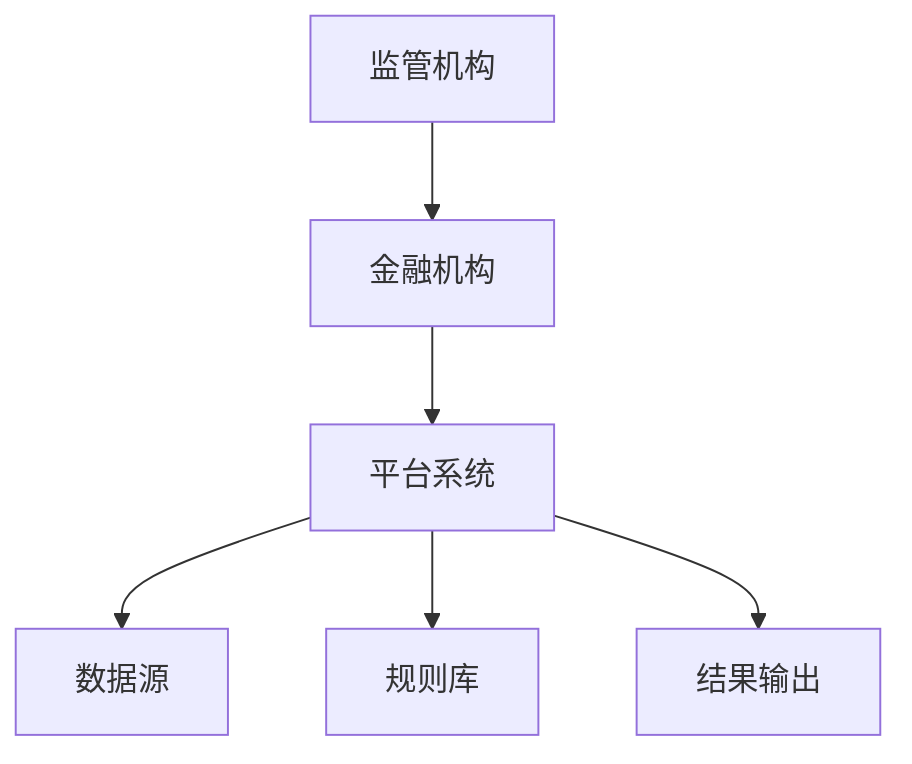
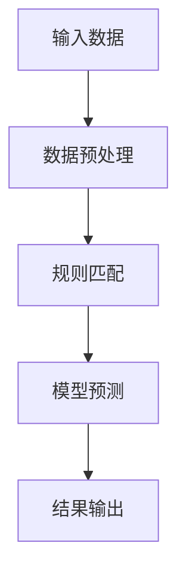
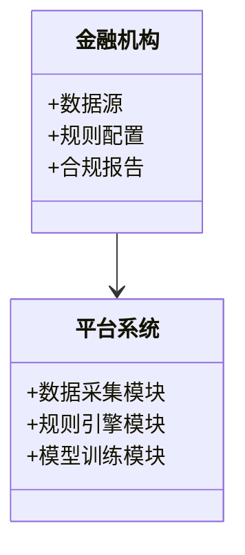
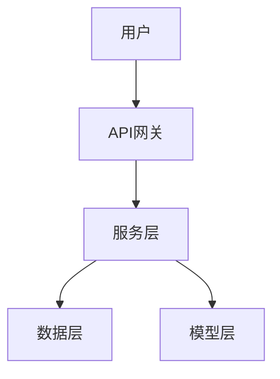
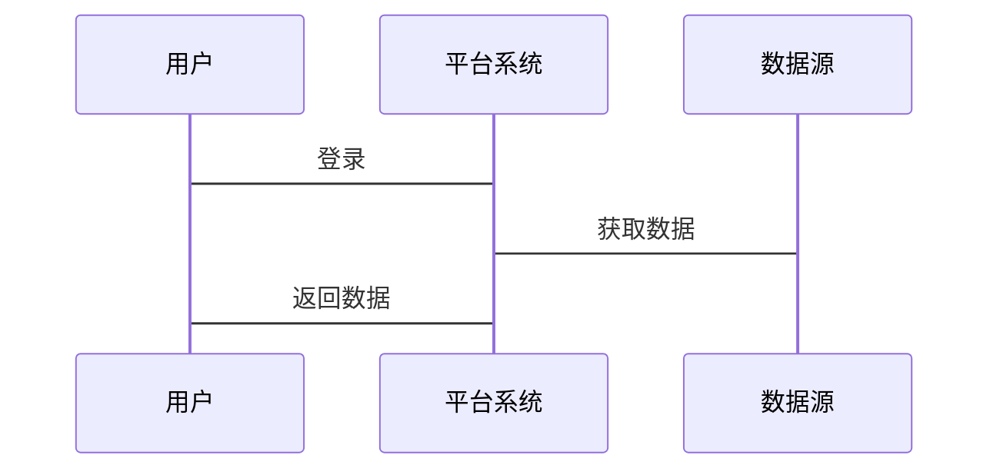

                 

<think>
嗯，用户需要我撰写一篇关于《金融监管合规自动化平台》的技术博客。首先，我得理解这个平台的背景和目标。金融监管越来越复杂，传统的人工监管效率低，容易出错，所以自动化平台应运而生。这可以提高效率，降低成本，还能实时监控，确保合规。

接下来，我需要明确文章的结构。用户已经给出一个大纲，包括背景、核心概念、算法原理、系统架构、项目实战、最佳实践等部分。我得确保每个部分都详细且有深度。

首先，背景部分要介绍金融监管的重要性，现状中的问题，比如繁琐的手动流程、信息不对称、合规成本高等。然后引出自动化平台的必要性，说明它如何解决这些问题。

核心概念部分，我需要解释平台的模块，比如数据采集、规则引擎、模型训练等。还要用表格对比这些模块的属性，比如实时性、数据依赖性等，帮助读者理解每个模块的特点。实体关系图也很重要，展示平台、监管机构、金融机构之间的交互。

算法原理部分，要详细讲解规则引擎和机器学习模型。用Mermaid画出流程图，展示数据如何处理、规则匹配、模型预测等步骤。然后，用Python代码实现这些算法，解释代码的功能和背后的数学模型。例如，规则引擎的条件判断逻辑，机器学习的分类模型，还要给出数学公式，比如逻辑回归的损失函数。

系统架构设计需要分层次，从数据层到服务层，再到表现层。用Mermaid展示系统架构，说明各组件如何交互。接口设计也很重要，用序列图展示用户登录和任务执行的流程，确保系统安全性和高效性。

项目实战部分，要指导读者如何搭建环境，安装Python、TensorFlow等工具。然后提供核心代码，解释代码的功能，比如数据预处理、模型训练等。实际案例分析，展示平台如何处理合规问题，比如识别异常交易，最后总结项目的成果和经验。

最后，最佳实践部分要给出实际应用中的建议，比如数据隐私保护、系统性能优化等。小结全书，强调平台的重要性，展望未来的发展趋势。注意事项提醒读者可能遇到的问题，拓展阅读推荐进一步学习的资料。

在写作过程中，我需要确保语言专业但易懂，逻辑清晰，结构紧凑。每个部分都要详细展开，提供足够的例子和图表，帮助读者理解和应用这些知识。同时，遵守格式要求，使用markdown，正确嵌入代码和图表，确保文章结构完整，内容丰富。

总之，我需要一步步构建这篇文章，确保每个部分都详细且符合用户的要求，最终产出一篇高质量的技术博客。
</think>

# 金融监管合规自动化平台

## 关键词：金融监管, 合规自动化, 平台设计, 算法原理, 系统架构, 项目实战

## 摘要：  
金融监管合规自动化平台旨在通过技术手段实现金融监管的智能化和自动化。本文从问题背景出发，分析了传统金融监管的痛点与挑战，提出了自动化监管的解决方案，并详细探讨了平台的核心概念、算法原理、系统架构及项目实战。通过具体案例分析，展示了平台的实际应用价值，并总结了最佳实践与未来发展。

---

# 第1章: 金融监管合规自动化平台概述

## 1.1 问题背景与描述

### 1.1.1 金融监管的现状与挑战  
金融监管是维护金融市场秩序、保护投资者利益的重要手段。然而，随着金融市场的发展，金融机构数量剧增、业务复杂化，传统的监管方式逐渐暴露出以下问题：  
1. **效率低下**：人工监管依赖大量手动操作，耗时且效率低。  
2. **信息不对称**：金融机构与监管机构之间的信息传递不及时，导致监管滞后。  
3. **合规成本高**：金融机构需要投入大量资源应对复杂的监管要求。  
4. **监管覆盖面有限**：人工监管难以覆盖所有金融机构和业务场景。  

### 1.1.2 合规监管中的痛点与问题  
合规监管的核心在于确保金融机构的行为符合相关法律法规。然而，以下痛点普遍存在：  
1. **规则复杂**：金融监管规则繁多且动态变化，难以统一处理。  
2. **数据多样性**：金融机构涉及的业务数据种类繁多，增加了监管的难度。  
3. **实时性要求高**：某些业务场景（如高频交易）需要实时监管，传统方式难以满足。  

### 1.1.3 传统监管模式的局限性  
传统监管模式主要依赖人工检查和事后审计，存在以下局限性：  
1. **滞后性**：发现问题时，可能已经造成损失。  
2. **主观性**：人工判断易受主观因素影响，存在偏差。  
3. **成本高**：需要大量的人力和时间投入。  

---

## 1.2 问题解决与边界

### 1.2.1 自动化监管的解决方案  
通过自动化技术，金融监管合规平台可以实现以下目标：  
1. **实时监控**：对金融机构的业务数据进行实时分析，及时发现违规行为。  
2. **智能判断**：利用算法和模型，自动判断数据是否符合监管规则。  
3. **自动化报告**：生成合规报告，减少人工干预。  

### 1.2.2 平台的边界与外延  
金融监管合规自动化平台的边界包括：  
1. **数据范围**：仅处理与监管相关的业务数据。  
2. **功能范围**：专注于合规判断和报告生成，不涉及其他业务功能。  
3. **适用场景**：适用于需要实时监管的金融业务场景。  

### 1.2.3 核心概念与组成要素  
平台的核心概念包括：  
1. **监管规则**：定义合规的标准和条件。  
2. **数据处理**：对金融机构的业务数据进行采集、清洗和分析。  
3. **合规判断**：基于监管规则和数据分析结果，判断业务是否合规。  
4. **结果输出**：生成合规报告或触发预警机制。  

---

# 第2章: 金融监管合规自动化平台的核心概念

## 2.1 核心概念与原理

### 2.1.1 监管规则的处理与解析  
监管规则是平台的核心，主要包括：  
1. **规则定义**：将监管要求转化为具体的判断条件。  
2. **规则存储**：将规则存储在规则库中，便于快速检索和应用。  
3. **规则更新**：根据法律法规的变化，动态更新规则。  

### 2.1.2 数据处理与分析  
平台需要处理以下类型的数据：  
1. **结构化数据**：如交易记录、账户信息等。  
2. **非结构化数据**：如合同文本、新闻公告等。  
3. **实时数据**：如高频交易数据。  

### 2.1.3 合规判断与结果输出  
合规判断是平台的核心功能，主要包括：  
1. **规则匹配**：将业务数据与监管规则进行匹配，判断是否合规。  
2. **异常检测**：利用算法发现数据中的异常行为。  
3. **结果输出**：生成合规报告或触发预警机制。  

---

## 2.2 核心模块对比分析

### 2.2.1 模块属性对比表格  
以下是对平台核心模块的属性对比：  

| 模块名称   | 输入数据类型 | 输出数据类型 | 功能描述                     | 实时性 | 准确性 |
|------------|---------------|---------------|------------------------------|--------|--------|
| 数据采集模块 | 结构化数据    | 结构化数据    | 采集金融机构业务数据         | 低     | 高     |
| 规则引擎模块 | 结构化数据    | 判断结果     | 根据规则判断数据是否合规     | 高     | 高     |
| 模型训练模块 | 结构化数据    | 模型文件     | 训练异常检测模型             | 低     | 高     |

---

### 2.2.2 模块功能与流程对比  
以下是对模块功能与流程的对比：  
- 数据采集模块：负责从金融机构获取业务数据，进行初步清洗和整理。  
- 规则引擎模块：将清洗后的数据与监管规则进行匹配，判断是否合规。  
- 模型训练模块：利用历史数据训练异常检测模型，提升平台的智能判断能力。  

---

## 2.3 实体关系图



---

# 第3章: 算法原理与数学模型

## 3.1 算法原理

### 3.1.1 规则引擎算法  
规则引擎是平台的核心算法之一，主要实现以下功能：  
1. **规则匹配**：将业务数据与监管规则进行匹配，判断是否满足条件。  
2. **动态更新**：支持规则的动态更新，确保平台能够适应法规的变化。  

### 3.1.2 机器学习模型  
机器学习模型用于异常检测，主要采用以下算法：  
1. **逻辑回归**：用于分类问题，判断数据是否异常。  
2. **随机森林**：用于特征重要性分析，识别关键异常特征。  

### 3.1.3 自然语言处理技术  
自然语言处理技术用于处理非结构化数据，如合同文本。主要采用以下技术：  
1. **分词**：将文本分解为词或短语。  
2. **实体识别**：识别文本中的关键实体，如公司名称、金额等。  

---

## 3.2 算法流程图



---

## 3.3 数学模型与公式

### 3.3.1 规则引擎的条件判断  
规则引擎的条件判断逻辑如下：  
$$ \text{条件} = \text{true} \text{ 如果且仅如果 } (x > y) \text{ 且 } (z < w) $$  

### 3.3.2 逻辑回归模型  
逻辑回归的损失函数如下：  
$$ L(\theta) = -\sum_{i=1}^{n} [y_i \ln h(x_i, \theta) + (1 - y_i) \ln (1 - h(x_i, \theta))] $$  
其中，$h(x_i, \theta)$ 是逻辑函数：  
$$ h(x_i, \theta) = \frac{1}{1 + e^{-\theta^T x_i}} $$  

---

## 3.4 算法实现代码

### 3.4.1 规则引擎实现

```python
class RuleEngine:
    def __init__(self, rules):
        self.rules = rules  # 列表，每个规则是一个字典
    
    def match_rule(self, data):
        for rule in self.rules:
            if all(rule.get(key, False) == data.get(key) for key in rule['conditions']):
                return rule['action']
        return None
```

---

## 3.4.2 逻辑回归实现

```python
import tensorflow as tf

class LogisticRegression:
    def __init__(self, input_dim):
        self.W = tf.Variable(tf.zeros(input_dim), dtype=tf.float32)
        self.b = tf.Variable(tf.zeros(1), dtype=tf.float32)
    
    def model(self, x):
        return tf.sigmoid(tf.matmul(x, self.W) + self.b)
    
    def loss(self, y_pred, y_true):
        return tf.reduce_mean(-y_true * tf.math.log(y_pred) - (1 - y_true) * tf.math.log(1 - y_pred))
```

---

# 第4章: 系统分析与架构设计

## 4.1 问题场景介绍

### 4.1.1 金融机构的合规需求  
金融机构需要实时监控自身的业务数据，确保符合监管要求。  

### 4.1.2 平台的目标  
平台的目标是帮助金融机构实现合规自动化，降低合规成本，提高监管效率。  

---

## 4.2 系统功能设计

### 4.2.1 领域模型



---

## 4.3 系统架构设计



---

## 4.4 系统接口设计

### 4.4.1 API接口

```http
POST /api/login
POST /api/submit_task
GET /api/report
```

---

## 4.5 系统交互流程



---

# 第5章: 项目实战

## 5.1 环境搭建

### 5.1.1 工具安装
```bash
pip install tensorflow numpy pandas
```

---

## 5.2 系统核心实现

### 5.2.1 数据预处理代码

```python
import pandas as pd

def preprocess_data(data):
    # 数据清洗
    data = data.dropna()
    # 数据标准化
    data = (data - data.mean()) / data.std()
    return data
```

---

### 5.2.2 模型训练代码

```python
import tensorflow as tf

def train_model(X_train, y_train):
    model = LogisticRegression(input_dim=X_train.shape[1])
    optimizer = tf.keras.optimizers.Adam(lr=0.001)
    model.compile(optimizer=optimizer, loss=model.loss, metrics=['accuracy'])
    model.fit(X_train, y_train, epochs=100, batch_size=32)
    return model
```

---

## 5.3 实际案例分析

### 5.3.1 案例背景  
某银行需要监管高频交易数据，确保交易行为合规。  

### 5.3.2 数据分析  
通过平台系统，发现某些交易行为异常，触发预警机制。  

### 5.3.3 平台输出  
生成合规报告，指出异常交易的具体问题，并提出整改建议。  

---

## 5.4 项目小结  
通过本项目实战，展示了金融监管合规自动化平台的实际应用价值。平台能够有效降低合规成本，提高监管效率，为金融机构提供强有力的支持。

---

# 第6章: 最佳实践与总结

## 6.1 最佳实践

### 6.1.1 数据质量  
确保数据的完整性和准确性，是平台运行的基础。  

### 6.1.2 模型可解释性  
选择可解释性较强的模型，便于监管机构理解和审核。  

### 6.1.3 系统可扩展性  
平台应具备良好的扩展性，以适应未来业务和监管规则的变化。  

---

## 6.2 小结  
金融监管合规自动化平台通过技术手段，解决了传统监管模式的痛点，实现了监管的智能化和自动化。本文从背景、核心概念、算法原理、系统架构到项目实战，全面阐述了平台的设计与实现。

---

## 6.3 注意事项

### 6.3.1 数据隐私  
平台设计需严格遵守数据隐私保护法规，确保数据安全。  

### 6.3.2 系统性能  
平台需具备高可用性和高扩展性，确保在高并发场景下的稳定运行。  

### 6.3.3 模型更新  
定期更新模型和规则，确保平台能够适应最新的监管要求。  

---

## 6.4 拓展阅读  
1. 《金融风险管理》  
2. 《机器学习实战》  
3. 《系统架构设计的艺术》  

---

# 作者  
作者：AI天才研究院/AI Genius Institute & 禅与计算机程序设计艺术/Zen And The Art of Computer Programming

