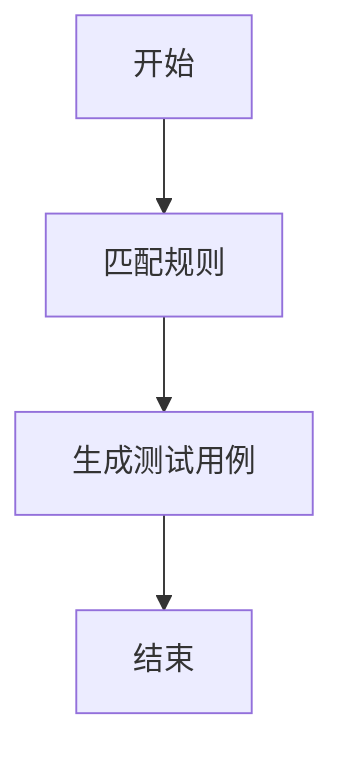
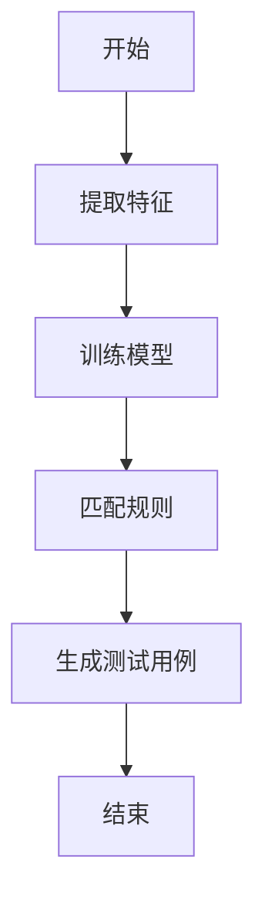
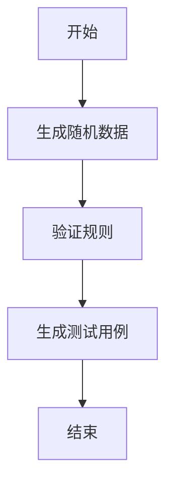
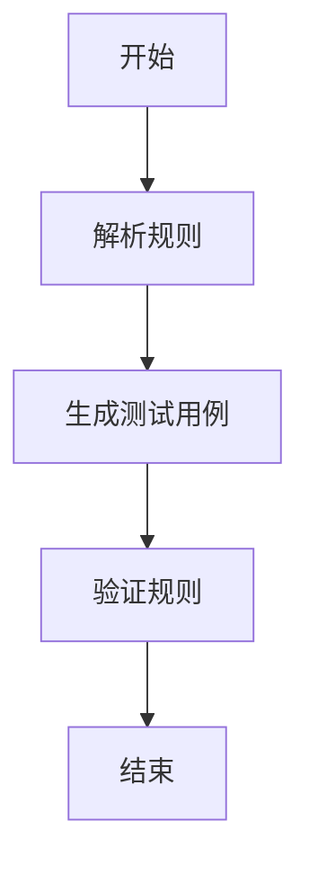
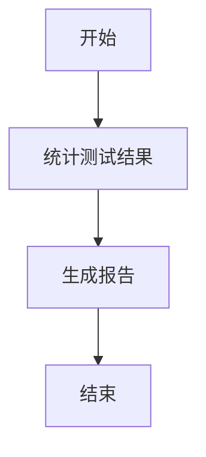
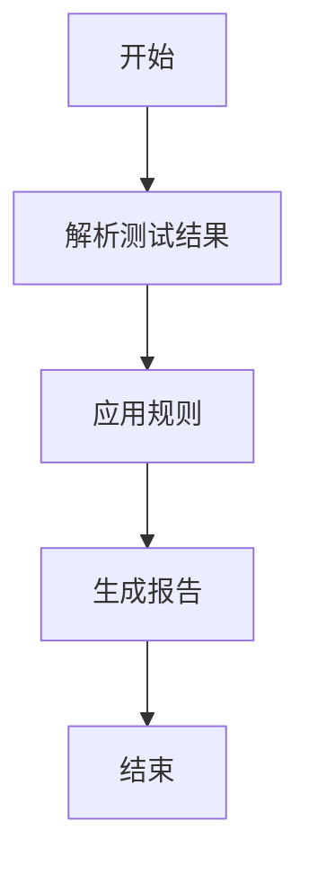
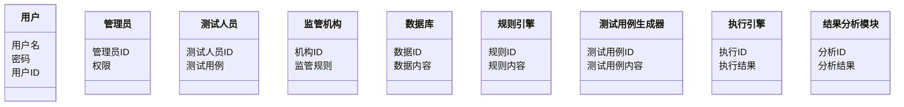
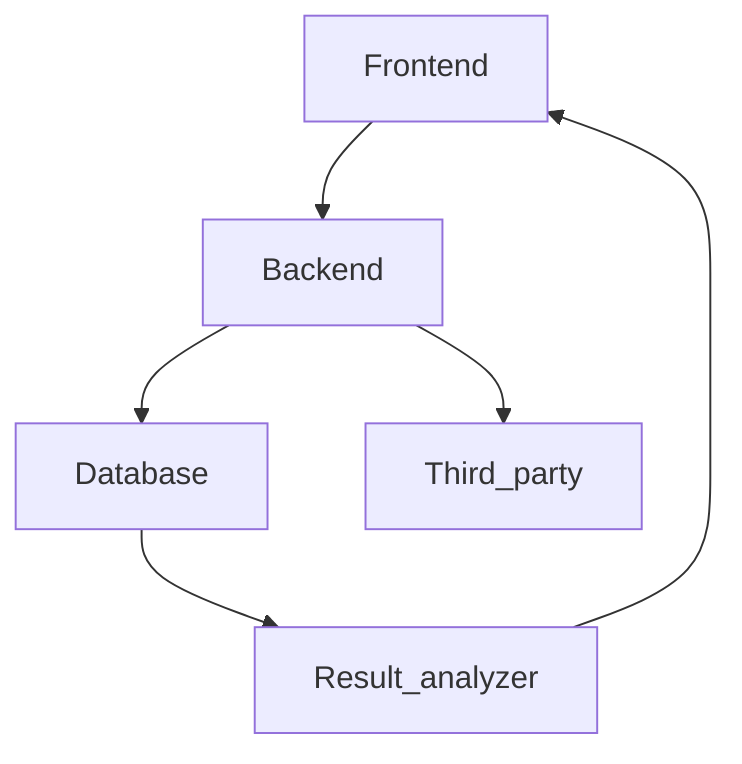
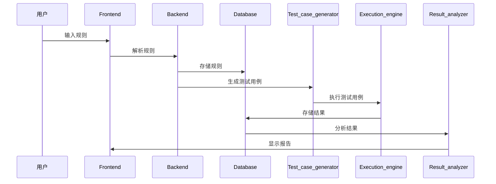

                 

<think>
好的，我现在需要帮用户设计一本名为《金融监管合规自动化测试平台》的书籍目录大纲。用户要求目录结构清晰，内容详细，符合技术博客的标准，同时需要涵盖背景、核心概念、算法、系统架构、项目实战等多个方面。

首先，我需要明确这本书的核心目标：介绍金融监管中的合规自动化测试平台，帮助读者理解其背景、技术原理和实现方法。考虑到读者可能是金融从业者、技术开发人员或监管机构的人员，我需要确保内容既专业又易懂。

接下来，我需要按照用户提供的大纲模板进行细化。从背景开始，逐步深入到核心概念、算法、系统设计，最后通过项目实战来巩固知识。同时，用户强调了每个部分的详细程度，包括使用Mermaid图和数学公式，因此我要确保这些元素在目录中都有体现。

在背景部分，我会先介绍金融监管的重要性，然后分析传统测试方法的痛点，引出自动化测试的必要性。接着描述问题，再提出解决方案，说明平台的目标和价值。这部分需要让读者明白为什么需要这样一个平台。

核心概念部分，我需要详细讲解平台的组成，包括规则引擎、测试用例生成等核心模块。同时，通过对比分析不同技术的特点，帮助读者理解平台的优势。实体关系图的使用将进一步澄清各模块之间的关系。

算法原理是技术博客的重点，我需要用Mermaid流程图详细描述规则匹配算法，并提供Python代码示例，解释数学模型和公式。这部分需要让读者了解平台的技术细节，以及如何实现合规测试。

系统分析与架构设计部分，我会介绍问题场景，设计系统功能，并用Mermaid类图展示领域模型。架构图将展示平台的整体结构，包括前端、后端、数据库和第三方接口。接口设计和交互流程图则说明系统的运作机制。

项目实战部分，我需要指导读者如何安装环境，实现核心功能，并分析实际案例。这部分通过代码示例和案例分析，帮助读者理解如何应用平台。

最后，我会总结最佳实践，提醒读者注意的事项，并提供拓展阅读的内容，引导他们进一步学习。

整体来看，我需要确保目录结构清晰，每个部分都涵盖必要的内容，并且逻辑连贯。同时，使用Mermaid图和数学公式来增强技术深度，使文章更具专业性和可读性。

可能遇到的挑战是如何平衡技术细节和可读性，确保目录既详细又不冗杂。此外，如何将复杂的算法和系统设计以清晰的方式呈现，也是需要重点考虑的。我会多次检查每个部分，确保它们符合用户的要求，并提供足够的细节来支持读者的理解。

总结，我将按照用户提供的大纲模板，逐步细化每个章节，确保内容全面且逻辑清晰，帮助读者系统地了解金融监管合规自动化测试平台的技术和实现。
</think>

```markdown
# 《金融监管合规自动化测试平台》

**关键词：** 金融监管、合规自动化、测试平台、规则引擎、算法原理、系统架构

**摘要：** 本文将详细介绍金融监管合规自动化测试平台的设计与实现，从背景、核心概念到算法原理、系统架构，最后通过项目实战和最佳实践，全面解析该平台的技术要点和应用价值。

---

## 第1章: 金融监管合规自动化测试平台的背景与意义

### 1.1 问题背景

#### 1.1.1 金融监管的重要性
金融监管是维护金融市场秩序、保护投资者利益的重要手段。传统监管方式依赖人工审查，效率低且易出错。

#### 1.1.2 传统金融监管的痛点
- 手工审查耗时耗力，效率低下。
- 规则复杂多样，难以统一执行。
- 数据量大，人工难以处理。

#### 1.1.3 自动化测试的必要性
随着金融业务的复杂化，自动化测试成为提升监管效率的关键技术。

### 1.2 问题描述

#### 1.2.1 金融监管中的常见问题
- 规则繁多，难以统一应用。
- 数据分散，难以集中处理。
- 执行标准不统一，结果难以验证。

#### 1.2.2 传统测试方法的局限性
- 手工测试效率低，且容易出错。
- 规则难以动态调整，难以适应监管需求的变化。

#### 1.2.3 合规性测试的复杂性
- 合规性测试涉及多个业务领域，规则复杂。
- 数据量大，测试用例难以覆盖所有场景。

### 1.3 问题解决

#### 1.3.1 自动化测试的解决方案
- 引入规则引擎，动态生成测试用例。
- 通过自动化执行引擎，提高测试效率。
- 结果分析模块，自动生成报告。

#### 1.3.2 合规性测试的自动化实现
- 基于规则的测试用例生成。
- 自动化执行引擎实现测试脚本的运行。
- 结果分析模块实现合规性评估。

#### 1.3.3 平台的目标与价值
- 提高监管效率，降低人工成本。
- 确保合规性测试的全面性和准确性。
- 动态调整规则，适应监管需求的变化。

### 1.4 平台的边界与外延

#### 1.4.1 平台的功能边界
- 仅专注于合规性测试，不涉及其他监管功能。
- 不直接处理业务数据，仅进行测试和评估。

#### 1.4.2 平台的适用范围
- 适用于银行、证券、保险等金融机构。
- 适用于监管机构的合规性测试需求。

#### 1.4.3 平台与其他系统的区别
- 与业务系统分离，仅作为测试工具使用。
- 不直接参与业务流程，仅进行测试和评估。

### 1.5 核心概念与结构

#### 1.5.1 平台的核心要素
- 规则引擎：负责规则的解析和执行。
- 测试用例生成器：根据规则生成测试用例。
- 执行引擎：负责测试用例的执行。
- 结果分析模块：对测试结果进行分析和评估。

#### 1.5.2 平台的组成结构
- 前端：提供用户界面，供用户输入规则和查看结果。
- 后端：负责规则的解析和测试用例的生成。
- 数据库：存储规则、测试用例和测试结果。
- 第三方接口：与业务系统进行交互。

#### 1.5.3 平台的功能模块划分
- 规则管理模块：管理所有监管规则。
- 测试用例生成模块：根据规则生成测试用例。
- 测试执行模块：执行测试用例并记录结果。
- 结果分析模块：分析测试结果并生成报告。

---

## 第2章: 核心概念与联系

### 2.1 核心概念原理

#### 2.1.1 规则引擎的工作原理
规则引擎通过解析规则文件，生成相应的测试用例。规则文件可以是文本文件、Excel表格或其他格式。

#### 2.1.2 测试用例生成的逻辑
测试用例生成器根据规则引擎提供的规则，生成具体的测试用例。每个测试用例包括输入数据和预期结果。

#### 2.1.3 执行引擎的运行机制
执行引擎负责运行测试用例，调用业务系统接口，获取实际结果，并将其与预期结果进行比较。

### 2.2 核心概念对比表

| **核心概念** | **传统方法** | **自动化测试平台** |
|--------------|--------------|-------------------|
| **规则管理** | 手工编写规则，难以统一 | 自动生成规则，支持动态调整 |
| **测试用例** | 手工编写，耗时 | 自动生成，效率高 |
| **测试执行** | 人工执行，效率低 | 自动化执行，效率高 |
| **结果分析** | 手工分析，容易出错 | 自动生成报告，准确高效 |

### 2.3 ER实体关系图

```mermaid
erDiagram
    user[用户] {
        +string 用户名
        +string 密码
        +string 用户ID
    }
    admin[管理员] {
        +string 管理员ID
        +string 权限
    }
    test_person[测试人员] {
        +string 测试人员ID
        +string 测试用例
    }
    regulator[监管机构] {
        +string 机构ID
        +string 监管规则
    }
    database[数据库] {
        +string 数据ID
        +string 数据内容
    }
    rules_engine[规则引擎] {
        +string 规则ID
        +string 规则内容
    }
    test_case_generator[测试用例生成器] {
        +string 测试用例ID
        +string 测试用例内容
    }
    execution_engine[执行引擎] {
        +string 执行ID
        +string 执行结果
    }
    result_analyzer[结果分析模块] {
        +string 分析ID
        +string 分析结果
    }
```

---

## 第3章: 算法原理

### 3.1 规则匹配算法

#### 3.1.1 算法描述
规则匹配算法负责将输入数据与预设规则进行匹配，生成相应的测试用例。常用的算法包括正则表达式匹配和基于机器学习的规则匹配。

#### 3.1.2 基于正则表达式的规则匹配


#### 3.1.3 基于机器学习的规则匹配


#### 3.1.4 算法实现
```python
def match_rule(data, rule):
    if isinstance(rule, str):
        return re.match(rule, data) is not None
    elif isinstance(rule, list):
        for r in rule:
            if re.match(r, data):
                return True
        return False
    else:
        return False
```

#### 3.1.5 算法优化
- 使用正则表达式提高匹配效率。
- 引入机器学习算法，动态调整规则。

### 3.2 测试用例生成算法

#### 3.2.1 算法描述
测试用例生成算法根据规则生成具体的测试用例。常用的算法包括随机生成和基于规则的生成。

#### 3.2.2 基于随机的测试用例生成


#### 3.2.3 基于规则的测试用例生成


#### 3.2.4 算法实现
```python
def generate_test_case(rule):
    test_cases = []
    for r in rule:
        data = generate_random_data()
        if match_rule(data, r):
            test_cases.append(data)
    return test_cases
```

### 3.3 结果分析算法

#### 3.3.1 算法描述
结果分析算法对测试结果进行分析，生成合规性报告。常用的算法包括基于统计的分析和基于规则的分析。

#### 3.3.2 基于统计的结果分析


#### 3.3.3 基于规则的结果分析


#### 3.3.4 算法实现
```python
def analyze_result(results, rule):
    pass_count = 0
    fail_count = 0
    for result in results:
        if match_rule(result, rule):
            pass_count += 1
        else:
            fail_count += 1
    return {"pass": pass_count, "fail": fail_count}
```

---

## 第4章: 系统分析与架构设计

### 4.1 问题场景介绍

#### 4.1.1 金融机构的合规性测试需求
金融机构需要定期进行合规性测试，确保业务流程符合监管要求。

#### 4.1.2 监管机构的测试需求
监管机构需要对金融机构进行定期检查，确保其合规性。

### 4.2 项目介绍

#### 4.2.1 项目目标
- 实现金融监管合规性测试的自动化。
- 提高测试效率和准确性。

#### 4.2.2 项目范围
- 覆盖主要金融业务领域。
- 支持多种监管规则。

### 4.3 系统功能设计

#### 4.3.1 领域模型类图


#### 4.3.2 系统架构设计


#### 4.3.3 系统接口设计
- 前端接口：用户输入规则和查看结果。
- 后端接口：处理规则解析和测试用例生成。
- 数据库接口：存储规则、测试用例和结果。

#### 4.3.4 系统交互流程图


---

## 第5章: 项目实战

### 5.1 环境安装

#### 5.1.1 安装Python
```bash
python --version
pip install --upgrade pip
```

#### 5.1.2 安装依赖
```bash
pip install mermaid-cli
pip install matplotlib
pip install scikit-learn
```

### 5.2 核心系统实现

#### 5.2.1 规则引擎实现
```python
import re

def match_rule(data, rule):
    if isinstance(rule, str):
        return re.match(rule, data) is not None
    elif isinstance(rule, list):
        for r in rule:
            if re.match(r, data):
                return True
        return False
    else:
        return False
```

#### 5.2.2 测试用例生成实现
```python
import random

def generate_test_case(rule):
    test_cases = []
    for r in rule:
        data = generate_random_data()
        if match_rule(data, r):
            test_cases.append(data)
    return test_cases
```

#### 5.2.3 执行引擎实现
```python
def execute_test_case(test_case, system):
    results = []
    for case in test_case:
        result = system.run(case)
        results.append(result)
    return results
```

#### 5.2.4 结果分析实现
```python
def analyze_result(results, rule):
    pass_count = 0
    fail_count = 0
    for result in results:
        if match_rule(result, rule):
            pass_count += 1
        else:
            fail_count += 1
    return {"pass": pass_count, "fail": fail_count}
```

### 5.3 代码应用解读与分析

#### 5.3.1 规则引擎的代码解读
- 使用正则表达式匹配规则。
- 支持单个规则和多个规则的匹配。

#### 5.3.2 测试用例生成的代码解读
- 根据规则生成随机数据。
- 验证数据是否符合规则。

#### 5.3.3 执行引擎的代码解读
- 执行每个测试用例。
- 获取业务系统返回的结果。

#### 5.3.4 结果分析的代码解读
- 统计测试结果。
- 生成合规性报告。

### 5.4 实际案例分析

#### 5.4.1 案例背景
某银行需要测试其客户信息录入系统的合规性。

#### 5.4.2 测试用例生成
根据监管规则生成测试用例。

#### 5.4.3 测试执行
执行测试用例，获取结果。

#### 5.4.4 结果分析
分析结果，生成报告。

### 5.5 项目小结

#### 5.5.1 项目实现总结
- 成功实现了金融监管合规性测试平台。
- 提高了测试效率和准确性。

#### 5.5.2 项目意义
- 为金融机构提供了高效的监管工具。
- 为监管机构提供了准确的测试结果。

---

## 第6章: 最佳实践

### 6.1 项目实施中的注意事项

#### 6.1.1 规则的设计
- 规则要清晰明确。
- 避免规则冲突。

#### 6.1.2 测试用例的生成
- 测试用例要覆盖所有规则。
- 避免重复测试用例。

#### 6.1.3 系统性能优化
- 使用高效的规则引擎。
- 优化数据库查询。

### 6.2 小结

#### 6.2.1 核心概念回顾
- 规则引擎、测试用例生成器、执行引擎和结果分析模块是平台的核心模块。

#### 6.2.2 技术要点总结
- 使用规则引擎实现动态规则匹配。
- 使用自动化测试提高效率。

### 6.3 注意事项

#### 6.3.1 系统安全性
- 确保系统安全，防止数据泄露。

#### 6.3.2 系统维护
- 定期更新规则。
- 及时修复系统漏洞。

### 6.4 拓展阅读

#### 6.4.1 推荐书籍
- 《金融监管与合规》
- 《自动化测试技术》

#### 6.4.2 技术博客
- 金融监管技术博客
- 自动化测试技术博客

---

## 作者：AI天才研究院/AI Genius Institute & 禅与计算机程序设计艺术/Zen And The Art of Computer Programming
```

