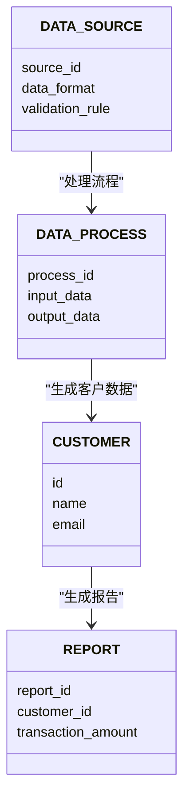
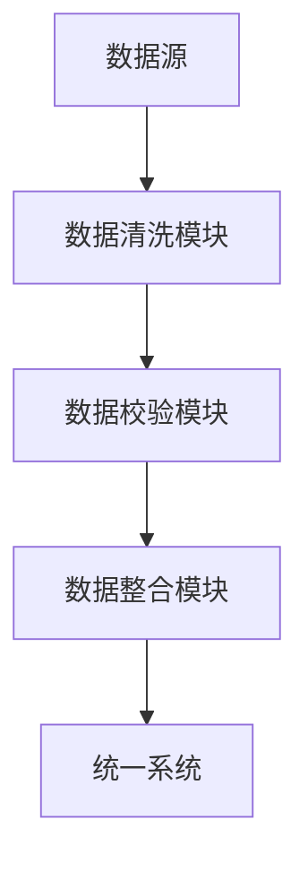

                 

<think>
好的，现在我需要撰写一篇名为《金融监管报告数据一致性检查工具》的技术博客文章。根据用户提供的目录大纲，我需要按照结构化的方式逐步分析和推理，确保内容完整、详细且专业。

首先，我需要明确文章的核心关键词和摘要，这将帮助读者快速了解文章的主题。接着，按照目录大纲，逐步撰写每一部分内容，确保每个章节都涵盖必要的细节，并使用适当的图表和代码示例来支持内容。

在撰写过程中，我会注意保持逻辑清晰，语言简洁易懂，同时确保技术深度足够，能够帮助读者理解数据一致性检查工具的开发和应用。此外，我还需要在文章末尾添加作者信息，以符合格式要求。

现在，我开始按照目录大纲逐步撰写内容。
</think>

# 《金融监管报告数据一致性检查工具》

---

## 关键词：
金融监管、数据一致性、数据清洗、数据校验、系统架构、工具开发

---

## 摘要：
金融监管报告数据一致性检查工具是一项重要的技术挑战，旨在解决金融数据在收集、处理和报告过程中可能出现的不一致问题。本文从背景介绍、核心概念、算法原理、系统架构、项目实战等多个角度，详细阐述了如何开发和应用这一工具。文章通过理论分析和实践案例，为读者提供了全面的技术指导，帮助其理解并实现高效的金融数据一致性检查系统。

---

## 第一部分：背景介绍

### 第1章：金融监管报告数据一致性问题背景

#### 1.1 数据一致性问题的背景
- **1.1.1 金融监管的重要性**  
  金融监管是保障金融市场健康运行的关键环节，数据一致性是其核心基础。  
- **1.1.2 数据一致性问题的现状**  
  数据孤岛、格式不统一、来源复杂等问题普遍存在。  
- **1.1.3 数据一致性问题对企业的影响**  
  数据不一致可能导致监管失准、决策失误，甚至引发合规风险。

#### 1.2 数据一致性问题的描述
- **1.2.1 数据不一致的定义**  
  数据在不同系统或来源中的表示不一致。  
- **1.2.2 数据不一致的表现形式**  
  例如，同一客户在不同系统中的ID不一致，或同一交易在不同报告中的金额不一致。  
- **1.2.3 数据不一致的根源分析**  
  数据来源多样性、系统集成复杂性、人为错误等。

#### 1.3 数据一致性问题的解决方法
- **1.3.1 数据清洗**  
  通过标准化处理消除数据中的不一致。  
- **1.3.2 数据校验**  
  使用规则或算法检查数据的准确性。  
- **1.3.3 数据整合**  
  将分散的数据源整合到统一的系统中。

#### 1.4 数据一致性问题的边界与外延
- **1.4.1 数据一致性的范围界定**  
  仅关注关键业务字段的一致性。  
- **1.4.2 数据一致性与其他数据质量问题的关系**  
  数据一致性是数据质量的重要组成部分，还包括完整性、准确性等。  
- **1.4.3 数据一致性问题的扩展性分析**  
  数据一致性问题可能扩展到实时监控和动态调整。

#### 1.5 数据一致性问题的核心要素
- **数据源**：如数据库、API接口等。  
- **数据格式**：如字符串、数值、日期等。  
- **数据校验规则**：如唯一性校验、格式校验等。  
- **数据处理流程**：从数据采集到整合的完整流程。

---

## 第二部分：核心概念与联系

### 第2章：数据一致性检查的核心概念

#### 2.1 数据一致性检查的原理
- **数据清洗**：通过标准化处理消除数据中的不一致。  
- **数据校验**：使用规则或算法检查数据的准确性。  
- **数据整合**：将分散的数据源整合到统一的系统中。

#### 2.2 核心概念属性特征对比表
| 核心概念 | 数据源 | 数据格式 | 数据校验规则 | 数据处理流程 |
|----------|--------|----------|--------------|--------------|
| 属性1    | 来源渠道 | 格式类型 | 校验规则类型 | 处理步骤     |
| 属性2    | 数据准确性 | 数据完整性 | 校验逻辑复杂度 | 数据流向     |

#### 2.3 数据一致性检查的ER实体关系图
```mermaid
erDiagram
    customer[CUSTOMER] {
        +string id
        +string name
        +string email
    }
    report[REPORT] {
        +string report_id
        +string customer_id
        +string transaction_amount
    }
    source[DATA_SOURCE] {
        +string source_id
        +string data_format
        +string validation_rule
    }
    process[DATA_PROCESS] {
        +string process_id
        +string input_data
        +string output_data
    }
    CUSTOMER *---- REPORT : "生成报告"
    REPORT *---- DATA_SOURCE : "数据来源"
    DATA_SOURCE --> DATA_PROCESS : "处理流程"
```

---

## 第三部分：算法原理讲解

### 第3章：数据一致性检查算法原理

#### 3.1 数据清洗算法
- **算法原理**：  
  数据清洗是通过标准化、去重、填补缺失值等方法，消除数据中的不一致。  
- **算法流程**：  
  ```mermaid
  graph TD
      A[开始] --> B[读取数据]
      B --> C[标准化处理]
      C --> D[去重处理]
      D --> E[填补缺失值]
      E --> F[结束]
  ```

#### 3.2 数据校验算法
- **算法原理**：  
  使用正则表达式、唯一性校验等方法检查数据的准确性。  
- **Python代码示例**：
  ```python
  import re

  def validate_email(email):
      pattern = r'^[a-zA-Z0-9._%+-]+@[a-zA-Z0-9.-]+.[a-zA-Z]{2,4}$'
      return bool(re.match(pattern, email))

  # 示例数据
  emails = ['test@example.com', 'invalidemail', 'test@example']
  for email in emails:
      print(f'{email}: {validate_email(email)}')
  ```

#### 3.3 数据整合算法
- **算法原理**：  
  使用ETL（抽取、转换、加载）技术将分散的数据源整合到统一的系统中。  
- **数学模型**：  
  数据整合可以看作是一个图匹配问题，使用以下公式表示匹配度：
  $$ match\_score = \sum_{i=1}^{n} (field_i匹配程度) $$

---

## 第四部分：系统分析与架构设计

### 第4章：系统架构设计

#### 4.1 问题场景介绍
- 数据源分散、格式多样、校验规则复杂。  

#### 4.2 系统功能设计
- 数据采集模块：从多个数据源采集数据。  
- 数据清洗模块：标准化处理数据。  
- 数据校验模块：检查数据准确性。  
- 数据整合模块：将数据整合到统一系统中。  

#### 4.3 领域模型类图


#### 4.4 系统架构图


---

## 第五部分：项目实战

### 第5章：项目实战与案例分析

#### 5.1 环境安装
- 安装Python、Jupyter Notebook、Pandas库。  

#### 5.2 核心代码实现
```python
import pandas as pd

def load_data(source):
    return pd.read_csv(source)

def clean_data(data):
    # 标准化处理
    return data.apply(lambda x: x.astype(str).str.strip())

def validate_data(data):
    # 校验规则示例
    return data[data['amount'].apply(lambda x: isinstance(x, (int, float)) and x > 0)]

def integrate_data(data1, data2):
    # 数据整合示例
    return pd.merge(data1, data2, on='customer_id', how='outer')

# 示例运行
data1 = load_data('data1.csv')
data2 = load_data('data2.csv')
cleaned_data = clean_data(data1)
validated_data = validate_data(cleaned_data)
integrated_data = integrate_data(cleaned_data, data2)
```

#### 5.3 案例分析
- 某银行案例：通过工具整合交易数据，提高监管报告的准确性。

---

## 第六部分：最佳实践与总结

### 第6章：最佳实践

#### 6.1 小结
- 数据一致性检查工具能够有效提升金融监管的效率和准确性。  

#### 6.2 注意事项
- 数据清洗需谨慎，避免误删或误改数据。  
- 校验规则需明确，避免漏检或误检。  

#### 6.3 拓展阅读
- 推荐阅读《数据质量管理》和《金融监管技术》相关书籍。

---

## 作者：AI天才研究院 & 禅与计算机程序设计艺术

