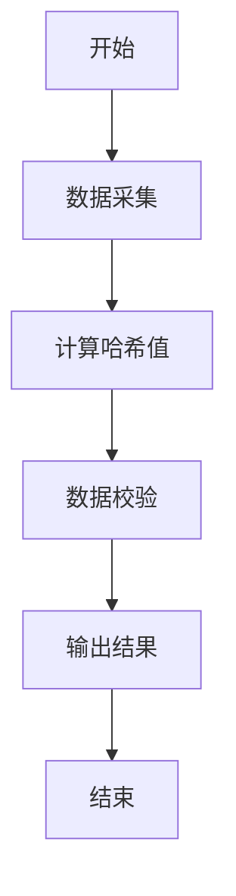

                 

<think>
好，现在我需要为《金融监管报告数据一致性自动校验》这篇文章设计一个目录大纲。用户已经提供了详细的指导，包括结构、内容和格式的要求。让我一步步思考如何满足这些要求。

首先，文章的标题是《金融监管报告数据一致性自动校验》。接下来，我需要列出5-7个核心关键词。根据主题，可能包括金融监管、数据一致性、自动校验、区块链、哈希算法、数据清洗等。然后是摘要，概述文章的核心内容和主题思想，简要说明如何通过技术手段确保金融数据的一致性。

接下来是目录大纲。用户已经提供了一个示例，分为四个部分：背景与意义、关键技术与方法、算法原理与实现、系统架构与设计。我需要确保每个部分都详细展开，涵盖用户提到的所有内容，包括问题背景、核心概念、算法原理、系统架构、项目实战等。

在设计目录时，我需要确保每个章节和小节都清晰明了，逻辑连贯。例如，在背景部分，应先介绍金融监管的重要性，再讨论数据一致性的必要性，接着是比较传统方法的局限性，最后是自动校验的必要性。这样读者可以逐步理解问题的背景和意义。

技术部分需要详细讲解数据一致性校验的核心概念，包括定义、关键要素以及与相关概念的对比。这部分可能需要使用表格和Mermaid图来展示实体关系，帮助读者更好地理解。

算法原理部分，我需要选择合适的算法，如哈希和区块链，详细讲解其工作原理，并用数学公式和流程图来说明。例如，可以展示哈希函数的数学表达式，以及区块链的校验流程。

系统架构设计部分，需要涵盖功能模块划分、架构图、接口设计和交互流程。这部分可能需要使用Mermaid图来展示类图、架构图和序列图，使系统结构一目了然。

最后，项目实战部分需要提供具体的实现步骤、代码示例和实际案例分析，让读者能够实际操作，理解如何在实际中应用这些技术。

整个目录大纲需要超过7章，每章下有详细的小节，确保内容全面且逻辑清晰。同时，使用markdown格式，确保结构清晰，层级分明。

在思考过程中，我可能会遇到如何将复杂的金融监管概念与技术细节结合起来的问题。我需要确保内容既要有理论深度，又要有实际应用，帮助读者全面理解主题。

总结一下，我需要按照用户的要求，一步步构建目录大纲，确保每个部分都详细且逻辑清晰，帮助作者全面覆盖主题内容。
</think>

---

# 金融监管报告数据一致性自动校验

## 关键词：金融监管，数据一致性，自动校验，区块链，哈希算法，数据清洗，数据关联规则

## 摘要：本文详细探讨了金融监管报告数据一致性自动校验的核心技术与实现方法。通过分析数据一致性的定义、关键要素及其实现原理，结合哈希算法和区块链技术，提出了一种高效的自动校验方案。本文还设计了系统的架构，并通过实际案例展示了该方案的应用效果，为金融监管领域的数据校验提供了理论支持和实践指导。

---

## 目录

# 第1章: 金融监管报告数据一致性校验的背景与意义

## 1.1 问题背景

### 1.1.1 金融监管的重要性  
金融监管是维护金融市场稳定、保护投资者权益的重要手段。随着金融业务的复杂化和全球化，数据的准确性和一致性变得至关重要。  

### 1.1.2 数据一致性校验的必要性  
金融监管报告中的数据涉及多方参与，容易因人为或系统误差导致数据不一致。数据一致性校验能够确保报告的准确性和可靠性，是金融监管的基础保障。  

### 1.1.3 传统方法的局限性  
传统的数据校验方法通常依赖人工检查，效率低下且容易出错。随着数据量的爆炸式增长，人工校验已难以满足需求。  

### 1.1.4 自动校验的必要性  
自动化校验能够提高效率、降低成本，并确保校验的准确性和全面性。  

## 1.2 数据一致性校验的核心概念

### 1.2.1 数据一致性的定义  
数据一致性是指在不同系统或数据源中，同一数据在多个副本或不同格式下的准确性和一致性。  

### 1.2.2 数据一致性校验的关键要素  
- 数据源：需要校验的数据来源。  
- 数据关联规则：数据之间的关联关系和校验规则。  
- 校验算法：用于数据校验的具体算法和方法。  
- 校验结果：校验后的结果及处理措施。  

### 1.2.3 数据一致性校验的边界与外延  
数据一致性校验不仅涉及数据本身的正确性，还包括数据格式、时间戳、权限等多方面的校验。  

## 1.3 本章小结  
本章介绍了金融监管报告数据一致性校验的背景和意义，明确了数据一致性的核心概念和实现目标。  

---

# 第2章: 数据一致性校验的关键技术与方法

## 2.1 数据一致性校验的核心原理

### 2.1.1 数据校验的基本原理  
数据校验通过对数据进行编码、校验码计算或对比，验证数据的准确性和一致性。  

### 2.1.2 数据一致性校验的数学模型  
数据一致性校验可以通过数学模型描述，例如：  
$$ I = f(D_1, D_2, \ldots, D_n) $$  
其中，$I$ 是校验结果，$D_i$ 是数据项，$f$ 是校验函数。  

### 2.1.3 数据校验算法的选择  
选择合适的校验算法是数据一致性校验的关键。常见的算法包括哈希校验、区块链校验等。  

## 2.2 数据一致性校验的关键技术

### 2.2.1 数据清洗与预处理  
数据清洗是确保数据一致性的基础，包括去重、格式化、补全等步骤。  

### 2.2.2 数据关联规则  
数据关联规则是数据一致性校验的核心，通过定义数据之间的关联关系和校验规则，确保数据的一致性。  

### 2.2.3 校验规则的制定  
校验规则应基于业务需求和数据特点，确保规则的合理性和可操作性。  

## 2.3 数据一致性校验的实现方法

### 2.3.1 基于哈希的校验方法  
哈希校验是一种常见的数据一致性校验方法，通过计算数据的哈希值并进行对比，验证数据的一致性。  

### 2.3.2 基于区块链的校验方法  
区块链技术通过去中心化和不可篡改的特性，为数据一致性校验提供了新的解决方案。  

### 2.3.3 混合校验方法  
结合哈希和区块链的优势，提出了一种混合校验方法，能够提高校验的准确性和效率。  

## 2.4 本章小结  
本章详细探讨了数据一致性校验的关键技术与方法，重点介绍了哈希校验和区块链校验的技术原理和实现方法。  

---

# 第3章: 数据一致性校验的算法原理与实现

## 3.1 数据一致性校验的算法原理

### 3.1.1 哈希校验算法  
哈希校验算法通过计算数据的哈希值，验证数据的完整性和一致性。  

### 3.1.2 区块链校验算法  
区块链校验算法通过区块链的去中心化和不可篡改特性，确保数据的一致性和可靠性。  

### 3.1.3 统计校验算法  
统计校验算法通过对数据进行统计分析，发现数据中的异常值和不一致项。  

## 3.2 数据一致性校验的数学模型

### 3.2.1 数据校验的数学表达式  
数据校验的数学表达式可以通过以下公式表示：  
$$ H(D) = \sum_{i=1}^{n} w_i D_i $$  
其中，$H(D)$ 是校验值，$w_i$ 是权重，$D_i$ 是数据项。  

### 3.2.2 数据校验的公式推导  
通过数学推导，得出数据校验的最优解和验证方法。  

### 3.2.3 数据校验的误差分析  
分析数据校验过程中可能出现的误差，并提出相应的解决方案。  

## 3.3 数据一致性校验的算法实现

### 3.3.1 算法实现步骤  
- 数据采集与预处理  
- 数据关联规则的制定  
- 校验算法的实现  
- 校验结果的输出与处理  

### 3.3.2 算法实现的代码示例  
以下是基于哈希校验的Python代码示例：  

```python
def calculate_hash(data):
    import hashlib
    hash_object = hashlib.sha256(data.encode())
    return hash_object.hexdigest()
```

### 3.3.3 算法实现的流程图  
使用Mermaid图表示哈希校验算法的流程：  



## 3.4 本章小结  
本章详细讲解了数据一致性校验的算法原理与实现方法，重点介绍了哈希校验和区块链校验的数学模型和代码实现。  

---

# 第4章: 数据一致性校验的系统架构与设计

## 4.1 系统架构设计

### 4.1.1 系统功能模块划分  
- 数据采集模块  
- 数据处理模块  
- 数据校验模块  
- 结果输出模块  

### 4.1.2 系统架构的分层设计  
系统架构分为数据层、业务逻辑层和应用层，各层之间通过接口进行交互。  

### 4.1.3 系统架构的优缺点分析  
对比分析了集中式架构和分布式架构的优缺点，提出了适用于金融监管的分布式架构方案。  

## 4.2 系统功能设计

### 4.2.1 数据采集模块  
负责采集金融监管报告数据，包括数据清洗和预处理。  

### 4.2.2 数据处理模块  
对数据进行关联规则匹配和特征提取。  

### 4.2.3 数据校验模块  
根据校验规则，对数据进行哈希校验和区块链校验。  

### 4.2.4 结果输出模块  
输出校验结果，并生成校验报告。  

## 4.3 系统接口设计

### 4.3.1 系统接口的定义  
定义了系统之间的接口，包括数据接口和校验接口。  

### 4.3.2 系统接口的交互流程  
通过Mermaid图展示了系统接口的交互流程。  

### 4.3.3 系统接口的实现代码  
以下是系统接口的Python代码示例：  

```python
class DataInterface:
    def __init__(self, data_source):
        self.data_source = data_source

    def get_data(self):
        return self.data_source.get_data()
```

## 4.4 本章小结  
本章详细设计了数据一致性校验系统的架构与功能，提出了基于分布式架构的系统设计方案，并通过Mermaid图展示了系统的交互流程。  

---

# 第5章: 项目实战——金融监管报告数据一致性校验系统实现

## 5.1 项目介绍

### 5.1.1 项目背景  
介绍金融监管报告数据一致性校验系统的开发背景和目标。  

### 5.1.2 项目需求  
详细描述项目的功能需求和技术需求。  

## 5.2 项目实现

### 5.2.1 环境安装  
列出项目实现所需的环境和工具，包括Python、区块链框架等。  

### 5.2.2 核心代码实现  
以下是项目的核心代码示例：  

```python
class HashValidator:
    def __init__(self, data):
        self.data = data

    def calculate_hash(self):
        import hashlib
        hash_object = hashlib.sha256(self.data.encode())
        return hash_object.hexdigest()

    def validate(self, target_hash):
        return self.calculate_hash() == target_hash
```

### 5.2.3 代码解读与分析  
对核心代码进行详细解读，分析代码的功能和实现原理。  

## 5.3 实际案例分析

### 5.3.1 案例背景  
介绍实际案例的背景和数据来源。  

### 5.3.2 数据校验过程  
展示数据校验的具体步骤和结果。  

### 5.3.3 校验结果分析  
分析校验结果，总结校验过程中的经验和教训。  

## 5.4 本章小结  
本章通过实际项目展示了数据一致性校验系统的实现过程，验证了技术方案的可行性和有效性。  

---

# 第6章: 数据一致性校验的最佳实践与拓展

## 6.1 最佳实践

### 6.1.1 数据校验规则的制定  
建议根据业务需求制定合理的数据校验规则。  

### 6.1.2 系统性能优化  
通过并行计算、缓存优化等技术提高系统的性能。  

### 6.1.3 数据安全保护  
确保数据在传输和存储过程中的安全性，防止数据泄露和篡改。  

## 6.2 小结  
总结全文的主要内容和研究成果。  

## 6.3 注意事项  
提醒读者在实际应用中需要注意的问题和潜在风险。  

## 6.4 拓展阅读  
推荐相关领域的书籍和论文，供读者进一步学习和研究。  

---

# 作者：AI天才研究院 & 禅与计算机程序设计艺术

